# MermaidSharp Test Examples

This document is auto-generated from the test suite.

## Architecture

### BasicService

**Input:**
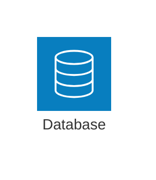

**Output SVG:**
```xml
<svg id="mermaid-svg" width="100%" xmlns="http://www.w3.org/2000/svg" viewBox="0 0 140 120" style="max-width: 140px;" role="graphics-document document" xmlns:xlink="http://www.w3.org/1999/xlink"><style xmlns="http://www.w3.org/1999/xhtml">@import url("https://cdnjs.cloudflare.com/ajax/libs/font-awesome/6.7.2/css/all.min.css");</style><defs><marker id="arch-arrow" refX="9" refY="3.5" markerWidth="10" markerHeight="7" orient="auto"><path d="M0,0 L10,3.5 L0,7 Z" class="arrowMarkerPath" style="stroke-width: 1; stroke-dasharray: 1, 0;"/></marker></defs><g transform="translate(20,20)"><rect x="0" y="0" width="100" height="80" rx="8" ry="8" fill="#FAFAFA" stroke="#81C784" stroke-width="2"/><g transform="translate(34,8) scale(0.64)"><path d="M10,20 L10,50 Q25,60 40,50 L40,20 Q25,10 10,20 M10,20 Q25,30 40,20" fill="#81C784" stroke="#333" stroke-width="1"/></g><text x="50" y="68" text-anchor="middle" dominant-baseline="middle" font-size="12px" font-family="Arial, sans-serif" fill="#333">Database</text></g></svg>
```

### ServiceWithDifferentIcons

**Input:**
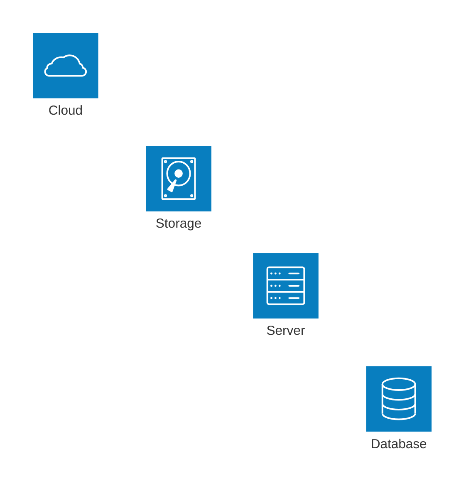

**Output SVG:**
```xml
<svg id="mermaid-svg" width="100%" xmlns="http://www.w3.org/2000/svg" viewBox="0 0 280 240" style="max-width: 280px;" role="graphics-document document" xmlns:xlink="http://www.w3.org/1999/xlink"><style xmlns="http://www.w3.org/1999/xhtml">@import url("https://cdnjs.cloudflare.com/ajax/libs/font-awesome/6.7.2/css/all.min.css");</style><defs><marker id="arch-arrow" refX="9" refY="3.5" markerWidth="10" markerHeight="7" orient="auto"><path d="M0,0 L10,3.5 L0,7 Z" class="arrowMarkerPath" style="stroke-width: 1; stroke-dasharray: 1, 0;"/></marker></defs><g transform="translate(20,20)"><rect x="0" y="0" width="100" height="80" rx="8" ry="8" fill="#FAFAFA" stroke="#81C784" stroke-width="2"/><g transform="translate(34,8) scale(0.64)"><path d="M10,20 L10,50 Q25,60 40,50 L40,20 Q25,10 10,20 M10,20 Q25,30 40,20" fill="#81C784" stroke="#333" stroke-width="1"/></g><text x="50" y="68" text-anchor="middle" dominant-baseline="middle" font-size="12px" font-family="Arial, sans-serif" fill="#333">Database</text><rect x="140" y="0" width="100" height="80" rx="8" ry="8" fill="#FAFAFA" stroke="#90A4AE" stroke-width="2"/><g transform="translate(174,8) scale(0.64)"><path d="M5,10 L45,10 L45,40 L5,40 Z M5,15 L45,15 M8,12.5 A1,1 0 1,1 8,12.49" fill="#90A4AE" stroke="#333" stroke-width="1"/></g><text x="190" y="68" text-anchor="middle" dominant-baseline="middle" font-size="12px" font-family="Arial, sans-serif" fill="#333">Server</text><rect x="0" y="120" width="100" height="80" rx="8" ry="8" fill="#FAFAFA" stroke="#FFB74D" stroke-width="2"/><g transform="translate(34,128) scale(0.64)"><path d="M5,40 L5,20 A20,10 0 1,1 45,20 L45,40 A20,10 0 1,1 5,40 M5,20 A20,10 0 1,0 45,20" fill="#FFB74D" stroke="#333" stroke-width="1"/></g><text x="50" y="188" text-anchor="middle" dominant-baseline="middle" font-size="12px" font-family="Arial, sans-serif" fill="#333">Storage</text><rect x="140" y="120" width="100" height="80" rx="8" ry="8" fill="#FAFAFA" stroke="#4FC3F7" stroke-width="2"/><g transform="translate(174,128) scale(0.64)"><path d="M25,60 Q0,60 0,45 Q0,30 15,30 Q15,15 35,15 Q55,15 55,30 Q70,30 70,45 Q70,60 45,60 Z" fill="#4FC3F7" stroke="#333" stroke-width="1"/></g><text x="190" y="188" text-anchor="middle" dominant-baseline="middle" font-size="12px" font-family="Arial, sans-serif" fill="#333">Cloud</text></g></svg>
```

### ServiceWithGroup

**Input:**
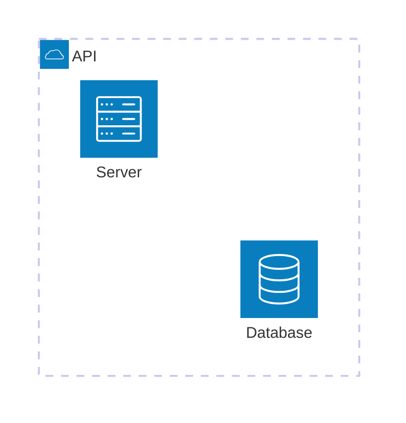

**Output SVG:**
```xml
<svg id="mermaid-svg" width="100%" xmlns="http://www.w3.org/2000/svg" viewBox="0 0 320 184" style="max-width: 320px;" role="graphics-document document" xmlns:xlink="http://www.w3.org/1999/xlink"><style xmlns="http://www.w3.org/1999/xhtml">@import url("https://cdnjs.cloudflare.com/ajax/libs/font-awesome/6.7.2/css/all.min.css");</style><defs><marker id="arch-arrow" refX="9" refY="3.5" markerWidth="10" markerHeight="7" orient="auto"><path d="M0,0 L10,3.5 L0,7 Z" class="arrowMarkerPath" style="stroke-width: 1; stroke-dasharray: 1, 0;"/></marker></defs><g transform="translate(20,20)"><rect x="0" y="0" width="280" height="144" rx="8" ry="8" fill="#E3F2FD" stroke="#4FC3F7" stroke-width="2" style="stroke-dasharray: 5,3"/><text x="20" y="22" text-anchor="start" dominant-baseline="middle" font-size="14px" font-family="Arial, sans-serif" font-weight="bold" fill="#333">API</text><rect x="20" y="44" width="100" height="80" rx="8" ry="8" fill="#FAFAFA" stroke="#81C784" stroke-width="2"/><g transform="translate(54,52) scale(0.64)"><path d="M10,20 L10,50 Q25,60 40,50 L40,20 Q25,10 10,20 M10,20 Q25,30 40,20" fill="#81C784" stroke="#333" stroke-width="1"/></g><text x="70" y="112" text-anchor="middle" dominant-baseline="middle" font-size="12px" font-family="Arial, sans-serif" fill="#333">Database</text><rect x="160" y="44" width="100" height="80" rx="8" ry="8" fill="#FAFAFA" stroke="#90A4AE" stroke-width="2"/><g transform="translate(194,52) scale(0.64)"><path d="M5,10 L45,10 L45,40 L5,40 Z M5,15 L45,15 M8,12.5 A1,1 0 1,1 8,12.49" fill="#90A4AE" stroke="#333" stroke-width="1"/></g><text x="210" y="112" text-anchor="middle" dominant-baseline="middle" font-size="12px" font-family="Arial, sans-serif" fill="#333">Server</text></g></svg>
```

### ServicesWithEdge

**Input:**
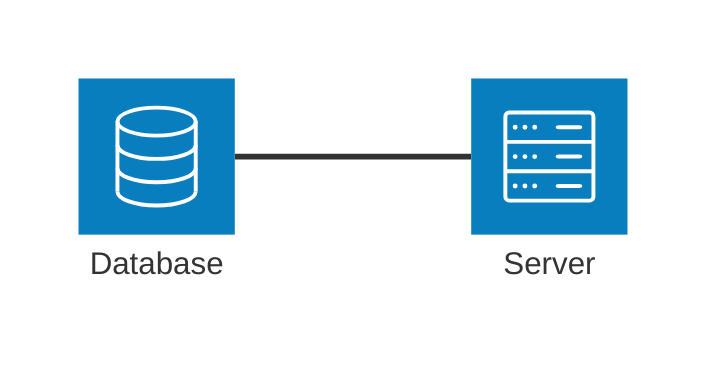

**Output SVG:**
```xml
<svg id="mermaid-svg" width="100%" xmlns="http://www.w3.org/2000/svg" viewBox="0 0 280 120" style="max-width: 280px;" role="graphics-document document" xmlns:xlink="http://www.w3.org/1999/xlink"><style xmlns="http://www.w3.org/1999/xhtml">@import url("https://cdnjs.cloudflare.com/ajax/libs/font-awesome/6.7.2/css/all.min.css");</style><defs><marker id="arch-arrow" refX="9" refY="3.5" markerWidth="10" markerHeight="7" orient="auto"><path d="M0,0 L10,3.5 L0,7 Z" class="arrowMarkerPath" style="stroke-width: 1; stroke-dasharray: 1, 0;"/></marker></defs><g transform="translate(20,20)"><rect x="0" y="0" width="100" height="80" rx="8" ry="8" fill="#FAFAFA" stroke="#81C784" stroke-width="2"/><g transform="translate(34,8) scale(0.64)"><path d="M10,20 L10,50 Q25,60 40,50 L40,20 Q25,10 10,20 M10,20 Q25,30 40,20" fill="#81C784" stroke="#333" stroke-width="1"/></g><text x="50" y="68" text-anchor="middle" dominant-baseline="middle" font-size="12px" font-family="Arial, sans-serif" fill="#333">Database</text><rect x="140" y="0" width="100" height="80" rx="8" ry="8" fill="#FAFAFA" stroke="#90A4AE" stroke-width="2"/><g transform="translate(174,8) scale(0.64)"><path d="M5,10 L45,10 L45,40 L5,40 Z M5,15 L45,15 M8,12.5 A1,1 0 1,1 8,12.49" fill="#90A4AE" stroke="#333" stroke-width="1"/></g><text x="190" y="68" text-anchor="middle" dominant-baseline="middle" font-size="12px" font-family="Arial, sans-serif" fill="#333">Server</text><line x1="100" y1="40" x2="140" y2="40" stroke="#666" stroke-width="1.5"/></g></svg>
```

### Complex

**Input:**
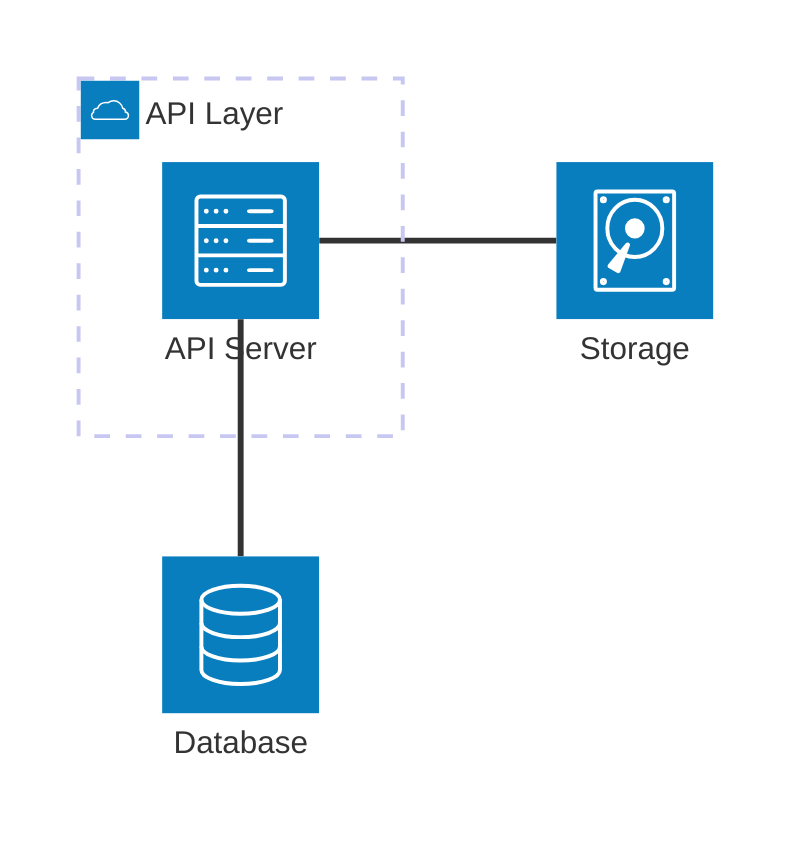

**Output SVG:**
```xml
<svg id="mermaid-svg" width="100%" xmlns="http://www.w3.org/2000/svg" viewBox="0 0 320 304" style="max-width: 320px;" role="graphics-document document" xmlns:xlink="http://www.w3.org/1999/xlink"><style xmlns="http://www.w3.org/1999/xhtml">@import url("https://cdnjs.cloudflare.com/ajax/libs/font-awesome/6.7.2/css/all.min.css");</style><defs><marker id="arch-arrow" refX="9" refY="3.5" markerWidth="10" markerHeight="7" orient="auto"><path d="M0,0 L10,3.5 L0,7 Z" class="arrowMarkerPath" style="stroke-width: 1; stroke-dasharray: 1, 0;"/></marker></defs><g transform="translate(20,20)"><rect x="0" y="0" width="140" height="144" rx="8" ry="8" fill="#E3F2FD" stroke="#4FC3F7" stroke-width="2" style="stroke-dasharray: 5,3"/><text x="20" y="22" text-anchor="start" dominant-baseline="middle" font-size="14px" font-family="Arial, sans-serif" font-weight="bold" fill="#333">API Layer</text><rect x="20" y="44" width="100" height="80" rx="8" ry="8" fill="#FAFAFA" stroke="#90A4AE" stroke-width="2"/><g transform="translate(54,52) scale(0.64)"><path d="M5,10 L45,10 L45,40 L5,40 Z M5,15 L45,15 M8,12.5 A1,1 0 1,1 8,12.49" fill="#90A4AE" stroke="#333" stroke-width="1"/></g><text x="70" y="112" text-anchor="middle" dominant-baseline="middle" font-size="12px" font-family="Arial, sans-serif" fill="#333">API Server</text><rect x="160" y="44" width="100" height="80" rx="8" ry="8" fill="#FAFAFA" stroke="#81C784" stroke-width="2"/><g transform="translate(194,52) scale(0.64)"><path d="M10,20 L10,50 Q25,60 40,50 L40,20 Q25,10 10,20 M10,20 Q25,30 40,20" fill="#81C784" stroke="#333" stroke-width="1"/></g><text x="210" y="112" text-anchor="middle" dominant-baseline="middle" font-size="12px" font-family="Arial, sans-serif" fill="#333">Database</text><rect x="20" y="164" width="100" height="80" rx="8" ry="8" fill="#FAFAFA" stroke="#FFB74D" stroke-width="2"/><g transform="translate(54,172) scale(0.64)"><path d="M5,40 L5,20 A20,10 0 1,1 45,20 L45,40 A20,10 0 1,1 5,40 M5,20 A20,10 0 1,0 45,20" fill="#FFB74D" stroke="#333" stroke-width="1"/></g><text x="70" y="232" text-anchor="middle" dominant-baseline="middle" font-size="12px" font-family="Arial, sans-serif" fill="#333">Storage</text><line x1="70" y1="124" x2="210" y2="44" stroke="#666" stroke-width="1.5"/><line x1="120" y1="84" x2="20" y2="204" stroke="#666" stroke-width="1.5"/></g></svg>
```

### EdgeWithArrows

**Input:**


## Block

### Simple

**Input:**
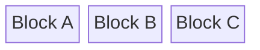

**Output SVG:**
```xml
<svg id="mermaid-svg" width="100%" xmlns="http://www.w3.org/2000/svg" viewBox="0 0 400 100" style="max-width: 400px;" role="graphics-document document" xmlns:xlink="http://www.w3.org/1999/xlink"><style xmlns="http://www.w3.org/1999/xhtml">@import url("https://cdnjs.cloudflare.com/ajax/libs/font-awesome/6.7.2/css/all.min.css");</style><rect x="30" y="30" width="100" height="40" rx="4" ry="4" fill="#E3F2FD" stroke="#333" stroke-width="1"/><text x="80" y="50" text-anchor="middle" dominant-baseline="middle" font-size="13px" font-family="Arial, sans-serif" fill="#333">Block A</text><rect x="150" y="30" width="100" height="40" rx="4" ry="4" fill="#E8F5E9" stroke="#333" stroke-width="1"/><text x="200" y="50" text-anchor="middle" dominant-baseline="middle" font-size="13px" font-family="Arial, sans-serif" fill="#333">Block B</text><rect x="270" y="30" width="100" height="40" rx="4" ry="4" fill="#FFF3E0" stroke="#333" stroke-width="1"/><text x="320" y="50" text-anchor="middle" dominant-baseline="middle" font-size="13px" font-family="Arial, sans-serif" fill="#333">Block C</text></svg>
```

### Span

**Input:**
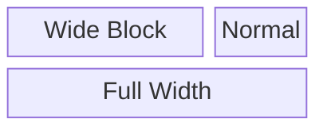

**Output SVG:**
```xml
<svg id="mermaid-svg" width="100%" xmlns="http://www.w3.org/2000/svg" viewBox="0 0 400 160" style="max-width: 400px;" role="graphics-document document" xmlns:xlink="http://www.w3.org/1999/xlink"><style xmlns="http://www.w3.org/1999/xhtml">@import url("https://cdnjs.cloudflare.com/ajax/libs/font-awesome/6.7.2/css/all.min.css");</style><rect x="30" y="30" width="220" height="40" rx="4" ry="4" fill="#E3F2FD" stroke="#333" stroke-width="1"/><text x="140" y="50" text-anchor="middle" dominant-baseline="middle" font-size="13px" font-family="Arial, sans-serif" fill="#333">Wide Block</text><rect x="270" y="30" width="100" height="40" rx="4" ry="4" fill="#E8F5E9" stroke="#333" stroke-width="1"/><text x="320" y="50" text-anchor="middle" dominant-baseline="middle" font-size="13px" font-family="Arial, sans-serif" fill="#333">Normal</text><rect x="30" y="90" width="340" height="40" rx="4" ry="4" fill="#FFF3E0" stroke="#333" stroke-width="1"/><text x="200" y="110" text-anchor="middle" dominant-baseline="middle" font-size="13px" font-family="Arial, sans-serif" fill="#333">Full Width</text></svg>
```

### DifferentShapes

**Input:**
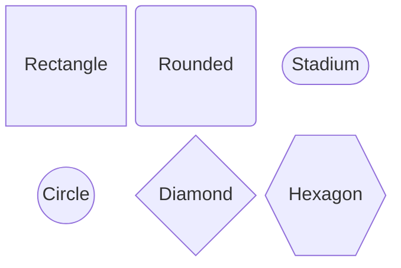

**Output SVG:**
```xml
<svg id="mermaid-svg" width="100%" xmlns="http://www.w3.org/2000/svg" viewBox="0 0 400 160" style="max-width: 400px;" role="graphics-document document" xmlns:xlink="http://www.w3.org/1999/xlink"><style xmlns="http://www.w3.org/1999/xhtml">@import url("https://cdnjs.cloudflare.com/ajax/libs/font-awesome/6.7.2/css/all.min.css");</style><rect x="30" y="30" width="100" height="40" rx="4" ry="4" fill="#E3F2FD" stroke="#333" stroke-width="1"/><text x="80" y="50" text-anchor="middle" dominant-baseline="middle" font-size="13px" font-family="Arial, sans-serif" fill="#333">Rectangle</text><rect x="150" y="30" width="100" height="40" rx="20" ry="20" fill="#E8F5E9" stroke="#333" stroke-width="1"/><text x="200" y="50" text-anchor="middle" dominant-baseline="middle" font-size="13px" font-family="Arial, sans-serif" fill="#333">Rounded</text><rect x="270" y="30" width="100" height="40" rx="20" ry="20" fill="#FFF3E0" stroke="#333" stroke-width="1"/><text x="320" y="50" text-anchor="middle" dominant-baseline="middle" font-size="13px" font-family="Arial, sans-serif" fill="#333">Stadium</text><circle cx="80" cy="110" r="20" fill="#F3E5F5" stroke="#333" stroke-width="1"/><text x="80" y="110" text-anchor="middle" dominant-baseline="middle" font-size="13px" font-family="Arial, sans-serif" fill="#333">Circle</text><path d="M 200 90 L 250 110 L 200 130 L 150 110 Z" fill="#FCE4EC" stroke="#333" stroke-width="1"/><text x="200" y="110" text-anchor="middle" dominant-baseline="middle" font-size="13px" font-family="Arial, sans-serif" fill="#333">Diamond</text><path d="M 285 90 L 355 90 L 370 110 L 355 130 L 285 130 L 270 110 Z" fill="#E0F7FA" stroke="#333" stroke-width="1"/><text x="320" y="110" text-anchor="middle" dominant-baseline="middle" font-size="13px" font-family="Arial, sans-serif" fill="#333">Hexagon</text></svg>
```

### Column

**Input:**
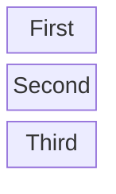

**Output SVG:**
```xml
<svg id="mermaid-svg" width="100%" xmlns="http://www.w3.org/2000/svg" viewBox="0 0 160 220" style="max-width: 160px;" role="graphics-document document" xmlns:xlink="http://www.w3.org/1999/xlink"><style xmlns="http://www.w3.org/1999/xhtml">@import url("https://cdnjs.cloudflare.com/ajax/libs/font-awesome/6.7.2/css/all.min.css");</style><rect x="30" y="30" width="100" height="40" rx="4" ry="4" fill="#E3F2FD" stroke="#333" stroke-width="1"/><text x="80" y="50" text-anchor="middle" dominant-baseline="middle" font-size="13px" font-family="Arial, sans-serif" fill="#333">First</text><rect x="30" y="90" width="100" height="40" rx="4" ry="4" fill="#E8F5E9" stroke="#333" stroke-width="1"/><text x="80" y="110" text-anchor="middle" dominant-baseline="middle" font-size="13px" font-family="Arial, sans-serif" fill="#333">Second</text><rect x="30" y="150" width="100" height="40" rx="4" ry="4" fill="#FFF3E0" stroke="#333" stroke-width="1"/><text x="80" y="170" text-anchor="middle" dominant-baseline="middle" font-size="13px" font-family="Arial, sans-serif" fill="#333">Third</text></svg>
```

### ManyColumns

**Input:**
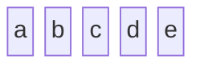

**Output SVG:**
```xml
<svg id="mermaid-svg" width="100%" xmlns="http://www.w3.org/2000/svg" viewBox="0 0 640 100" style="max-width: 640px;" role="graphics-document document" xmlns:xlink="http://www.w3.org/1999/xlink"><style xmlns="http://www.w3.org/1999/xhtml">@import url("https://cdnjs.cloudflare.com/ajax/libs/font-awesome/6.7.2/css/all.min.css");</style><rect x="30" y="30" width="100" height="40" rx="4" ry="4" fill="#E3F2FD" stroke="#333" stroke-width="1"/><text x="80" y="50" text-anchor="middle" dominant-baseline="middle" font-size="13px" font-family="Arial, sans-serif" fill="#333">a</text><rect x="150" y="30" width="100" height="40" rx="4" ry="4" fill="#E8F5E9" stroke="#333" stroke-width="1"/><text x="200" y="50" text-anchor="middle" dominant-baseline="middle" font-size="13px" font-family="Arial, sans-serif" fill="#333">b</text><rect x="270" y="30" width="100" height="40" rx="4" ry="4" fill="#FFF3E0" stroke="#333" stroke-width="1"/><text x="320" y="50" text-anchor="middle" dominant-baseline="middle" font-size="13px" font-family="Arial, sans-serif" fill="#333">c</text><rect x="390" y="30" width="100" height="40" rx="4" ry="4" fill="#F3E5F5" stroke="#333" stroke-width="1"/><text x="440" y="50" text-anchor="middle" dominant-baseline="middle" font-size="13px" font-family="Arial, sans-serif" fill="#333">d</text><rect x="510" y="30" width="100" height="40" rx="4" ry="4" fill="#FCE4EC" stroke="#333" stroke-width="1"/><text x="560" y="50" text-anchor="middle" dominant-baseline="middle" font-size="13px" font-family="Arial, sans-serif" fill="#333">e</text></svg>
```

### MixedLayout

**Input:**
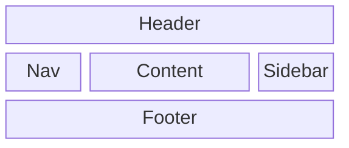

**Output SVG:**
```xml
<svg id="mermaid-svg" width="100%" xmlns="http://www.w3.org/2000/svg" viewBox="0 0 520 220" style="max-width: 520px;" role="graphics-document document" xmlns:xlink="http://www.w3.org/1999/xlink"><style xmlns="http://www.w3.org/1999/xhtml">@import url("https://cdnjs.cloudflare.com/ajax/libs/font-awesome/6.7.2/css/all.min.css");</style><rect x="30" y="30" width="460" height="40" rx="4" ry="4" fill="#E3F2FD" stroke="#333" stroke-width="1"/><text x="260" y="50" text-anchor="middle" dominant-baseline="middle" font-size="13px" font-family="Arial, sans-serif" fill="#333">Header</text><rect x="30" y="90" width="100" height="40" rx="4" ry="4" fill="#E8F5E9" stroke="#333" stroke-width="1"/><text x="80" y="110" text-anchor="middle" dominant-baseline="middle" font-size="13px" font-family="Arial, sans-serif" fill="#333">Nav</text><rect x="150" y="90" width="220" height="40" rx="4" ry="4" fill="#FFF3E0" stroke="#333" stroke-width="1"/><text x="260" y="110" text-anchor="middle" dominant-baseline="middle" font-size="13px" font-family="Arial, sans-serif" fill="#333">Content</text><rect x="390" y="90" width="100" height="40" rx="4" ry="4" fill="#F3E5F5" stroke="#333" stroke-width="1"/><text x="440" y="110" text-anchor="middle" dominant-baseline="middle" font-size="13px" font-family="Arial, sans-serif" fill="#333">Sidebar</text><rect x="30" y="150" width="460" height="40" rx="4" ry="4" fill="#FCE4EC" stroke="#333" stroke-width="1"/><text x="260" y="170" text-anchor="middle" dominant-baseline="middle" font-size="13px" font-family="Arial, sans-serif" fill="#333">Footer</text></svg>
```

## C4

### Simple

**Input:**
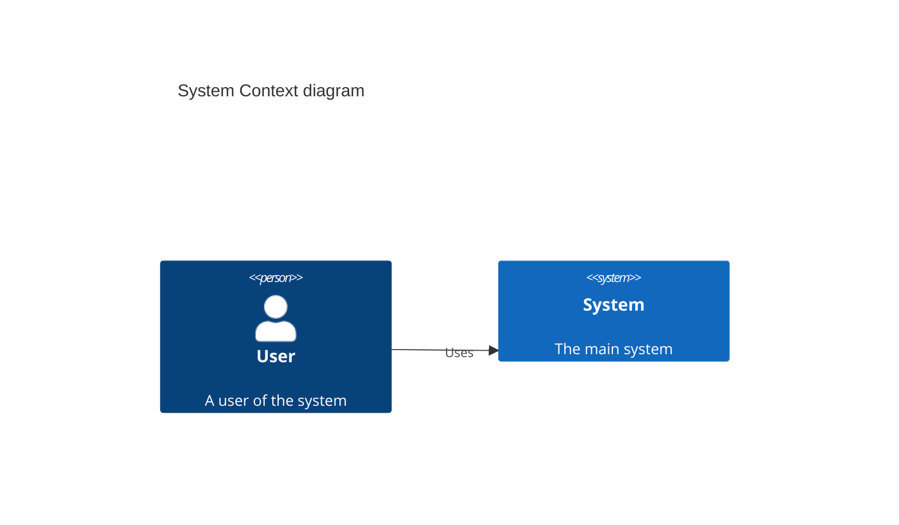

**Output SVG:**
```xml
<svg id="mermaid-svg" width="100%" xmlns="http://www.w3.org/2000/svg" viewBox="0 0 240 460" style="max-width: 240px;" role="graphics-document document" xmlns:xlink="http://www.w3.org/1999/xlink"><style xmlns="http://www.w3.org/1999/xhtml">@import url("https://cdnjs.cloudflare.com/ajax/libs/font-awesome/6.7.2/css/all.min.css");</style><defs><marker id="c4arrow" refX="9" refY="3.5" markerWidth="10" markerHeight="7" orient="auto"><path d="M0,0 L10,3.5 L0,7 Z" class="arrowMarkerPath" style="stroke-width: 1; stroke-dasharray: 1, 0;"/></marker></defs><text x="120" y="45" text-anchor="middle" dominant-baseline="middle" font-size="20px" font-family="Arial, sans-serif" font-weight="bold">System Context diagram</text><circle cx="120" cy="95" r="20" fill="#08427B" stroke="none"/><rect x="80" y="120" width="80" height="60" rx="10" ry="10" fill="#08427B" stroke="none"/><text x="120" y="170" text-anchor="middle" dominant-baseline="middle" font-size="13px" font-family="Arial, sans-serif" font-weight="bold" fill="#FFFFFF">User</text><text x="120" y="185" text-anchor="middle" dominant-baseline="middle" font-size="11px" font-family="Arial, sans-serif" fill="#FFFFFF">A user of the system</text><rect x="40" y="250" width="160" height="100" rx="5" ry="5" fill="#1168BD" stroke="none"/><text x="120" y="275" text-anchor="middle" dominant-baseline="middle" font-size="13px" font-family="Arial, sans-serif" font-weight="bold" fill="#FFFFFF">System</text><text x="120" y="293" text-anchor="middle" dominant-baseline="middle" font-size="11px" font-family="Arial, sans-serif" fill="#FFFFFF">The main system</text><line x1="120" y1="190" x2="120" y2="250" stroke="#666" stroke-width="1.5" stroke-dasharray="5,5"/><path d="M 120 250 L 116 243.07 L 124 243.07 Z" fill="#666" stroke="none"/><text x="120" y="212" text-anchor="middle" dominant-baseline="middle" font-size="11px" font-family="Arial, sans-serif" fill="#666">Uses</text></svg>
```

### External

**Input:**
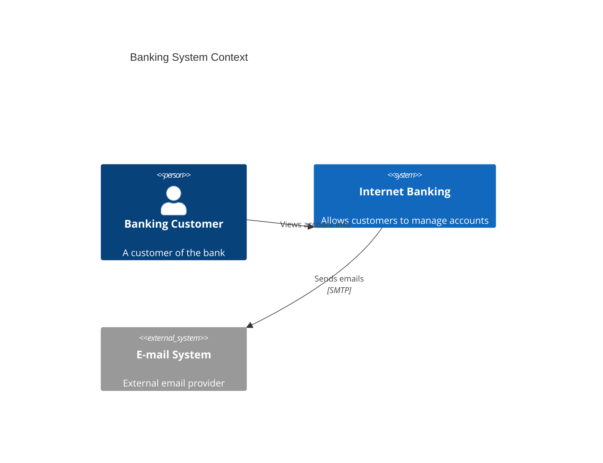

**Output SVG:**
```xml
<svg id="mermaid-svg" width="100%" xmlns="http://www.w3.org/2000/svg" viewBox="0 0 440 460" style="max-width: 440px;" role="graphics-document document" xmlns:xlink="http://www.w3.org/1999/xlink"><style xmlns="http://www.w3.org/1999/xhtml">@import url("https://cdnjs.cloudflare.com/ajax/libs/font-awesome/6.7.2/css/all.min.css");</style><defs><marker id="c4arrow" refX="9" refY="3.5" markerWidth="10" markerHeight="7" orient="auto"><path d="M0,0 L10,3.5 L0,7 Z" class="arrowMarkerPath" style="stroke-width: 1; stroke-dasharray: 1, 0;"/></marker></defs><text x="220" y="45" text-anchor="middle" dominant-baseline="middle" font-size="20px" font-family="Arial, sans-serif" font-weight="bold">Banking System Context</text><circle cx="220" cy="95" r="20" fill="#08427B" stroke="none"/><rect x="180" y="120" width="80" height="60" rx="10" ry="10" fill="#08427B" stroke="none"/><text x="220" y="170" text-anchor="middle" dominant-baseline="middle" font-size="13px" font-family="Arial, sans-serif" font-weight="bold" fill="#FFFFFF">Banking Customer</text><text x="220" y="185" text-anchor="middle" dominant-baseline="middle" font-size="11px" font-family="Arial, sans-serif" fill="#FFFFFF">A customer of the bank</text><rect x="40" y="250" width="160" height="100" rx="5" ry="5" fill="#1168BD" stroke="none"/><text x="120" y="275" text-anchor="middle" dominant-baseline="middle" font-size="13px" font-family="Arial, sans-serif" font-weight="bold" fill="#FFFFFF">Internet Banking</text><text x="120" y="293" text-anchor="middle" dominant-baseline="middle" font-size="11px" font-family="Arial, sans-serif" fill="#FFFFFF">Allows customers to...</text><rect x="240" y="250" width="160" height="100" rx="5" ry="5" fill="#999999" stroke="none"/><text x="320" y="275" text-anchor="middle" dominant-baseline="middle" font-size="13px" font-family="Arial, sans-serif" font-weight="bold" fill="#FFFFFF">E-mail System</text><text x="320" y="293" text-anchor="middle" dominant-baseline="middle" font-size="11px" font-family="Arial, sans-serif" fill="#FFFFFF">External email prov...</text><line x1="179.44" y1="181.72" x2="160.56" y2="256.9" stroke="#666" stroke-width="1.5" stroke-dasharray="5,5"/><path d="M 160.56 256.9 L 160.63 248.9 L 167.52 252.96 Z" fill="#666" stroke="none"/><text x="170" y="211.31" text-anchor="middle" dominant-baseline="middle" font-size="11px" font-family="Arial, sans-serif" fill="#666">Views account info</text><line x1="200" y1="300" x2="240" y2="300" stroke="#666" stroke-width="1.5" stroke-dasharray="5,5"/><path d="M 240 300 L 233.07 304 L 233.07 296 Z" fill="#666" stroke="none"/><text x="220" y="292" text-anchor="middle" dominant-baseline="middle" font-size="11px" font-family="Arial, sans-serif" fill="#666">Sends emails</text></svg>
```

### Container

**Input:**
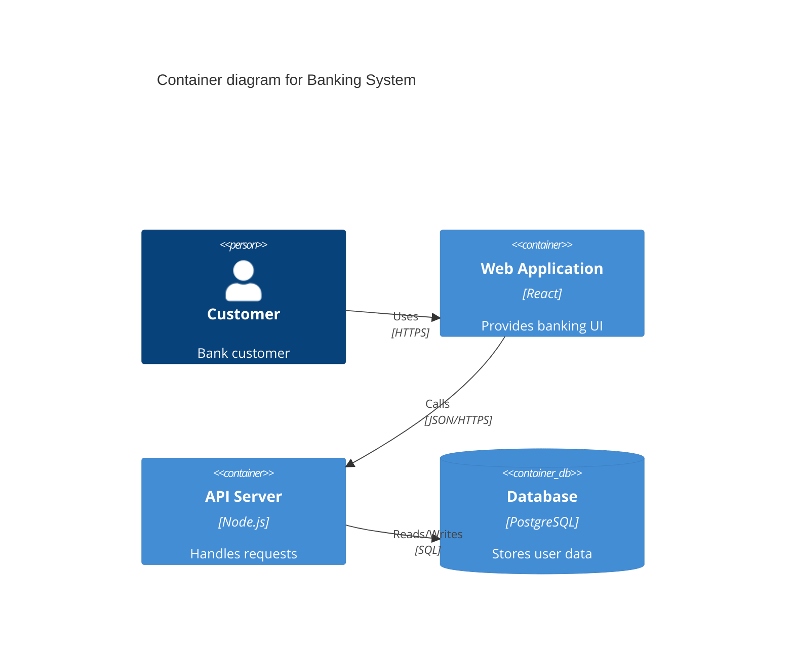

**Output SVG:**
```xml
<svg id="mermaid-svg" width="100%" xmlns="http://www.w3.org/2000/svg" viewBox="0 0 640 460" style="max-width: 640px;" role="graphics-document document" xmlns:xlink="http://www.w3.org/1999/xlink"><style xmlns="http://www.w3.org/1999/xhtml">@import url("https://cdnjs.cloudflare.com/ajax/libs/font-awesome/6.7.2/css/all.min.css");</style><defs><marker id="c4arrow" refX="9" refY="3.5" markerWidth="10" markerHeight="7" orient="auto"><path d="M0,0 L10,3.5 L0,7 Z" class="arrowMarkerPath" style="stroke-width: 1; stroke-dasharray: 1, 0;"/></marker></defs><text x="320" y="45" text-anchor="middle" dominant-baseline="middle" font-size="20px" font-family="Arial, sans-serif" font-weight="bold">Container diagram for Banking System</text><circle cx="320" cy="95" r="20" fill="#08427B" stroke="none"/><rect x="280" y="120" width="80" height="60" rx="10" ry="10" fill="#08427B" stroke="none"/><text x="320" y="170" text-anchor="middle" dominant-baseline="middle" font-size="13px" font-family="Arial, sans-serif" font-weight="bold" fill="#FFFFFF">Customer</text><text x="320" y="185" text-anchor="middle" dominant-baseline="middle" font-size="11px" font-family="Arial, sans-serif" fill="#FFFFFF">Bank customer</text><rect x="40" y="250" width="160" height="100" rx="5" ry="5" fill="#438DD5" stroke="none"/><text x="120" y="275" text-anchor="middle" dominant-baseline="middle" font-size="13px" font-family="Arial, sans-serif" font-weight="bold" fill="#FFFFFF">Web Application</text><text x="120" y="293" text-anchor="middle" dominant-baseline="middle" font-size="11px" font-family="Arial, sans-serif" fill="#FFFFFF">[React]</text><text x="120" y="311" text-anchor="middle" dominant-baseline="middle" font-size="11px" font-family="Arial, sans-serif" fill="#FFFFFF">Provides banking UI</text><rect x="240" y="250" width="160" height="100" rx="5" ry="5" fill="#438DD5" stroke="none"/><text x="320" y="275" text-anchor="middle" dominant-baseline="middle" font-size="13px" font-family="Arial, sans-serif" font-weight="bold" fill="#FFFFFF">API Server</text><text x="320" y="293" text-anchor="middle" dominant-baseline="middle" font-size="11px" font-family="Arial, sans-serif" fill="#FFFFFF">[Node.js]</text><text x="320" y="311" text-anchor="middle" dominant-baseline="middle" font-size="11px" font-family="Arial, sans-serif" fill="#FFFFFF">Handles requests</text><ellipse cx="520" cy="265" rx="75" ry="15" fill="#438DD5" stroke="none"/><rect x="445" y="265" width="150" height="70" fill="#438DD5" stroke="none"/><ellipse cx="520" cy="335" rx="75" ry="15" fill="#438DD5" stroke="none"/><text x="520" y="275" text-anchor="middle" dominant-baseline="middle" font-size="13px" font-family="Arial, sans-serif" font-weight="bold" fill="#FFFFFF">Database</text><text x="520" y="293" text-anchor="middle" dominant-baseline="middle" font-size="11px" font-family="Arial, sans-serif" fill="#FFFFFF">[PostgreSQL]</text><text x="520" y="311" text-anchor="middle" dominant-baseline="middle" font-size="11px" font-family="Arial, sans-serif" fill="#FFFFFF">Stores user data</text><line x1="259.04" y1="168.86" x2="180.96" y2="267.62" stroke="#666" stroke-width="1.5" stroke-dasharray="5,5"/><path d="M 180.96 267.62 L 183.64 260.08 L 188.82 266.18 Z" fill="#666" stroke="none"/><text x="220" y="210.24" text-anchor="middle" dominant-baseline="middle" font-size="11px" font-family="Arial, sans-serif" fill="#666">Uses</text><line x1="200" y1="300" x2="240" y2="300" stroke="#666" stroke-width="1.5" stroke-dasharray="5,5"/><path d="M 240 300 L 233.07 304 L 233.07 296 Z" fill="#666" stroke="none"/><text x="220" y="292" text-anchor="middle" dominant-baseline="middle" font-size="11px" font-family="Arial, sans-serif" fill="#666">Calls</text><line x1="400" y1="300" x2="440" y2="300" stroke="#666" stroke-width="1.5" stroke-dasharray="5,5"/><path d="M 440 300 L 433.07 304 L 433.07 296 Z" fill="#666" stroke="none"/><text x="420" y="292" text-anchor="middle" dominant-baseline="middle" font-size="11px" font-family="Arial, sans-serif" fill="#666">Reads/Writes</text></svg>
```

### Component

**Input:**
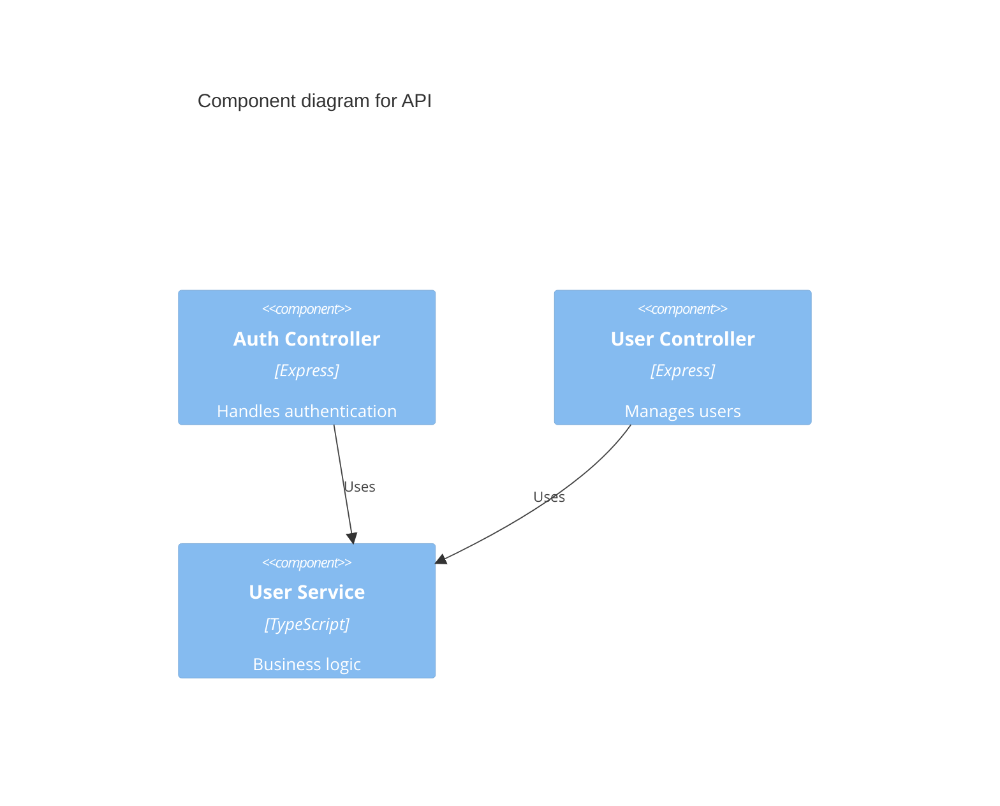

**Output SVG:**
```xml
<svg id="mermaid-svg" width="100%" xmlns="http://www.w3.org/2000/svg" viewBox="0 0 640 300" style="max-width: 640px;" role="graphics-document document" xmlns:xlink="http://www.w3.org/1999/xlink"><style xmlns="http://www.w3.org/1999/xhtml">@import url("https://cdnjs.cloudflare.com/ajax/libs/font-awesome/6.7.2/css/all.min.css");</style><defs><marker id="c4arrow" refX="9" refY="3.5" markerWidth="10" markerHeight="7" orient="auto"><path d="M0,0 L10,3.5 L0,7 Z" class="arrowMarkerPath" style="stroke-width: 1; stroke-dasharray: 1, 0;"/></marker></defs><text x="320" y="45" text-anchor="middle" dominant-baseline="middle" font-size="20px" font-family="Arial, sans-serif" font-weight="bold">Component diagram for API</text><rect x="40" y="70" width="160" height="100" rx="5" ry="5" fill="#85BBF0" stroke="none"/><text x="120" y="95" text-anchor="middle" dominant-baseline="middle" font-size="13px" font-family="Arial, sans-serif" font-weight="bold" fill="#FFFFFF">Auth Controller</text><text x="120" y="113" text-anchor="middle" dominant-baseline="middle" font-size="11px" font-family="Arial, sans-serif" fill="#FFFFFF">[Express]</text><text x="120" y="131" text-anchor="middle" dominant-baseline="middle" font-size="11px" font-family="Arial, sans-serif" fill="#FFFFFF">Handles authentication</text><rect x="240" y="70" width="160" height="100" rx="5" ry="5" fill="#85BBF0" stroke="none"/><text x="320" y="95" text-anchor="middle" dominant-baseline="middle" font-size="13px" font-family="Arial, sans-serif" font-weight="bold" fill="#FFFFFF">User Controller</text><text x="320" y="113" text-anchor="middle" dominant-baseline="middle" font-size="11px" font-family="Arial, sans-serif" fill="#FFFFFF">[Express]</text><text x="320" y="131" text-anchor="middle" dominant-baseline="middle" font-size="11px" font-family="Arial, sans-serif" fill="#FFFFFF">Manages users</text><rect x="440" y="70" width="160" height="100" rx="5" ry="5" fill="#85BBF0" stroke="none"/><text x="520" y="95" text-anchor="middle" dominant-baseline="middle" font-size="13px" font-family="Arial, sans-serif" font-weight="bold" fill="#FFFFFF">User Service</text><text x="520" y="113" text-anchor="middle" dominant-baseline="middle" font-size="11px" font-family="Arial, sans-serif" fill="#FFFFFF">[TypeScript]</text><text x="520" y="131" text-anchor="middle" dominant-baseline="middle" font-size="11px" font-family="Arial, sans-serif" fill="#FFFFFF">Business logic</text><line x1="200" y1="120" x2="440" y2="120" stroke="#666" stroke-width="1.5" stroke-dasharray="5,5"/><path d="M 440 120 L 433.07 124 L 433.07 116 Z" fill="#666" stroke="none"/><text x="320" y="112" text-anchor="middle" dominant-baseline="middle" font-size="11px" font-family="Arial, sans-serif" fill="#666">Uses</text><line x1="400" y1="120" x2="440" y2="120" stroke="#666" stroke-width="1.5" stroke-dasharray="5,5"/><path d="M 440 120 L 433.07 124 L 433.07 116 Z" fill="#666" stroke="none"/><text x="420" y="112" text-anchor="middle" dominant-baseline="middle" font-size="11px" font-family="Arial, sans-serif" fill="#666">Uses</text></svg>
```

### MixedElements

**Input:**
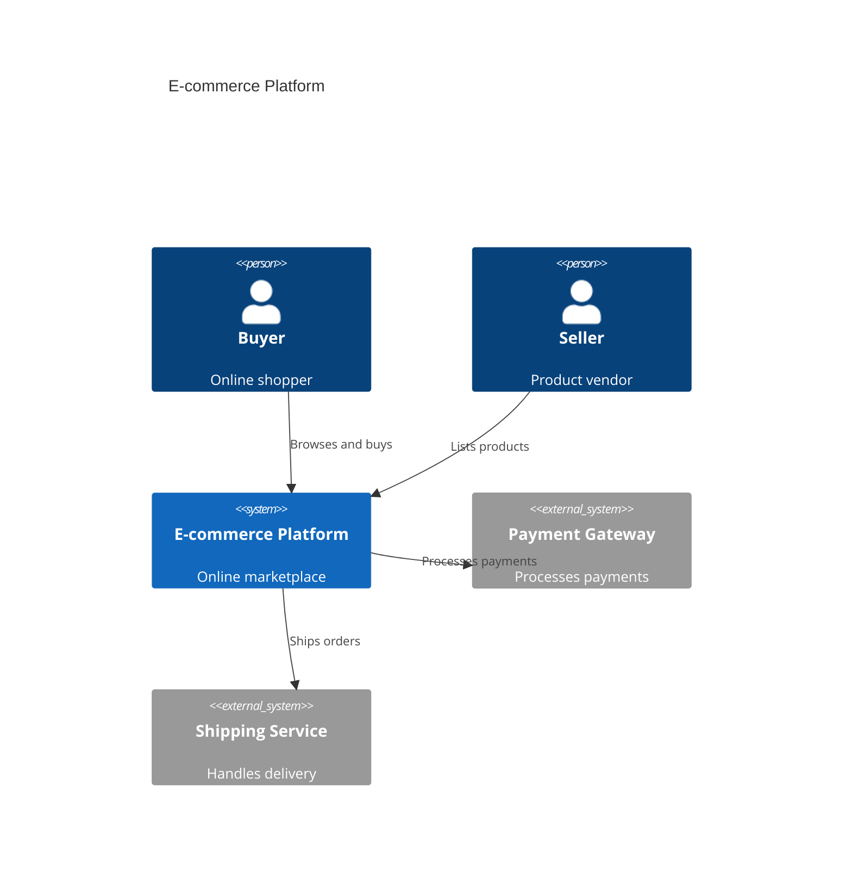

**Output SVG:**
```xml
<svg id="mermaid-svg" width="100%" xmlns="http://www.w3.org/2000/svg" viewBox="0 0 640 460" style="max-width: 640px;" role="graphics-document document" xmlns:xlink="http://www.w3.org/1999/xlink"><style xmlns="http://www.w3.org/1999/xhtml">@import url("https://cdnjs.cloudflare.com/ajax/libs/font-awesome/6.7.2/css/all.min.css");</style><defs><marker id="c4arrow" refX="9" refY="3.5" markerWidth="10" markerHeight="7" orient="auto"><path d="M0,0 L10,3.5 L0,7 Z" class="arrowMarkerPath" style="stroke-width: 1; stroke-dasharray: 1, 0;"/></marker></defs><text x="320" y="45" text-anchor="middle" dominant-baseline="middle" font-size="20px" font-family="Arial, sans-serif" font-weight="bold">E-commerce Platform</text><circle cx="220" cy="95" r="20" fill="#08427B" stroke="none"/><rect x="180" y="120" width="80" height="60" rx="10" ry="10" fill="#08427B" stroke="none"/><text x="220" y="170" text-anchor="middle" dominant-baseline="middle" font-size="13px" font-family="Arial, sans-serif" font-weight="bold" fill="#FFFFFF">Buyer</text><text x="220" y="185" text-anchor="middle" dominant-baseline="middle" font-size="11px" font-family="Arial, sans-serif" fill="#FFFFFF">Online shopper</text><circle cx="420" cy="95" r="20" fill="#08427B" stroke="none"/><rect x="380" y="120" width="80" height="60" rx="10" ry="10" fill="#08427B" stroke="none"/><text x="420" y="170" text-anchor="middle" dominant-baseline="middle" font-size="13px" font-family="Arial, sans-serif" font-weight="bold" fill="#FFFFFF">Seller</text><text x="420" y="185" text-anchor="middle" dominant-baseline="middle" font-size="11px" font-family="Arial, sans-serif" fill="#FFFFFF">Product vendor</text><rect x="40" y="250" width="160" height="100" rx="5" ry="5" fill="#1168BD" stroke="none"/><text x="120" y="275" text-anchor="middle" dominant-baseline="middle" font-size="13px" font-family="Arial, sans-serif" font-weight="bold" fill="#FFFFFF">E-commerce Platform</text><text x="120" y="293" text-anchor="middle" dominant-baseline="middle" font-size="11px" font-family="Arial, sans-serif" fill="#FFFFFF">Online marketplace</text><rect x="240" y="250" width="160" height="100" rx="5" ry="5" fill="#999999" stroke="none"/><text x="320" y="275" text-anchor="middle" dominant-baseline="middle" font-size="13px" font-family="Arial, sans-serif" font-weight="bold" fill="#FFFFFF">Payment Gateway</text><text x="320" y="293" text-anchor="middle" dominant-baseline="middle" font-size="11px" font-family="Arial, sans-serif" fill="#FFFFFF">Processes payments</text><rect x="440" y="250" width="160" height="100" rx="5" ry="5" fill="#999999" stroke="none"/><text x="520" y="275" text-anchor="middle" dominant-baseline="middle" font-size="13px" font-family="Arial, sans-serif" font-weight="bold" fill="#FFFFFF">Shipping Service</text><text x="520" y="293" text-anchor="middle" dominant-baseline="middle" font-size="11px" font-family="Arial, sans-serif" fill="#FFFFFF">Handles delivery</text><line x1="179.44" y1="181.72" x2="160.56" y2="256.9" stroke="#666" stroke-width="1.5" stroke-dasharray="5,5"/><path d="M 160.56 256.9 L 160.63 248.9 L 167.52 252.96 Z" fill="#666" stroke="none"/><text x="170" y="211.31" text-anchor="middle" dominant-baseline="middle" font-size="11px" font-family="Arial, sans-serif" fill="#666">Browses and buys</text><line x1="350.4" y1="159.58" x2="189.6" y2="275.35" stroke="#666" stroke-width="1.5" stroke-dasharray="5,5"/><path d="M 189.6 275.35 L 193.66 268.45 L 197.6 275.41 Z" fill="#666" stroke="none"/><text x="270" y="209.47" text-anchor="middle" dominant-baseline="middle" font-size="11px" font-family="Arial, sans-serif" fill="#666">Lists products</text><line x1="200" y1="300" x2="240" y2="300" stroke="#666" stroke-width="1.5" stroke-dasharray="5,5"/><path d="M 240 300 L 233.07 304 L 233.07 296 Z" fill="#666" stroke="none"/><text x="220" y="292" text-anchor="middle" dominant-baseline="middle" font-size="11px" font-family="Arial, sans-serif" fill="#666">Processes payments</text><line x1="200" y1="300" x2="440" y2="300" stroke="#666" stroke-width="1.5" stroke-dasharray="5,5"/><path d="M 440 300 L 433.07 304 L 433.07 296 Z" fill="#666" stroke="none"/><text x="320" y="292" text-anchor="middle" dominant-baseline="middle" font-size="11px" font-family="Arial, sans-serif" fill="#666">Ships orders</text></svg>
```

### NoRelationships

**Input:**
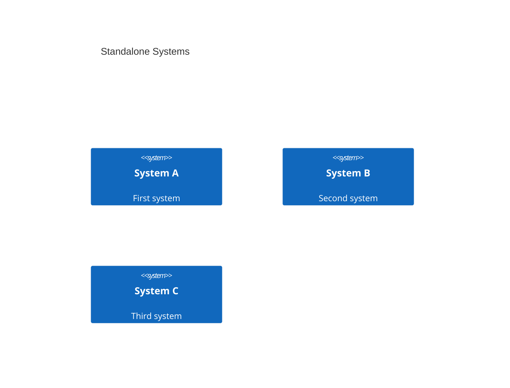

**Output SVG:**
```xml
<svg id="mermaid-svg" width="100%" xmlns="http://www.w3.org/2000/svg" viewBox="0 0 640 300" style="max-width: 640px;" role="graphics-document document" xmlns:xlink="http://www.w3.org/1999/xlink"><style xmlns="http://www.w3.org/1999/xhtml">@import url("https://cdnjs.cloudflare.com/ajax/libs/font-awesome/6.7.2/css/all.min.css");</style><defs><marker id="c4arrow" refX="9" refY="3.5" markerWidth="10" markerHeight="7" orient="auto"><path d="M0,0 L10,3.5 L0,7 Z" class="arrowMarkerPath" style="stroke-width: 1; stroke-dasharray: 1, 0;"/></marker></defs><text x="320" y="45" text-anchor="middle" dominant-baseline="middle" font-size="20px" font-family="Arial, sans-serif" font-weight="bold">Standalone Systems</text><rect x="40" y="70" width="160" height="100" rx="5" ry="5" fill="#1168BD" stroke="none"/><text x="120" y="95" text-anchor="middle" dominant-baseline="middle" font-size="13px" font-family="Arial, sans-serif" font-weight="bold" fill="#FFFFFF">System A</text><text x="120" y="113" text-anchor="middle" dominant-baseline="middle" font-size="11px" font-family="Arial, sans-serif" fill="#FFFFFF">First system</text><rect x="240" y="70" width="160" height="100" rx="5" ry="5" fill="#1168BD" stroke="none"/><text x="320" y="95" text-anchor="middle" dominant-baseline="middle" font-size="13px" font-family="Arial, sans-serif" font-weight="bold" fill="#FFFFFF">System B</text><text x="320" y="113" text-anchor="middle" dominant-baseline="middle" font-size="11px" font-family="Arial, sans-serif" fill="#FFFFFF">Second system</text><rect x="440" y="70" width="160" height="100" rx="5" ry="5" fill="#1168BD" stroke="none"/><text x="520" y="95" text-anchor="middle" dominant-baseline="middle" font-size="13px" font-family="Arial, sans-serif" font-weight="bold" fill="#FFFFFF">System C</text><text x="520" y="113" text-anchor="middle" dominant-baseline="middle" font-size="11px" font-family="Arial, sans-serif" fill="#FFFFFF">Third system</text></svg>
```

### Complex

**Input:**
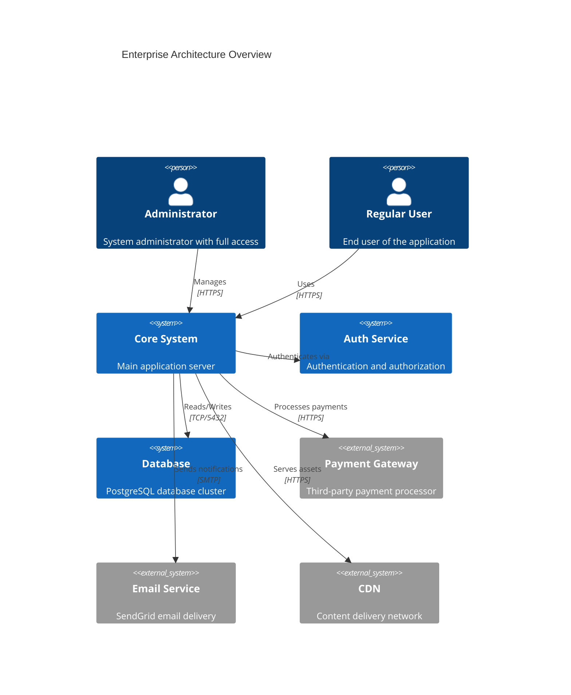

**Output SVG:**
```xml
<svg id="mermaid-svg" width="100%" xmlns="http://www.w3.org/2000/svg" viewBox="0 0 840 620" style="max-width: 840px;" role="graphics-document document" xmlns:xlink="http://www.w3.org/1999/xlink"><style xmlns="http://www.w3.org/1999/xhtml">@import url("https://cdnjs.cloudflare.com/ajax/libs/font-awesome/6.7.2/css/all.min.css");</style><defs><marker id="c4arrow" refX="9" refY="3.5" markerWidth="10" markerHeight="7" orient="auto"><path d="M0,0 L10,3.5 L0,7 Z" class="arrowMarkerPath" style="stroke-width: 1; stroke-dasharray: 1, 0;"/></marker></defs><text x="420" y="45" text-anchor="middle" dominant-baseline="middle" font-size="20px" font-family="Arial, sans-serif" font-weight="bold">Enterprise Architecture Overview</text><circle cx="320" cy="95" r="20" fill="#08427B" stroke="none"/><rect x="280" y="120" width="80" height="60" rx="10" ry="10" fill="#08427B" stroke="none"/><text x="320" y="170" text-anchor="middle" dominant-baseline="middle" font-size="13px" font-family="Arial, sans-serif" font-weight="bold" fill="#FFFFFF">Administrator</text><text x="320" y="185" text-anchor="middle" dominant-baseline="middle" font-size="11px" font-family="Arial, sans-serif" fill="#FFFFFF">System administrator w...</text><circle cx="520" cy="95" r="20" fill="#08427B" stroke="none"/><rect x="480" y="120" width="80" height="60" rx="10" ry="10" fill="#08427B" stroke="none"/><text x="520" y="170" text-anchor="middle" dominant-baseline="middle" font-size="13px" font-family="Arial, sans-serif" font-weight="bold" fill="#FFFFFF">Regular User</text><text x="520" y="185" text-anchor="middle" dominant-baseline="middle" font-size="11px" font-family="Arial, sans-serif" fill="#FFFFFF">End user of the applic...</text><rect x="-160" y="250" width="160" height="100" rx="5" ry="5" fill="#1168BD" stroke="none"/><text x="-80" y="275" text-anchor="middle" dominant-baseline="middle" font-size="13px" font-family="Arial, sans-serif" font-weight="bold" fill="#FFFFFF">Core System</text><text x="-80" y="293" text-anchor="middle" dominant-baseline="middle" font-size="11px" font-family="Arial, sans-serif" fill="#FFFFFF">Main application se...</text><rect x="40" y="250" width="160" height="100" rx="5" ry="5" fill="#1168BD" stroke="none"/><text x="120" y="275" text-anchor="middle" dominant-baseline="middle" font-size="13px" font-family="Arial, sans-serif" font-weight="bold" fill="#FFFFFF">Auth Service</text><text x="120" y="293" text-anchor="middle" dominant-baseline="middle" font-size="11px" font-family="Arial, sans-serif" fill="#FFFFFF">Authentication and ...</text><rect x="240" y="250" width="160" height="100" rx="5" ry="5" fill="#1168BD" stroke="none"/><text x="320" y="275" text-anchor="middle" dominant-baseline="middle" font-size="13px" font-family="Arial, sans-serif" font-weight="bold" fill="#FFFFFF">Database</text><text x="320" y="293" text-anchor="middle" dominant-baseline="middle" font-size="11px" font-family="Arial, sans-serif" fill="#FFFFFF">PostgreSQL database...</text><rect x="440" y="250" width="160" height="100" rx="5" ry="5" fill="#999999" stroke="none"/><text x="520" y="275" text-anchor="middle" dominant-baseline="middle" font-size="13px" font-family="Arial, sans-serif" font-weight="bold" fill="#FFFFFF">Payment Gateway</text><text x="520" y="293" text-anchor="middle" dominant-baseline="middle" font-size="11px" font-family="Arial, sans-serif" fill="#FFFFFF">Third-party payment...</text><rect x="640" y="250" width="160" height="100" rx="5" ry="5" fill="#999999" stroke="none"/><text x="720" y="275" text-anchor="middle" dominant-baseline="middle" font-size="13px" font-family="Arial, sans-serif" font-weight="bold" fill="#FFFFFF">Email Service</text><text x="720" y="293" text-anchor="middle" dominant-baseline="middle" font-size="11px" font-family="Arial, sans-serif" fill="#FFFFFF">SendGrid email deli...</text><rect x="840" y="250" width="160" height="100" rx="5" ry="5" fill="#999999" stroke="none"/><text x="920" y="275" text-anchor="middle" dominant-baseline="middle" font-size="13px" font-family="Arial, sans-serif" font-weight="bold" fill="#FFFFFF">CDN</text><text x="920" y="293" text-anchor="middle" dominant-baseline="middle" font-size="11px" font-family="Arial, sans-serif" fill="#FFFFFF">Content delivery ne...</text><line x1="246.37" y1="153.47" x2="-6.37" y2="280.44" stroke="#666" stroke-width="1.5" stroke-dasharray="5,5"/><path d="M -6.37 280.44 L -1.56 274.05 L 1.57 281.41 Z" fill="#666" stroke="none"/><text x="120" y="208.96" text-anchor="middle" dominant-baseline="middle" font-size="11px" font-family="Arial, sans-serif" fill="#666">Manages</text><line x1="443.03" y1="146.36" x2="-3.03" y2="286.37" stroke="#666" stroke-width="1.5" stroke-dasharray="5,5"/><path d="M -3.03 286.37 L 2.55 280.63 L 4.73 288.33 Z" fill="#666" stroke="none"/><text x="220" y="208.36" text-anchor="middle" dominant-baseline="middle" font-size="11px" font-family="Arial, sans-serif" fill="#666">Uses</text><line x1="0" y1="300" x2="40" y2="300" stroke="#666" stroke-width="1.5" stroke-dasharray="5,5"/><path d="M 40 300 L 33.07 304 L 33.07 296 Z" fill="#666" stroke="none"/><text x="20" y="292" text-anchor="middle" dominant-baseline="middle" font-size="11px" font-family="Arial, sans-serif" fill="#666">Authenticates via</text><line x1="0" y1="300" x2="240" y2="300" stroke="#666" stroke-width="1.5" stroke-dasharray="5,5"/><path d="M 240 300 L 233.07 304 L 233.07 296 Z" fill="#666" stroke="none"/><text x="120" y="292" text-anchor="middle" dominant-baseline="middle" font-size="11px" font-family="Arial, sans-serif" fill="#666">Reads/Writes</text><line x1="0" y1="300" x2="440" y2="300" stroke="#666" stroke-width="1.5" stroke-dasharray="5,5"/><path d="M 440 300 L 433.07 304 L 433.07 296 Z" fill="#666" stroke="none"/><text x="220" y="292" text-anchor="middle" dominant-baseline="middle" font-size="11px" font-family="Arial, sans-serif" fill="#666">Processes payments</text><line x1="0" y1="300" x2="640" y2="300" stroke="#666" stroke-width="1.5" stroke-dasharray="5,5"/><path d="M 640 300 L 633.07 304 L 633.07 296 Z" fill="#666" stroke="none"/><text x="320" y="292" text-anchor="middle" dominant-baseline="middle" font-size="11px" font-family="Arial, sans-serif" fill="#666">Sends notifications</text><line x1="0" y1="300" x2="840" y2="300" stroke="#666" stroke-width="1.5" stroke-dasharray="5,5"/><path d="M 840 300 L 833.07 304 L 833.07 296 Z" fill="#666" stroke="none"/><text x="420" y="292" text-anchor="middle" dominant-baseline="middle" font-size="11px" font-family="Arial, sans-serif" fill="#666">Serves assets</text></svg>
```

## Class

### Simple

**Input:**
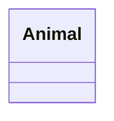

**Output SVG:**
```xml
<svg id="mermaid-svg" width="100%" xmlns="http://www.w3.org/2000/svg" viewBox="0 0 140 90" style="max-width: 140px;" role="graphics-document document" xmlns:xlink="http://www.w3.org/1999/xlink"><style xmlns="http://www.w3.org/1999/xhtml">@import url("https://cdnjs.cloudflare.com/ajax/libs/font-awesome/6.7.2/css/all.min.css");</style><defs><marker id="arrowhead" refX="9" refY="3.5" markerWidth="10" markerHeight="7" orient="auto"><path d="M0,0 L10,3.5 L0,7 Z" class="arrowMarkerPath" style="stroke-width: 1; stroke-dasharray: 1, 0;"/></marker><marker id="arrowhead-open" refX="9" refY="3.5" markerWidth="10" markerHeight="7" orient="auto"><path d="M0,0 L10,3.5 L0,7 Z" class="arrowMarkerPath" style="stroke-width: 1; stroke-dasharray: 1, 0;"/></marker><marker id="inheritance" refX="10" refY="5" markerWidth="12" markerHeight="12" orient="auto"><path d="M0,0 L10,5 L0,10 Z" class="arrowMarkerPath" style="stroke-width: 1; stroke-dasharray: 1, 0;"/></marker><marker id="composition" refX="10" refY="5" markerWidth="12" markerHeight="12" orient="auto"><path d="M0,5 L5,0 L10,5 L5,10 Z" class="arrowMarkerPath" style="stroke-width: 1; stroke-dasharray: 1, 0;"/></marker><marker id="aggregation" refX="10" refY="5" markerWidth="12" markerHeight="12" orient="auto"><path d="M0,5 L5,0 L10,5 L5,10 Z" class="arrowMarkerPath" style="stroke-width: 1; stroke-dasharray: 1, 0;"/></marker></defs><g transform="translate(20,20)"><rect x="0" y="0" width="100" height="50" fill="#FFFFDE" stroke="#333" stroke-width="1"/><text x="50" y="20" text-anchor="middle" dominant-baseline="middle" font-size="14px" font-family="Arial, sans-serif" font-weight="bold">Animal</text></g></svg>
```

### Members

**Input:**
```mermaid
classDiagram
    class Animal {
        +String name
        +int age
    }
```

**Output SVG:**
```xml
<svg id="mermaid-svg" width="100%" xmlns="http://www.w3.org/2000/svg" viewBox="0 0 140 90" style="max-width: 140px;" role="graphics-document document" xmlns:xlink="http://www.w3.org/1999/xlink"><style xmlns="http://www.w3.org/1999/xhtml">@import url("https://cdnjs.cloudflare.com/ajax/libs/font-awesome/6.7.2/css/all.min.css");</style><defs><marker id="arrowhead" refX="9" refY="3.5" markerWidth="10" markerHeight="7" orient="auto"><path d="M0,0 L10,3.5 L0,7 Z" class="arrowMarkerPath" style="stroke-width: 1; stroke-dasharray: 1, 0;"/></marker><marker id="arrowhead-open" refX="9" refY="3.5" markerWidth="10" markerHeight="7" orient="auto"><path d="M0,0 L10,3.5 L0,7 Z" class="arrowMarkerPath" style="stroke-width: 1; stroke-dasharray: 1, 0;"/></marker><marker id="inheritance" refX="10" refY="5" markerWidth="12" markerHeight="12" orient="auto"><path d="M0,0 L10,5 L0,10 Z" class="arrowMarkerPath" style="stroke-width: 1; stroke-dasharray: 1, 0;"/></marker><marker id="composition" refX="10" refY="5" markerWidth="12" markerHeight="12" orient="auto"><path d="M0,5 L5,0 L10,5 L5,10 Z" class="arrowMarkerPath" style="stroke-width: 1; stroke-dasharray: 1, 0;"/></marker><marker id="aggregation" refX="10" refY="5" markerWidth="12" markerHeight="12" orient="auto"><path d="M0,5 L5,0 L10,5 L5,10 Z" class="arrowMarkerPath" style="stroke-width: 1; stroke-dasharray: 1, 0;"/></marker></defs><g transform="translate(20,20)"><rect x="0" y="0" width="100" height="50" fill="#FFFFDE" stroke="#333" stroke-width="1"/><text x="50" y="20" text-anchor="middle" dominant-baseline="middle" font-size="14px" font-family="Arial, sans-serif" font-weight="bold">Animal</text></g></svg>
```

### Methods

**Input:**
```mermaid
classDiagram
    class Animal {
        +makeSound()
        +move() : void
    }
```

**Output SVG:**
```xml
<svg id="mermaid-svg" width="100%" xmlns="http://www.w3.org/2000/svg" viewBox="0 0 140 90" style="max-width: 140px;" role="graphics-document document" xmlns:xlink="http://www.w3.org/1999/xlink"><style xmlns="http://www.w3.org/1999/xhtml">@import url("https://cdnjs.cloudflare.com/ajax/libs/font-awesome/6.7.2/css/all.min.css");</style><defs><marker id="arrowhead" refX="9" refY="3.5" markerWidth="10" markerHeight="7" orient="auto"><path d="M0,0 L10,3.5 L0,7 Z" class="arrowMarkerPath" style="stroke-width: 1; stroke-dasharray: 1, 0;"/></marker><marker id="arrowhead-open" refX="9" refY="3.5" markerWidth="10" markerHeight="7" orient="auto"><path d="M0,0 L10,3.5 L0,7 Z" class="arrowMarkerPath" style="stroke-width: 1; stroke-dasharray: 1, 0;"/></marker><marker id="inheritance" refX="10" refY="5" markerWidth="12" markerHeight="12" orient="auto"><path d="M0,0 L10,5 L0,10 Z" class="arrowMarkerPath" style="stroke-width: 1; stroke-dasharray: 1, 0;"/></marker><marker id="composition" refX="10" refY="5" markerWidth="12" markerHeight="12" orient="auto"><path d="M0,5 L5,0 L10,5 L5,10 Z" class="arrowMarkerPath" style="stroke-width: 1; stroke-dasharray: 1, 0;"/></marker><marker id="aggregation" refX="10" refY="5" markerWidth="12" markerHeight="12" orient="auto"><path d="M0,5 L5,0 L10,5 L5,10 Z" class="arrowMarkerPath" style="stroke-width: 1; stroke-dasharray: 1, 0;"/></marker></defs><g transform="translate(20,20)"><rect x="0" y="0" width="100" height="50" fill="#FFFFDE" stroke="#333" stroke-width="1"/><text x="50" y="20" text-anchor="middle" dominant-baseline="middle" font-size="14px" font-family="Arial, sans-serif" font-weight="bold">Animal</text></g></svg>
```

### MembersAndMethods

**Input:**
```mermaid
classDiagram
    class Animal {
        +String name
        +int age
        +makeSound() : void
        +move(int distance) : void
    }
```

**Output SVG:**
```xml
<svg id="mermaid-svg" width="100%" xmlns="http://www.w3.org/2000/svg" viewBox="0 0 140 90" style="max-width: 140px;" role="graphics-document document" xmlns:xlink="http://www.w3.org/1999/xlink"><style xmlns="http://www.w3.org/1999/xhtml">@import url("https://cdnjs.cloudflare.com/ajax/libs/font-awesome/6.7.2/css/all.min.css");</style><defs><marker id="arrowhead" refX="9" refY="3.5" markerWidth="10" markerHeight="7" orient="auto"><path d="M0,0 L10,3.5 L0,7 Z" class="arrowMarkerPath" style="stroke-width: 1; stroke-dasharray: 1, 0;"/></marker><marker id="arrowhead-open" refX="9" refY="3.5" markerWidth="10" markerHeight="7" orient="auto"><path d="M0,0 L10,3.5 L0,7 Z" class="arrowMarkerPath" style="stroke-width: 1; stroke-dasharray: 1, 0;"/></marker><marker id="inheritance" refX="10" refY="5" markerWidth="12" markerHeight="12" orient="auto"><path d="M0,0 L10,5 L0,10 Z" class="arrowMarkerPath" style="stroke-width: 1; stroke-dasharray: 1, 0;"/></marker><marker id="composition" refX="10" refY="5" markerWidth="12" markerHeight="12" orient="auto"><path d="M0,5 L5,0 L10,5 L5,10 Z" class="arrowMarkerPath" style="stroke-width: 1; stroke-dasharray: 1, 0;"/></marker><marker id="aggregation" refX="10" refY="5" markerWidth="12" markerHeight="12" orient="auto"><path d="M0,5 L5,0 L10,5 L5,10 Z" class="arrowMarkerPath" style="stroke-width: 1; stroke-dasharray: 1, 0;"/></marker></defs><g transform="translate(20,20)"><rect x="0" y="0" width="100" height="50" fill="#FFFFDE" stroke="#333" stroke-width="1"/><text x="50" y="20" text-anchor="middle" dominant-baseline="middle" font-size="14px" font-family="Arial, sans-serif" font-weight="bold">Animal</text></g></svg>
```

### Inheritance

**Input:**
```mermaid
classDiagram
    Animal <|-- Dog
    Animal <|-- Cat
```

**Output SVG:**
```xml
<svg id="mermaid-svg" width="100%" xmlns="http://www.w3.org/2000/svg" viewBox="0 0 300 220" style="max-width: 300px;" role="graphics-document document" xmlns:xlink="http://www.w3.org/1999/xlink"><style xmlns="http://www.w3.org/1999/xhtml">@import url("https://cdnjs.cloudflare.com/ajax/libs/font-awesome/6.7.2/css/all.min.css");</style><defs><marker id="arrowhead" refX="9" refY="3.5" markerWidth="10" markerHeight="7" orient="auto"><path d="M0,0 L10,3.5 L0,7 Z" class="arrowMarkerPath" style="stroke-width: 1; stroke-dasharray: 1, 0;"/></marker><marker id="arrowhead-open" refX="9" refY="3.5" markerWidth="10" markerHeight="7" orient="auto"><path d="M0,0 L10,3.5 L0,7 Z" class="arrowMarkerPath" style="stroke-width: 1; stroke-dasharray: 1, 0;"/></marker><marker id="inheritance" refX="10" refY="5" markerWidth="12" markerHeight="12" orient="auto"><path d="M0,0 L10,5 L0,10 Z" class="arrowMarkerPath" style="stroke-width: 1; stroke-dasharray: 1, 0;"/></marker><marker id="composition" refX="10" refY="5" markerWidth="12" markerHeight="12" orient="auto"><path d="M0,5 L5,0 L10,5 L5,10 Z" class="arrowMarkerPath" style="stroke-width: 1; stroke-dasharray: 1, 0;"/></marker><marker id="aggregation" refX="10" refY="5" markerWidth="12" markerHeight="12" orient="auto"><path d="M0,5 L5,0 L10,5 L5,10 Z" class="arrowMarkerPath" style="stroke-width: 1; stroke-dasharray: 1, 0;"/></marker></defs><g transform="translate(20,20)"><line x1="130" y1="50" x2="50" y2="130" stroke="#333" stroke-width="1"/><polygon points="50,130 52.59,120.34 59.66,127.41" fill="#fff" stroke="#333"/><line x1="130" y1="50" x2="210" y2="130" stroke="#333" stroke-width="1"/><polygon points="210,130 200.34,127.41 207.41,120.34" fill="#fff" stroke="#333"/><rect x="80" y="0" width="100" height="50" fill="#FFFFDE" stroke="#333" stroke-width="1"/><text x="130" y="20" text-anchor="middle" dominant-baseline="middle" font-size="14px" font-family="Arial, sans-serif" font-weight="bold">Animal</text><rect x="0" y="130" width="100" height="50" fill="#FFFFDE" stroke="#333" stroke-width="1"/><text x="50" y="150" text-anchor="middle" dominant-baseline="middle" font-size="14px" font-family="Arial, sans-serif" font-weight="bold">Dog</text><rect x="160" y="130" width="100" height="50" fill="#FFFFDE" stroke="#333" stroke-width="1"/><text x="210" y="150" text-anchor="middle" dominant-baseline="middle" font-size="14px" font-family="Arial, sans-serif" font-weight="bold">Cat</text></g></svg>
```

### Composition

**Input:**
```mermaid
classDiagram
    Car *-- Engine
    Car *-- Wheel
```

**Output SVG:**
```xml
<svg id="mermaid-svg" width="100%" xmlns="http://www.w3.org/2000/svg" viewBox="0 0 300 220" style="max-width: 300px;" role="graphics-document document" xmlns:xlink="http://www.w3.org/1999/xlink"><style xmlns="http://www.w3.org/1999/xhtml">@import url("https://cdnjs.cloudflare.com/ajax/libs/font-awesome/6.7.2/css/all.min.css");</style><defs><marker id="arrowhead" refX="9" refY="3.5" markerWidth="10" markerHeight="7" orient="auto"><path d="M0,0 L10,3.5 L0,7 Z" class="arrowMarkerPath" style="stroke-width: 1; stroke-dasharray: 1, 0;"/></marker><marker id="arrowhead-open" refX="9" refY="3.5" markerWidth="10" markerHeight="7" orient="auto"><path d="M0,0 L10,3.5 L0,7 Z" class="arrowMarkerPath" style="stroke-width: 1; stroke-dasharray: 1, 0;"/></marker><marker id="inheritance" refX="10" refY="5" markerWidth="12" markerHeight="12" orient="auto"><path d="M0,0 L10,5 L0,10 Z" class="arrowMarkerPath" style="stroke-width: 1; stroke-dasharray: 1, 0;"/></marker><marker id="composition" refX="10" refY="5" markerWidth="12" markerHeight="12" orient="auto"><path d="M0,5 L5,0 L10,5 L5,10 Z" class="arrowMarkerPath" style="stroke-width: 1; stroke-dasharray: 1, 0;"/></marker><marker id="aggregation" refX="10" refY="5" markerWidth="12" markerHeight="12" orient="auto"><path d="M0,5 L5,0 L10,5 L5,10 Z" class="arrowMarkerPath" style="stroke-width: 1; stroke-dasharray: 1, 0;"/></marker></defs><g transform="translate(20,20)"><line x1="130" y1="50" x2="50" y2="130" stroke="#333" stroke-width="1"/><polygon points="50,130 57.07,130 57.07,122.93 50,122.93" fill="#333" stroke="#333"/><line x1="130" y1="50" x2="210" y2="130" stroke="#333" stroke-width="1"/><polygon points="210,130 210,122.93 202.93,122.93 202.93,130" fill="#333" stroke="#333"/><rect x="80" y="0" width="100" height="50" fill="#FFFFDE" stroke="#333" stroke-width="1"/><text x="130" y="20" text-anchor="middle" dominant-baseline="middle" font-size="14px" font-family="Arial, sans-serif" font-weight="bold">Car</text><rect x="0" y="130" width="100" height="50" fill="#FFFFDE" stroke="#333" stroke-width="1"/><text x="50" y="150" text-anchor="middle" dominant-baseline="middle" font-size="14px" font-family="Arial, sans-serif" font-weight="bold">Engine</text><rect x="160" y="130" width="100" height="50" fill="#FFFFDE" stroke="#333" stroke-width="1"/><text x="210" y="150" text-anchor="middle" dominant-baseline="middle" font-size="14px" font-family="Arial, sans-serif" font-weight="bold">Wheel</text></g></svg>
```

### Aggregation

**Input:**
```mermaid
classDiagram
    Library o-- Book
```

**Output SVG:**
```xml
<svg id="mermaid-svg" width="100%" xmlns="http://www.w3.org/2000/svg" viewBox="0 0 140 220" style="max-width: 140px;" role="graphics-document document" xmlns:xlink="http://www.w3.org/1999/xlink"><style xmlns="http://www.w3.org/1999/xhtml">@import url("https://cdnjs.cloudflare.com/ajax/libs/font-awesome/6.7.2/css/all.min.css");</style><defs><marker id="arrowhead" refX="9" refY="3.5" markerWidth="10" markerHeight="7" orient="auto"><path d="M0,0 L10,3.5 L0,7 Z" class="arrowMarkerPath" style="stroke-width: 1; stroke-dasharray: 1, 0;"/></marker><marker id="arrowhead-open" refX="9" refY="3.5" markerWidth="10" markerHeight="7" orient="auto"><path d="M0,0 L10,3.5 L0,7 Z" class="arrowMarkerPath" style="stroke-width: 1; stroke-dasharray: 1, 0;"/></marker><marker id="inheritance" refX="10" refY="5" markerWidth="12" markerHeight="12" orient="auto"><path d="M0,0 L10,5 L0,10 Z" class="arrowMarkerPath" style="stroke-width: 1; stroke-dasharray: 1, 0;"/></marker><marker id="composition" refX="10" refY="5" markerWidth="12" markerHeight="12" orient="auto"><path d="M0,5 L5,0 L10,5 L5,10 Z" class="arrowMarkerPath" style="stroke-width: 1; stroke-dasharray: 1, 0;"/></marker><marker id="aggregation" refX="10" refY="5" markerWidth="12" markerHeight="12" orient="auto"><path d="M0,5 L5,0 L10,5 L5,10 Z" class="arrowMarkerPath" style="stroke-width: 1; stroke-dasharray: 1, 0;"/></marker></defs><g transform="translate(20,20)"><line x1="50" y1="50" x2="50" y2="130" stroke="#333" stroke-width="1"/><polygon points="50,130 55,125 50,120 45,125" fill="#fff" stroke="#333"/><rect x="0" y="0" width="100" height="50" fill="#FFFFDE" stroke="#333" stroke-width="1"/><text x="50" y="20" text-anchor="middle" dominant-baseline="middle" font-size="14px" font-family="Arial, sans-serif" font-weight="bold">Library</text><rect x="0" y="130" width="100" height="50" fill="#FFFFDE" stroke="#333" stroke-width="1"/><text x="50" y="150" text-anchor="middle" dominant-baseline="middle" font-size="14px" font-family="Arial, sans-serif" font-weight="bold">Book</text></g></svg>
```

### Association

**Input:**
```mermaid
classDiagram
    Student --> Course : enrolls
```

**Output SVG:**
```xml
<svg id="mermaid-svg" width="100%" xmlns="http://www.w3.org/2000/svg" viewBox="0 0 140 220" style="max-width: 140px;" role="graphics-document document" xmlns:xlink="http://www.w3.org/1999/xlink"><style xmlns="http://www.w3.org/1999/xhtml">@import url("https://cdnjs.cloudflare.com/ajax/libs/font-awesome/6.7.2/css/all.min.css");</style><defs><marker id="arrowhead" refX="9" refY="3.5" markerWidth="10" markerHeight="7" orient="auto"><path d="M0,0 L10,3.5 L0,7 Z" class="arrowMarkerPath" style="stroke-width: 1; stroke-dasharray: 1, 0;"/></marker><marker id="arrowhead-open" refX="9" refY="3.5" markerWidth="10" markerHeight="7" orient="auto"><path d="M0,0 L10,3.5 L0,7 Z" class="arrowMarkerPath" style="stroke-width: 1; stroke-dasharray: 1, 0;"/></marker><marker id="inheritance" refX="10" refY="5" markerWidth="12" markerHeight="12" orient="auto"><path d="M0,0 L10,5 L0,10 Z" class="arrowMarkerPath" style="stroke-width: 1; stroke-dasharray: 1, 0;"/></marker><marker id="composition" refX="10" refY="5" markerWidth="12" markerHeight="12" orient="auto"><path d="M0,5 L5,0 L10,5 L5,10 Z" class="arrowMarkerPath" style="stroke-width: 1; stroke-dasharray: 1, 0;"/></marker><marker id="aggregation" refX="10" refY="5" markerWidth="12" markerHeight="12" orient="auto"><path d="M0,5 L5,0 L10,5 L5,10 Z" class="arrowMarkerPath" style="stroke-width: 1; stroke-dasharray: 1, 0;"/></marker></defs><g transform="translate(20,20)"><line x1="50" y1="50" x2="50" y2="130" stroke="#333" stroke-width="1"/><polygon points="50,130 45,121.34 55,121.34" fill="#333"/><text x="50" y="80" text-anchor="middle" dominant-baseline="bottom" font-size="12px" font-family="Arial, sans-serif">enrolls</text><rect x="0" y="0" width="100" height="50" fill="#FFFFDE" stroke="#333" stroke-width="1"/><text x="50" y="20" text-anchor="middle" dominant-baseline="middle" font-size="14px" font-family="Arial, sans-serif" font-weight="bold">Student</text><rect x="0" y="130" width="100" height="50" fill="#FFFFDE" stroke="#333" stroke-width="1"/><text x="50" y="150" text-anchor="middle" dominant-baseline="middle" font-size="14px" font-family="Arial, sans-serif" font-weight="bold">Course</text></g></svg>
```

### InterfaceAnnotation

**Input:**
```mermaid
classDiagram
    class IFlyable {
        <<interface>>
        +fly() : void
    }
```

**Output SVG:**
```xml
<svg id="mermaid-svg" width="100%" xmlns="http://www.w3.org/2000/svg" viewBox="0 0 140 90" style="max-width: 140px;" role="graphics-document document" xmlns:xlink="http://www.w3.org/1999/xlink"><style xmlns="http://www.w3.org/1999/xhtml">@import url("https://cdnjs.cloudflare.com/ajax/libs/font-awesome/6.7.2/css/all.min.css");</style><defs><marker id="arrowhead" refX="9" refY="3.5" markerWidth="10" markerHeight="7" orient="auto"><path d="M0,0 L10,3.5 L0,7 Z" class="arrowMarkerPath" style="stroke-width: 1; stroke-dasharray: 1, 0;"/></marker><marker id="arrowhead-open" refX="9" refY="3.5" markerWidth="10" markerHeight="7" orient="auto"><path d="M0,0 L10,3.5 L0,7 Z" class="arrowMarkerPath" style="stroke-width: 1; stroke-dasharray: 1, 0;"/></marker><marker id="inheritance" refX="10" refY="5" markerWidth="12" markerHeight="12" orient="auto"><path d="M0,0 L10,5 L0,10 Z" class="arrowMarkerPath" style="stroke-width: 1; stroke-dasharray: 1, 0;"/></marker><marker id="composition" refX="10" refY="5" markerWidth="12" markerHeight="12" orient="auto"><path d="M0,5 L5,0 L10,5 L5,10 Z" class="arrowMarkerPath" style="stroke-width: 1; stroke-dasharray: 1, 0;"/></marker><marker id="aggregation" refX="10" refY="5" markerWidth="12" markerHeight="12" orient="auto"><path d="M0,5 L5,0 L10,5 L5,10 Z" class="arrowMarkerPath" style="stroke-width: 1; stroke-dasharray: 1, 0;"/></marker></defs><g transform="translate(20,20)"><rect x="0" y="0" width="100" height="50" fill="#FFFFDE" stroke="#333" stroke-width="1"/><text x="50" y="20" text-anchor="middle" dominant-baseline="middle" font-size="14px" font-family="Arial, sans-serif" font-weight="bold">IFlyable</text></g></svg>
```

### Complex

**Input:**
```mermaid
classDiagram
class IRepository~T~ {
    <<interface>>
    +get(id: int) T
    +save(entity: T) void
    +delete(id: int) void
}

class AbstractEntity {
    <<abstract>>
    #int id
    #DateTime createdAt
    #DateTime updatedAt
    +getId() int
}

class UserService {
    <<service>>
    -IUserRepository repository
    -ILogger logger
    +createUser(name: String) User
    +findUser(id: int) User
    +deleteUser(id: int) void
}

class Status {
    <<enumeration>>
    ACTIVE
    INACTIVE
    PENDING
    DELETED
}

class User {
    +String name
    +String email
    -String passwordHash
    ~Status status
    +validate()$ bool
    +hashPassword(password: String)$ String
}

class Address {
    +String street
    +String city
    +String zipCode
}

class Order {
    +int orderId
    +List~Item~ items
    +calculateTotal() Decimal
}

class Item {
    +String name
    +Decimal price
    +int quantity
}

IRepository~T~ <|.. UserRepository : implements
AbstractEntity <|-- User : extends
UserService ..> IRepository~T~ : uses
User "1" --> "1..*" Address : has
User "1" o-- "*" Order : places
Order "1" *-- "1..*" Item : contains
```

**Output SVG:**
```xml
<svg id="mermaid-svg" width="100%" xmlns="http://www.w3.org/2000/svg" viewBox="0 0 160.1 90" style="max-width: 160.1px;" role="graphics-document document" xmlns:xlink="http://www.w3.org/1999/xlink"><style xmlns="http://www.w3.org/1999/xhtml">@import url("https://cdnjs.cloudflare.com/ajax/libs/font-awesome/6.7.2/css/all.min.css");</style><defs><marker id="arrowhead" refX="9" refY="3.5" markerWidth="10" markerHeight="7" orient="auto"><path d="M0,0 L10,3.5 L0,7 Z" class="arrowMarkerPath" style="stroke-width: 1; stroke-dasharray: 1, 0;"/></marker><marker id="arrowhead-open" refX="9" refY="3.5" markerWidth="10" markerHeight="7" orient="auto"><path d="M0,0 L10,3.5 L0,7 Z" class="arrowMarkerPath" style="stroke-width: 1; stroke-dasharray: 1, 0;"/></marker><marker id="inheritance" refX="10" refY="5" markerWidth="12" markerHeight="12" orient="auto"><path d="M0,0 L10,5 L0,10 Z" class="arrowMarkerPath" style="stroke-width: 1; stroke-dasharray: 1, 0;"/></marker><marker id="composition" refX="10" refY="5" markerWidth="12" markerHeight="12" orient="auto"><path d="M0,5 L5,0 L10,5 L5,10 Z" class="arrowMarkerPath" style="stroke-width: 1; stroke-dasharray: 1, 0;"/></marker><marker id="aggregation" refX="10" refY="5" markerWidth="12" markerHeight="12" orient="auto"><path d="M0,5 L5,0 L10,5 L5,10 Z" class="arrowMarkerPath" style="stroke-width: 1; stroke-dasharray: 1, 0;"/></marker></defs><g transform="translate(20,20)"><rect x="0" y="0" width="120.1" height="50" fill="#FFFFDE" stroke="#333" stroke-width="1"/><text x="60.05" y="20" text-anchor="middle" dominant-baseline="middle" font-size="14px" font-family="Arial, sans-serif" font-weight="bold">IRepository</text></g></svg>
```

## EntityRelationship

### Simple

**Input:**
```mermaid
erDiagram
    CUSTOMER ||--o{ ORDER : places
```

**Output SVG:**
```xml
<svg id="mermaid-svg" width="100%" xmlns="http://www.w3.org/2000/svg" viewBox="0 0 160 200" style="max-width: 160px;" role="graphics-document document" xmlns:xlink="http://www.w3.org/1999/xlink"><style xmlns="http://www.w3.org/1999/xhtml">@import url("https://cdnjs.cloudflare.com/ajax/libs/font-awesome/6.7.2/css/all.min.css");</style><g transform="translate(20,20)"><line x1="60" y1="30" x2="60" y2="130" stroke="#333" stroke-width="1"/><line x1="64" y1="45" x2="56" y2="45" stroke="#333" stroke-width="1"/><line x1="64" y1="50" x2="56" y2="50" stroke="#333" stroke-width="1"/><circle cx="60" cy="115" r="4" fill="#fff" stroke="#333" stroke-width="1"/><line x1="60" y1="107" x2="60" y2="99" stroke="#333" stroke-width="1"/><line x1="60" y1="107" x2="64" y2="99" stroke="#333" stroke-width="1"/><line x1="60" y1="107" x2="56" y2="99" stroke="#333" stroke-width="1"/><rect x="35.2" y="70" width="49.6" height="20" fill="#fff" stroke="none"/><text x="60" y="80" text-anchor="middle" dominant-baseline="middle" font-size="12px" font-family="Arial, sans-serif" fill="#333">places</text><rect x="0" y="0" width="120" height="30" fill="#ECECFF" stroke="#9370DB" stroke-width="2"/><rect x="0" y="0" width="120" height="30" fill="#9370DB" stroke="#9370DB" stroke-width="1"/><text x="60" y="15" text-anchor="middle" dominant-baseline="middle" font-size="14px" font-family="Arial, sans-serif" font-weight="bold" fill="#fff">CUSTOMER</text><rect x="0" y="130" width="120" height="30" fill="#ECECFF" stroke="#9370DB" stroke-width="2"/><rect x="0" y="130" width="120" height="30" fill="#9370DB" stroke="#9370DB" stroke-width="1"/><text x="60" y="145" text-anchor="middle" dominant-baseline="middle" font-size="14px" font-family="Arial, sans-serif" font-weight="bold" fill="#fff">ORDER</text></g></svg>
```

### MultipleRelationships

**Input:**
```mermaid
erDiagram
    CUSTOMER ||--o{ ORDER : places
    ORDER ||--|{ LINE-ITEM : contains
    PRODUCT ||--o{ LINE-ITEM : includes
```

**Output SVG:**
```xml
<svg id="mermaid-svg" width="100%" xmlns="http://www.w3.org/2000/svg" viewBox="0 0 360 330" style="max-width: 360px;" role="graphics-document document" xmlns:xlink="http://www.w3.org/1999/xlink"><style xmlns="http://www.w3.org/1999/xhtml">@import url("https://cdnjs.cloudflare.com/ajax/libs/font-awesome/6.7.2/css/all.min.css");</style><g transform="translate(20,20)"><line x1="60" y1="30" x2="60" y2="130" stroke="#333" stroke-width="1"/><line x1="64" y1="45" x2="56" y2="45" stroke="#333" stroke-width="1"/><line x1="64" y1="50" x2="56" y2="50" stroke="#333" stroke-width="1"/><circle cx="60" cy="115" r="4" fill="#fff" stroke="#333" stroke-width="1"/><line x1="60" y1="107" x2="60" y2="99" stroke="#333" stroke-width="1"/><line x1="60" y1="107" x2="64" y2="99" stroke="#333" stroke-width="1"/><line x1="60" y1="107" x2="56" y2="99" stroke="#333" stroke-width="1"/><rect x="35.2" y="70" width="49.6" height="20" fill="#fff" stroke="none"/><text x="60" y="80" text-anchor="middle" dominant-baseline="middle" font-size="12px" font-family="Arial, sans-serif" fill="#333">places</text><line x1="60" y1="160" x2="160" y2="260" stroke="#333" stroke-width="1"/><line x1="73.44" y1="167.78" x2="67.78" y2="173.44" stroke="#333" stroke-width="1"/><line x1="76.97" y1="171.31" x2="71.31" y2="176.97" stroke="#333" stroke-width="1"/><line x1="146.56" y1="252.22" x2="152.22" y2="246.56" stroke="#333" stroke-width="1"/><line x1="145.86" y1="245.86" x2="140.2" y2="240.2" stroke="#333" stroke-width="1"/><line x1="145.86" y1="245.86" x2="143.03" y2="237.37" stroke="#333" stroke-width="1"/><line x1="145.86" y1="245.86" x2="137.37" y2="243.03" stroke="#333" stroke-width="1"/><rect x="78.6" y="200" width="62.8" height="20" fill="#fff" stroke="none"/><text x="110" y="210" text-anchor="middle" dominant-baseline="middle" font-size="12px" font-family="Arial, sans-serif" fill="#333">contains</text><line x1="260" y1="160" x2="160" y2="260" stroke="#333" stroke-width="1"/><line x1="252.22" y1="173.44" x2="246.56" y2="167.78" stroke="#333" stroke-width="1"/><line x1="248.69" y1="176.97" x2="243.03" y2="171.31" stroke="#333" stroke-width="1"/><circle cx="170.61" cy="249.39" r="4" fill="#fff" stroke="#333" stroke-width="1"/><line x1="176.26" y1="243.74" x2="181.92" y2="238.08" stroke="#333" stroke-width="1"/><line x1="176.26" y1="243.74" x2="184.75" y2="240.91" stroke="#333" stroke-width="1"/><line x1="176.26" y1="243.74" x2="179.09" y2="235.25" stroke="#333" stroke-width="1"/><rect x="178.6" y="200" width="62.8" height="20" fill="#fff" stroke="none"/><text x="210" y="210" text-anchor="middle" dominant-baseline="middle" font-size="12px" font-family="Arial, sans-serif" fill="#333">includes</text><rect x="0" y="0" width="120" height="30" fill="#ECECFF" stroke="#9370DB" stroke-width="2"/><rect x="0" y="0" width="120" height="30" fill="#9370DB" stroke="#9370DB" stroke-width="1"/><text x="60" y="15" text-anchor="middle" dominant-baseline="middle" font-size="14px" font-family="Arial, sans-serif" font-weight="bold" fill="#fff">CUSTOMER</text><rect x="0" y="130" width="120" height="30" fill="#ECECFF" stroke="#9370DB" stroke-width="2"/><rect x="0" y="130" width="120" height="30" fill="#9370DB" stroke="#9370DB" stroke-width="1"/><text x="60" y="145" text-anchor="middle" dominant-baseline="middle" font-size="14px" font-family="Arial, sans-serif" font-weight="bold" fill="#fff">ORDER</text><rect x="100" y="260" width="120" height="30" fill="#ECECFF" stroke="#9370DB" stroke-width="2"/><rect x="100" y="260" width="120" height="30" fill="#9370DB" stroke="#9370DB" stroke-width="1"/><text x="160" y="275" text-anchor="middle" dominant-baseline="middle" font-size="14px" font-family="Arial, sans-serif" font-weight="bold" fill="#fff">LINE-ITEM</text><rect x="200" y="130" width="120" height="30" fill="#ECECFF" stroke="#9370DB" stroke-width="2"/><rect x="200" y="130" width="120" height="30" fill="#9370DB" stroke="#9370DB" stroke-width="1"/><text x="260" y="145" text-anchor="middle" dominant-baseline="middle" font-size="14px" font-family="Arial, sans-serif" font-weight="bold" fill="#fff">PRODUCT</text></g></svg>
```

### Attributes

**Input:**
```mermaid
erDiagram
    CUSTOMER {
        string name
        string email
        int age
    }
```

**Output SVG:**
```xml
<svg id="mermaid-svg" width="100%" xmlns="http://www.w3.org/2000/svg" viewBox="0 0 162.4 140" style="max-width: 162.4px;" role="graphics-document document" xmlns:xlink="http://www.w3.org/1999/xlink"><style xmlns="http://www.w3.org/1999/xhtml">@import url("https://cdnjs.cloudflare.com/ajax/libs/font-awesome/6.7.2/css/all.min.css");</style><g transform="translate(20,20)"><rect x="0" y="0" width="122.4" height="100" fill="#ECECFF" stroke="#9370DB" stroke-width="2"/><rect x="0" y="0" width="122.4" height="30" fill="#9370DB" stroke="#9370DB" stroke-width="1"/><text x="61.2" y="15" text-anchor="middle" dominant-baseline="middle" font-size="14px" font-family="Arial, sans-serif" font-weight="bold" fill="#fff">CUSTOMER</text><line x1="0" y1="30" x2="122.4" y2="30" stroke="#9370DB" stroke-width="1"/><text x="40" y="50" text-anchor="start" dominant-baseline="middle" font-size="14px" font-family="Arial, sans-serif">string name</text><text x="40" y="70" text-anchor="start" dominant-baseline="middle" font-size="14px" font-family="Arial, sans-serif">string email</text><text x="40" y="90" text-anchor="start" dominant-baseline="middle" font-size="14px" font-family="Arial, sans-serif">int age</text></g></svg>
```

### KeyTypes

**Input:**
```mermaid
erDiagram
    CUSTOMER {
        int id PK
        string name
        string email UK
    }
```

**Output SVG:**
```xml
<svg id="mermaid-svg" width="100%" xmlns="http://www.w3.org/2000/svg" viewBox="0 0 162.4 140" style="max-width: 162.4px;" role="graphics-document document" xmlns:xlink="http://www.w3.org/1999/xlink"><style xmlns="http://www.w3.org/1999/xhtml">@import url("https://cdnjs.cloudflare.com/ajax/libs/font-awesome/6.7.2/css/all.min.css");</style><g transform="translate(20,20)"><rect x="0" y="0" width="122.4" height="100" fill="#ECECFF" stroke="#9370DB" stroke-width="2"/><rect x="0" y="0" width="122.4" height="30" fill="#9370DB" stroke="#9370DB" stroke-width="1"/><text x="61.2" y="15" text-anchor="middle" dominant-baseline="middle" font-size="14px" font-family="Arial, sans-serif" font-weight="bold" fill="#fff">CUSTOMER</text><line x1="0" y1="30" x2="122.4" y2="30" stroke="#9370DB" stroke-width="1"/><text x="10" y="50" text-anchor="start" dominant-baseline="middle" font-size="12px" font-family="Arial, sans-serif" fill="#666">PK</text><text x="40" y="50" text-anchor="start" dominant-baseline="middle" font-size="14px" font-family="Arial, sans-serif">int id</text><text x="40" y="70" text-anchor="start" dominant-baseline="middle" font-size="14px" font-family="Arial, sans-serif">string name</text><text x="10" y="90" text-anchor="start" dominant-baseline="middle" font-size="12px" font-family="Arial, sans-serif" fill="#666">UK</text><text x="40" y="90" text-anchor="start" dominant-baseline="middle" font-size="14px" font-family="Arial, sans-serif">string email</text></g></svg>
```

### Comments

**Input:**
```mermaid
erDiagram
    CUSTOMER {
        int id PK "Primary key"
        string name "Customer name"
    }
```

**Output SVG:**
```xml
<svg id="mermaid-svg" width="100%" xmlns="http://www.w3.org/2000/svg" viewBox="0 0 277.9 120" style="max-width: 277.9px;" role="graphics-document document" xmlns:xlink="http://www.w3.org/1999/xlink"><style xmlns="http://www.w3.org/1999/xhtml">@import url("https://cdnjs.cloudflare.com/ajax/libs/font-awesome/6.7.2/css/all.min.css");</style><g transform="translate(20,20)"><rect x="0" y="0" width="237.9" height="80" fill="#ECECFF" stroke="#9370DB" stroke-width="2"/><rect x="0" y="0" width="237.9" height="30" fill="#9370DB" stroke="#9370DB" stroke-width="1"/><text x="118.95" y="15" text-anchor="middle" dominant-baseline="middle" font-size="14px" font-family="Arial, sans-serif" font-weight="bold" fill="#fff">CUSTOMER</text><line x1="0" y1="30" x2="237.9" y2="30" stroke="#9370DB" stroke-width="1"/><text x="10" y="50" text-anchor="start" dominant-baseline="middle" font-size="12px" font-family="Arial, sans-serif" fill="#666">PK</text><text x="40" y="50" text-anchor="start" dominant-baseline="middle" font-size="14px" font-family="Arial, sans-serif">int id &quot;Primary key&quot;</text><text x="40" y="70" text-anchor="start" dominant-baseline="middle" font-size="14px" font-family="Arial, sans-serif">string name &quot;Customer name&quot;</text></g></svg>
```

### OneToOne

**Input:**
```mermaid
erDiagram
    PERSON ||--|| PASSPORT : has
```

**Output SVG:**
```xml
<svg id="mermaid-svg" width="100%" xmlns="http://www.w3.org/2000/svg" viewBox="0 0 160 200" style="max-width: 160px;" role="graphics-document document" xmlns:xlink="http://www.w3.org/1999/xlink"><style xmlns="http://www.w3.org/1999/xhtml">@import url("https://cdnjs.cloudflare.com/ajax/libs/font-awesome/6.7.2/css/all.min.css");</style><g transform="translate(20,20)"><line x1="60" y1="30" x2="60" y2="130" stroke="#333" stroke-width="1"/><line x1="64" y1="45" x2="56" y2="45" stroke="#333" stroke-width="1"/><line x1="64" y1="50" x2="56" y2="50" stroke="#333" stroke-width="1"/><line x1="56" y1="115" x2="64" y2="115" stroke="#333" stroke-width="1"/><line x1="56" y1="110" x2="64" y2="110" stroke="#333" stroke-width="1"/><rect x="45.1" y="70" width="29.8" height="20" fill="#fff" stroke="none"/><text x="60" y="80" text-anchor="middle" dominant-baseline="middle" font-size="12px" font-family="Arial, sans-serif" fill="#333">has</text><rect x="0" y="0" width="120" height="30" fill="#ECECFF" stroke="#9370DB" stroke-width="2"/><rect x="0" y="0" width="120" height="30" fill="#9370DB" stroke="#9370DB" stroke-width="1"/><text x="60" y="15" text-anchor="middle" dominant-baseline="middle" font-size="14px" font-family="Arial, sans-serif" font-weight="bold" fill="#fff">PERSON</text><rect x="0" y="130" width="120" height="30" fill="#ECECFF" stroke="#9370DB" stroke-width="2"/><rect x="0" y="130" width="120" height="30" fill="#9370DB" stroke="#9370DB" stroke-width="1"/><text x="60" y="145" text-anchor="middle" dominant-baseline="middle" font-size="14px" font-family="Arial, sans-serif" font-weight="bold" fill="#fff">PASSPORT</text></g></svg>
```

### ZeroOrOne

**Input:**
```mermaid
erDiagram
    EMPLOYEE |o--o| PARKING-SPACE : uses
```

**Output SVG:**
```xml
<svg id="mermaid-svg" width="100%" xmlns="http://www.w3.org/2000/svg" viewBox="0 0 188.3 200" style="max-width: 188.3px;" role="graphics-document document" xmlns:xlink="http://www.w3.org/1999/xlink"><style xmlns="http://www.w3.org/1999/xhtml">@import url("https://cdnjs.cloudflare.com/ajax/libs/font-awesome/6.7.2/css/all.min.css");</style><g transform="translate(20,20)"><line x1="74.15" y1="30" x2="74.15" y2="130" stroke="#333" stroke-width="1"/><circle cx="74.15" cy="45" r="4" fill="#fff" stroke="#333" stroke-width="1"/><line x1="78.15" y1="53" x2="70.15" y2="53" stroke="#333" stroke-width="1"/><circle cx="74.15" cy="115" r="4" fill="#fff" stroke="#333" stroke-width="1"/><line x1="70.15" y1="107" x2="78.15" y2="107" stroke="#333" stroke-width="1"/><rect x="55.95" y="70" width="36.4" height="20" fill="#fff" stroke="none"/><text x="74.15" y="80" text-anchor="middle" dominant-baseline="middle" font-size="12px" font-family="Arial, sans-serif" fill="#333">uses</text><rect x="14.15" y="0" width="120" height="30" fill="#ECECFF" stroke="#9370DB" stroke-width="2"/><rect x="14.15" y="0" width="120" height="30" fill="#9370DB" stroke="#9370DB" stroke-width="1"/><text x="74.15" y="15" text-anchor="middle" dominant-baseline="middle" font-size="14px" font-family="Arial, sans-serif" font-weight="bold" fill="#fff">EMPLOYEE</text><rect x="0" y="130" width="148.3" height="30" fill="#ECECFF" stroke="#9370DB" stroke-width="2"/><rect x="0" y="130" width="148.3" height="30" fill="#9370DB" stroke="#9370DB" stroke-width="1"/><text x="74.15" y="145" text-anchor="middle" dominant-baseline="middle" font-size="14px" font-family="Arial, sans-serif" font-weight="bold" fill="#fff">PARKING-SPACE</text></g></svg>
```

### NonIdentifying

**Input:**
```mermaid
erDiagram
    CUSTOMER ||..o{ ORDER : places
```

**Output SVG:**
```xml
<svg id="mermaid-svg" width="100%" xmlns="http://www.w3.org/2000/svg" viewBox="0 0 160 200" style="max-width: 160px;" role="graphics-document document" xmlns:xlink="http://www.w3.org/1999/xlink"><style xmlns="http://www.w3.org/1999/xhtml">@import url("https://cdnjs.cloudflare.com/ajax/libs/font-awesome/6.7.2/css/all.min.css");</style><g transform="translate(20,20)"><line x1="60" y1="30" x2="60" y2="130" stroke="#333" stroke-width="1" stroke-dasharray="5,5"/><line x1="64" y1="45" x2="56" y2="45" stroke="#333" stroke-width="1"/><line x1="64" y1="50" x2="56" y2="50" stroke="#333" stroke-width="1"/><circle cx="60" cy="115" r="4" fill="#fff" stroke="#333" stroke-width="1"/><line x1="60" y1="107" x2="60" y2="99" stroke="#333" stroke-width="1"/><line x1="60" y1="107" x2="64" y2="99" stroke="#333" stroke-width="1"/><line x1="60" y1="107" x2="56" y2="99" stroke="#333" stroke-width="1"/><rect x="35.2" y="70" width="49.6" height="20" fill="#fff" stroke="none"/><text x="60" y="80" text-anchor="middle" dominant-baseline="middle" font-size="12px" font-family="Arial, sans-serif" fill="#333">places</text><rect x="0" y="0" width="120" height="30" fill="#ECECFF" stroke="#9370DB" stroke-width="2"/><rect x="0" y="0" width="120" height="30" fill="#9370DB" stroke="#9370DB" stroke-width="1"/><text x="60" y="15" text-anchor="middle" dominant-baseline="middle" font-size="14px" font-family="Arial, sans-serif" font-weight="bold" fill="#fff">CUSTOMER</text><rect x="0" y="130" width="120" height="30" fill="#ECECFF" stroke="#9370DB" stroke-width="2"/><rect x="0" y="130" width="120" height="30" fill="#9370DB" stroke="#9370DB" stroke-width="1"/><text x="60" y="145" text-anchor="middle" dominant-baseline="middle" font-size="14px" font-family="Arial, sans-serif" font-weight="bold" fill="#fff">ORDER</text></g></svg>
```

### Compelx

**Input:**
```mermaid
erDiagram
CUSTOMER {
    int customer_id PK "Primary key"
    string first_name "Customer first name"
    string last_name "Customer last name"
    string email UK "Unique email address"
    date date_of_birth
    string phone
    boolean is_active
}

ADDRESS {
    int address_id PK
    int customer_id FK
    string street
    string city
    string state
    string postal_code
    string country
    string address_type "billing or shipping"
}

ORDER {
    int order_id PK
    int customer_id FK
    int shipping_address_id FK
    int billing_address_id FK
    datetime order_date
    datetime shipped_date
    string status
    decimal total_amount
}

ORDER_ITEM {
    int item_id PK
    int order_id FK
    int product_id FK
    int quantity
    decimal unit_price
    decimal discount
}

PRODUCT {
    int product_id PK
    int category_id FK
    string name
    string description
    decimal price
    int stock_quantity
    string sku UK
}

CATEGORY {
    int category_id PK
    int parent_id FK "Self-referencing"
    string name
    string description
}

CUSTOMER ||--o{ ORDER : places
CUSTOMER ||--o{ ADDRESS : has
ORDER ||--|{ ORDER_ITEM : contains
ORDER }o--|| ADDRESS : "ships to"
ORDER }o--|| ADDRESS : "bills to"
PRODUCT ||--o{ ORDER_ITEM : "included in"
CATEGORY ||--o{ PRODUCT : categorizes
CATEGORY |o--o| CATEGORY : "parent of"
```

**Output SVG:**
```xml
<svg id="mermaid-svg" width="100%" xmlns="http://www.w3.org/2000/svg" viewBox="0 0 796 820" style="max-width: 796px;" role="graphics-document document" xmlns:xlink="http://www.w3.org/1999/xlink"><style xmlns="http://www.w3.org/1999/xhtml">@import url("https://cdnjs.cloudflare.com/ajax/libs/font-awesome/6.7.2/css/all.min.css");</style><g transform="translate(20,20)"><line x1="234.45" y1="180" x2="172.85" y2="280" stroke="#333" stroke-width="1"/><line x1="229.99" y1="194.87" x2="223.18" y2="190.67" stroke="#333" stroke-width="1"/><line x1="227.37" y1="199.13" x2="220.55" y2="194.93" stroke="#333" stroke-width="1"/><circle cx="180.72" cy="267.23" r="4" fill="#fff" stroke="#333" stroke-width="1"/><line x1="184.91" y1="260.42" x2="189.11" y2="253.61" stroke="#333" stroke-width="1"/><line x1="184.91" y1="260.42" x2="192.51" y2="255.7" stroke="#333" stroke-width="1"/><line x1="184.91" y1="260.42" x2="185.7" y2="251.51" stroke="#333" stroke-width="1"/><rect x="178.85" y="220" width="49.6" height="20" fill="#fff" stroke="none"/><text x="203.65" y="230" text-anchor="middle" dominant-baseline="middle" font-size="12px" font-family="Arial, sans-serif" fill="#333">places</text><line x1="234.45" y1="180" x2="172.85" y2="580" stroke="#333" stroke-width="1"/><line x1="236.12" y1="195.43" x2="228.21" y2="194.22" stroke="#333" stroke-width="1"/><line x1="235.36" y1="200.38" x2="227.45" y2="199.16" stroke="#333" stroke-width="1"/><circle cx="175.13" cy="565.17" r="4" fill="#fff" stroke="#333" stroke-width="1"/><line x1="176.35" y1="557.27" x2="177.57" y2="549.36" stroke="#333" stroke-width="1"/><line x1="176.35" y1="557.27" x2="181.52" y2="549.97" stroke="#333" stroke-width="1"/><line x1="176.35" y1="557.27" x2="173.61" y2="548.75" stroke="#333" stroke-width="1"/><rect x="188.75" y="370" width="29.8" height="20" fill="#fff" stroke="none"/><text x="203.65" y="380" text-anchor="middle" dominant-baseline="middle" font-size="12px" font-family="Arial, sans-serif" fill="#333">has</text><line x1="276.4" y1="380" x2="495" y2="680" stroke="#333" stroke-width="1"/><line x1="288.47" y1="389.77" x2="282" y2="394.48" stroke="#333" stroke-width="1"/><line x1="291.41" y1="393.81" x2="284.95" y2="398.52" stroke="#333" stroke-width="1"/><line x1="482.93" y1="670.23" x2="489.4" y2="665.52" stroke="#333" stroke-width="1"/><line x1="483.22" y1="663.84" x2="478.51" y2="657.37" stroke="#333" stroke-width="1"/><line x1="483.22" y1="663.84" x2="481.74" y2="655.01" stroke="#333" stroke-width="1"/><line x1="483.22" y1="663.84" x2="475.28" y2="659.73" stroke="#333" stroke-width="1"/><rect x="354.3" y="520" width="62.8" height="20" fill="#fff" stroke="none"/><text x="385.7" y="530" text-anchor="middle" dominant-baseline="middle" font-size="12px" font-family="Arial, sans-serif" fill="#333">contains</text><line x1="172.85" y1="480" x2="172.85" y2="580" stroke="#333" stroke-width="1"/><circle cx="172.85" cy="495" r="4" fill="#fff" stroke="#333" stroke-width="1"/><line x1="172.85" y1="503" x2="172.85" y2="511" stroke="#333" stroke-width="1"/><line x1="172.85" y1="503" x2="168.85" y2="511" stroke="#333" stroke-width="1"/><line x1="172.85" y1="503" x2="176.85" y2="511" stroke="#333" stroke-width="1"/><line x1="168.85" y1="565" x2="176.85" y2="565" stroke="#333" stroke-width="1"/><line x1="168.85" y1="560" x2="176.85" y2="560" stroke="#333" stroke-width="1"/><rect x="134.85" y="520" width="76" height="20" fill="#fff" stroke="none"/><text x="172.85" y="530" text-anchor="middle" dominant-baseline="middle" font-size="12px" font-family="Arial, sans-serif" fill="#333">&quot;ships to&quot;</text><line x1="172.85" y1="480" x2="172.85" y2="580" stroke="#333" stroke-width="1"/><circle cx="172.85" cy="495" r="4" fill="#fff" stroke="#333" stroke-width="1"/><line x1="172.85" y1="503" x2="172.85" y2="511" stroke="#333" stroke-width="1"/><line x1="172.85" y1="503" x2="168.85" y2="511" stroke="#333" stroke-width="1"/><line x1="172.85" y1="503" x2="176.85" y2="511" stroke="#333" stroke-width="1"/><line x1="168.85" y1="565" x2="176.85" y2="565" stroke="#333" stroke-width="1"/><line x1="168.85" y1="560" x2="176.85" y2="560" stroke="#333" stroke-width="1"/><rect x="134.85" y="520" width="76" height="20" fill="#fff" stroke="none"/><text x="172.85" y="530" text-anchor="middle" dominant-baseline="middle" font-size="12px" font-family="Arial, sans-serif" fill="#333">&quot;bills to&quot;</text><line x1="579.3" y1="470" x2="579.3" y2="600" stroke="#333" stroke-width="1"/><line x1="583.3" y1="485" x2="575.3" y2="485" stroke="#333" stroke-width="1"/><line x1="583.3" y1="490" x2="575.3" y2="490" stroke="#333" stroke-width="1"/><circle cx="579.3" cy="585" r="4" fill="#fff" stroke="#333" stroke-width="1"/><line x1="579.3" y1="577" x2="579.3" y2="569" stroke="#333" stroke-width="1"/><line x1="579.3" y1="577" x2="583.3" y2="569" stroke="#333" stroke-width="1"/><line x1="579.3" y1="577" x2="575.3" y2="569" stroke="#333" stroke-width="1"/><rect x="531.4" y="525" width="95.8" height="20" fill="#fff" stroke="none"/><text x="579.3" y="535" text-anchor="middle" dominant-baseline="middle" font-size="12px" font-family="Arial, sans-serif" fill="#333">&quot;included in&quot;</text><line x1="617.8" y1="150" x2="579.3" y2="290" stroke="#333" stroke-width="1"/><line x1="617.68" y1="165.52" x2="609.97" y2="163.4" stroke="#333" stroke-width="1"/><line x1="616.35" y1="170.34" x2="608.64" y2="168.22" stroke="#333" stroke-width="1"/><circle cx="583.28" cy="275.54" r="4" fill="#fff" stroke="#333" stroke-width="1"/><line x1="585.4" y1="267.82" x2="587.52" y2="260.11" stroke="#333" stroke-width="1"/><line x1="585.4" y1="267.82" x2="591.38" y2="261.17" stroke="#333" stroke-width="1"/><line x1="585.4" y1="267.82" x2="583.66" y2="259.05" stroke="#333" stroke-width="1"/><rect x="557.25" y="210" width="82.6" height="20" fill="#fff" stroke="none"/><text x="598.55" y="220" text-anchor="middle" dominant-baseline="middle" font-size="12px" font-family="Arial, sans-serif" fill="#333">categorizes</text><line x1="617.8" y1="30" x2="617.8" y2="30" stroke="#333" stroke-width="1"/><circle cx="632.8" cy="30" r="4" fill="#fff" stroke="#333" stroke-width="1"/><line x1="640.8" y1="26" x2="640.8" y2="34" stroke="#333" stroke-width="1"/><circle cx="632.8" cy="30" r="4" fill="#fff" stroke="#333" stroke-width="1"/><line x1="640.8" y1="26" x2="640.8" y2="34" stroke="#333" stroke-width="1"/><rect x="576.5" y="20" width="82.6" height="20" fill="#fff" stroke="none"/><text x="617.8" y="30" text-anchor="middle" dominant-baseline="middle" font-size="12px" font-family="Arial, sans-serif" fill="#333">&quot;parent of&quot;</text><rect x="69.3" y="0" width="330.3" height="180" fill="#ECECFF" stroke="#9370DB" stroke-width="2"/><rect x="69.3" y="0" width="330.3" height="30" fill="#9370DB" stroke="#9370DB" stroke-width="1"/><text x="234.45" y="15" text-anchor="middle" dominant-baseline="middle" font-size="14px" font-family="Arial, sans-serif" font-weight="bold" fill="#fff">CUSTOMER</text><line x1="69.3" y1="30" x2="399.6" y2="30" stroke="#9370DB" stroke-width="1"/><text x="79.3" y="50" text-anchor="start" dominant-baseline="middle" font-size="12px" font-family="Arial, sans-serif" fill="#666">PK</text><text x="109.3" y="50" text-anchor="start" dominant-baseline="middle" font-size="14px" font-family="Arial, sans-serif">int customer_id &quot;Primary key&quot;</text><text x="109.3" y="70" text-anchor="start" dominant-baseline="middle" font-size="14px" font-family="Arial, sans-serif">string first_name &quot;Customer first name&quot;</text><text x="109.3" y="90" text-anchor="start" dominant-baseline="middle" font-size="14px" font-family="Arial, sans-serif">string last_name &quot;Customer last name&quot;</text><text x="79.3" y="110" text-anchor="start" dominant-baseline="middle" font-size="12px" font-family="Arial, sans-serif" fill="#666">UK</text><text x="109.3" y="110" text-anchor="start" dominant-baseline="middle" font-size="14px" font-family="Arial, sans-serif">string email &quot;Unique email address&quot;</text><text x="109.3" y="130" text-anchor="start" dominant-baseline="middle" font-size="14px" font-family="Arial, sans-serif">date date_of_birth</text><text x="109.3" y="150" text-anchor="start" dominant-baseline="middle" font-size="14px" font-family="Arial, sans-serif">string phone</text><text x="109.3" y="170" text-anchor="start" dominant-baseline="middle" font-size="14px" font-family="Arial, sans-serif">boolean is_active</text><rect x="0" y="580" width="345.7" height="200" fill="#ECECFF" stroke="#9370DB" stroke-width="2"/><rect x="0" y="580" width="345.7" height="30" fill="#9370DB" stroke="#9370DB" stroke-width="1"/><text x="172.85" y="595" text-anchor="middle" dominant-baseline="middle" font-size="14px" font-family="Arial, sans-serif" font-weight="bold" fill="#fff">ADDRESS</text><line x1="0" y1="610" x2="345.7" y2="610" stroke="#9370DB" stroke-width="1"/><text x="10" y="630" text-anchor="start" dominant-baseline="middle" font-size="12px" font-family="Arial, sans-serif" fill="#666">PK</text><text x="40" y="630" text-anchor="start" dominant-baseline="middle" font-size="14px" font-family="Arial, sans-serif">int address_id</text><text x="10" y="650" text-anchor="start" dominant-baseline="middle" font-size="12px" font-family="Arial, sans-serif" fill="#666">FK</text><text x="40" y="650" text-anchor="start" dominant-baseline="middle" font-size="14px" font-family="Arial, sans-serif">int customer_id</text><text x="40" y="670" text-anchor="start" dominant-baseline="middle" font-size="14px" font-family="Arial, sans-serif">string street</text><text x="40" y="690" text-anchor="start" dominant-baseline="middle" font-size="14px" font-family="Arial, sans-serif">string city</text><text x="40" y="710" text-anchor="start" dominant-baseline="middle" font-size="14px" font-family="Arial, sans-serif">string state</text><text x="40" y="730" text-anchor="start" dominant-baseline="middle" font-size="14px" font-family="Arial, sans-serif">string postal_code</text><text x="40" y="750" text-anchor="start" dominant-baseline="middle" font-size="14px" font-family="Arial, sans-serif">string country</text><text x="40" y="770" text-anchor="start" dominant-baseline="middle" font-size="14px" font-family="Arial, sans-serif">string address_type &quot;billing or shipping&quot;</text><rect x="69.3" y="280" width="207.1" height="200" fill="#ECECFF" stroke="#9370DB" stroke-width="2"/><rect x="69.3" y="280" width="207.1" height="30" fill="#9370DB" stroke="#9370DB" stroke-width="1"/><text x="172.85" y="295" text-anchor="middle" dominant-baseline="middle" font-size="14px" font-family="Arial, sans-serif" font-weight="bold" fill="#fff">ORDER</text><line x1="69.3" y1="310" x2="276.4" y2="310" stroke="#9370DB" stroke-width="1"/><text x="79.3" y="330" text-anchor="start" dominant-baseline="middle" font-size="12px" font-family="Arial, sans-serif" fill="#666">PK</text><text x="109.3" y="330" text-anchor="start" dominant-baseline="middle" font-size="14px" font-family="Arial, sans-serif">int order_id</text><text x="79.3" y="350" text-anchor="start" dominant-baseline="middle" font-size="12px" font-family="Arial, sans-serif" fill="#666">FK</text><text x="109.3" y="350" text-anchor="start" dominant-baseline="middle" font-size="14px" font-family="Arial, sans-serif">int customer_id</text><text x="79.3" y="370" text-anchor="start" dominant-baseline="middle" font-size="12px" font-family="Arial, sans-serif" fill="#666">FK</text><text x="109.3" y="370" text-anchor="start" dominant-baseline="middle" font-size="14px" font-family="Arial, sans-serif">int shipping_address_id</text><text x="79.3" y="390" text-anchor="start" dominant-baseline="middle" font-size="12px" font-family="Arial, sans-serif" fill="#666">FK</text><text x="109.3" y="390" text-anchor="start" dominant-baseline="middle" font-size="14px" font-family="Arial, sans-serif">int billing_address_id</text><text x="109.3" y="410" text-anchor="start" dominant-baseline="middle" font-size="14px" font-family="Arial, sans-serif">datetime order_date</text><text x="109.3" y="430" text-anchor="start" dominant-baseline="middle" font-size="14px" font-family="Arial, sans-serif">datetime shipped_date</text><text x="109.3" y="450" text-anchor="start" dominant-baseline="middle" font-size="14px" font-family="Arial, sans-serif">string status</text><text x="109.3" y="470" text-anchor="start" dominant-baseline="middle" font-size="14px" font-family="Arial, sans-serif">decimal total_amount</text><rect x="495" y="600" width="168.6" height="160" fill="#ECECFF" stroke="#9370DB" stroke-width="2"/><rect x="495" y="600" width="168.6" height="30" fill="#9370DB" stroke="#9370DB" stroke-width="1"/><text x="579.3" y="615" text-anchor="middle" dominant-baseline="middle" font-size="14px" font-family="Arial, sans-serif" font-weight="bold" fill="#fff">ORDER_ITEM</text><line x1="495" y1="630" x2="663.6" y2="630" stroke="#9370DB" stroke-width="1"/><text x="505" y="650" text-anchor="start" dominant-baseline="middle" font-size="12px" font-family="Arial, sans-serif" fill="#666">PK</text><text x="535" y="650" text-anchor="start" dominant-baseline="middle" font-size="14px" font-family="Arial, sans-serif">int item_id</text><text x="505" y="670" text-anchor="start" dominant-baseline="middle" font-size="12px" font-family="Arial, sans-serif" fill="#666">FK</text><text x="535" y="670" text-anchor="start" dominant-baseline="middle" font-size="14px" font-family="Arial, sans-serif">int order_id</text><text x="505" y="690" text-anchor="start" dominant-baseline="middle" font-size="12px" font-family="Arial, sans-serif" fill="#666">FK</text><text x="535" y="690" text-anchor="start" dominant-baseline="middle" font-size="14px" font-family="Arial, sans-serif">int product_id</text><text x="535" y="710" text-anchor="start" dominant-baseline="middle" font-size="14px" font-family="Arial, sans-serif">int quantity</text><text x="535" y="730" text-anchor="start" dominant-baseline="middle" font-size="14px" font-family="Arial, sans-serif">decimal unit_price</text><text x="535" y="750" text-anchor="start" dominant-baseline="middle" font-size="14px" font-family="Arial, sans-serif">decimal discount</text><rect x="495" y="290" width="168.6" height="180" fill="#ECECFF" stroke="#9370DB" stroke-width="2"/><rect x="495" y="290" width="168.6" height="30" fill="#9370DB" stroke="#9370DB" stroke-width="1"/><text x="579.3" y="305" text-anchor="middle" dominant-baseline="middle" font-size="14px" font-family="Arial, sans-serif" font-weight="bold" fill="#fff">PRODUCT</text><line x1="495" y1="320" x2="663.6" y2="320" stroke="#9370DB" stroke-width="1"/><text x="505" y="340" text-anchor="start" dominant-baseline="middle" font-size="12px" font-family="Arial, sans-serif" fill="#666">PK</text><text x="535" y="340" text-anchor="start" dominant-baseline="middle" font-size="14px" font-family="Arial, sans-serif">int product_id</text><text x="505" y="360" text-anchor="start" dominant-baseline="middle" font-size="12px" font-family="Arial, sans-serif" fill="#666">FK</text><text x="535" y="360" text-anchor="start" dominant-baseline="middle" font-size="14px" font-family="Arial, sans-serif">int category_id</text><text x="535" y="380" text-anchor="start" dominant-baseline="middle" font-size="14px" font-family="Arial, sans-serif">string name</text><text x="535" y="400" text-anchor="start" dominant-baseline="middle" font-size="14px" font-family="Arial, sans-serif">string description</text><text x="535" y="420" text-anchor="start" dominant-baseline="middle" font-size="14px" font-family="Arial, sans-serif">decimal price</text><text x="535" y="440" text-anchor="start" dominant-baseline="middle" font-size="14px" font-family="Arial, sans-serif">int stock_quantity</text><text x="505" y="460" text-anchor="start" dominant-baseline="middle" font-size="12px" font-family="Arial, sans-serif" fill="#666">UK</text><text x="535" y="460" text-anchor="start" dominant-baseline="middle" font-size="14px" font-family="Arial, sans-serif">string sku</text><rect x="479.6" y="30" width="276.4" height="120" fill="#ECECFF" stroke="#9370DB" stroke-width="2"/><rect x="479.6" y="30" width="276.4" height="30" fill="#9370DB" stroke="#9370DB" stroke-width="1"/><text x="617.8" y="45" text-anchor="middle" dominant-baseline="middle" font-size="14px" font-family="Arial, sans-serif" font-weight="bold" fill="#fff">CATEGORY</text><line x1="479.6" y1="60" x2="756" y2="60" stroke="#9370DB" stroke-width="1"/><text x="489.6" y="80" text-anchor="start" dominant-baseline="middle" font-size="12px" font-family="Arial, sans-serif" fill="#666">PK</text><text x="519.6" y="80" text-anchor="start" dominant-baseline="middle" font-size="14px" font-family="Arial, sans-serif">int category_id</text><text x="489.6" y="100" text-anchor="start" dominant-baseline="middle" font-size="12px" font-family="Arial, sans-serif" fill="#666">FK</text><text x="519.6" y="100" text-anchor="start" dominant-baseline="middle" font-size="14px" font-family="Arial, sans-serif">int parent_id &quot;Self-referencing&quot;</text><text x="519.6" y="120" text-anchor="start" dominant-baseline="middle" font-size="14px" font-family="Arial, sans-serif">string name</text><text x="519.6" y="140" text-anchor="start" dominant-baseline="middle" font-size="14px" font-family="Arial, sans-serif">string description</text></g></svg>
```

## Flowchart

### Simple

**Input:**
```mermaid
flowchart LR
    A[Start] --> B[Process] --> C[End]
```

**Output SVG:**
```xml
<svg id="mermaid-svg" width="100%" xmlns="http://www.w3.org/2000/svg" viewBox="0 0 385.5 88" style="max-width: 385.5px;" role="graphics-document document" xmlns:xlink="http://www.w3.org/1999/xlink"><style xmlns="http://www.w3.org/1999/xhtml">@import url("https://cdnjs.cloudflare.com/ajax/libs/font-awesome/6.7.2/css/all.min.css");</style><style>#mermaid-svg{font-family:"trebuchet ms",verdana,arial,sans-serif;font-size:16px;fill:#333;}@keyframes edge-animation-frame{from{stroke-dashoffset:0;}}@keyframes dash{to{stroke-dashoffset:0;}}#mermaid-svg .edge-animation-slow{stroke-dasharray:9,5!important;stroke-dashoffset:900;animation:dash 50s linear infinite;stroke-linecap:round;}#mermaid-svg .edge-animation-fast{stroke-dasharray:9,5!important;stroke-dashoffset:900;animation:dash 20s linear infinite;stroke-linecap:round;}#mermaid-svg .error-icon{fill:#552222;}#mermaid-svg .error-text{fill:#552222;stroke:#552222;}#mermaid-svg .edge-thickness-normal{stroke-width:1px;}#mermaid-svg .edge-thickness-thick{stroke-width:3.5px;}#mermaid-svg .edge-pattern-solid{stroke-dasharray:0;}#mermaid-svg .edge-thickness-invisible{stroke-width:0;fill:none;}#mermaid-svg .edge-pattern-dashed{stroke-dasharray:3;}#mermaid-svg .edge-pattern-dotted{stroke-dasharray:2;}#mermaid-svg .marker{fill:#333333;stroke:#333333;}#mermaid-svg .marker.cross{stroke:#333333;}#mermaid-svg svg{font-family:"trebuchet ms",verdana,arial,sans-serif;font-size:16px;}#mermaid-svg p{margin:0;}#mermaid-svg .label{font-family:"trebuchet ms",verdana,arial,sans-serif;color:#333;}#mermaid-svg .cluster-label text{fill:#333;}#mermaid-svg .cluster-label span{color:#333;}#mermaid-svg .cluster-label span p{background-color:transparent;}#mermaid-svg .label text,#mermaid-svg span{fill:#333;color:#333;}#mermaid-svg .node rect,#mermaid-svg .node circle,#mermaid-svg .node ellipse,#mermaid-svg .node polygon,#mermaid-svg .node path{fill:#ECECFF;stroke:#9370DB;stroke-width:1px;}#mermaid-svg .rough-node .label text,#mermaid-svg .node .label text,#mermaid-svg .image-shape .label,#mermaid-svg .icon-shape .label{text-anchor:middle;}#mermaid-svg .node .katex path{fill:#000;stroke:#000;stroke-width:1px;}#mermaid-svg .rough-node .label,#mermaid-svg .node .label,#mermaid-svg .image-shape .label,#mermaid-svg .icon-shape .label{text-align:center;}#mermaid-svg .node.clickable{cursor:pointer;}#mermaid-svg .root .anchor path{fill:#333333!important;stroke-width:0;stroke:#333333;}#mermaid-svg .arrowheadPath{fill:#333333;}#mermaid-svg .edgePath .path{stroke:#333333;stroke-width:2.0px;}#mermaid-svg .flowchart-link{stroke:#333333;fill:none;}#mermaid-svg .edgeLabel{background-color:rgba(232,232,232, 0.8);text-align:center;}#mermaid-svg .edgeLabel p{background-color:rgba(232,232,232, 0.8);}#mermaid-svg .edgeLabel rect{opacity:0.5;background-color:rgba(232,232,232, 0.8);fill:rgba(232,232,232, 0.8);}#mermaid-svg .labelBkg{background-color:rgba(232, 232, 232, 0.5);}#mermaid-svg .cluster rect{fill:#ffffde;stroke:#aaaa33;stroke-width:1px;}#mermaid-svg .cluster text{fill:#333;}#mermaid-svg .cluster span{color:#333;}#mermaid-svg div.mermaidTooltip{position:absolute;text-align:center;max-width:200px;padding:2px;font-family:"trebuchet ms",verdana,arial,sans-serif;font-size:12px;background:hsl(80, 100%, 96.2745%);border:1px solid #aaaa33;border-radius:2px;pointer-events:none;z-index:100;}#mermaid-svg .flowchartTitleText{text-anchor:middle;font-size:18px;fill:#333;}#mermaid-svg rect.text{fill:none;stroke-width:0;}#mermaid-svg .icon-shape,#mermaid-svg .image-shape{background-color:rgba(232,232,232, 0.8);text-align:center;}#mermaid-svg .icon-shape p,#mermaid-svg .image-shape p{background-color:rgba(232,232,232, 0.8);padding:2px;}#mermaid-svg .icon-shape rect,#mermaid-svg .image-shape rect{opacity:0.5;background-color:rgba(232,232,232, 0.8);fill:rgba(232,232,232, 0.8);}#mermaid-svg .label-icon{display:inline-block;height:1em;overflow:visible;vertical-align:-0.125em;}#mermaid-svg .node .label-icon path{fill:currentColor;stroke:revert;stroke-width:revert;}#mermaid-svg :root{--mermaid-font-family:"trebuchet ms",verdana,arial,sans-serif;}</style><defs><marker id="mermaid-svg_flowchart-v2-pointEnd" class="marker flowchart-v2" viewBox="0 0 10 10" refX="5" refY="5" markerUnits="userSpaceOnUse" markerWidth="8" markerHeight="8" orient="auto"><path d="M 0 0 L 10 5 L 0 10 z" class="arrowMarkerPath" style="stroke-width: 1; stroke-dasharray: 1, 0;"/></marker><marker id="mermaid-svg_flowchart-v2-pointStart" class="marker flowchart-v2" viewBox="0 0 10 10" refX="4.5" refY="5" markerUnits="userSpaceOnUse" markerWidth="8" markerHeight="8" orient="auto"><path d="M 0 5 L 10 10 L 10 0 z" class="arrowMarkerPath" style="stroke-width: 1; stroke-dasharray: 1, 0;"/></marker><marker id="mermaid-svg_flowchart-v2-circleEnd" class="marker flowchart-v2" viewBox="0 0 10 10" refX="11" refY="5" markerUnits="userSpaceOnUse" markerWidth="11" markerHeight="11" orient="auto"><circle cx="5" cy="5" r="5" class="arrowMarkerPath" style="stroke-width: 1; stroke-dasharray: 1, 0;"/></marker><marker id="mermaid-svg_flowchart-v2-circleStart" class="marker flowchart-v2" viewBox="0 0 10 10" refX="-1" refY="5" markerUnits="userSpaceOnUse" markerWidth="11" markerHeight="11" orient="auto"><circle cx="5" cy="5" r="5" class="arrowMarkerPath" style="stroke-width: 1; stroke-dasharray: 1, 0;"/></marker><marker id="mermaid-svg_flowchart-v2-crossEnd" class="marker cross flowchart-v2" viewBox="0 0 11 11" refX="12" refY="5.2" markerUnits="userSpaceOnUse" markerWidth="11" markerHeight="11" orient="auto"><path d="M 1,1 l 9,9 M 10,1 l -9,9" class="arrowMarkerPath" style="stroke-width: 2; stroke-dasharray: 1, 0;"/></marker><marker id="mermaid-svg_flowchart-v2-crossStart" class="marker cross flowchart-v2" viewBox="0 0 11 11" refX="-1" refY="5.2" markerUnits="userSpaceOnUse" markerWidth="11" markerHeight="11" orient="auto"><path d="M 1,1 l 9,9 M 10,1 l -9,9" class="arrowMarkerPath" style="stroke-width: 2; stroke-dasharray: 1, 0;"/></marker></defs><g transform="translate(20,20)"><path d="M34.25,48 L175.7,1.56" fill="none" stroke="#333333" stroke-width="2" marker-end="url(#mermaid-svg_flowchart-v2-pointEnd)" class="flowchart-link"/><path d="M180.45,48 L314.23,1.64" fill="none" stroke="#333333" stroke-width="2" marker-end="url(#mermaid-svg_flowchart-v2-pointEnd)" class="flowchart-link"/><path d="M0,0 H68.5 V48 H0 Z" fill="#ECECFF" stroke="#9370DB" stroke-width="1"/><foreignObject x="0" y="0" width="68.5" height="48" class="nodeLabel"><div xmlns="http://www.w3.org/1999/xhtml" style="display: table-cell; white-space: nowrap; line-height: 1.5; max-width: 200px; text-align: center; vertical-align: middle; width: 68.5px; height: 48px;"><span class="nodeLabel"><p>Start</p></span></div></foreignObject><path d="M138.5,0 H222.4 V48 H138.5 Z" fill="#ECECFF" stroke="#9370DB" stroke-width="1"/><foreignObject x="138.5" y="0" width="83.9" height="48" class="nodeLabel"><div xmlns="http://www.w3.org/1999/xhtml" style="display: table-cell; white-space: nowrap; line-height: 1.5; max-width: 200px; text-align: center; vertical-align: middle; width: 83.9px; height: 48px;"><span class="nodeLabel"><p>Process</p></span></div></foreignObject><path d="M292.4,0 H345.5 V48 H292.4 Z" fill="#ECECFF" stroke="#9370DB" stroke-width="1"/><foreignObject x="292.4" y="0" width="53.1" height="48" class="nodeLabel"><div xmlns="http://www.w3.org/1999/xhtml" style="display: table-cell; white-space: nowrap; line-height: 1.5; max-width: 200px; text-align: center; vertical-align: middle; width: 53.1px; height: 48px;"><span class="nodeLabel"><p>End</p></span></div></foreignObject></g></svg>
```

### Complex

**Input:**
```mermaid
flowchart TD
    A[Christmas] -->|Get money| B(Go shopping)
    B --> C{Let me think}
    C -->|One| D[Laptop]
    C -->|Two| E[iPhone]
    C -->|Three| F[fa:fa-car Car]
```

**Output SVG:**
```xml
<svg id="mermaid-svg" width="100%" xmlns="http://www.w3.org/2000/svg" viewBox="0 0 365.5 461.2" style="max-width: 365.5px;" role="graphics-document document" xmlns:xlink="http://www.w3.org/1999/xlink"><style xmlns="http://www.w3.org/1999/xhtml">@import url("https://cdnjs.cloudflare.com/ajax/libs/font-awesome/6.7.2/css/all.min.css");</style><style>#mermaid-svg{font-family:"trebuchet ms",verdana,arial,sans-serif;font-size:16px;fill:#333;}@keyframes edge-animation-frame{from{stroke-dashoffset:0;}}@keyframes dash{to{stroke-dashoffset:0;}}#mermaid-svg .edge-animation-slow{stroke-dasharray:9,5!important;stroke-dashoffset:900;animation:dash 50s linear infinite;stroke-linecap:round;}#mermaid-svg .edge-animation-fast{stroke-dasharray:9,5!important;stroke-dashoffset:900;animation:dash 20s linear infinite;stroke-linecap:round;}#mermaid-svg .error-icon{fill:#552222;}#mermaid-svg .error-text{fill:#552222;stroke:#552222;}#mermaid-svg .edge-thickness-normal{stroke-width:1px;}#mermaid-svg .edge-thickness-thick{stroke-width:3.5px;}#mermaid-svg .edge-pattern-solid{stroke-dasharray:0;}#mermaid-svg .edge-thickness-invisible{stroke-width:0;fill:none;}#mermaid-svg .edge-pattern-dashed{stroke-dasharray:3;}#mermaid-svg .edge-pattern-dotted{stroke-dasharray:2;}#mermaid-svg .marker{fill:#333333;stroke:#333333;}#mermaid-svg .marker.cross{stroke:#333333;}#mermaid-svg svg{font-family:"trebuchet ms",verdana,arial,sans-serif;font-size:16px;}#mermaid-svg p{margin:0;}#mermaid-svg .label{font-family:"trebuchet ms",verdana,arial,sans-serif;color:#333;}#mermaid-svg .cluster-label text{fill:#333;}#mermaid-svg .cluster-label span{color:#333;}#mermaid-svg .cluster-label span p{background-color:transparent;}#mermaid-svg .label text,#mermaid-svg span{fill:#333;color:#333;}#mermaid-svg .node rect,#mermaid-svg .node circle,#mermaid-svg .node ellipse,#mermaid-svg .node polygon,#mermaid-svg .node path{fill:#ECECFF;stroke:#9370DB;stroke-width:1px;}#mermaid-svg .rough-node .label text,#mermaid-svg .node .label text,#mermaid-svg .image-shape .label,#mermaid-svg .icon-shape .label{text-anchor:middle;}#mermaid-svg .node .katex path{fill:#000;stroke:#000;stroke-width:1px;}#mermaid-svg .rough-node .label,#mermaid-svg .node .label,#mermaid-svg .image-shape .label,#mermaid-svg .icon-shape .label{text-align:center;}#mermaid-svg .node.clickable{cursor:pointer;}#mermaid-svg .root .anchor path{fill:#333333!important;stroke-width:0;stroke:#333333;}#mermaid-svg .arrowheadPath{fill:#333333;}#mermaid-svg .edgePath .path{stroke:#333333;stroke-width:2.0px;}#mermaid-svg .flowchart-link{stroke:#333333;fill:none;}#mermaid-svg .edgeLabel{background-color:rgba(232,232,232, 0.8);text-align:center;}#mermaid-svg .edgeLabel p{background-color:rgba(232,232,232, 0.8);}#mermaid-svg .edgeLabel rect{opacity:0.5;background-color:rgba(232,232,232, 0.8);fill:rgba(232,232,232, 0.8);}#mermaid-svg .labelBkg{background-color:rgba(232, 232, 232, 0.5);}#mermaid-svg .cluster rect{fill:#ffffde;stroke:#aaaa33;stroke-width:1px;}#mermaid-svg .cluster text{fill:#333;}#mermaid-svg .cluster span{color:#333;}#mermaid-svg div.mermaidTooltip{position:absolute;text-align:center;max-width:200px;padding:2px;font-family:"trebuchet ms",verdana,arial,sans-serif;font-size:12px;background:hsl(80, 100%, 96.2745%);border:1px solid #aaaa33;border-radius:2px;pointer-events:none;z-index:100;}#mermaid-svg .flowchartTitleText{text-anchor:middle;font-size:18px;fill:#333;}#mermaid-svg rect.text{fill:none;stroke-width:0;}#mermaid-svg .icon-shape,#mermaid-svg .image-shape{background-color:rgba(232,232,232, 0.8);text-align:center;}#mermaid-svg .icon-shape p,#mermaid-svg .image-shape p{background-color:rgba(232,232,232, 0.8);padding:2px;}#mermaid-svg .icon-shape rect,#mermaid-svg .image-shape rect{opacity:0.5;background-color:rgba(232,232,232, 0.8);fill:rgba(232,232,232, 0.8);}#mermaid-svg .label-icon{display:inline-block;height:1em;overflow:visible;vertical-align:-0.125em;}#mermaid-svg .node .label-icon path{fill:currentColor;stroke:revert;stroke-width:revert;}#mermaid-svg :root{--mermaid-font-family:"trebuchet ms",verdana,arial,sans-serif;}</style><defs><marker id="mermaid-svg_flowchart-v2-pointEnd" class="marker flowchart-v2" viewBox="0 0 10 10" refX="5" refY="5" markerUnits="userSpaceOnUse" markerWidth="8" markerHeight="8" orient="auto"><path d="M 0 0 L 10 5 L 0 10 z" class="arrowMarkerPath" style="stroke-width: 1; stroke-dasharray: 1, 0;"/></marker><marker id="mermaid-svg_flowchart-v2-pointStart" class="marker flowchart-v2" viewBox="0 0 10 10" refX="4.5" refY="5" markerUnits="userSpaceOnUse" markerWidth="8" markerHeight="8" orient="auto"><path d="M 0 5 L 10 10 L 10 0 z" class="arrowMarkerPath" style="stroke-width: 1; stroke-dasharray: 1, 0;"/></marker><marker id="mermaid-svg_flowchart-v2-circleEnd" class="marker flowchart-v2" viewBox="0 0 10 10" refX="11" refY="5" markerUnits="userSpaceOnUse" markerWidth="11" markerHeight="11" orient="auto"><circle cx="5" cy="5" r="5" class="arrowMarkerPath" style="stroke-width: 1; stroke-dasharray: 1, 0;"/></marker><marker id="mermaid-svg_flowchart-v2-circleStart" class="marker flowchart-v2" viewBox="0 0 10 10" refX="-1" refY="5" markerUnits="userSpaceOnUse" markerWidth="11" markerHeight="11" orient="auto"><circle cx="5" cy="5" r="5" class="arrowMarkerPath" style="stroke-width: 1; stroke-dasharray: 1, 0;"/></marker><marker id="mermaid-svg_flowchart-v2-crossEnd" class="marker cross flowchart-v2" viewBox="0 0 11 11" refX="12" refY="5.2" markerUnits="userSpaceOnUse" markerWidth="11" markerHeight="11" orient="auto"><path d="M 1,1 l 9,9 M 10,1 l -9,9" class="arrowMarkerPath" style="stroke-width: 2; stroke-dasharray: 1, 0;"/></marker><marker id="mermaid-svg_flowchart-v2-crossStart" class="marker cross flowchart-v2" viewBox="0 0 11 11" refX="-1" refY="5.2" markerUnits="userSpaceOnUse" markerWidth="11" markerHeight="11" orient="auto"><path d="M 1,1 l 9,9 M 10,1 l -9,9" class="arrowMarkerPath" style="stroke-width: 2; stroke-dasharray: 1, 0;"/></marker></defs><g transform="translate(20,20)"><path d="M164.3,48 L164.3,113" fill="none" stroke="#333333" stroke-width="2" marker-end="url(#mermaid-svg_flowchart-v2-pointEnd)" class="flowchart-link"/><rect x="120.3" y="68.5" width="88" height="24" fill="rgba(232,232,232,0.8)" stroke="none" class="edgeLabel"/><foreignObject x="120.3" y="68.5" width="88" height="24" class="edgeLabel"><div xmlns="http://www.w3.org/1999/xhtml" style="display: table-cell; white-space: nowrap; line-height: 1.5; max-width: 200px; text-align: center; vertical-align: middle; width: 88px; height: 24px;"><span class="nodeLabel"><p>Get money</p></span></div></foreignObject><path d="M164.3,166 L164.3,231" fill="none" stroke="#333333" stroke-width="2" marker-end="url(#mermaid-svg_flowchart-v2-pointEnd)" class="flowchart-link"/><path d="M164.3,303.2 L42.47,370.77" fill="none" stroke="#333333" stroke-width="2" marker-end="url(#mermaid-svg_flowchart-v2-pointEnd)" class="flowchart-link"/><rect x="83.39" y="324.99" width="40" height="24" fill="rgba(232,232,232,0.8)" stroke="none" class="edgeLabel"/><foreignObject x="83.39" y="324.99" width="40" height="24" class="edgeLabel"><div xmlns="http://www.w3.org/1999/xhtml" style="display: table-cell; white-space: nowrap; line-height: 1.5; max-width: 200px; text-align: center; vertical-align: middle; width: 40px; height: 24px;"><span class="nodeLabel"><p>One</p></span></div></foreignObject><path d="M164.3,303.2 L164.3,368.2" fill="none" stroke="#333333" stroke-width="2" marker-end="url(#mermaid-svg_flowchart-v2-pointEnd)" class="flowchart-link"/><rect x="144.3" y="323.7" width="40" height="24" fill="rgba(232,232,232,0.8)" stroke="none" class="edgeLabel"/><foreignObject x="144.3" y="323.7" width="40" height="24" class="edgeLabel"><div xmlns="http://www.w3.org/1999/xhtml" style="display: table-cell; white-space: nowrap; line-height: 1.5; max-width: 200px; text-align: center; vertical-align: middle; width: 40px; height: 24px;"><span class="nodeLabel"><p>Two</p></span></div></foreignObject><path d="M164.3,303.2 L284.59,370.75" fill="none" stroke="#333333" stroke-width="2" marker-end="url(#mermaid-svg_flowchart-v2-pointEnd)" class="flowchart-link"/><rect x="196.45" y="324.98" width="56" height="24" fill="rgba(232,232,232,0.8)" stroke="none" class="edgeLabel"/><foreignObject x="196.45" y="324.98" width="56" height="24" class="edgeLabel"><div xmlns="http://www.w3.org/1999/xhtml" style="display: table-cell; white-space: nowrap; line-height: 1.5; max-width: 200px; text-align: center; vertical-align: middle; width: 56px; height: 24px;"><span class="nodeLabel"><p>Three</p></span></div></foreignObject><path d="M114.65,0 H213.95 V48 H114.65 Z" fill="#ECECFF" stroke="#9370DB" stroke-width="1"/><foreignObject x="114.65" y="0" width="99.3" height="48" class="nodeLabel"><div xmlns="http://www.w3.org/1999/xhtml" style="display: table-cell; white-space: nowrap; line-height: 1.5; max-width: 200px; text-align: center; vertical-align: middle; width: 99.3px; height: 48px;"><span class="nodeLabel"><p>Christmas</p></span></div></foreignObject><path d="M111.95,118 H216.65 Q221.65,118 221.65,123 V161 Q221.65,166 216.65,166 H111.95 Q106.95,166 106.95,161 V123 Q106.95,118 111.95,118 Z" fill="#ECECFF" stroke="#9370DB" stroke-width="1"/><foreignObject x="106.95" y="118" width="114.7" height="48" class="nodeLabel"><div xmlns="http://www.w3.org/1999/xhtml" style="display: table-cell; white-space: nowrap; line-height: 1.5; max-width: 200px; text-align: center; vertical-align: middle; width: 114.7px; height: 48px;"><span class="nodeLabel"><p>Go shopping</p></span></div></foreignObject><path d="M164.3,236 L249.98,269.6 L164.3,303.2 L78.62,269.6 Z" fill="#ECECFF" stroke="#9370DB" stroke-width="1"/><foreignObject x="78.62" y="236" width="171.36" height="67.2" class="nodeLabel"><div xmlns="http://www.w3.org/1999/xhtml" style="display: table-cell; white-space: nowrap; line-height: 1.5; max-width: 200px; text-align: center; vertical-align: middle; width: 171.36px; height: 67.2px;"><span class="nodeLabel"><p>Let me think</p></span></div></foreignObject><path d="M0,373.2 H76.2 V421.2 H0 Z" fill="#ECECFF" stroke="#9370DB" stroke-width="1"/><foreignObject x="0" y="373.2" width="76.2" height="48" class="nodeLabel"><div xmlns="http://www.w3.org/1999/xhtml" style="display: table-cell; white-space: nowrap; line-height: 1.5; max-width: 200px; text-align: center; vertical-align: middle; width: 76.2px; height: 48px;"><span class="nodeLabel"><p>Laptop</p></span></div></foreignObject><path d="M126.2,373.2 H202.4 V421.2 H126.2 Z" fill="#ECECFF" stroke="#9370DB" stroke-width="1"/><foreignObject x="126.2" y="373.2" width="76.2" height="48" class="nodeLabel"><div xmlns="http://www.w3.org/1999/xhtml" style="display: table-cell; white-space: nowrap; line-height: 1.5; max-width: 200px; text-align: center; vertical-align: middle; width: 76.2px; height: 48px;"><span class="nodeLabel"><p>iPhone</p></span></div></foreignObject><path d="M252.4,373.2 H325.5 V421.2 H252.4 Z" fill="#ECECFF" stroke="#9370DB" stroke-width="1"/><foreignObject x="252.4" y="373.2" width="73.1" height="48" class="nodeLabel"><div xmlns="http://www.w3.org/1999/xhtml" style="display: table-cell; white-space: nowrap; line-height: 1.5; max-width: 200px; text-align: center; vertical-align: middle; width: 73.1px; height: 48px;"><span class="nodeLabel"><p><i class="fa fa-car"></i> Car</p></span></div></foreignObject></g></svg>
```

### Shapes

**Input:**
```mermaid
flowchart TD
    A[Rectangle]
    B(Rounded)
    C{Diamond}
    D((Circle))
```

**Output SVG:**
```xml
<svg id="mermaid-svg" width="100%" xmlns="http://www.w3.org/2000/svg" viewBox="0 0 566.86 116.2" style="max-width: 566.86px;" role="graphics-document document" xmlns:xlink="http://www.w3.org/1999/xlink"><style xmlns="http://www.w3.org/1999/xhtml">@import url("https://cdnjs.cloudflare.com/ajax/libs/font-awesome/6.7.2/css/all.min.css");</style><style>#mermaid-svg{font-family:"trebuchet ms",verdana,arial,sans-serif;font-size:16px;fill:#333;}@keyframes edge-animation-frame{from{stroke-dashoffset:0;}}@keyframes dash{to{stroke-dashoffset:0;}}#mermaid-svg .edge-animation-slow{stroke-dasharray:9,5!important;stroke-dashoffset:900;animation:dash 50s linear infinite;stroke-linecap:round;}#mermaid-svg .edge-animation-fast{stroke-dasharray:9,5!important;stroke-dashoffset:900;animation:dash 20s linear infinite;stroke-linecap:round;}#mermaid-svg .error-icon{fill:#552222;}#mermaid-svg .error-text{fill:#552222;stroke:#552222;}#mermaid-svg .edge-thickness-normal{stroke-width:1px;}#mermaid-svg .edge-thickness-thick{stroke-width:3.5px;}#mermaid-svg .edge-pattern-solid{stroke-dasharray:0;}#mermaid-svg .edge-thickness-invisible{stroke-width:0;fill:none;}#mermaid-svg .edge-pattern-dashed{stroke-dasharray:3;}#mermaid-svg .edge-pattern-dotted{stroke-dasharray:2;}#mermaid-svg .marker{fill:#333333;stroke:#333333;}#mermaid-svg .marker.cross{stroke:#333333;}#mermaid-svg svg{font-family:"trebuchet ms",verdana,arial,sans-serif;font-size:16px;}#mermaid-svg p{margin:0;}#mermaid-svg .label{font-family:"trebuchet ms",verdana,arial,sans-serif;color:#333;}#mermaid-svg .cluster-label text{fill:#333;}#mermaid-svg .cluster-label span{color:#333;}#mermaid-svg .cluster-label span p{background-color:transparent;}#mermaid-svg .label text,#mermaid-svg span{fill:#333;color:#333;}#mermaid-svg .node rect,#mermaid-svg .node circle,#mermaid-svg .node ellipse,#mermaid-svg .node polygon,#mermaid-svg .node path{fill:#ECECFF;stroke:#9370DB;stroke-width:1px;}#mermaid-svg .rough-node .label text,#mermaid-svg .node .label text,#mermaid-svg .image-shape .label,#mermaid-svg .icon-shape .label{text-anchor:middle;}#mermaid-svg .node .katex path{fill:#000;stroke:#000;stroke-width:1px;}#mermaid-svg .rough-node .label,#mermaid-svg .node .label,#mermaid-svg .image-shape .label,#mermaid-svg .icon-shape .label{text-align:center;}#mermaid-svg .node.clickable{cursor:pointer;}#mermaid-svg .root .anchor path{fill:#333333!important;stroke-width:0;stroke:#333333;}#mermaid-svg .arrowheadPath{fill:#333333;}#mermaid-svg .edgePath .path{stroke:#333333;stroke-width:2.0px;}#mermaid-svg .flowchart-link{stroke:#333333;fill:none;}#mermaid-svg .edgeLabel{background-color:rgba(232,232,232, 0.8);text-align:center;}#mermaid-svg .edgeLabel p{background-color:rgba(232,232,232, 0.8);}#mermaid-svg .edgeLabel rect{opacity:0.5;background-color:rgba(232,232,232, 0.8);fill:rgba(232,232,232, 0.8);}#mermaid-svg .labelBkg{background-color:rgba(232, 232, 232, 0.5);}#mermaid-svg .cluster rect{fill:#ffffde;stroke:#aaaa33;stroke-width:1px;}#mermaid-svg .cluster text{fill:#333;}#mermaid-svg .cluster span{color:#333;}#mermaid-svg div.mermaidTooltip{position:absolute;text-align:center;max-width:200px;padding:2px;font-family:"trebuchet ms",verdana,arial,sans-serif;font-size:12px;background:hsl(80, 100%, 96.2745%);border:1px solid #aaaa33;border-radius:2px;pointer-events:none;z-index:100;}#mermaid-svg .flowchartTitleText{text-anchor:middle;font-size:18px;fill:#333;}#mermaid-svg rect.text{fill:none;stroke-width:0;}#mermaid-svg .icon-shape,#mermaid-svg .image-shape{background-color:rgba(232,232,232, 0.8);text-align:center;}#mermaid-svg .icon-shape p,#mermaid-svg .image-shape p{background-color:rgba(232,232,232, 0.8);padding:2px;}#mermaid-svg .icon-shape rect,#mermaid-svg .image-shape rect{opacity:0.5;background-color:rgba(232,232,232, 0.8);fill:rgba(232,232,232, 0.8);}#mermaid-svg .label-icon{display:inline-block;height:1em;overflow:visible;vertical-align:-0.125em;}#mermaid-svg .node .label-icon path{fill:currentColor;stroke:revert;stroke-width:revert;}#mermaid-svg :root{--mermaid-font-family:"trebuchet ms",verdana,arial,sans-serif;}</style><defs><marker id="mermaid-svg_flowchart-v2-pointEnd" class="marker flowchart-v2" viewBox="0 0 10 10" refX="5" refY="5" markerUnits="userSpaceOnUse" markerWidth="8" markerHeight="8" orient="auto"><path d="M 0 0 L 10 5 L 0 10 z" class="arrowMarkerPath" style="stroke-width: 1; stroke-dasharray: 1, 0;"/></marker><marker id="mermaid-svg_flowchart-v2-pointStart" class="marker flowchart-v2" viewBox="0 0 10 10" refX="4.5" refY="5" markerUnits="userSpaceOnUse" markerWidth="8" markerHeight="8" orient="auto"><path d="M 0 5 L 10 10 L 10 0 z" class="arrowMarkerPath" style="stroke-width: 1; stroke-dasharray: 1, 0;"/></marker><marker id="mermaid-svg_flowchart-v2-circleEnd" class="marker flowchart-v2" viewBox="0 0 10 10" refX="11" refY="5" markerUnits="userSpaceOnUse" markerWidth="11" markerHeight="11" orient="auto"><circle cx="5" cy="5" r="5" class="arrowMarkerPath" style="stroke-width: 1; stroke-dasharray: 1, 0;"/></marker><marker id="mermaid-svg_flowchart-v2-circleStart" class="marker flowchart-v2" viewBox="0 0 10 10" refX="-1" refY="5" markerUnits="userSpaceOnUse" markerWidth="11" markerHeight="11" orient="auto"><circle cx="5" cy="5" r="5" class="arrowMarkerPath" style="stroke-width: 1; stroke-dasharray: 1, 0;"/></marker><marker id="mermaid-svg_flowchart-v2-crossEnd" class="marker cross flowchart-v2" viewBox="0 0 11 11" refX="12" refY="5.2" markerUnits="userSpaceOnUse" markerWidth="11" markerHeight="11" orient="auto"><path d="M 1,1 l 9,9 M 10,1 l -9,9" class="arrowMarkerPath" style="stroke-width: 2; stroke-dasharray: 1, 0;"/></marker><marker id="mermaid-svg_flowchart-v2-crossStart" class="marker cross flowchart-v2" viewBox="0 0 11 11" refX="-1" refY="5.2" markerUnits="userSpaceOnUse" markerWidth="11" markerHeight="11" orient="auto"><path d="M 1,1 l 9,9 M 10,1 l -9,9" class="arrowMarkerPath" style="stroke-width: 2; stroke-dasharray: 1, 0;"/></marker></defs><g transform="translate(20,20)"><path d="M0,14.1 H99.3 V62.1 H0 Z" fill="#ECECFF" stroke="#9370DB" stroke-width="1"/><foreignObject x="0" y="14.1" width="99.3" height="48" class="nodeLabel"><div xmlns="http://www.w3.org/1999/xhtml" style="display: table-cell; white-space: nowrap; line-height: 1.5; max-width: 200px; text-align: center; vertical-align: middle; width: 99.3px; height: 48px;"><span class="nodeLabel"><p>Rectangle</p></span></div></foreignObject><path d="M154.3,14.1 H228.2 Q233.2,14.1 233.2,19.1 V57.1 Q233.2,62.1 228.2,62.1 H154.3 Q149.3,62.1 149.3,57.1 V19.1 Q149.3,14.1 154.3,14.1 Z" fill="#ECECFF" stroke="#9370DB" stroke-width="1"/><foreignObject x="149.3" y="14.1" width="83.9" height="48" class="nodeLabel"><div xmlns="http://www.w3.org/1999/xhtml" style="display: table-cell; white-space: nowrap; line-height: 1.5; max-width: 200px; text-align: center; vertical-align: middle; width: 83.9px; height: 48px;"><span class="nodeLabel"><p>Rounded</p></span></div></foreignObject><path d="M341.93,4.5 L400.66,38.1 L341.93,71.7 L283.2,38.1 Z" fill="#ECECFF" stroke="#9370DB" stroke-width="1"/><foreignObject x="283.2" y="4.5" width="117.46" height="67.2" class="nodeLabel"><div xmlns="http://www.w3.org/1999/xhtml" style="display: table-cell; white-space: nowrap; line-height: 1.5; max-width: 200px; text-align: center; vertical-align: middle; width: 117.46px; height: 67.2px;"><span class="nodeLabel"><p>Diamond</p></span></div></foreignObject><path d="M488.76,0 A38.1,38.1 0 1 1 488.76,76.2 A38.1,38.1 0 1 1 488.76,0 Z" fill="#ECECFF" stroke="#9370DB" stroke-width="1"/><foreignObject x="450.66" y="0" width="76.2" height="76.2" class="nodeLabel"><div xmlns="http://www.w3.org/1999/xhtml" style="display: table-cell; white-space: nowrap; line-height: 1.5; max-width: 200px; text-align: center; vertical-align: middle; width: 76.2px; height: 76.2px;"><span class="nodeLabel"><p>Circle</p></span></div></foreignObject></g></svg>
```

### EdgeLabels

**Input:**
```mermaid
flowchart LR
    A --> |Yes| B
    A --> |No| C
```

**Output SVG:**
```xml
<svg id="mermaid-svg" width="100%" xmlns="http://www.w3.org/2000/svg" viewBox="0 0 185.4 186" style="max-width: 185.4px;" role="graphics-document document" xmlns:xlink="http://www.w3.org/1999/xlink"><style xmlns="http://www.w3.org/1999/xhtml">@import url("https://cdnjs.cloudflare.com/ajax/libs/font-awesome/6.7.2/css/all.min.css");</style><style>#mermaid-svg{font-family:"trebuchet ms",verdana,arial,sans-serif;font-size:16px;fill:#333;}@keyframes edge-animation-frame{from{stroke-dashoffset:0;}}@keyframes dash{to{stroke-dashoffset:0;}}#mermaid-svg .edge-animation-slow{stroke-dasharray:9,5!important;stroke-dashoffset:900;animation:dash 50s linear infinite;stroke-linecap:round;}#mermaid-svg .edge-animation-fast{stroke-dasharray:9,5!important;stroke-dashoffset:900;animation:dash 20s linear infinite;stroke-linecap:round;}#mermaid-svg .error-icon{fill:#552222;}#mermaid-svg .error-text{fill:#552222;stroke:#552222;}#mermaid-svg .edge-thickness-normal{stroke-width:1px;}#mermaid-svg .edge-thickness-thick{stroke-width:3.5px;}#mermaid-svg .edge-pattern-solid{stroke-dasharray:0;}#mermaid-svg .edge-thickness-invisible{stroke-width:0;fill:none;}#mermaid-svg .edge-pattern-dashed{stroke-dasharray:3;}#mermaid-svg .edge-pattern-dotted{stroke-dasharray:2;}#mermaid-svg .marker{fill:#333333;stroke:#333333;}#mermaid-svg .marker.cross{stroke:#333333;}#mermaid-svg svg{font-family:"trebuchet ms",verdana,arial,sans-serif;font-size:16px;}#mermaid-svg p{margin:0;}#mermaid-svg .label{font-family:"trebuchet ms",verdana,arial,sans-serif;color:#333;}#mermaid-svg .cluster-label text{fill:#333;}#mermaid-svg .cluster-label span{color:#333;}#mermaid-svg .cluster-label span p{background-color:transparent;}#mermaid-svg .label text,#mermaid-svg span{fill:#333;color:#333;}#mermaid-svg .node rect,#mermaid-svg .node circle,#mermaid-svg .node ellipse,#mermaid-svg .node polygon,#mermaid-svg .node path{fill:#ECECFF;stroke:#9370DB;stroke-width:1px;}#mermaid-svg .rough-node .label text,#mermaid-svg .node .label text,#mermaid-svg .image-shape .label,#mermaid-svg .icon-shape .label{text-anchor:middle;}#mermaid-svg .node .katex path{fill:#000;stroke:#000;stroke-width:1px;}#mermaid-svg .rough-node .label,#mermaid-svg .node .label,#mermaid-svg .image-shape .label,#mermaid-svg .icon-shape .label{text-align:center;}#mermaid-svg .node.clickable{cursor:pointer;}#mermaid-svg .root .anchor path{fill:#333333!important;stroke-width:0;stroke:#333333;}#mermaid-svg .arrowheadPath{fill:#333333;}#mermaid-svg .edgePath .path{stroke:#333333;stroke-width:2.0px;}#mermaid-svg .flowchart-link{stroke:#333333;fill:none;}#mermaid-svg .edgeLabel{background-color:rgba(232,232,232, 0.8);text-align:center;}#mermaid-svg .edgeLabel p{background-color:rgba(232,232,232, 0.8);}#mermaid-svg .edgeLabel rect{opacity:0.5;background-color:rgba(232,232,232, 0.8);fill:rgba(232,232,232, 0.8);}#mermaid-svg .labelBkg{background-color:rgba(232, 232, 232, 0.5);}#mermaid-svg .cluster rect{fill:#ffffde;stroke:#aaaa33;stroke-width:1px;}#mermaid-svg .cluster text{fill:#333;}#mermaid-svg .cluster span{color:#333;}#mermaid-svg div.mermaidTooltip{position:absolute;text-align:center;max-width:200px;padding:2px;font-family:"trebuchet ms",verdana,arial,sans-serif;font-size:12px;background:hsl(80, 100%, 96.2745%);border:1px solid #aaaa33;border-radius:2px;pointer-events:none;z-index:100;}#mermaid-svg .flowchartTitleText{text-anchor:middle;font-size:18px;fill:#333;}#mermaid-svg rect.text{fill:none;stroke-width:0;}#mermaid-svg .icon-shape,#mermaid-svg .image-shape{background-color:rgba(232,232,232, 0.8);text-align:center;}#mermaid-svg .icon-shape p,#mermaid-svg .image-shape p{background-color:rgba(232,232,232, 0.8);padding:2px;}#mermaid-svg .icon-shape rect,#mermaid-svg .image-shape rect{opacity:0.5;background-color:rgba(232,232,232, 0.8);fill:rgba(232,232,232, 0.8);}#mermaid-svg .label-icon{display:inline-block;height:1em;overflow:visible;vertical-align:-0.125em;}#mermaid-svg .node .label-icon path{fill:currentColor;stroke:revert;stroke-width:revert;}#mermaid-svg :root{--mermaid-font-family:"trebuchet ms",verdana,arial,sans-serif;}</style><defs><marker id="mermaid-svg_flowchart-v2-pointEnd" class="marker flowchart-v2" viewBox="0 0 10 10" refX="5" refY="5" markerUnits="userSpaceOnUse" markerWidth="8" markerHeight="8" orient="auto"><path d="M 0 0 L 10 5 L 0 10 z" class="arrowMarkerPath" style="stroke-width: 1; stroke-dasharray: 1, 0;"/></marker><marker id="mermaid-svg_flowchart-v2-pointStart" class="marker flowchart-v2" viewBox="0 0 10 10" refX="4.5" refY="5" markerUnits="userSpaceOnUse" markerWidth="8" markerHeight="8" orient="auto"><path d="M 0 5 L 10 10 L 10 0 z" class="arrowMarkerPath" style="stroke-width: 1; stroke-dasharray: 1, 0;"/></marker><marker id="mermaid-svg_flowchart-v2-circleEnd" class="marker flowchart-v2" viewBox="0 0 10 10" refX="11" refY="5" markerUnits="userSpaceOnUse" markerWidth="11" markerHeight="11" orient="auto"><circle cx="5" cy="5" r="5" class="arrowMarkerPath" style="stroke-width: 1; stroke-dasharray: 1, 0;"/></marker><marker id="mermaid-svg_flowchart-v2-circleStart" class="marker flowchart-v2" viewBox="0 0 10 10" refX="-1" refY="5" markerUnits="userSpaceOnUse" markerWidth="11" markerHeight="11" orient="auto"><circle cx="5" cy="5" r="5" class="arrowMarkerPath" style="stroke-width: 1; stroke-dasharray: 1, 0;"/></marker><marker id="mermaid-svg_flowchart-v2-crossEnd" class="marker cross flowchart-v2" viewBox="0 0 11 11" refX="12" refY="5.2" markerUnits="userSpaceOnUse" markerWidth="11" markerHeight="11" orient="auto"><path d="M 1,1 l 9,9 M 10,1 l -9,9" class="arrowMarkerPath" style="stroke-width: 2; stroke-dasharray: 1, 0;"/></marker><marker id="mermaid-svg_flowchart-v2-crossStart" class="marker cross flowchart-v2" viewBox="0 0 11 11" refX="-1" refY="5.2" markerUnits="userSpaceOnUse" markerWidth="11" markerHeight="11" orient="auto"><path d="M 1,1 l 9,9 M 10,1 l -9,9" class="arrowMarkerPath" style="stroke-width: 2; stroke-dasharray: 1, 0;"/></marker></defs><g transform="translate(20,20)"><path d="M18.85,97 L122.83,3.35" fill="none" stroke="#333333" stroke-width="2" marker-end="url(#mermaid-svg_flowchart-v2-pointEnd)" class="flowchart-link"/><rect x="50.84" y="38.17" width="40" height="24" fill="rgba(232,232,232,0.8)" stroke="none" class="edgeLabel"/><foreignObject x="50.84" y="38.17" width="40" height="24" class="edgeLabel"><div xmlns="http://www.w3.org/1999/xhtml" style="display: table-cell; white-space: nowrap; line-height: 1.5; max-width: 200px; text-align: center; vertical-align: middle; width: 40px; height: 24px;"><span class="nodeLabel"><p>Yes</p></span></div></foreignObject><path d="M18.85,97 L121.55,97.95" fill="none" stroke="#333333" stroke-width="2" marker-end="url(#mermaid-svg_flowchart-v2-pointEnd)" class="flowchart-link"/><rect x="54.2" y="85.48" width="32" height="24" fill="rgba(232,232,232,0.8)" stroke="none" class="edgeLabel"/><foreignObject x="54.2" y="85.48" width="32" height="24" class="edgeLabel"><div xmlns="http://www.w3.org/1999/xhtml" style="display: table-cell; white-space: nowrap; line-height: 1.5; max-width: 200px; text-align: center; vertical-align: middle; width: 32px; height: 24px;"><span class="nodeLabel"><p>No</p></span></div></foreignObject><path d="M0,49 H37.7 V97 H0 Z" fill="#ECECFF" stroke="#9370DB" stroke-width="1"/><foreignObject x="0" y="49" width="37.7" height="48" class="nodeLabel"><div xmlns="http://www.w3.org/1999/xhtml" style="display: table-cell; white-space: nowrap; line-height: 1.5; max-width: 200px; text-align: center; vertical-align: middle; width: 37.7px; height: 48px;"><span class="nodeLabel"><p>A</p></span></div></foreignObject><path d="M107.7,0 H145.4 V48 H107.7 Z" fill="#ECECFF" stroke="#9370DB" stroke-width="1"/><foreignObject x="107.7" y="0" width="37.7" height="48" class="nodeLabel"><div xmlns="http://www.w3.org/1999/xhtml" style="display: table-cell; white-space: nowrap; line-height: 1.5; max-width: 200px; text-align: center; vertical-align: middle; width: 37.7px; height: 48px;"><span class="nodeLabel"><p>B</p></span></div></foreignObject><path d="M107.7,98 H145.4 V146 H107.7 Z" fill="#ECECFF" stroke="#9370DB" stroke-width="1"/><foreignObject x="107.7" y="98" width="37.7" height="48" class="nodeLabel"><div xmlns="http://www.w3.org/1999/xhtml" style="display: table-cell; white-space: nowrap; line-height: 1.5; max-width: 200px; text-align: center; vertical-align: middle; width: 37.7px; height: 48px;"><span class="nodeLabel"><p>C</p></span></div></foreignObject></g></svg>
```

### GraphKeyword

**Input:**
```mermaid
graph TD
    A --> B --> C
```

**Output SVG:**
```xml
<svg id="mermaid-svg" width="100%" xmlns="http://www.w3.org/2000/svg" viewBox="0 0 77.7 324" style="max-width: 77.7px;" role="graphics-document document" xmlns:xlink="http://www.w3.org/1999/xlink"><style xmlns="http://www.w3.org/1999/xhtml">@import url("https://cdnjs.cloudflare.com/ajax/libs/font-awesome/6.7.2/css/all.min.css");</style><style>#mermaid-svg{font-family:"trebuchet ms",verdana,arial,sans-serif;font-size:16px;fill:#333;}@keyframes edge-animation-frame{from{stroke-dashoffset:0;}}@keyframes dash{to{stroke-dashoffset:0;}}#mermaid-svg .edge-animation-slow{stroke-dasharray:9,5!important;stroke-dashoffset:900;animation:dash 50s linear infinite;stroke-linecap:round;}#mermaid-svg .edge-animation-fast{stroke-dasharray:9,5!important;stroke-dashoffset:900;animation:dash 20s linear infinite;stroke-linecap:round;}#mermaid-svg .error-icon{fill:#552222;}#mermaid-svg .error-text{fill:#552222;stroke:#552222;}#mermaid-svg .edge-thickness-normal{stroke-width:1px;}#mermaid-svg .edge-thickness-thick{stroke-width:3.5px;}#mermaid-svg .edge-pattern-solid{stroke-dasharray:0;}#mermaid-svg .edge-thickness-invisible{stroke-width:0;fill:none;}#mermaid-svg .edge-pattern-dashed{stroke-dasharray:3;}#mermaid-svg .edge-pattern-dotted{stroke-dasharray:2;}#mermaid-svg .marker{fill:#333333;stroke:#333333;}#mermaid-svg .marker.cross{stroke:#333333;}#mermaid-svg svg{font-family:"trebuchet ms",verdana,arial,sans-serif;font-size:16px;}#mermaid-svg p{margin:0;}#mermaid-svg .label{font-family:"trebuchet ms",verdana,arial,sans-serif;color:#333;}#mermaid-svg .cluster-label text{fill:#333;}#mermaid-svg .cluster-label span{color:#333;}#mermaid-svg .cluster-label span p{background-color:transparent;}#mermaid-svg .label text,#mermaid-svg span{fill:#333;color:#333;}#mermaid-svg .node rect,#mermaid-svg .node circle,#mermaid-svg .node ellipse,#mermaid-svg .node polygon,#mermaid-svg .node path{fill:#ECECFF;stroke:#9370DB;stroke-width:1px;}#mermaid-svg .rough-node .label text,#mermaid-svg .node .label text,#mermaid-svg .image-shape .label,#mermaid-svg .icon-shape .label{text-anchor:middle;}#mermaid-svg .node .katex path{fill:#000;stroke:#000;stroke-width:1px;}#mermaid-svg .rough-node .label,#mermaid-svg .node .label,#mermaid-svg .image-shape .label,#mermaid-svg .icon-shape .label{text-align:center;}#mermaid-svg .node.clickable{cursor:pointer;}#mermaid-svg .root .anchor path{fill:#333333!important;stroke-width:0;stroke:#333333;}#mermaid-svg .arrowheadPath{fill:#333333;}#mermaid-svg .edgePath .path{stroke:#333333;stroke-width:2.0px;}#mermaid-svg .flowchart-link{stroke:#333333;fill:none;}#mermaid-svg .edgeLabel{background-color:rgba(232,232,232, 0.8);text-align:center;}#mermaid-svg .edgeLabel p{background-color:rgba(232,232,232, 0.8);}#mermaid-svg .edgeLabel rect{opacity:0.5;background-color:rgba(232,232,232, 0.8);fill:rgba(232,232,232, 0.8);}#mermaid-svg .labelBkg{background-color:rgba(232, 232, 232, 0.5);}#mermaid-svg .cluster rect{fill:#ffffde;stroke:#aaaa33;stroke-width:1px;}#mermaid-svg .cluster text{fill:#333;}#mermaid-svg .cluster span{color:#333;}#mermaid-svg div.mermaidTooltip{position:absolute;text-align:center;max-width:200px;padding:2px;font-family:"trebuchet ms",verdana,arial,sans-serif;font-size:12px;background:hsl(80, 100%, 96.2745%);border:1px solid #aaaa33;border-radius:2px;pointer-events:none;z-index:100;}#mermaid-svg .flowchartTitleText{text-anchor:middle;font-size:18px;fill:#333;}#mermaid-svg rect.text{fill:none;stroke-width:0;}#mermaid-svg .icon-shape,#mermaid-svg .image-shape{background-color:rgba(232,232,232, 0.8);text-align:center;}#mermaid-svg .icon-shape p,#mermaid-svg .image-shape p{background-color:rgba(232,232,232, 0.8);padding:2px;}#mermaid-svg .icon-shape rect,#mermaid-svg .image-shape rect{opacity:0.5;background-color:rgba(232,232,232, 0.8);fill:rgba(232,232,232, 0.8);}#mermaid-svg .label-icon{display:inline-block;height:1em;overflow:visible;vertical-align:-0.125em;}#mermaid-svg .node .label-icon path{fill:currentColor;stroke:revert;stroke-width:revert;}#mermaid-svg :root{--mermaid-font-family:"trebuchet ms",verdana,arial,sans-serif;}</style><defs><marker id="mermaid-svg_flowchart-v2-pointEnd" class="marker flowchart-v2" viewBox="0 0 10 10" refX="5" refY="5" markerUnits="userSpaceOnUse" markerWidth="8" markerHeight="8" orient="auto"><path d="M 0 0 L 10 5 L 0 10 z" class="arrowMarkerPath" style="stroke-width: 1; stroke-dasharray: 1, 0;"/></marker><marker id="mermaid-svg_flowchart-v2-pointStart" class="marker flowchart-v2" viewBox="0 0 10 10" refX="4.5" refY="5" markerUnits="userSpaceOnUse" markerWidth="8" markerHeight="8" orient="auto"><path d="M 0 5 L 10 10 L 10 0 z" class="arrowMarkerPath" style="stroke-width: 1; stroke-dasharray: 1, 0;"/></marker><marker id="mermaid-svg_flowchart-v2-circleEnd" class="marker flowchart-v2" viewBox="0 0 10 10" refX="11" refY="5" markerUnits="userSpaceOnUse" markerWidth="11" markerHeight="11" orient="auto"><circle cx="5" cy="5" r="5" class="arrowMarkerPath" style="stroke-width: 1; stroke-dasharray: 1, 0;"/></marker><marker id="mermaid-svg_flowchart-v2-circleStart" class="marker flowchart-v2" viewBox="0 0 10 10" refX="-1" refY="5" markerUnits="userSpaceOnUse" markerWidth="11" markerHeight="11" orient="auto"><circle cx="5" cy="5" r="5" class="arrowMarkerPath" style="stroke-width: 1; stroke-dasharray: 1, 0;"/></marker><marker id="mermaid-svg_flowchart-v2-crossEnd" class="marker cross flowchart-v2" viewBox="0 0 11 11" refX="12" refY="5.2" markerUnits="userSpaceOnUse" markerWidth="11" markerHeight="11" orient="auto"><path d="M 1,1 l 9,9 M 10,1 l -9,9" class="arrowMarkerPath" style="stroke-width: 2; stroke-dasharray: 1, 0;"/></marker><marker id="mermaid-svg_flowchart-v2-crossStart" class="marker cross flowchart-v2" viewBox="0 0 11 11" refX="-1" refY="5.2" markerUnits="userSpaceOnUse" markerWidth="11" markerHeight="11" orient="auto"><path d="M 1,1 l 9,9 M 10,1 l -9,9" class="arrowMarkerPath" style="stroke-width: 2; stroke-dasharray: 1, 0;"/></marker></defs><g transform="translate(20,20)"><path d="M18.85,48 L18.85,113" fill="none" stroke="#333333" stroke-width="2" marker-end="url(#mermaid-svg_flowchart-v2-pointEnd)" class="flowchart-link"/><path d="M18.85,166 L18.85,231" fill="none" stroke="#333333" stroke-width="2" marker-end="url(#mermaid-svg_flowchart-v2-pointEnd)" class="flowchart-link"/><path d="M0,0 H37.7 V48 H0 Z" fill="#ECECFF" stroke="#9370DB" stroke-width="1"/><foreignObject x="0" y="0" width="37.7" height="48" class="nodeLabel"><div xmlns="http://www.w3.org/1999/xhtml" style="display: table-cell; white-space: nowrap; line-height: 1.5; max-width: 200px; text-align: center; vertical-align: middle; width: 37.7px; height: 48px;"><span class="nodeLabel"><p>A</p></span></div></foreignObject><path d="M0,118 H37.7 V166 H0 Z" fill="#ECECFF" stroke="#9370DB" stroke-width="1"/><foreignObject x="0" y="118" width="37.7" height="48" class="nodeLabel"><div xmlns="http://www.w3.org/1999/xhtml" style="display: table-cell; white-space: nowrap; line-height: 1.5; max-width: 200px; text-align: center; vertical-align: middle; width: 37.7px; height: 48px;"><span class="nodeLabel"><p>B</p></span></div></foreignObject><path d="M0,236 H37.7 V284 H0 Z" fill="#ECECFF" stroke="#9370DB" stroke-width="1"/><foreignObject x="0" y="236" width="37.7" height="48" class="nodeLabel"><div xmlns="http://www.w3.org/1999/xhtml" style="display: table-cell; white-space: nowrap; line-height: 1.5; max-width: 200px; text-align: center; vertical-align: middle; width: 37.7px; height: 48px;"><span class="nodeLabel"><p>C</p></span></div></foreignObject></g></svg>
```

## Gantt

### Simple

**Input:**
```mermaid
gantt
    title Simple Gantt
    Task A :a1, 2024-01-01, 30d
    Task B :b1, 2024-01-15, 20d
```

**Output SVG:**
```xml
<svg id="mermaid-svg" width="100%" xmlns="http://www.w3.org/2000/svg" viewBox="0 0 890 140" style="max-width: 890px;" role="graphics-document document" xmlns:xlink="http://www.w3.org/1999/xlink"><style xmlns="http://www.w3.org/1999/xhtml">@import url("https://cdnjs.cloudflare.com/ajax/libs/font-awesome/6.7.2/css/all.min.css");</style><text x="445" y="35" text-anchor="middle" dominant-baseline="middle" font-size="16px" font-family="Arial, sans-serif" font-weight="bold">Simple Gantt</text><line x1="170" y1="85" x2="870" y2="85" stroke="#333" stroke-width="1"/><line x1="170" y1="80" x2="170" y2="85" stroke="#333" stroke-width="1"/><text x="170" y="70" text-anchor="middle" dominant-baseline="middle" font-size="12px" font-family="Arial, sans-serif" fill="#666">01/01</text><line x1="310" y1="80" x2="310" y2="85" stroke="#333" stroke-width="1"/><text x="310" y="70" text-anchor="middle" dominant-baseline="middle" font-size="12px" font-family="Arial, sans-serif" fill="#666">01/08</text><line x1="450" y1="80" x2="450" y2="85" stroke="#333" stroke-width="1"/><text x="450" y="70" text-anchor="middle" dominant-baseline="middle" font-size="12px" font-family="Arial, sans-serif" fill="#666">01/15</text><line x1="590" y1="80" x2="590" y2="85" stroke="#333" stroke-width="1"/><text x="590" y="70" text-anchor="middle" dominant-baseline="middle" font-size="12px" font-family="Arial, sans-serif" fill="#666">01/22</text><line x1="730" y1="80" x2="730" y2="85" stroke="#333" stroke-width="1"/><text x="730" y="70" text-anchor="middle" dominant-baseline="middle" font-size="12px" font-family="Arial, sans-serif" fill="#666">01/29</text><line x1="170" y1="90" x2="170" y2="150" stroke="#ddd" stroke-width="1"/><line x1="310" y1="90" x2="310" y2="150" stroke="#ddd" stroke-width="1"/><line x1="450" y1="90" x2="450" y2="150" stroke="#ddd" stroke-width="1"/><line x1="590" y1="90" x2="590" y2="150" stroke="#ddd" stroke-width="1"/><line x1="730" y1="90" x2="730" y2="150" stroke="#ddd" stroke-width="1"/><line x1="170" y1="90" x2="870" y2="90" stroke="#eee" stroke-width="1"/><line x1="170" y1="120" x2="870" y2="120" stroke="#eee" stroke-width="1"/><line x1="170" y1="150" x2="870" y2="150" stroke="#eee" stroke-width="1"/><text x="30" y="105" text-anchor="start" dominant-baseline="middle" font-size="14px" font-family="Arial, sans-serif">Task A</text><rect x="170" y="95" width="600" height="20" rx="3" ry="3" fill="#4CAF50" stroke="#333" stroke-width="1"/><text x="470" y="105" text-anchor="middle" dominant-baseline="middle" font-size="12px" font-family="Arial, sans-serif" fill="#fff">a1</text><text x="30" y="135" text-anchor="start" dominant-baseline="middle" font-size="14px" font-family="Arial, sans-serif">Task B</text><rect x="450" y="125" width="400" height="20" rx="3" ry="3" fill="#4CAF50" stroke="#333" stroke-width="1"/><text x="650" y="135" text-anchor="middle" dominant-baseline="middle" font-size="12px" font-family="Arial, sans-serif" fill="#fff">b1</text></svg>
```

### TaskWithDependency

**Input:**
```mermaid
gantt
    title Dependent Tasks
    Task A :a1, 2024-01-01, 10d
    Task B :b1, after a1, 15d
```

**Output SVG:**
```xml
<svg id="mermaid-svg" width="100%" xmlns="http://www.w3.org/2000/svg" viewBox="0 0 710 140" style="max-width: 710px;" role="graphics-document document" xmlns:xlink="http://www.w3.org/1999/xlink"><style xmlns="http://www.w3.org/1999/xhtml">@import url("https://cdnjs.cloudflare.com/ajax/libs/font-awesome/6.7.2/css/all.min.css");</style><text x="355" y="35" text-anchor="middle" dominant-baseline="middle" font-size="16px" font-family="Arial, sans-serif" font-weight="bold">Dependent Tasks</text><line x1="170" y1="85" x2="690" y2="85" stroke="#333" stroke-width="1"/><line x1="170" y1="80" x2="170" y2="85" stroke="#333" stroke-width="1"/><text x="170" y="70" text-anchor="middle" dominant-baseline="middle" font-size="12px" font-family="Arial, sans-serif" fill="#666">01/01</text><line x1="230" y1="80" x2="230" y2="85" stroke="#333" stroke-width="1"/><text x="230" y="70" text-anchor="middle" dominant-baseline="middle" font-size="12px" font-family="Arial, sans-serif" fill="#666">01/04</text><line x1="290" y1="80" x2="290" y2="85" stroke="#333" stroke-width="1"/><text x="290" y="70" text-anchor="middle" dominant-baseline="middle" font-size="12px" font-family="Arial, sans-serif" fill="#666">01/07</text><line x1="350" y1="80" x2="350" y2="85" stroke="#333" stroke-width="1"/><text x="350" y="70" text-anchor="middle" dominant-baseline="middle" font-size="12px" font-family="Arial, sans-serif" fill="#666">01/10</text><line x1="410" y1="80" x2="410" y2="85" stroke="#333" stroke-width="1"/><text x="410" y="70" text-anchor="middle" dominant-baseline="middle" font-size="12px" font-family="Arial, sans-serif" fill="#666">01/13</text><line x1="470" y1="80" x2="470" y2="85" stroke="#333" stroke-width="1"/><text x="470" y="70" text-anchor="middle" dominant-baseline="middle" font-size="12px" font-family="Arial, sans-serif" fill="#666">01/16</text><line x1="530" y1="80" x2="530" y2="85" stroke="#333" stroke-width="1"/><text x="530" y="70" text-anchor="middle" dominant-baseline="middle" font-size="12px" font-family="Arial, sans-serif" fill="#666">01/19</text><line x1="590" y1="80" x2="590" y2="85" stroke="#333" stroke-width="1"/><text x="590" y="70" text-anchor="middle" dominant-baseline="middle" font-size="12px" font-family="Arial, sans-serif" fill="#666">01/22</text><line x1="650" y1="80" x2="650" y2="85" stroke="#333" stroke-width="1"/><text x="650" y="70" text-anchor="middle" dominant-baseline="middle" font-size="12px" font-family="Arial, sans-serif" fill="#666">01/25</text><line x1="170" y1="90" x2="170" y2="150" stroke="#ddd" stroke-width="1"/><line x1="310" y1="90" x2="310" y2="150" stroke="#ddd" stroke-width="1"/><line x1="450" y1="90" x2="450" y2="150" stroke="#ddd" stroke-width="1"/><line x1="590" y1="90" x2="590" y2="150" stroke="#ddd" stroke-width="1"/><line x1="170" y1="90" x2="690" y2="90" stroke="#eee" stroke-width="1"/><line x1="170" y1="120" x2="690" y2="120" stroke="#eee" stroke-width="1"/><line x1="170" y1="150" x2="690" y2="150" stroke="#eee" stroke-width="1"/><text x="30" y="105" text-anchor="start" dominant-baseline="middle" font-size="14px" font-family="Arial, sans-serif">Task A</text><rect x="170" y="95" width="200" height="20" rx="3" ry="3" fill="#4CAF50" stroke="#333" stroke-width="1"/><text x="270" y="105" text-anchor="middle" dominant-baseline="middle" font-size="12px" font-family="Arial, sans-serif" fill="#fff">a1</text><text x="30" y="135" text-anchor="start" dominant-baseline="middle" font-size="14px" font-family="Arial, sans-serif">Task B</text><rect x="370" y="125" width="300" height="20" rx="3" ry="3" fill="#4CAF50" stroke="#333" stroke-width="1"/><text x="520" y="135" text-anchor="middle" dominant-baseline="middle" font-size="12px" font-family="Arial, sans-serif" fill="#fff">b1</text></svg>
```

### Sections

**Input:**
```mermaid
gantt
    title Project Timeline
    section Planning
        Research :a1, 2024-01-01, 7d
        Design :a2, after a1, 14d
    section Development
        Coding :b1, after a2, 30d
        Testing :b2, after b1, 14d
```

**Output SVG:**
```xml
<svg id="mermaid-svg" width="100%" xmlns="http://www.w3.org/2000/svg" viewBox="0 0 1510 260" style="max-width: 1510px;" role="graphics-document document" xmlns:xlink="http://www.w3.org/1999/xlink"><style xmlns="http://www.w3.org/1999/xhtml">@import url("https://cdnjs.cloudflare.com/ajax/libs/font-awesome/6.7.2/css/all.min.css");</style><text x="755" y="35" text-anchor="middle" dominant-baseline="middle" font-size="16px" font-family="Arial, sans-serif" font-weight="bold">Project Timeline</text><line x1="170" y1="85" x2="1490" y2="85" stroke="#333" stroke-width="1"/><line x1="170" y1="80" x2="170" y2="85" stroke="#333" stroke-width="1"/><text x="170" y="70" text-anchor="middle" dominant-baseline="middle" font-size="12px" font-family="Arial, sans-serif" fill="#666">01/01</text><line x1="310" y1="80" x2="310" y2="85" stroke="#333" stroke-width="1"/><text x="310" y="70" text-anchor="middle" dominant-baseline="middle" font-size="12px" font-family="Arial, sans-serif" fill="#666">01/08</text><line x1="450" y1="80" x2="450" y2="85" stroke="#333" stroke-width="1"/><text x="450" y="70" text-anchor="middle" dominant-baseline="middle" font-size="12px" font-family="Arial, sans-serif" fill="#666">01/15</text><line x1="590" y1="80" x2="590" y2="85" stroke="#333" stroke-width="1"/><text x="590" y="70" text-anchor="middle" dominant-baseline="middle" font-size="12px" font-family="Arial, sans-serif" fill="#666">01/22</text><line x1="730" y1="80" x2="730" y2="85" stroke="#333" stroke-width="1"/><text x="730" y="70" text-anchor="middle" dominant-baseline="middle" font-size="12px" font-family="Arial, sans-serif" fill="#666">01/29</text><line x1="870" y1="80" x2="870" y2="85" stroke="#333" stroke-width="1"/><text x="870" y="70" text-anchor="middle" dominant-baseline="middle" font-size="12px" font-family="Arial, sans-serif" fill="#666">02/05</text><line x1="1010" y1="80" x2="1010" y2="85" stroke="#333" stroke-width="1"/><text x="1010" y="70" text-anchor="middle" dominant-baseline="middle" font-size="12px" font-family="Arial, sans-serif" fill="#666">02/12</text><line x1="1150" y1="80" x2="1150" y2="85" stroke="#333" stroke-width="1"/><text x="1150" y="70" text-anchor="middle" dominant-baseline="middle" font-size="12px" font-family="Arial, sans-serif" fill="#666">02/19</text><line x1="1290" y1="80" x2="1290" y2="85" stroke="#333" stroke-width="1"/><text x="1290" y="70" text-anchor="middle" dominant-baseline="middle" font-size="12px" font-family="Arial, sans-serif" fill="#666">02/26</text><line x1="1430" y1="80" x2="1430" y2="85" stroke="#333" stroke-width="1"/><text x="1430" y="70" text-anchor="middle" dominant-baseline="middle" font-size="12px" font-family="Arial, sans-serif" fill="#666">03/04</text><line x1="170" y1="90" x2="170" y2="270" stroke="#ddd" stroke-width="1"/><line x1="310" y1="90" x2="310" y2="270" stroke="#ddd" stroke-width="1"/><line x1="450" y1="90" x2="450" y2="270" stroke="#ddd" stroke-width="1"/><line x1="590" y1="90" x2="590" y2="270" stroke="#ddd" stroke-width="1"/><line x1="730" y1="90" x2="730" y2="270" stroke="#ddd" stroke-width="1"/><line x1="870" y1="90" x2="870" y2="270" stroke="#ddd" stroke-width="1"/><line x1="1010" y1="90" x2="1010" y2="270" stroke="#ddd" stroke-width="1"/><line x1="1150" y1="90" x2="1150" y2="270" stroke="#ddd" stroke-width="1"/><line x1="1290" y1="90" x2="1290" y2="270" stroke="#ddd" stroke-width="1"/><line x1="1430" y1="90" x2="1430" y2="270" stroke="#ddd" stroke-width="1"/><line x1="170" y1="90" x2="1490" y2="90" stroke="#eee" stroke-width="1"/><line x1="170" y1="120" x2="1490" y2="120" stroke="#eee" stroke-width="1"/><line x1="170" y1="150" x2="1490" y2="150" stroke="#eee" stroke-width="1"/><line x1="170" y1="180" x2="1490" y2="180" stroke="#eee" stroke-width="1"/><line x1="170" y1="210" x2="1490" y2="210" stroke="#eee" stroke-width="1"/><line x1="170" y1="240" x2="1490" y2="240" stroke="#eee" stroke-width="1"/><line x1="170" y1="270" x2="1490" y2="270" stroke="#eee" stroke-width="1"/><rect x="20" y="90" width="1470" height="25" fill="#ECECFF" stroke="none"/><text x="30" y="102.5" text-anchor="start" dominant-baseline="middle" font-size="14px" font-family="Arial, sans-serif" font-weight="bold">Planning</text><text x="30" y="135" text-anchor="start" dominant-baseline="middle" font-size="14px" font-family="Arial, sans-serif">Research</text><rect x="170" y="125" width="140" height="20" rx="3" ry="3" fill="#4CAF50" stroke="#333" stroke-width="1"/><text x="240" y="135" text-anchor="middle" dominant-baseline="middle" font-size="12px" font-family="Arial, sans-serif" fill="#fff">a1</text><text x="30" y="165" text-anchor="start" dominant-baseline="middle" font-size="14px" font-family="Arial, sans-serif">Design</text><rect x="310" y="155" width="280" height="20" rx="3" ry="3" fill="#4CAF50" stroke="#333" stroke-width="1"/><text x="450" y="165" text-anchor="middle" dominant-baseline="middle" font-size="12px" font-family="Arial, sans-serif" fill="#fff">a2</text><rect x="20" y="180" width="1470" height="25" fill="#ECECFF" stroke="none"/><text x="30" y="192.5" text-anchor="start" dominant-baseline="middle" font-size="14px" font-family="Arial, sans-serif" font-weight="bold">Development</text><text x="30" y="225" text-anchor="start" dominant-baseline="middle" font-size="14px" font-family="Arial, sans-serif">Coding</text><rect x="590" y="215" width="600" height="20" rx="3" ry="3" fill="#4CAF50" stroke="#333" stroke-width="1"/><text x="890" y="225" text-anchor="middle" dominant-baseline="middle" font-size="12px" font-family="Arial, sans-serif" fill="#fff">b1</text><text x="30" y="255" text-anchor="start" dominant-baseline="middle" font-size="14px" font-family="Arial, sans-serif">Testing</text><rect x="1190" y="245" width="280" height="20" rx="3" ry="3" fill="#4CAF50" stroke="#333" stroke-width="1"/><text x="1330" y="255" text-anchor="middle" dominant-baseline="middle" font-size="12px" font-family="Arial, sans-serif" fill="#fff">b2</text></svg>
```

### Statuses

**Input:**
```mermaid
gantt
    title Task Statuses
    Done Task :done, d1, 2024-01-01, 10d
    Active Task :active, a1, 2024-01-11, 10d
    Normal Task :n1, 2024-01-21, 10d
```

**Output SVG:**
```xml
<svg id="mermaid-svg" width="100%" xmlns="http://www.w3.org/2000/svg" viewBox="0 0 810 170" style="max-width: 810px;" role="graphics-document document" xmlns:xlink="http://www.w3.org/1999/xlink"><style xmlns="http://www.w3.org/1999/xhtml">@import url("https://cdnjs.cloudflare.com/ajax/libs/font-awesome/6.7.2/css/all.min.css");</style><text x="405" y="35" text-anchor="middle" dominant-baseline="middle" font-size="16px" font-family="Arial, sans-serif" font-weight="bold">Task Statuses</text><line x1="170" y1="85" x2="790" y2="85" stroke="#333" stroke-width="1"/><line x1="170" y1="80" x2="170" y2="85" stroke="#333" stroke-width="1"/><text x="170" y="70" text-anchor="middle" dominant-baseline="middle" font-size="12px" font-family="Arial, sans-serif" fill="#666">01/01</text><line x1="310" y1="80" x2="310" y2="85" stroke="#333" stroke-width="1"/><text x="310" y="70" text-anchor="middle" dominant-baseline="middle" font-size="12px" font-family="Arial, sans-serif" fill="#666">01/08</text><line x1="450" y1="80" x2="450" y2="85" stroke="#333" stroke-width="1"/><text x="450" y="70" text-anchor="middle" dominant-baseline="middle" font-size="12px" font-family="Arial, sans-serif" fill="#666">01/15</text><line x1="590" y1="80" x2="590" y2="85" stroke="#333" stroke-width="1"/><text x="590" y="70" text-anchor="middle" dominant-baseline="middle" font-size="12px" font-family="Arial, sans-serif" fill="#666">01/22</text><line x1="730" y1="80" x2="730" y2="85" stroke="#333" stroke-width="1"/><text x="730" y="70" text-anchor="middle" dominant-baseline="middle" font-size="12px" font-family="Arial, sans-serif" fill="#666">01/29</text><line x1="170" y1="90" x2="170" y2="180" stroke="#ddd" stroke-width="1"/><line x1="310" y1="90" x2="310" y2="180" stroke="#ddd" stroke-width="1"/><line x1="450" y1="90" x2="450" y2="180" stroke="#ddd" stroke-width="1"/><line x1="590" y1="90" x2="590" y2="180" stroke="#ddd" stroke-width="1"/><line x1="730" y1="90" x2="730" y2="180" stroke="#ddd" stroke-width="1"/><line x1="170" y1="90" x2="790" y2="90" stroke="#eee" stroke-width="1"/><line x1="170" y1="120" x2="790" y2="120" stroke="#eee" stroke-width="1"/><line x1="170" y1="150" x2="790" y2="150" stroke="#eee" stroke-width="1"/><line x1="170" y1="180" x2="790" y2="180" stroke="#eee" stroke-width="1"/><text x="30" y="105" text-anchor="start" dominant-baseline="middle" font-size="14px" font-family="Arial, sans-serif">Done Task</text><rect x="170" y="95" width="200" height="20" rx="3" ry="3" fill="#808080" stroke="#333" stroke-width="1"/><text x="270" y="105" text-anchor="middle" dominant-baseline="middle" font-size="12px" font-family="Arial, sans-serif" fill="#fff">d1</text><text x="30" y="135" text-anchor="start" dominant-baseline="middle" font-size="14px" font-family="Arial, sans-serif">Active Task</text><rect x="370" y="125" width="200" height="20" rx="3" ry="3" fill="#2196F3" stroke="#333" stroke-width="1"/><text x="470" y="135" text-anchor="middle" dominant-baseline="middle" font-size="12px" font-family="Arial, sans-serif" fill="#fff">a1</text><text x="30" y="165" text-anchor="start" dominant-baseline="middle" font-size="14px" font-family="Arial, sans-serif">Normal Task</text><rect x="570" y="155" width="200" height="20" rx="3" ry="3" fill="#4CAF50" stroke="#333" stroke-width="1"/><text x="670" y="165" text-anchor="middle" dominant-baseline="middle" font-size="12px" font-family="Arial, sans-serif" fill="#fff">n1</text></svg>
```

### Critical

**Input:**
```mermaid
gantt
    title Critical Path
    Normal :n1, 2024-01-01, 10d
    Critical :crit, c1, 2024-01-11, 10d
    Also Critical :crit, c2, after c1, 10d
```

**Output SVG:**
```xml
<svg id="mermaid-svg" width="100%" xmlns="http://www.w3.org/2000/svg" viewBox="0 0 810 170" style="max-width: 810px;" role="graphics-document document" xmlns:xlink="http://www.w3.org/1999/xlink"><style xmlns="http://www.w3.org/1999/xhtml">@import url("https://cdnjs.cloudflare.com/ajax/libs/font-awesome/6.7.2/css/all.min.css");</style><text x="405" y="35" text-anchor="middle" dominant-baseline="middle" font-size="16px" font-family="Arial, sans-serif" font-weight="bold">Critical Path</text><line x1="170" y1="85" x2="790" y2="85" stroke="#333" stroke-width="1"/><line x1="170" y1="80" x2="170" y2="85" stroke="#333" stroke-width="1"/><text x="170" y="70" text-anchor="middle" dominant-baseline="middle" font-size="12px" font-family="Arial, sans-serif" fill="#666">01/01</text><line x1="310" y1="80" x2="310" y2="85" stroke="#333" stroke-width="1"/><text x="310" y="70" text-anchor="middle" dominant-baseline="middle" font-size="12px" font-family="Arial, sans-serif" fill="#666">01/08</text><line x1="450" y1="80" x2="450" y2="85" stroke="#333" stroke-width="1"/><text x="450" y="70" text-anchor="middle" dominant-baseline="middle" font-size="12px" font-family="Arial, sans-serif" fill="#666">01/15</text><line x1="590" y1="80" x2="590" y2="85" stroke="#333" stroke-width="1"/><text x="590" y="70" text-anchor="middle" dominant-baseline="middle" font-size="12px" font-family="Arial, sans-serif" fill="#666">01/22</text><line x1="730" y1="80" x2="730" y2="85" stroke="#333" stroke-width="1"/><text x="730" y="70" text-anchor="middle" dominant-baseline="middle" font-size="12px" font-family="Arial, sans-serif" fill="#666">01/29</text><line x1="170" y1="90" x2="170" y2="180" stroke="#ddd" stroke-width="1"/><line x1="310" y1="90" x2="310" y2="180" stroke="#ddd" stroke-width="1"/><line x1="450" y1="90" x2="450" y2="180" stroke="#ddd" stroke-width="1"/><line x1="590" y1="90" x2="590" y2="180" stroke="#ddd" stroke-width="1"/><line x1="730" y1="90" x2="730" y2="180" stroke="#ddd" stroke-width="1"/><line x1="170" y1="90" x2="790" y2="90" stroke="#eee" stroke-width="1"/><line x1="170" y1="120" x2="790" y2="120" stroke="#eee" stroke-width="1"/><line x1="170" y1="150" x2="790" y2="150" stroke="#eee" stroke-width="1"/><line x1="170" y1="180" x2="790" y2="180" stroke="#eee" stroke-width="1"/><text x="30" y="105" text-anchor="start" dominant-baseline="middle" font-size="14px" font-family="Arial, sans-serif">Normal</text><rect x="170" y="95" width="200" height="20" rx="3" ry="3" fill="#4CAF50" stroke="#333" stroke-width="1"/><text x="270" y="105" text-anchor="middle" dominant-baseline="middle" font-size="12px" font-family="Arial, sans-serif" fill="#fff">n1</text><text x="30" y="135" text-anchor="start" dominant-baseline="middle" font-size="14px" font-family="Arial, sans-serif">Critical</text><rect x="370" y="125" width="200" height="20" rx="3" ry="3" fill="#F44336" stroke="#333" stroke-width="1"/><text x="470" y="135" text-anchor="middle" dominant-baseline="middle" font-size="12px" font-family="Arial, sans-serif" fill="#fff">c1</text><text x="30" y="165" text-anchor="start" dominant-baseline="middle" font-size="14px" font-family="Arial, sans-serif">Also Critical</text><rect x="570" y="155" width="200" height="20" rx="3" ry="3" fill="#F44336" stroke="#333" stroke-width="1"/><text x="670" y="165" text-anchor="middle" dominant-baseline="middle" font-size="12px" font-family="Arial, sans-serif" fill="#fff">c2</text></svg>
```

### Milestones

**Input:**
```mermaid
gantt
    title With Milestones
    Development :d1, 2024-01-01, 30d
    Release :milestone, m1, 2024-01-31, 0d
```

**Output SVG:**
```xml
<svg id="mermaid-svg" width="100%" xmlns="http://www.w3.org/2000/svg" viewBox="0 0 810 140" style="max-width: 810px;" role="graphics-document document" xmlns:xlink="http://www.w3.org/1999/xlink"><style xmlns="http://www.w3.org/1999/xhtml">@import url("https://cdnjs.cloudflare.com/ajax/libs/font-awesome/6.7.2/css/all.min.css");</style><text x="405" y="35" text-anchor="middle" dominant-baseline="middle" font-size="16px" font-family="Arial, sans-serif" font-weight="bold">With Milestones</text><line x1="170" y1="85" x2="790" y2="85" stroke="#333" stroke-width="1"/><line x1="170" y1="80" x2="170" y2="85" stroke="#333" stroke-width="1"/><text x="170" y="70" text-anchor="middle" dominant-baseline="middle" font-size="12px" font-family="Arial, sans-serif" fill="#666">01/01</text><line x1="310" y1="80" x2="310" y2="85" stroke="#333" stroke-width="1"/><text x="310" y="70" text-anchor="middle" dominant-baseline="middle" font-size="12px" font-family="Arial, sans-serif" fill="#666">01/08</text><line x1="450" y1="80" x2="450" y2="85" stroke="#333" stroke-width="1"/><text x="450" y="70" text-anchor="middle" dominant-baseline="middle" font-size="12px" font-family="Arial, sans-serif" fill="#666">01/15</text><line x1="590" y1="80" x2="590" y2="85" stroke="#333" stroke-width="1"/><text x="590" y="70" text-anchor="middle" dominant-baseline="middle" font-size="12px" font-family="Arial, sans-serif" fill="#666">01/22</text><line x1="730" y1="80" x2="730" y2="85" stroke="#333" stroke-width="1"/><text x="730" y="70" text-anchor="middle" dominant-baseline="middle" font-size="12px" font-family="Arial, sans-serif" fill="#666">01/29</text><line x1="170" y1="90" x2="170" y2="150" stroke="#ddd" stroke-width="1"/><line x1="310" y1="90" x2="310" y2="150" stroke="#ddd" stroke-width="1"/><line x1="450" y1="90" x2="450" y2="150" stroke="#ddd" stroke-width="1"/><line x1="590" y1="90" x2="590" y2="150" stroke="#ddd" stroke-width="1"/><line x1="730" y1="90" x2="730" y2="150" stroke="#ddd" stroke-width="1"/><line x1="170" y1="90" x2="790" y2="90" stroke="#eee" stroke-width="1"/><line x1="170" y1="120" x2="790" y2="120" stroke="#eee" stroke-width="1"/><line x1="170" y1="150" x2="790" y2="150" stroke="#eee" stroke-width="1"/><text x="30" y="105" text-anchor="start" dominant-baseline="middle" font-size="14px" font-family="Arial, sans-serif">Development</text><rect x="170" y="95" width="600" height="20" rx="3" ry="3" fill="#4CAF50" stroke="#333" stroke-width="1"/><text x="470" y="105" text-anchor="middle" dominant-baseline="middle" font-size="12px" font-family="Arial, sans-serif" fill="#fff">d1</text><text x="30" y="135" text-anchor="start" dominant-baseline="middle" font-size="14px" font-family="Arial, sans-serif">Release</text><path d="M 770 123 L 782 135 L 770 147 L 758 135 Z" fill="#FF9800" stroke="#333" stroke-width="1"/></svg>
```

### Complex

**Input:**
```mermaid
gantt
    title Complete Project
    dateFormat YYYY-MM-DD
    section Phase 1
        Planning :done, p1, 2024-01-01, 7d
        Design :done, p2, after p1, 14d
    section Phase 2
        Development :active, d1, after p2, 30d
        Code Review :crit, d2, after d1, 7d
    section Phase 3
        Testing :t1, after d2, 14d
        Deployment :t2, after t1, 3d
        Go Live :milestone, m1, after t2, 0d
```

**Output SVG:**
```xml
<svg id="mermaid-svg" width="100%" xmlns="http://www.w3.org/2000/svg" viewBox="0 0 1710 380" style="max-width: 1710px;" role="graphics-document document" xmlns:xlink="http://www.w3.org/1999/xlink"><style xmlns="http://www.w3.org/1999/xhtml">@import url("https://cdnjs.cloudflare.com/ajax/libs/font-awesome/6.7.2/css/all.min.css");</style><text x="855" y="35" text-anchor="middle" dominant-baseline="middle" font-size="16px" font-family="Arial, sans-serif" font-weight="bold">Complete Project</text><line x1="170" y1="85" x2="1690" y2="85" stroke="#333" stroke-width="1"/><line x1="170" y1="80" x2="170" y2="85" stroke="#333" stroke-width="1"/><text x="170" y="70" text-anchor="middle" dominant-baseline="middle" font-size="12px" font-family="Arial, sans-serif" fill="#666">01/01</text><line x1="310" y1="80" x2="310" y2="85" stroke="#333" stroke-width="1"/><text x="310" y="70" text-anchor="middle" dominant-baseline="middle" font-size="12px" font-family="Arial, sans-serif" fill="#666">01/08</text><line x1="450" y1="80" x2="450" y2="85" stroke="#333" stroke-width="1"/><text x="450" y="70" text-anchor="middle" dominant-baseline="middle" font-size="12px" font-family="Arial, sans-serif" fill="#666">01/15</text><line x1="590" y1="80" x2="590" y2="85" stroke="#333" stroke-width="1"/><text x="590" y="70" text-anchor="middle" dominant-baseline="middle" font-size="12px" font-family="Arial, sans-serif" fill="#666">01/22</text><line x1="730" y1="80" x2="730" y2="85" stroke="#333" stroke-width="1"/><text x="730" y="70" text-anchor="middle" dominant-baseline="middle" font-size="12px" font-family="Arial, sans-serif" fill="#666">01/29</text><line x1="870" y1="80" x2="870" y2="85" stroke="#333" stroke-width="1"/><text x="870" y="70" text-anchor="middle" dominant-baseline="middle" font-size="12px" font-family="Arial, sans-serif" fill="#666">02/05</text><line x1="1010" y1="80" x2="1010" y2="85" stroke="#333" stroke-width="1"/><text x="1010" y="70" text-anchor="middle" dominant-baseline="middle" font-size="12px" font-family="Arial, sans-serif" fill="#666">02/12</text><line x1="1150" y1="80" x2="1150" y2="85" stroke="#333" stroke-width="1"/><text x="1150" y="70" text-anchor="middle" dominant-baseline="middle" font-size="12px" font-family="Arial, sans-serif" fill="#666">02/19</text><line x1="1290" y1="80" x2="1290" y2="85" stroke="#333" stroke-width="1"/><text x="1290" y="70" text-anchor="middle" dominant-baseline="middle" font-size="12px" font-family="Arial, sans-serif" fill="#666">02/26</text><line x1="1430" y1="80" x2="1430" y2="85" stroke="#333" stroke-width="1"/><text x="1430" y="70" text-anchor="middle" dominant-baseline="middle" font-size="12px" font-family="Arial, sans-serif" fill="#666">03/04</text><line x1="1570" y1="80" x2="1570" y2="85" stroke="#333" stroke-width="1"/><text x="1570" y="70" text-anchor="middle" dominant-baseline="middle" font-size="12px" font-family="Arial, sans-serif" fill="#666">03/11</text><line x1="170" y1="90" x2="170" y2="390" stroke="#ddd" stroke-width="1"/><line x1="310" y1="90" x2="310" y2="390" stroke="#ddd" stroke-width="1"/><line x1="450" y1="90" x2="450" y2="390" stroke="#ddd" stroke-width="1"/><line x1="590" y1="90" x2="590" y2="390" stroke="#ddd" stroke-width="1"/><line x1="730" y1="90" x2="730" y2="390" stroke="#ddd" stroke-width="1"/><line x1="870" y1="90" x2="870" y2="390" stroke="#ddd" stroke-width="1"/><line x1="1010" y1="90" x2="1010" y2="390" stroke="#ddd" stroke-width="1"/><line x1="1150" y1="90" x2="1150" y2="390" stroke="#ddd" stroke-width="1"/><line x1="1290" y1="90" x2="1290" y2="390" stroke="#ddd" stroke-width="1"/><line x1="1430" y1="90" x2="1430" y2="390" stroke="#ddd" stroke-width="1"/><line x1="1570" y1="90" x2="1570" y2="390" stroke="#ddd" stroke-width="1"/><line x1="170" y1="90" x2="1690" y2="90" stroke="#eee" stroke-width="1"/><line x1="170" y1="120" x2="1690" y2="120" stroke="#eee" stroke-width="1"/><line x1="170" y1="150" x2="1690" y2="150" stroke="#eee" stroke-width="1"/><line x1="170" y1="180" x2="1690" y2="180" stroke="#eee" stroke-width="1"/><line x1="170" y1="210" x2="1690" y2="210" stroke="#eee" stroke-width="1"/><line x1="170" y1="240" x2="1690" y2="240" stroke="#eee" stroke-width="1"/><line x1="170" y1="270" x2="1690" y2="270" stroke="#eee" stroke-width="1"/><line x1="170" y1="300" x2="1690" y2="300" stroke="#eee" stroke-width="1"/><line x1="170" y1="330" x2="1690" y2="330" stroke="#eee" stroke-width="1"/><line x1="170" y1="360" x2="1690" y2="360" stroke="#eee" stroke-width="1"/><line x1="170" y1="390" x2="1690" y2="390" stroke="#eee" stroke-width="1"/><rect x="20" y="90" width="1670" height="25" fill="#ECECFF" stroke="none"/><text x="30" y="102.5" text-anchor="start" dominant-baseline="middle" font-size="14px" font-family="Arial, sans-serif" font-weight="bold">Phase 1</text><text x="30" y="135" text-anchor="start" dominant-baseline="middle" font-size="14px" font-family="Arial, sans-serif">Planning</text><rect x="170" y="125" width="140" height="20" rx="3" ry="3" fill="#808080" stroke="#333" stroke-width="1"/><text x="240" y="135" text-anchor="middle" dominant-baseline="middle" font-size="12px" font-family="Arial, sans-serif" fill="#fff">p1</text><text x="30" y="165" text-anchor="start" dominant-baseline="middle" font-size="14px" font-family="Arial, sans-serif">Design</text><rect x="310" y="155" width="280" height="20" rx="3" ry="3" fill="#808080" stroke="#333" stroke-width="1"/><text x="450" y="165" text-anchor="middle" dominant-baseline="middle" font-size="12px" font-family="Arial, sans-serif" fill="#fff">p2</text><rect x="20" y="180" width="1670" height="25" fill="#ECECFF" stroke="none"/><text x="30" y="192.5" text-anchor="start" dominant-baseline="middle" font-size="14px" font-family="Arial, sans-serif" font-weight="bold">Phase 2</text><text x="30" y="225" text-anchor="start" dominant-baseline="middle" font-size="14px" font-family="Arial, sans-serif">Development</text><rect x="590" y="215" width="600" height="20" rx="3" ry="3" fill="#2196F3" stroke="#333" stroke-width="1"/><text x="890" y="225" text-anchor="middle" dominant-baseline="middle" font-size="12px" font-family="Arial, sans-serif" fill="#fff">d1</text><text x="30" y="255" text-anchor="start" dominant-baseline="middle" font-size="14px" font-family="Arial, sans-serif">Code Review</text><rect x="1190" y="245" width="140" height="20" rx="3" ry="3" fill="#F44336" stroke="#333" stroke-width="1"/><text x="1260" y="255" text-anchor="middle" dominant-baseline="middle" font-size="12px" font-family="Arial, sans-serif" fill="#fff">d2</text><rect x="20" y="270" width="1670" height="25" fill="#ECECFF" stroke="none"/><text x="30" y="282.5" text-anchor="start" dominant-baseline="middle" font-size="14px" font-family="Arial, sans-serif" font-weight="bold">Phase 3</text><text x="30" y="315" text-anchor="start" dominant-baseline="middle" font-size="14px" font-family="Arial, sans-serif">Testing</text><rect x="1330" y="305" width="280" height="20" rx="3" ry="3" fill="#4CAF50" stroke="#333" stroke-width="1"/><text x="1470" y="315" text-anchor="middle" dominant-baseline="middle" font-size="12px" font-family="Arial, sans-serif" fill="#fff">t1</text><text x="30" y="345" text-anchor="start" dominant-baseline="middle" font-size="14px" font-family="Arial, sans-serif">Deployment</text><rect x="1610" y="335" width="60" height="20" rx="3" ry="3" fill="#4CAF50" stroke="#333" stroke-width="1"/><text x="1640" y="345" text-anchor="middle" dominant-baseline="middle" font-size="12px" font-family="Arial, sans-serif" fill="#fff">t2</text><text x="30" y="375" text-anchor="start" dominant-baseline="middle" font-size="14px" font-family="Arial, sans-serif">Go Live</text><path d="M 1670 363 L 1682 375 L 1670 387 L 1658 375 Z" fill="#FF9800" stroke="#333" stroke-width="1"/></svg>
```

### WeeklyDuration

**Input:**
```mermaid
gantt
    title Weekly Tasks
    Week Task :w1, 2024-01-01, 2w
    Day Task :d1, after w1, 5d
```

**Output SVG:**
```xml
<svg id="mermaid-svg" width="100%" xmlns="http://www.w3.org/2000/svg" viewBox="0 0 590 140" style="max-width: 590px;" role="graphics-document document" xmlns:xlink="http://www.w3.org/1999/xlink"><style xmlns="http://www.w3.org/1999/xhtml">@import url("https://cdnjs.cloudflare.com/ajax/libs/font-awesome/6.7.2/css/all.min.css");</style><text x="295" y="35" text-anchor="middle" dominant-baseline="middle" font-size="16px" font-family="Arial, sans-serif" font-weight="bold">Weekly Tasks</text><line x1="170" y1="85" x2="570" y2="85" stroke="#333" stroke-width="1"/><line x1="170" y1="80" x2="170" y2="85" stroke="#333" stroke-width="1"/><text x="170" y="70" text-anchor="middle" dominant-baseline="middle" font-size="12px" font-family="Arial, sans-serif" fill="#666">01/01</text><line x1="230" y1="80" x2="230" y2="85" stroke="#333" stroke-width="1"/><text x="230" y="70" text-anchor="middle" dominant-baseline="middle" font-size="12px" font-family="Arial, sans-serif" fill="#666">01/04</text><line x1="290" y1="80" x2="290" y2="85" stroke="#333" stroke-width="1"/><text x="290" y="70" text-anchor="middle" dominant-baseline="middle" font-size="12px" font-family="Arial, sans-serif" fill="#666">01/07</text><line x1="350" y1="80" x2="350" y2="85" stroke="#333" stroke-width="1"/><text x="350" y="70" text-anchor="middle" dominant-baseline="middle" font-size="12px" font-family="Arial, sans-serif" fill="#666">01/10</text><line x1="410" y1="80" x2="410" y2="85" stroke="#333" stroke-width="1"/><text x="410" y="70" text-anchor="middle" dominant-baseline="middle" font-size="12px" font-family="Arial, sans-serif" fill="#666">01/13</text><line x1="470" y1="80" x2="470" y2="85" stroke="#333" stroke-width="1"/><text x="470" y="70" text-anchor="middle" dominant-baseline="middle" font-size="12px" font-family="Arial, sans-serif" fill="#666">01/16</text><line x1="530" y1="80" x2="530" y2="85" stroke="#333" stroke-width="1"/><text x="530" y="70" text-anchor="middle" dominant-baseline="middle" font-size="12px" font-family="Arial, sans-serif" fill="#666">01/19</text><line x1="170" y1="90" x2="170" y2="150" stroke="#ddd" stroke-width="1"/><line x1="310" y1="90" x2="310" y2="150" stroke="#ddd" stroke-width="1"/><line x1="450" y1="90" x2="450" y2="150" stroke="#ddd" stroke-width="1"/><line x1="170" y1="90" x2="570" y2="90" stroke="#eee" stroke-width="1"/><line x1="170" y1="120" x2="570" y2="120" stroke="#eee" stroke-width="1"/><line x1="170" y1="150" x2="570" y2="150" stroke="#eee" stroke-width="1"/><text x="30" y="105" text-anchor="start" dominant-baseline="middle" font-size="14px" font-family="Arial, sans-serif">Week Task</text><rect x="170" y="95" width="280" height="20" rx="3" ry="3" fill="#4CAF50" stroke="#333" stroke-width="1"/><text x="310" y="105" text-anchor="middle" dominant-baseline="middle" font-size="12px" font-family="Arial, sans-serif" fill="#fff">w1</text><text x="30" y="135" text-anchor="start" dominant-baseline="middle" font-size="14px" font-family="Arial, sans-serif">Day Task</text><rect x="450" y="125" width="100" height="20" rx="3" ry="3" fill="#4CAF50" stroke="#333" stroke-width="1"/><text x="500" y="135" text-anchor="middle" dominant-baseline="middle" font-size="12px" font-family="Arial, sans-serif" fill="#fff">d1</text></svg>
```

## GitGraph

### Simple

**Input:**
```mermaid
gitGraph
    commit
    commit
    commit
```

**Output SVG:**
```xml
<svg id="mermaid-svg" width="100%" xmlns="http://www.w3.org/2000/svg" viewBox="0 0 300 90" style="max-width: 300px;" role="graphics-document document" xmlns:xlink="http://www.w3.org/1999/xlink"><style xmlns="http://www.w3.org/1999/xhtml">@import url("https://cdnjs.cloudflare.com/ajax/libs/font-awesome/6.7.2/css/all.min.css");</style><text x="25" y="45" text-anchor="start" dominant-baseline="middle" font-size="12px" font-family="Arial, sans-serif" font-weight="bold" fill="#4CAF50">main</text><line x1="100" y1="45" x2="220" y2="45" stroke="#4CAF50" stroke-width="2"/><circle cx="100" cy="45" r="12" fill="#4CAF50" stroke="#4CAF50" stroke-width="2"/><text x="100" y="45" text-anchor="middle" dominant-baseline="middle" font-size="10px" font-family="Arial, sans-serif" fill="#fff">commit0</text><circle cx="160" cy="45" r="12" fill="#4CAF50" stroke="#4CAF50" stroke-width="2"/><text x="160" y="45" text-anchor="middle" dominant-baseline="middle" font-size="10px" font-family="Arial, sans-serif" fill="#fff">commit1</text><circle cx="220" cy="45" r="12" fill="#4CAF50" stroke="#4CAF50" stroke-width="2"/><text x="220" y="45" text-anchor="middle" dominant-baseline="middle" font-size="10px" font-family="Arial, sans-serif" fill="#fff">commit2</text></svg>
```

### Id

**Input:**
```mermaid
gitGraph
    commit id: "alpha"
    commit id: "beta"
    commit id: "gamma"
```

**Output SVG:**
```xml
<svg id="mermaid-svg" width="100%" xmlns="http://www.w3.org/2000/svg" viewBox="0 0 300 90" style="max-width: 300px;" role="graphics-document document" xmlns:xlink="http://www.w3.org/1999/xlink"><style xmlns="http://www.w3.org/1999/xhtml">@import url("https://cdnjs.cloudflare.com/ajax/libs/font-awesome/6.7.2/css/all.min.css");</style><text x="25" y="45" text-anchor="start" dominant-baseline="middle" font-size="12px" font-family="Arial, sans-serif" font-weight="bold" fill="#4CAF50">main</text><line x1="100" y1="45" x2="220" y2="45" stroke="#4CAF50" stroke-width="2"/><circle cx="100" cy="45" r="12" fill="#4CAF50" stroke="#4CAF50" stroke-width="2"/><text x="100" y="45" text-anchor="middle" dominant-baseline="middle" font-size="10px" font-family="Arial, sans-serif" fill="#fff">alpha</text><circle cx="160" cy="45" r="12" fill="#4CAF50" stroke="#4CAF50" stroke-width="2"/><text x="160" y="45" text-anchor="middle" dominant-baseline="middle" font-size="10px" font-family="Arial, sans-serif" fill="#fff">beta</text><circle cx="220" cy="45" r="12" fill="#4CAF50" stroke="#4CAF50" stroke-width="2"/><text x="220" y="45" text-anchor="middle" dominant-baseline="middle" font-size="10px" font-family="Arial, sans-serif" fill="#fff">gamma</text></svg>
```

### Tag

**Input:**
```mermaid
gitGraph
    commit
    commit tag: "v1.0.0"
    commit
```

**Output SVG:**
```xml
<svg id="mermaid-svg" width="100%" xmlns="http://www.w3.org/2000/svg" viewBox="0 0 300 90" style="max-width: 300px;" role="graphics-document document" xmlns:xlink="http://www.w3.org/1999/xlink"><style xmlns="http://www.w3.org/1999/xhtml">@import url("https://cdnjs.cloudflare.com/ajax/libs/font-awesome/6.7.2/css/all.min.css");</style><text x="25" y="45" text-anchor="start" dominant-baseline="middle" font-size="12px" font-family="Arial, sans-serif" font-weight="bold" fill="#4CAF50">main</text><line x1="100" y1="45" x2="220" y2="45" stroke="#4CAF50" stroke-width="2"/><circle cx="100" cy="45" r="12" fill="#4CAF50" stroke="#4CAF50" stroke-width="2"/><text x="100" y="45" text-anchor="middle" dominant-baseline="middle" font-size="10px" font-family="Arial, sans-serif" fill="#fff">commit0</text><circle cx="160" cy="45" r="12" fill="#4CAF50" stroke="#4CAF50" stroke-width="2"/><text x="160" y="45" text-anchor="middle" dominant-baseline="middle" font-size="10px" font-family="Arial, sans-serif" fill="#fff">commit1</text><rect x="135.2" y="8" width="49.6" height="20" rx="3" ry="3" fill="#FFF9C4" stroke="#FBC02D" stroke-width="1"/><text x="160" y="18" text-anchor="middle" dominant-baseline="middle" font-size="12px" font-family="Arial, sans-serif" fill="#333">v1.0.0</text><circle cx="220" cy="45" r="12" fill="#4CAF50" stroke="#4CAF50" stroke-width="2"/><text x="220" y="45" text-anchor="middle" dominant-baseline="middle" font-size="10px" font-family="Arial, sans-serif" fill="#fff">commit2</text></svg>
```

### Message

**Input:**
```mermaid
gitGraph
    commit id: "init" msg: "Initial commit"
    commit id: "feat" msg: "Add feature"
```

**Output SVG:**
```xml
<svg id="mermaid-svg" width="100%" xmlns="http://www.w3.org/2000/svg" viewBox="0 0 240 90" style="max-width: 240px;" role="graphics-document document" xmlns:xlink="http://www.w3.org/1999/xlink"><style xmlns="http://www.w3.org/1999/xhtml">@import url("https://cdnjs.cloudflare.com/ajax/libs/font-awesome/6.7.2/css/all.min.css");</style><text x="25" y="45" text-anchor="start" dominant-baseline="middle" font-size="12px" font-family="Arial, sans-serif" font-weight="bold" fill="#4CAF50">main</text><line x1="100" y1="45" x2="160" y2="45" stroke="#4CAF50" stroke-width="2"/><circle cx="100" cy="45" r="12" fill="#4CAF50" stroke="#4CAF50" stroke-width="2"/><text x="100" y="45" text-anchor="middle" dominant-baseline="middle" font-size="10px" font-family="Arial, sans-serif" fill="#fff">init</text><circle cx="160" cy="45" r="12" fill="#4CAF50" stroke="#4CAF50" stroke-width="2"/><text x="160" y="45" text-anchor="middle" dominant-baseline="middle" font-size="10px" font-family="Arial, sans-serif" fill="#fff">feat</text></svg>
```

### Types

**Input:**
```mermaid
gitGraph
    commit type: NORMAL
    commit type: REVERSE
    commit type: HIGHLIGHT
```

**Output SVG:**
```xml
<svg id="mermaid-svg" width="100%" xmlns="http://www.w3.org/2000/svg" viewBox="0 0 300 90" style="max-width: 300px;" role="graphics-document document" xmlns:xlink="http://www.w3.org/1999/xlink"><style xmlns="http://www.w3.org/1999/xhtml">@import url("https://cdnjs.cloudflare.com/ajax/libs/font-awesome/6.7.2/css/all.min.css");</style><text x="25" y="45" text-anchor="start" dominant-baseline="middle" font-size="12px" font-family="Arial, sans-serif" font-weight="bold" fill="#4CAF50">main</text><line x1="100" y1="45" x2="220" y2="45" stroke="#4CAF50" stroke-width="2"/><circle cx="100" cy="45" r="12" fill="#4CAF50" stroke="#4CAF50" stroke-width="2"/><text x="100" y="45" text-anchor="middle" dominant-baseline="middle" font-size="10px" font-family="Arial, sans-serif" fill="#fff">commit0</text><circle cx="160" cy="45" r="12" fill="#fff" stroke="#4CAF50" stroke-width="3"/><text x="160" y="45" text-anchor="middle" dominant-baseline="middle" font-size="10px" font-family="Arial, sans-serif" fill="#fff">commit1</text><circle cx="220" cy="45" r="12" fill="#FFD700" stroke="#4CAF50" stroke-width="2"/><text x="220" y="45" text-anchor="middle" dominant-baseline="middle" font-size="10px" font-family="Arial, sans-serif" fill="#000">commit2</text></svg>
```

### BranchAndCheckout

**Input:**
```mermaid
gitGraph
    commit
    branch develop
    commit
    checkout main
    commit
```

**Output SVG:**
```xml
<svg id="mermaid-svg" width="100%" xmlns="http://www.w3.org/2000/svg" viewBox="0 0 300 140" style="max-width: 300px;" role="graphics-document document" xmlns:xlink="http://www.w3.org/1999/xlink"><style xmlns="http://www.w3.org/1999/xhtml">@import url("https://cdnjs.cloudflare.com/ajax/libs/font-awesome/6.7.2/css/all.min.css");</style><text x="25" y="45" text-anchor="start" dominant-baseline="middle" font-size="12px" font-family="Arial, sans-serif" font-weight="bold" fill="#4CAF50">main</text><text x="25" y="95" text-anchor="start" dominant-baseline="middle" font-size="12px" font-family="Arial, sans-serif" font-weight="bold" fill="#2196F3">develop</text><line x1="100" y1="45" x2="220" y2="45" stroke="#4CAF50" stroke-width="2"/><line x1="160" y1="95" x2="160" y2="95" stroke="#2196F3" stroke-width="2"/><path d="M 100 45 C 130 45, 130 95, 160 95" fill="none" stroke="#2196F3" stroke-width="2"/><circle cx="100" cy="45" r="12" fill="#4CAF50" stroke="#4CAF50" stroke-width="2"/><text x="100" y="45" text-anchor="middle" dominant-baseline="middle" font-size="10px" font-family="Arial, sans-serif" fill="#fff">commit0</text><circle cx="160" cy="95" r="12" fill="#2196F3" stroke="#2196F3" stroke-width="2"/><text x="160" y="95" text-anchor="middle" dominant-baseline="middle" font-size="10px" font-family="Arial, sans-serif" fill="#fff">commit1</text><circle cx="220" cy="45" r="12" fill="#4CAF50" stroke="#4CAF50" stroke-width="2"/><text x="220" y="45" text-anchor="middle" dominant-baseline="middle" font-size="10px" font-family="Arial, sans-serif" fill="#fff">commit2</text></svg>
```

### MultipleBranches

**Input:**
```mermaid
gitGraph
    commit
    branch develop
    commit
    branch feature
    commit
    checkout develop
    commit
    checkout main
    commit
```

**Output SVG:**
```xml
<svg id="mermaid-svg" width="100%" xmlns="http://www.w3.org/2000/svg" viewBox="0 0 420 190" style="max-width: 420px;" role="graphics-document document" xmlns:xlink="http://www.w3.org/1999/xlink"><style xmlns="http://www.w3.org/1999/xhtml">@import url("https://cdnjs.cloudflare.com/ajax/libs/font-awesome/6.7.2/css/all.min.css");</style><text x="25" y="45" text-anchor="start" dominant-baseline="middle" font-size="12px" font-family="Arial, sans-serif" font-weight="bold" fill="#4CAF50">main</text><text x="25" y="95" text-anchor="start" dominant-baseline="middle" font-size="12px" font-family="Arial, sans-serif" font-weight="bold" fill="#2196F3">develop</text><text x="25" y="145" text-anchor="start" dominant-baseline="middle" font-size="12px" font-family="Arial, sans-serif" font-weight="bold" fill="#FF9800">feature</text><line x1="100" y1="45" x2="340" y2="45" stroke="#4CAF50" stroke-width="2"/><line x1="160" y1="95" x2="280" y2="95" stroke="#2196F3" stroke-width="2"/><line x1="220" y1="145" x2="220" y2="145" stroke="#FF9800" stroke-width="2"/><path d="M 100 45 C 130 45, 130 95, 160 95" fill="none" stroke="#2196F3" stroke-width="2"/><path d="M 160 95 C 190 95, 190 145, 220 145" fill="none" stroke="#FF9800" stroke-width="2"/><circle cx="100" cy="45" r="12" fill="#4CAF50" stroke="#4CAF50" stroke-width="2"/><text x="100" y="45" text-anchor="middle" dominant-baseline="middle" font-size="10px" font-family="Arial, sans-serif" fill="#fff">commit0</text><circle cx="160" cy="95" r="12" fill="#2196F3" stroke="#2196F3" stroke-width="2"/><text x="160" y="95" text-anchor="middle" dominant-baseline="middle" font-size="10px" font-family="Arial, sans-serif" fill="#fff">commit1</text><circle cx="220" cy="145" r="12" fill="#FF9800" stroke="#FF9800" stroke-width="2"/><text x="220" y="145" text-anchor="middle" dominant-baseline="middle" font-size="10px" font-family="Arial, sans-serif" fill="#fff">commit2</text><circle cx="280" cy="95" r="12" fill="#2196F3" stroke="#2196F3" stroke-width="2"/><text x="280" y="95" text-anchor="middle" dominant-baseline="middle" font-size="10px" font-family="Arial, sans-serif" fill="#fff">commit3</text><circle cx="340" cy="45" r="12" fill="#4CAF50" stroke="#4CAF50" stroke-width="2"/><text x="340" y="45" text-anchor="middle" dominant-baseline="middle" font-size="10px" font-family="Arial, sans-serif" fill="#fff">commit4</text></svg>
```

### MergeBranch

**Input:**
```mermaid
gitGraph
    commit
    branch develop
    commit
    commit
    checkout main
    merge develop
    commit
```

**Output SVG:**
```xml
<svg id="mermaid-svg" width="100%" xmlns="http://www.w3.org/2000/svg" viewBox="0 0 420 140" style="max-width: 420px;" role="graphics-document document" xmlns:xlink="http://www.w3.org/1999/xlink"><style xmlns="http://www.w3.org/1999/xhtml">@import url("https://cdnjs.cloudflare.com/ajax/libs/font-awesome/6.7.2/css/all.min.css");</style><text x="25" y="45" text-anchor="start" dominant-baseline="middle" font-size="12px" font-family="Arial, sans-serif" font-weight="bold" fill="#4CAF50">main</text><text x="25" y="95" text-anchor="start" dominant-baseline="middle" font-size="12px" font-family="Arial, sans-serif" font-weight="bold" fill="#2196F3">develop</text><line x1="100" y1="45" x2="340" y2="45" stroke="#4CAF50" stroke-width="2"/><line x1="160" y1="95" x2="220" y2="95" stroke="#2196F3" stroke-width="2"/><path d="M 100 45 C 130 45, 130 95, 160 95" fill="none" stroke="#2196F3" stroke-width="2"/><path d="M 220 95 C 250 95, 250 45, 280 45" fill="none" stroke="#4CAF50" stroke-width="2"/><circle cx="100" cy="45" r="12" fill="#4CAF50" stroke="#4CAF50" stroke-width="2"/><text x="100" y="45" text-anchor="middle" dominant-baseline="middle" font-size="10px" font-family="Arial, sans-serif" fill="#fff">commit0</text><circle cx="160" cy="95" r="12" fill="#2196F3" stroke="#2196F3" stroke-width="2"/><text x="160" y="95" text-anchor="middle" dominant-baseline="middle" font-size="10px" font-family="Arial, sans-serif" fill="#fff">commit1</text><circle cx="220" cy="95" r="12" fill="#2196F3" stroke="#2196F3" stroke-width="2"/><text x="220" y="95" text-anchor="middle" dominant-baseline="middle" font-size="10px" font-family="Arial, sans-serif" fill="#fff">commit2</text><circle cx="280" cy="45" r="12" fill="#4CAF50" stroke="#4CAF50" stroke-width="2"/><text x="280" y="45" text-anchor="middle" dominant-baseline="middle" font-size="10px" font-family="Arial, sans-serif" fill="#fff">merge3</text><circle cx="340" cy="45" r="12" fill="#4CAF50" stroke="#4CAF50" stroke-width="2"/><text x="340" y="45" text-anchor="middle" dominant-baseline="middle" font-size="10px" font-family="Arial, sans-serif" fill="#fff">commit4</text></svg>
```

### MergeWithTag

**Input:**
```mermaid
gitGraph
    commit
    branch develop
    commit
    checkout main
    merge develop tag: "v2.0.0"
```

**Output SVG:**
```xml
<svg id="mermaid-svg" width="100%" xmlns="http://www.w3.org/2000/svg" viewBox="0 0 300 140" style="max-width: 300px;" role="graphics-document document" xmlns:xlink="http://www.w3.org/1999/xlink"><style xmlns="http://www.w3.org/1999/xhtml">@import url("https://cdnjs.cloudflare.com/ajax/libs/font-awesome/6.7.2/css/all.min.css");</style><text x="25" y="45" text-anchor="start" dominant-baseline="middle" font-size="12px" font-family="Arial, sans-serif" font-weight="bold" fill="#4CAF50">main</text><text x="25" y="95" text-anchor="start" dominant-baseline="middle" font-size="12px" font-family="Arial, sans-serif" font-weight="bold" fill="#2196F3">develop</text><line x1="100" y1="45" x2="220" y2="45" stroke="#4CAF50" stroke-width="2"/><line x1="160" y1="95" x2="160" y2="95" stroke="#2196F3" stroke-width="2"/><path d="M 100 45 C 130 45, 130 95, 160 95" fill="none" stroke="#2196F3" stroke-width="2"/><path d="M 160 95 C 190 95, 190 45, 220 45" fill="none" stroke="#4CAF50" stroke-width="2"/><circle cx="100" cy="45" r="12" fill="#4CAF50" stroke="#4CAF50" stroke-width="2"/><text x="100" y="45" text-anchor="middle" dominant-baseline="middle" font-size="10px" font-family="Arial, sans-serif" fill="#fff">commit0</text><circle cx="160" cy="95" r="12" fill="#2196F3" stroke="#2196F3" stroke-width="2"/><text x="160" y="95" text-anchor="middle" dominant-baseline="middle" font-size="10px" font-family="Arial, sans-serif" fill="#fff">commit1</text><circle cx="220" cy="45" r="12" fill="#4CAF50" stroke="#4CAF50" stroke-width="2"/><text x="220" y="45" text-anchor="middle" dominant-baseline="middle" font-size="10px" font-family="Arial, sans-serif" fill="#fff">merge2</text><rect x="195.2" y="8" width="49.6" height="20" rx="3" ry="3" fill="#FFF9C4" stroke="#FBC02D" stroke-width="1"/><text x="220" y="18" text-anchor="middle" dominant-baseline="middle" font-size="12px" font-family="Arial, sans-serif" fill="#333">v2.0.0</text></svg>
```

### CherryPick

**Input:**
```mermaid
gitGraph
    commit id: "one"
    branch develop
    commit id: "two"
    checkout main
    cherry-pick id: "two"
```

**Output SVG:**
```xml
<svg id="mermaid-svg" width="100%" xmlns="http://www.w3.org/2000/svg" viewBox="0 0 300 140" style="max-width: 300px;" role="graphics-document document" xmlns:xlink="http://www.w3.org/1999/xlink"><style xmlns="http://www.w3.org/1999/xhtml">@import url("https://cdnjs.cloudflare.com/ajax/libs/font-awesome/6.7.2/css/all.min.css");</style><text x="25" y="45" text-anchor="start" dominant-baseline="middle" font-size="12px" font-family="Arial, sans-serif" font-weight="bold" fill="#4CAF50">main</text><text x="25" y="95" text-anchor="start" dominant-baseline="middle" font-size="12px" font-family="Arial, sans-serif" font-weight="bold" fill="#2196F3">develop</text><line x1="100" y1="45" x2="220" y2="45" stroke="#4CAF50" stroke-width="2"/><line x1="160" y1="95" x2="160" y2="95" stroke="#2196F3" stroke-width="2"/><path d="M 100 45 C 130 45, 130 95, 160 95" fill="none" stroke="#2196F3" stroke-width="2"/><circle cx="100" cy="45" r="12" fill="#4CAF50" stroke="#4CAF50" stroke-width="2"/><text x="100" y="45" text-anchor="middle" dominant-baseline="middle" font-size="10px" font-family="Arial, sans-serif" fill="#fff">one</text><circle cx="160" cy="95" r="12" fill="#2196F3" stroke="#2196F3" stroke-width="2"/><text x="160" y="95" text-anchor="middle" dominant-baseline="middle" font-size="10px" font-family="Arial, sans-serif" fill="#fff">two</text><circle cx="220" cy="45" r="12" fill="#4CAF50" stroke="#4CAF50" stroke-width="2"/><text x="220" y="45" text-anchor="middle" dominant-baseline="middle" font-size="10px" font-family="Arial, sans-serif" fill="#fff">cherry2</text></svg>
```

### Complex

**Input:**
```mermaid
gitGraph
    commit id: "init" tag: "v1.0"
    branch develop
    commit id: "dev1"
    commit id: "dev2"
    branch feature
    commit id: "feat1"
    checkout develop
    merge feature
    checkout main
    merge develop tag: "v2.0"
    commit id: "hotfix" type: HIGHLIGHT
```

**Output SVG:**
```xml
<svg id="mermaid-svg" width="100%" xmlns="http://www.w3.org/2000/svg" viewBox="0 0 540 190" style="max-width: 540px;" role="graphics-document document" xmlns:xlink="http://www.w3.org/1999/xlink"><style xmlns="http://www.w3.org/1999/xhtml">@import url("https://cdnjs.cloudflare.com/ajax/libs/font-awesome/6.7.2/css/all.min.css");</style><text x="25" y="45" text-anchor="start" dominant-baseline="middle" font-size="12px" font-family="Arial, sans-serif" font-weight="bold" fill="#4CAF50">main</text><text x="25" y="95" text-anchor="start" dominant-baseline="middle" font-size="12px" font-family="Arial, sans-serif" font-weight="bold" fill="#2196F3">develop</text><text x="25" y="145" text-anchor="start" dominant-baseline="middle" font-size="12px" font-family="Arial, sans-serif" font-weight="bold" fill="#FF9800">feature</text><line x1="100" y1="45" x2="460" y2="45" stroke="#4CAF50" stroke-width="2"/><line x1="160" y1="95" x2="340" y2="95" stroke="#2196F3" stroke-width="2"/><line x1="280" y1="145" x2="280" y2="145" stroke="#FF9800" stroke-width="2"/><path d="M 100 45 C 130 45, 130 95, 160 95" fill="none" stroke="#2196F3" stroke-width="2"/><path d="M 220 95 C 250 95, 250 145, 280 145" fill="none" stroke="#FF9800" stroke-width="2"/><path d="M 280 145 C 310 145, 310 95, 340 95" fill="none" stroke="#2196F3" stroke-width="2"/><path d="M 340 95 C 370 95, 370 45, 400 45" fill="none" stroke="#4CAF50" stroke-width="2"/><circle cx="100" cy="45" r="12" fill="#4CAF50" stroke="#4CAF50" stroke-width="2"/><text x="100" y="45" text-anchor="middle" dominant-baseline="middle" font-size="10px" font-family="Arial, sans-serif" fill="#fff">init</text><rect x="81.8" y="8" width="36.4" height="20" rx="3" ry="3" fill="#FFF9C4" stroke="#FBC02D" stroke-width="1"/><text x="100" y="18" text-anchor="middle" dominant-baseline="middle" font-size="12px" font-family="Arial, sans-serif" fill="#333">v1.0</text><circle cx="160" cy="95" r="12" fill="#2196F3" stroke="#2196F3" stroke-width="2"/><text x="160" y="95" text-anchor="middle" dominant-baseline="middle" font-size="10px" font-family="Arial, sans-serif" fill="#fff">dev1</text><circle cx="220" cy="95" r="12" fill="#2196F3" stroke="#2196F3" stroke-width="2"/><text x="220" y="95" text-anchor="middle" dominant-baseline="middle" font-size="10px" font-family="Arial, sans-serif" fill="#fff">dev2</text><circle cx="280" cy="145" r="12" fill="#FF9800" stroke="#FF9800" stroke-width="2"/><text x="280" y="145" text-anchor="middle" dominant-baseline="middle" font-size="10px" font-family="Arial, sans-serif" fill="#fff">feat1</text><circle cx="340" cy="95" r="12" fill="#2196F3" stroke="#2196F3" stroke-width="2"/><text x="340" y="95" text-anchor="middle" dominant-baseline="middle" font-size="10px" font-family="Arial, sans-serif" fill="#fff">merge4</text><circle cx="400" cy="45" r="12" fill="#4CAF50" stroke="#4CAF50" stroke-width="2"/><text x="400" y="45" text-anchor="middle" dominant-baseline="middle" font-size="10px" font-family="Arial, sans-serif" fill="#fff">merge5</text><rect x="381.8" y="8" width="36.4" height="20" rx="3" ry="3" fill="#FFF9C4" stroke="#FBC02D" stroke-width="1"/><text x="400" y="18" text-anchor="middle" dominant-baseline="middle" font-size="12px" font-family="Arial, sans-serif" fill="#333">v2.0</text><circle cx="460" cy="45" r="12" fill="#FFD700" stroke="#4CAF50" stroke-width="2"/><text x="460" y="45" text-anchor="middle" dominant-baseline="middle" font-size="10px" font-family="Arial, sans-serif" fill="#000">hotfix</text></svg>
```

## Kanban

### Simple

**Input:**
```mermaid
kanban
todo[Todo]
    task1[First Task]
    task2[Second Task]
done[Done]
    task3[Completed Task]
```

**Output SVG:**
```xml
<svg id="mermaid-svg" width="100%" xmlns="http://www.w3.org/2000/svg" viewBox="0 0 430 206" style="max-width: 430px;" role="graphics-document document" xmlns:xlink="http://www.w3.org/1999/xlink"><style xmlns="http://www.w3.org/1999/xhtml">@import url("https://cdnjs.cloudflare.com/ajax/libs/font-awesome/6.7.2/css/all.min.css");</style><rect x="20" y="20" width="180" height="166" rx="8" ry="8" fill="#E3F2FD" stroke="#ccc" stroke-width="1"/><rect x="20" y="20" width="180" height="40" rx="8" ry="8" fill="#E3F2FD" stroke="none"/><rect x="20" y="52" width="180" height="8" fill="#E3F2FD" stroke="none"/><text x="110" y="40" text-anchor="middle" dominant-baseline="middle" font-size="14px" font-family="Arial, sans-serif" font-weight="bold" fill="#333">Todo</text><rect x="28" y="75" width="164" height="40" rx="4" ry="4" fill="#fff" stroke="#ddd" stroke-width="1"/><rect x="28" y="75" width="4" height="40" rx="2" ry="2" fill="#BBDEFB" stroke="none"/><text x="40" y="95" text-anchor="start" dominant-baseline="middle" font-size="12px" font-family="Arial, sans-serif" fill="#333">First Task</text><rect x="28" y="123" width="164" height="40" rx="4" ry="4" fill="#fff" stroke="#ddd" stroke-width="1"/><rect x="28" y="123" width="4" height="40" rx="2" ry="2" fill="#BBDEFB" stroke="none"/><text x="40" y="143" text-anchor="start" dominant-baseline="middle" font-size="12px" font-family="Arial, sans-serif" fill="#333">Second Task</text><rect x="215" y="20" width="180" height="166" rx="8" ry="8" fill="#E8F5E9" stroke="#ccc" stroke-width="1"/><rect x="215" y="20" width="180" height="40" rx="8" ry="8" fill="#E8F5E9" stroke="none"/><rect x="215" y="52" width="180" height="8" fill="#E8F5E9" stroke="none"/><text x="305" y="40" text-anchor="middle" dominant-baseline="middle" font-size="14px" font-family="Arial, sans-serif" font-weight="bold" fill="#333">Done</text><rect x="223" y="75" width="164" height="40" rx="4" ry="4" fill="#fff" stroke="#ddd" stroke-width="1"/><rect x="223" y="75" width="4" height="40" rx="2" ry="2" fill="#C8E6C9" stroke="none"/><text x="235" y="95" text-anchor="start" dominant-baseline="middle" font-size="12px" font-family="Arial, sans-serif" fill="#333">Completed Task</text></svg>
```

### ThreeColumns

**Input:**
```mermaid
kanban
todo[To Do]
    t1[Research]
    t2[Design]
wip[In Progress]
    t3[Development]
done[Done]
    t4[Testing]
    t5[Review]
```

**Output SVG:**
```xml
<svg id="mermaid-svg" width="100%" xmlns="http://www.w3.org/2000/svg" viewBox="0 0 625 206" style="max-width: 625px;" role="graphics-document document" xmlns:xlink="http://www.w3.org/1999/xlink"><style xmlns="http://www.w3.org/1999/xhtml">@import url("https://cdnjs.cloudflare.com/ajax/libs/font-awesome/6.7.2/css/all.min.css");</style><rect x="20" y="20" width="180" height="166" rx="8" ry="8" fill="#E3F2FD" stroke="#ccc" stroke-width="1"/><rect x="20" y="20" width="180" height="40" rx="8" ry="8" fill="#E3F2FD" stroke="none"/><rect x="20" y="52" width="180" height="8" fill="#E3F2FD" stroke="none"/><text x="110" y="40" text-anchor="middle" dominant-baseline="middle" font-size="14px" font-family="Arial, sans-serif" font-weight="bold" fill="#333">To Do</text><rect x="28" y="75" width="164" height="40" rx="4" ry="4" fill="#fff" stroke="#ddd" stroke-width="1"/><rect x="28" y="75" width="4" height="40" rx="2" ry="2" fill="#BBDEFB" stroke="none"/><text x="40" y="95" text-anchor="start" dominant-baseline="middle" font-size="12px" font-family="Arial, sans-serif" fill="#333">Research</text><rect x="28" y="123" width="164" height="40" rx="4" ry="4" fill="#fff" stroke="#ddd" stroke-width="1"/><rect x="28" y="123" width="4" height="40" rx="2" ry="2" fill="#BBDEFB" stroke="none"/><text x="40" y="143" text-anchor="start" dominant-baseline="middle" font-size="12px" font-family="Arial, sans-serif" fill="#333">Design</text><rect x="215" y="20" width="180" height="166" rx="8" ry="8" fill="#E8F5E9" stroke="#ccc" stroke-width="1"/><rect x="215" y="20" width="180" height="40" rx="8" ry="8" fill="#E8F5E9" stroke="none"/><rect x="215" y="52" width="180" height="8" fill="#E8F5E9" stroke="none"/><text x="305" y="40" text-anchor="middle" dominant-baseline="middle" font-size="14px" font-family="Arial, sans-serif" font-weight="bold" fill="#333">In Progress</text><rect x="223" y="75" width="164" height="40" rx="4" ry="4" fill="#fff" stroke="#ddd" stroke-width="1"/><rect x="223" y="75" width="4" height="40" rx="2" ry="2" fill="#C8E6C9" stroke="none"/><text x="235" y="95" text-anchor="start" dominant-baseline="middle" font-size="12px" font-family="Arial, sans-serif" fill="#333">Development</text><rect x="410" y="20" width="180" height="166" rx="8" ry="8" fill="#FFF3E0" stroke="#ccc" stroke-width="1"/><rect x="410" y="20" width="180" height="40" rx="8" ry="8" fill="#FFF3E0" stroke="none"/><rect x="410" y="52" width="180" height="8" fill="#FFF3E0" stroke="none"/><text x="500" y="40" text-anchor="middle" dominant-baseline="middle" font-size="14px" font-family="Arial, sans-serif" font-weight="bold" fill="#333">Done</text><rect x="418" y="75" width="164" height="40" rx="4" ry="4" fill="#fff" stroke="#ddd" stroke-width="1"/><rect x="418" y="75" width="4" height="40" rx="2" ry="2" fill="#FFE0B2" stroke="none"/><text x="430" y="95" text-anchor="start" dominant-baseline="middle" font-size="12px" font-family="Arial, sans-serif" fill="#333">Testing</text><rect x="418" y="123" width="164" height="40" rx="4" ry="4" fill="#fff" stroke="#ddd" stroke-width="1"/><rect x="418" y="123" width="4" height="40" rx="2" ry="2" fill="#FFE0B2" stroke="none"/><text x="430" y="143" text-anchor="start" dominant-baseline="middle" font-size="12px" font-family="Arial, sans-serif" fill="#333">Review</text></svg>
```

### EmptyColumns

**Input:**
```mermaid
kanban
backlog[Backlog]
todo[To Do]
done[Done]
    t1[Task 1]
```

**Output SVG:**
```xml
<svg id="mermaid-svg" width="100%" xmlns="http://www.w3.org/2000/svg" viewBox="0 0 625 158" style="max-width: 625px;" role="graphics-document document" xmlns:xlink="http://www.w3.org/1999/xlink"><style xmlns="http://www.w3.org/1999/xhtml">@import url("https://cdnjs.cloudflare.com/ajax/libs/font-awesome/6.7.2/css/all.min.css");</style><rect x="20" y="20" width="180" height="118" rx="8" ry="8" fill="#E3F2FD" stroke="#ccc" stroke-width="1"/><rect x="20" y="20" width="180" height="40" rx="8" ry="8" fill="#E3F2FD" stroke="none"/><rect x="20" y="52" width="180" height="8" fill="#E3F2FD" stroke="none"/><text x="110" y="40" text-anchor="middle" dominant-baseline="middle" font-size="14px" font-family="Arial, sans-serif" font-weight="bold" fill="#333">Backlog</text><rect x="215" y="20" width="180" height="118" rx="8" ry="8" fill="#E8F5E9" stroke="#ccc" stroke-width="1"/><rect x="215" y="20" width="180" height="40" rx="8" ry="8" fill="#E8F5E9" stroke="none"/><rect x="215" y="52" width="180" height="8" fill="#E8F5E9" stroke="none"/><text x="305" y="40" text-anchor="middle" dominant-baseline="middle" font-size="14px" font-family="Arial, sans-serif" font-weight="bold" fill="#333">To Do</text><rect x="410" y="20" width="180" height="118" rx="8" ry="8" fill="#FFF3E0" stroke="#ccc" stroke-width="1"/><rect x="410" y="20" width="180" height="40" rx="8" ry="8" fill="#FFF3E0" stroke="none"/><rect x="410" y="52" width="180" height="8" fill="#FFF3E0" stroke="none"/><text x="500" y="40" text-anchor="middle" dominant-baseline="middle" font-size="14px" font-family="Arial, sans-serif" font-weight="bold" fill="#333">Done</text><rect x="418" y="75" width="164" height="40" rx="4" ry="4" fill="#fff" stroke="#ddd" stroke-width="1"/><rect x="418" y="75" width="4" height="40" rx="2" ry="2" fill="#FFE0B2" stroke="none"/><text x="430" y="95" text-anchor="start" dominant-baseline="middle" font-size="12px" font-family="Arial, sans-serif" fill="#333">Task 1</text></svg>
```

### ManyTasks

**Input:**
```mermaid
kanban
col1[Sprint Backlog]
    t1[User Story 1]
    t2[User Story 2]
    t3[User Story 3]
    t4[User Story 4]
    t5[User Story 5]
col2[In Progress]
    t6[Feature A]
    t7[Feature B]
col3[Review]
    t8[Bug Fix 1]
col4[Done]
    t9[Setup]
    t10[Configuration]
```

**Output SVG:**
```xml
<svg id="mermaid-svg" width="100%" xmlns="http://www.w3.org/2000/svg" viewBox="0 0 820 350" style="max-width: 820px;" role="graphics-document document" xmlns:xlink="http://www.w3.org/1999/xlink"><style xmlns="http://www.w3.org/1999/xhtml">@import url("https://cdnjs.cloudflare.com/ajax/libs/font-awesome/6.7.2/css/all.min.css");</style><rect x="20" y="20" width="180" height="310" rx="8" ry="8" fill="#E3F2FD" stroke="#ccc" stroke-width="1"/><rect x="20" y="20" width="180" height="40" rx="8" ry="8" fill="#E3F2FD" stroke="none"/><rect x="20" y="52" width="180" height="8" fill="#E3F2FD" stroke="none"/><text x="110" y="40" text-anchor="middle" dominant-baseline="middle" font-size="14px" font-family="Arial, sans-serif" font-weight="bold" fill="#333">Sprint Backlog</text><rect x="28" y="75" width="164" height="40" rx="4" ry="4" fill="#fff" stroke="#ddd" stroke-width="1"/><rect x="28" y="75" width="4" height="40" rx="2" ry="2" fill="#BBDEFB" stroke="none"/><text x="40" y="95" text-anchor="start" dominant-baseline="middle" font-size="12px" font-family="Arial, sans-serif" fill="#333">User Story 1</text><rect x="28" y="123" width="164" height="40" rx="4" ry="4" fill="#fff" stroke="#ddd" stroke-width="1"/><rect x="28" y="123" width="4" height="40" rx="2" ry="2" fill="#BBDEFB" stroke="none"/><text x="40" y="143" text-anchor="start" dominant-baseline="middle" font-size="12px" font-family="Arial, sans-serif" fill="#333">User Story 2</text><rect x="28" y="171" width="164" height="40" rx="4" ry="4" fill="#fff" stroke="#ddd" stroke-width="1"/><rect x="28" y="171" width="4" height="40" rx="2" ry="2" fill="#BBDEFB" stroke="none"/><text x="40" y="191" text-anchor="start" dominant-baseline="middle" font-size="12px" font-family="Arial, sans-serif" fill="#333">User Story 3</text><rect x="28" y="219" width="164" height="40" rx="4" ry="4" fill="#fff" stroke="#ddd" stroke-width="1"/><rect x="28" y="219" width="4" height="40" rx="2" ry="2" fill="#BBDEFB" stroke="none"/><text x="40" y="239" text-anchor="start" dominant-baseline="middle" font-size="12px" font-family="Arial, sans-serif" fill="#333">User Story 4</text><rect x="28" y="267" width="164" height="40" rx="4" ry="4" fill="#fff" stroke="#ddd" stroke-width="1"/><rect x="28" y="267" width="4" height="40" rx="2" ry="2" fill="#BBDEFB" stroke="none"/><text x="40" y="287" text-anchor="start" dominant-baseline="middle" font-size="12px" font-family="Arial, sans-serif" fill="#333">User Story 5</text><rect x="215" y="20" width="180" height="310" rx="8" ry="8" fill="#E8F5E9" stroke="#ccc" stroke-width="1"/><rect x="215" y="20" width="180" height="40" rx="8" ry="8" fill="#E8F5E9" stroke="none"/><rect x="215" y="52" width="180" height="8" fill="#E8F5E9" stroke="none"/><text x="305" y="40" text-anchor="middle" dominant-baseline="middle" font-size="14px" font-family="Arial, sans-serif" font-weight="bold" fill="#333">In Progress</text><rect x="223" y="75" width="164" height="40" rx="4" ry="4" fill="#fff" stroke="#ddd" stroke-width="1"/><rect x="223" y="75" width="4" height="40" rx="2" ry="2" fill="#C8E6C9" stroke="none"/><text x="235" y="95" text-anchor="start" dominant-baseline="middle" font-size="12px" font-family="Arial, sans-serif" fill="#333">Feature A</text><rect x="223" y="123" width="164" height="40" rx="4" ry="4" fill="#fff" stroke="#ddd" stroke-width="1"/><rect x="223" y="123" width="4" height="40" rx="2" ry="2" fill="#C8E6C9" stroke="none"/><text x="235" y="143" text-anchor="start" dominant-baseline="middle" font-size="12px" font-family="Arial, sans-serif" fill="#333">Feature B</text><rect x="410" y="20" width="180" height="310" rx="8" ry="8" fill="#FFF3E0" stroke="#ccc" stroke-width="1"/><rect x="410" y="20" width="180" height="40" rx="8" ry="8" fill="#FFF3E0" stroke="none"/><rect x="410" y="52" width="180" height="8" fill="#FFF3E0" stroke="none"/><text x="500" y="40" text-anchor="middle" dominant-baseline="middle" font-size="14px" font-family="Arial, sans-serif" font-weight="bold" fill="#333">Review</text><rect x="418" y="75" width="164" height="40" rx="4" ry="4" fill="#fff" stroke="#ddd" stroke-width="1"/><rect x="418" y="75" width="4" height="40" rx="2" ry="2" fill="#FFE0B2" stroke="none"/><text x="430" y="95" text-anchor="start" dominant-baseline="middle" font-size="12px" font-family="Arial, sans-serif" fill="#333">Bug Fix 1</text><rect x="605" y="20" width="180" height="310" rx="8" ry="8" fill="#F3E5F5" stroke="#ccc" stroke-width="1"/><rect x="605" y="20" width="180" height="40" rx="8" ry="8" fill="#F3E5F5" stroke="none"/><rect x="605" y="52" width="180" height="8" fill="#F3E5F5" stroke="none"/><text x="695" y="40" text-anchor="middle" dominant-baseline="middle" font-size="14px" font-family="Arial, sans-serif" font-weight="bold" fill="#333">Done</text><rect x="613" y="75" width="164" height="40" rx="4" ry="4" fill="#fff" stroke="#ddd" stroke-width="1"/><rect x="613" y="75" width="4" height="40" rx="2" ry="2" fill="#E1BEE7" stroke="none"/><text x="625" y="95" text-anchor="start" dominant-baseline="middle" font-size="12px" font-family="Arial, sans-serif" fill="#333">Setup</text><rect x="613" y="123" width="164" height="40" rx="4" ry="4" fill="#fff" stroke="#ddd" stroke-width="1"/><rect x="613" y="123" width="4" height="40" rx="2" ry="2" fill="#E1BEE7" stroke="none"/><text x="625" y="143" text-anchor="start" dominant-baseline="middle" font-size="12px" font-family="Arial, sans-serif" fill="#333">Configuration</text></svg>
```

### SingleColumn

**Input:**
```mermaid
kanban
tasks[All Tasks]
    t1[Task One]
    t2[Task Two]
    t3[Task Three]
```

**Output SVG:**
```xml
<svg id="mermaid-svg" width="100%" xmlns="http://www.w3.org/2000/svg" viewBox="0 0 235 254" style="max-width: 235px;" role="graphics-document document" xmlns:xlink="http://www.w3.org/1999/xlink"><style xmlns="http://www.w3.org/1999/xhtml">@import url("https://cdnjs.cloudflare.com/ajax/libs/font-awesome/6.7.2/css/all.min.css");</style><rect x="20" y="20" width="180" height="214" rx="8" ry="8" fill="#E3F2FD" stroke="#ccc" stroke-width="1"/><rect x="20" y="20" width="180" height="40" rx="8" ry="8" fill="#E3F2FD" stroke="none"/><rect x="20" y="52" width="180" height="8" fill="#E3F2FD" stroke="none"/><text x="110" y="40" text-anchor="middle" dominant-baseline="middle" font-size="14px" font-family="Arial, sans-serif" font-weight="bold" fill="#333">All Tasks</text><rect x="28" y="75" width="164" height="40" rx="4" ry="4" fill="#fff" stroke="#ddd" stroke-width="1"/><rect x="28" y="75" width="4" height="40" rx="2" ry="2" fill="#BBDEFB" stroke="none"/><text x="40" y="95" text-anchor="start" dominant-baseline="middle" font-size="12px" font-family="Arial, sans-serif" fill="#333">Task One</text><rect x="28" y="123" width="164" height="40" rx="4" ry="4" fill="#fff" stroke="#ddd" stroke-width="1"/><rect x="28" y="123" width="4" height="40" rx="2" ry="2" fill="#BBDEFB" stroke="none"/><text x="40" y="143" text-anchor="start" dominant-baseline="middle" font-size="12px" font-family="Arial, sans-serif" fill="#333">Task Two</text><rect x="28" y="171" width="164" height="40" rx="4" ry="4" fill="#fff" stroke="#ddd" stroke-width="1"/><rect x="28" y="171" width="4" height="40" rx="2" ry="2" fill="#BBDEFB" stroke="none"/><text x="40" y="191" text-anchor="start" dominant-baseline="middle" font-size="12px" font-family="Arial, sans-serif" fill="#333">Task Three</text></svg>
```

## Mindmap

### Simple

**Input:**
```mermaid
mindmap
  Root
    Branch A
    Branch B
    Branch C
```

**Output SVG:**
```xml
<svg id="mermaid-svg" width="100%" xmlns="http://www.w3.org/2000/svg" viewBox="0 0 252.4 195" style="max-width: 252.4px;" role="graphics-document document" xmlns:xlink="http://www.w3.org/1999/xlink"><style xmlns="http://www.w3.org/1999/xhtml">@import url("https://cdnjs.cloudflare.com/ajax/libs/font-awesome/6.7.2/css/all.min.css");</style><path d="M 80.8 87.5 C 100.8 87.5, 100.8 37.5, 120.8 37.5" fill="none" stroke="#87CEEB" stroke-width="2"/><path d="M 80.8 87.5 C 100.8 87.5, 100.8 87.5, 120.8 87.5" fill="none" stroke="#87CEEB" stroke-width="2"/><path d="M 80.8 87.5 C 100.8 87.5, 100.8 137.5, 120.8 137.5" fill="none" stroke="#87CEEB" stroke-width="2"/><rect x="20" y="70" width="60.8" height="35" rx="8" ry="8" fill="#FFB6C1" stroke="#B27F87" stroke-width="2"/><text x="50.4" y="87.5" text-anchor="middle" dominant-baseline="middle" font-size="14px" font-family="Arial, sans-serif" font-weight="bold">Root</text><rect x="120.8" y="20" width="91.6" height="35" rx="8" ry="8" fill="#87CEEB" stroke="#5E90A4" stroke-width="2"/><text x="166.6" y="37.5" text-anchor="middle" dominant-baseline="middle" font-size="14px" font-family="Arial, sans-serif" font-weight="normal">Branch A</text><rect x="120.8" y="70" width="91.6" height="35" rx="8" ry="8" fill="#87CEEB" stroke="#5E90A4" stroke-width="2"/><text x="166.6" y="87.5" text-anchor="middle" dominant-baseline="middle" font-size="14px" font-family="Arial, sans-serif" font-weight="normal">Branch B</text><rect x="120.8" y="120" width="91.6" height="35" rx="8" ry="8" fill="#87CEEB" stroke="#5E90A4" stroke-width="2"/><text x="166.6" y="137.5" text-anchor="middle" dominant-baseline="middle" font-size="14px" font-family="Arial, sans-serif" font-weight="normal">Branch C</text></svg>
```

### Nested

**Input:**
```mermaid
mindmap
  Root
    Branch 1
      Sub 1.1
      Sub 1.2
    Branch 2
      Sub 2.1
```

**Output SVG:**
```xml
<svg id="mermaid-svg" width="100%" xmlns="http://www.w3.org/2000/svg" viewBox="0 0 252.4 195" style="max-width: 252.4px;" role="graphics-document document" xmlns:xlink="http://www.w3.org/1999/xlink"><style xmlns="http://www.w3.org/1999/xhtml">@import url("https://cdnjs.cloudflare.com/ajax/libs/font-awesome/6.7.2/css/all.min.css");</style><path d="M 80.8 87.5 C 100.8 87.5, 100.8 62.5, 120.8 62.5" fill="none" stroke="#87CEEB" stroke-width="2"/><path d="M 212.4 62.5 C 232.4 62.5, 232.4 37.5, 252.4 37.5" fill="none" stroke="#98FB98" stroke-width="2"/><path d="M 212.4 62.5 C 232.4 62.5, 232.4 87.5, 252.4 87.5" fill="none" stroke="#98FB98" stroke-width="2"/><path d="M 80.8 87.5 C 100.8 87.5, 100.8 137.5, 120.8 137.5" fill="none" stroke="#87CEEB" stroke-width="2"/><path d="M 212.4 137.5 C 232.4 137.5, 232.4 137.5, 252.4 137.5" fill="none" stroke="#98FB98" stroke-width="2"/><rect x="20" y="70" width="60.8" height="35" rx="8" ry="8" fill="#FFB6C1" stroke="#B27F87" stroke-width="2"/><text x="50.4" y="87.5" text-anchor="middle" dominant-baseline="middle" font-size="14px" font-family="Arial, sans-serif" font-weight="bold">Root</text><rect x="120.8" y="45" width="91.6" height="35" rx="8" ry="8" fill="#87CEEB" stroke="#5E90A4" stroke-width="2"/><text x="166.6" y="62.5" text-anchor="middle" dominant-baseline="middle" font-size="14px" font-family="Arial, sans-serif" font-weight="normal">Branch 1</text><rect x="252.4" y="20" width="83.9" height="35" rx="8" ry="8" fill="#98FB98" stroke="#6AAF6A" stroke-width="2"/><text x="294.35" y="37.5" text-anchor="middle" dominant-baseline="middle" font-size="14px" font-family="Arial, sans-serif" font-weight="normal">Sub 1.1</text><rect x="252.4" y="70" width="83.9" height="35" rx="8" ry="8" fill="#98FB98" stroke="#6AAF6A" stroke-width="2"/><text x="294.35" y="87.5" text-anchor="middle" dominant-baseline="middle" font-size="14px" font-family="Arial, sans-serif" font-weight="normal">Sub 1.2</text><rect x="120.8" y="120" width="91.6" height="35" rx="8" ry="8" fill="#87CEEB" stroke="#5E90A4" stroke-width="2"/><text x="166.6" y="137.5" text-anchor="middle" dominant-baseline="middle" font-size="14px" font-family="Arial, sans-serif" font-weight="normal">Branch 2</text><rect x="252.4" y="120" width="83.9" height="35" rx="8" ry="8" fill="#98FB98" stroke="#6AAF6A" stroke-width="2"/><text x="294.35" y="137.5" text-anchor="middle" dominant-baseline="middle" font-size="14px" font-family="Arial, sans-serif" font-weight="normal">Sub 2.1</text></svg>
```

### CircleShape

**Input:**
```mermaid
mindmap
  ((Central))
    Child 1
    Child 2
```

**Output SVG:**
```xml
<svg id="mermaid-svg" width="100%" xmlns="http://www.w3.org/2000/svg" viewBox="0 0 267.8 145" style="max-width: 267.8px;" role="graphics-document document" xmlns:xlink="http://www.w3.org/1999/xlink"><style xmlns="http://www.w3.org/1999/xhtml">@import url("https://cdnjs.cloudflare.com/ajax/libs/font-awesome/6.7.2/css/all.min.css");</style><path d="M 103.9 62.5 C 123.9 62.5, 123.9 37.5, 143.9 37.5" fill="none" stroke="#87CEEB" stroke-width="2"/><path d="M 103.9 62.5 C 123.9 62.5, 123.9 87.5, 143.9 87.5" fill="none" stroke="#87CEEB" stroke-width="2"/><circle cx="61.95" cy="62.5" r="41.95" fill="#FFB6C1" stroke="#B27F87" stroke-width="2"/><text x="61.95" y="62.5" text-anchor="middle" dominant-baseline="middle" font-size="14px" font-family="Arial, sans-serif" font-weight="bold">Central</text><rect x="143.9" y="20" width="83.9" height="35" rx="8" ry="8" fill="#87CEEB" stroke="#5E90A4" stroke-width="2"/><text x="185.85" y="37.5" text-anchor="middle" dominant-baseline="middle" font-size="14px" font-family="Arial, sans-serif" font-weight="normal">Child 1</text><rect x="143.9" y="70" width="83.9" height="35" rx="8" ry="8" fill="#87CEEB" stroke="#5E90A4" stroke-width="2"/><text x="185.85" y="87.5" text-anchor="middle" dominant-baseline="middle" font-size="14px" font-family="Arial, sans-serif" font-weight="normal">Child 2</text></svg>
```

### SquareShape

**Input:**
```mermaid
mindmap
  [Square Root]
    [Square Child]
    Normal Child
```

**Output SVG:**
```xml
<svg id="mermaid-svg" width="100%" xmlns="http://www.w3.org/2000/svg" viewBox="0 0 337.1 145" style="max-width: 337.1px;" role="graphics-document document" xmlns:xlink="http://www.w3.org/1999/xlink"><style xmlns="http://www.w3.org/1999/xhtml">@import url("https://cdnjs.cloudflare.com/ajax/libs/font-awesome/6.7.2/css/all.min.css");</style><path d="M 134.7 62.5 C 154.7 62.5, 154.7 37.5, 174.7 37.5" fill="none" stroke="#87CEEB" stroke-width="2"/><path d="M 134.7 62.5 C 154.7 62.5, 154.7 87.5, 174.7 87.5" fill="none" stroke="#87CEEB" stroke-width="2"/><rect x="20" y="45" width="114.7" height="35" fill="#FFB6C1" stroke="#B27F87" stroke-width="2"/><text x="77.35" y="62.5" text-anchor="middle" dominant-baseline="middle" font-size="14px" font-family="Arial, sans-serif" font-weight="bold">Square Root</text><rect x="174.7" y="20" width="122.4" height="35" fill="#87CEEB" stroke="#5E90A4" stroke-width="2"/><text x="235.9" y="37.5" text-anchor="middle" dominant-baseline="middle" font-size="14px" font-family="Arial, sans-serif" font-weight="normal">Square Child</text><rect x="174.7" y="70" width="122.4" height="35" rx="8" ry="8" fill="#87CEEB" stroke="#5E90A4" stroke-width="2"/><text x="235.9" y="87.5" text-anchor="middle" dominant-baseline="middle" font-size="14px" font-family="Arial, sans-serif" font-weight="normal">Normal Child</text></svg>
```

### RoundedShape

**Input:**
```mermaid
mindmap
  (Rounded Root)
    (Rounded Child)
    Normal Child
```

**Output SVG:**
```xml
<svg id="mermaid-svg" width="100%" xmlns="http://www.w3.org/2000/svg" viewBox="0 0 352.5 145" style="max-width: 352.5px;" role="graphics-document document" xmlns:xlink="http://www.w3.org/1999/xlink"><style xmlns="http://www.w3.org/1999/xhtml">@import url("https://cdnjs.cloudflare.com/ajax/libs/font-awesome/6.7.2/css/all.min.css");</style><path d="M 142.4 62.5 C 162.4 62.5, 162.4 37.5, 182.4 37.5" fill="none" stroke="#87CEEB" stroke-width="2"/><path d="M 142.4 62.5 C 162.4 62.5, 162.4 87.5, 182.4 87.5" fill="none" stroke="#87CEEB" stroke-width="2"/><rect x="20" y="45" width="122.4" height="35" rx="8" ry="8" fill="#FFB6C1" stroke="#B27F87" stroke-width="2"/><text x="81.2" y="62.5" text-anchor="middle" dominant-baseline="middle" font-size="14px" font-family="Arial, sans-serif" font-weight="bold">Rounded Root</text><rect x="182.4" y="20" width="130.1" height="35" rx="8" ry="8" fill="#87CEEB" stroke="#5E90A4" stroke-width="2"/><text x="247.45" y="37.5" text-anchor="middle" dominant-baseline="middle" font-size="14px" font-family="Arial, sans-serif" font-weight="normal">Rounded Child</text><rect x="182.4" y="70" width="122.4" height="35" rx="8" ry="8" fill="#87CEEB" stroke="#5E90A4" stroke-width="2"/><text x="243.6" y="87.5" text-anchor="middle" dominant-baseline="middle" font-size="14px" font-family="Arial, sans-serif" font-weight="normal">Normal Child</text></svg>
```

### HexagonShape

**Input:**
```mermaid
mindmap
  {{Hexagon}}
    Child A
    Child B
```

**Output SVG:**
```xml
<svg id="mermaid-svg" width="100%" xmlns="http://www.w3.org/2000/svg" viewBox="0 0 267.8 145" style="max-width: 267.8px;" role="graphics-document document" xmlns:xlink="http://www.w3.org/1999/xlink"><style xmlns="http://www.w3.org/1999/xhtml">@import url("https://cdnjs.cloudflare.com/ajax/libs/font-awesome/6.7.2/css/all.min.css");</style><path d="M 103.9 62.5 C 123.9 62.5, 123.9 37.5, 143.9 37.5" fill="none" stroke="#87CEEB" stroke-width="2"/><path d="M 103.9 62.5 C 123.9 62.5, 123.9 87.5, 143.9 87.5" fill="none" stroke="#87CEEB" stroke-width="2"/><path d="M 28.75 45 L 95.15 45 L 103.9 62.5 L 95.15 80 L 28.75 80 L 20 62.5 Z" fill="#FFB6C1" stroke="#B27F87" stroke-width="2"/><text x="61.95" y="62.5" text-anchor="middle" dominant-baseline="middle" font-size="14px" font-family="Arial, sans-serif" font-weight="bold">Hexagon</text><rect x="143.9" y="20" width="83.9" height="35" rx="8" ry="8" fill="#87CEEB" stroke="#5E90A4" stroke-width="2"/><text x="185.85" y="37.5" text-anchor="middle" dominant-baseline="middle" font-size="14px" font-family="Arial, sans-serif" font-weight="normal">Child A</text><rect x="143.9" y="70" width="83.9" height="35" rx="8" ry="8" fill="#87CEEB" stroke="#5E90A4" stroke-width="2"/><text x="185.85" y="87.5" text-anchor="middle" dominant-baseline="middle" font-size="14px" font-family="Arial, sans-serif" font-weight="normal">Child B</text></svg>
```

### MixedShapes

**Input:**
```mermaid
mindmap
  ((Center))
    [Square]
      Normal
    (Rounded)
      {{Hex}}
```

**Output SVG:**
```xml
<svg id="mermaid-svg" width="100%" xmlns="http://www.w3.org/2000/svg" viewBox="0 0 260.1 145" style="max-width: 260.1px;" role="graphics-document document" xmlns:xlink="http://www.w3.org/1999/xlink"><style xmlns="http://www.w3.org/1999/xhtml">@import url("https://cdnjs.cloudflare.com/ajax/libs/font-awesome/6.7.2/css/all.min.css");</style><path d="M 96.2 62.5 C 116.2 62.5, 116.2 37.5, 136.2 37.5" fill="none" stroke="#87CEEB" stroke-width="2"/><path d="M 212.4 37.5 C 232.4 37.5, 232.4 37.5, 252.4 37.5" fill="none" stroke="#98FB98" stroke-width="2"/><path d="M 96.2 62.5 C 116.2 62.5, 116.2 87.5, 136.2 87.5" fill="none" stroke="#87CEEB" stroke-width="2"/><path d="M 220.1 87.5 C 240.1 87.5, 240.1 87.5, 260.1 87.5" fill="none" stroke="#98FB98" stroke-width="2"/><circle cx="58.1" cy="62.5" r="38.1" fill="#FFB6C1" stroke="#B27F87" stroke-width="2"/><text x="58.1" y="62.5" text-anchor="middle" dominant-baseline="middle" font-size="14px" font-family="Arial, sans-serif" font-weight="bold">Center</text><rect x="136.2" y="20" width="76.2" height="35" fill="#87CEEB" stroke="#5E90A4" stroke-width="2"/><text x="174.3" y="37.5" text-anchor="middle" dominant-baseline="middle" font-size="14px" font-family="Arial, sans-serif" font-weight="normal">Square</text><rect x="252.4" y="20" width="76.2" height="35" rx="8" ry="8" fill="#98FB98" stroke="#6AAF6A" stroke-width="2"/><text x="290.5" y="37.5" text-anchor="middle" dominant-baseline="middle" font-size="14px" font-family="Arial, sans-serif" font-weight="normal">Normal</text><rect x="136.2" y="70" width="83.9" height="35" rx="8" ry="8" fill="#87CEEB" stroke="#5E90A4" stroke-width="2"/><text x="178.15" y="87.5" text-anchor="middle" dominant-baseline="middle" font-size="14px" font-family="Arial, sans-serif" font-weight="normal">Rounded</text><path d="M 268.85 70 L 311.35 70 L 320.1 87.5 L 311.35 105 L 268.85 105 L 260.1 87.5 Z" fill="#98FB98" stroke="#6AAF6A" stroke-width="2"/><text x="290.1" y="87.5" text-anchor="middle" dominant-baseline="middle" font-size="14px" font-family="Arial, sans-serif" font-weight="normal">Hex</text></svg>
```

### DeepHierarchy

**Input:**
```mermaid
mindmap
  Root
    Level 1
      Level 2
        Level 3
          Level 4
            Level 5
```

**Output SVG:**
```xml
<svg id="mermaid-svg" width="100%" xmlns="http://www.w3.org/2000/svg" viewBox="0 0 244.7 95" style="max-width: 244.7px;" role="graphics-document document" xmlns:xlink="http://www.w3.org/1999/xlink"><style xmlns="http://www.w3.org/1999/xhtml">@import url("https://cdnjs.cloudflare.com/ajax/libs/font-awesome/6.7.2/css/all.min.css");</style><path d="M 80.8 37.5 C 100.8 37.5, 100.8 37.5, 120.8 37.5" fill="none" stroke="#87CEEB" stroke-width="2"/><path d="M 204.7 37.5 C 224.7 37.5, 224.7 37.5, 244.7 37.5" fill="none" stroke="#98FB98" stroke-width="2"/><path d="M 328.6 37.5 C 348.6 37.5, 348.6 37.5, 368.6 37.5" fill="none" stroke="#DDA0DD" stroke-width="2"/><path d="M 452.5 37.5 C 472.5 37.5, 472.5 37.5, 492.5 37.5" fill="none" stroke="#F0E68C" stroke-width="2"/><path d="M 576.4 37.5 C 596.4 37.5, 596.4 37.5, 616.4 37.5" fill="none" stroke="#E0FFFF" stroke-width="2"/><rect x="20" y="20" width="60.8" height="35" rx="8" ry="8" fill="#FFB6C1" stroke="#B27F87" stroke-width="2"/><text x="50.4" y="37.5" text-anchor="middle" dominant-baseline="middle" font-size="14px" font-family="Arial, sans-serif" font-weight="bold">Root</text><rect x="120.8" y="20" width="83.9" height="35" rx="8" ry="8" fill="#87CEEB" stroke="#5E90A4" stroke-width="2"/><text x="162.75" y="37.5" text-anchor="middle" dominant-baseline="middle" font-size="14px" font-family="Arial, sans-serif" font-weight="normal">Level 1</text><rect x="244.7" y="20" width="83.9" height="35" rx="8" ry="8" fill="#98FB98" stroke="#6AAF6A" stroke-width="2"/><text x="286.65" y="37.5" text-anchor="middle" dominant-baseline="middle" font-size="14px" font-family="Arial, sans-serif" font-weight="normal">Level 2</text><rect x="368.6" y="20" width="83.9" height="35" rx="8" ry="8" fill="#DDA0DD" stroke="#9A709A" stroke-width="2"/><text x="410.55" y="37.5" text-anchor="middle" dominant-baseline="middle" font-size="14px" font-family="Arial, sans-serif" font-weight="normal">Level 3</text><rect x="492.5" y="20" width="83.9" height="35" rx="8" ry="8" fill="#F0E68C" stroke="#A8A162" stroke-width="2"/><text x="534.45" y="37.5" text-anchor="middle" dominant-baseline="middle" font-size="14px" font-family="Arial, sans-serif" font-weight="normal">Level 4</text><rect x="616.4" y="20" width="83.9" height="35" rx="8" ry="8" fill="#E0FFFF" stroke="#9CB2B2" stroke-width="2"/><text x="658.35" y="37.5" text-anchor="middle" dominant-baseline="middle" font-size="14px" font-family="Arial, sans-serif" font-weight="normal">Level 5</text></svg>
```

### WideTree

**Input:**
```mermaid
mindmap
  Center
    A
    B
    C
    D
    E
    F
```

**Output SVG:**
```xml
<svg id="mermaid-svg" width="100%" xmlns="http://www.w3.org/2000/svg" viewBox="0 0 236.2 345" style="max-width: 236.2px;" role="graphics-document document" xmlns:xlink="http://www.w3.org/1999/xlink"><style xmlns="http://www.w3.org/1999/xhtml">@import url("https://cdnjs.cloudflare.com/ajax/libs/font-awesome/6.7.2/css/all.min.css");</style><path d="M 96.2 162.5 C 116.2 162.5, 116.2 37.5, 136.2 37.5" fill="none" stroke="#87CEEB" stroke-width="2"/><path d="M 96.2 162.5 C 116.2 162.5, 116.2 87.5, 136.2 87.5" fill="none" stroke="#87CEEB" stroke-width="2"/><path d="M 96.2 162.5 C 116.2 162.5, 116.2 137.5, 136.2 137.5" fill="none" stroke="#87CEEB" stroke-width="2"/><path d="M 96.2 162.5 C 116.2 162.5, 116.2 187.5, 136.2 187.5" fill="none" stroke="#87CEEB" stroke-width="2"/><path d="M 96.2 162.5 C 116.2 162.5, 116.2 237.5, 136.2 237.5" fill="none" stroke="#87CEEB" stroke-width="2"/><path d="M 96.2 162.5 C 116.2 162.5, 116.2 287.5, 136.2 287.5" fill="none" stroke="#87CEEB" stroke-width="2"/><rect x="20" y="145" width="76.2" height="35" rx="8" ry="8" fill="#FFB6C1" stroke="#B27F87" stroke-width="2"/><text x="58.1" y="162.5" text-anchor="middle" dominant-baseline="middle" font-size="14px" font-family="Arial, sans-serif" font-weight="bold">Center</text><rect x="136.2" y="20" width="60" height="35" rx="8" ry="8" fill="#87CEEB" stroke="#5E90A4" stroke-width="2"/><text x="166.2" y="37.5" text-anchor="middle" dominant-baseline="middle" font-size="14px" font-family="Arial, sans-serif" font-weight="normal">A</text><rect x="136.2" y="70" width="60" height="35" rx="8" ry="8" fill="#87CEEB" stroke="#5E90A4" stroke-width="2"/><text x="166.2" y="87.5" text-anchor="middle" dominant-baseline="middle" font-size="14px" font-family="Arial, sans-serif" font-weight="normal">B</text><rect x="136.2" y="120" width="60" height="35" rx="8" ry="8" fill="#87CEEB" stroke="#5E90A4" stroke-width="2"/><text x="166.2" y="137.5" text-anchor="middle" dominant-baseline="middle" font-size="14px" font-family="Arial, sans-serif" font-weight="normal">C</text><rect x="136.2" y="170" width="60" height="35" rx="8" ry="8" fill="#87CEEB" stroke="#5E90A4" stroke-width="2"/><text x="166.2" y="187.5" text-anchor="middle" dominant-baseline="middle" font-size="14px" font-family="Arial, sans-serif" font-weight="normal">D</text><rect x="136.2" y="220" width="60" height="35" rx="8" ry="8" fill="#87CEEB" stroke="#5E90A4" stroke-width="2"/><text x="166.2" y="237.5" text-anchor="middle" dominant-baseline="middle" font-size="14px" font-family="Arial, sans-serif" font-weight="normal">E</text><rect x="136.2" y="270" width="60" height="35" rx="8" ry="8" fill="#87CEEB" stroke="#5E90A4" stroke-width="2"/><text x="166.2" y="287.5" text-anchor="middle" dominant-baseline="middle" font-size="14px" font-family="Arial, sans-serif" font-weight="normal">F</text></svg>
```

### Complex

**Input:**
```mermaid
mindmap
  ((Project))
    [Planning]
      Requirements
      Design
    [Development]
      Frontend
      Backend
      Database
    [Testing]
      Unit Tests
      Integration
    [Deployment]
      Staging
      Production
```

**Output SVG:**
```xml
<svg id="mermaid-svg" width="100%" xmlns="http://www.w3.org/2000/svg" viewBox="0 0 298.6 470" style="max-width: 298.6px;" role="graphics-document document" xmlns:xlink="http://www.w3.org/1999/xlink"><style xmlns="http://www.w3.org/1999/xhtml">@import url("https://cdnjs.cloudflare.com/ajax/libs/font-awesome/6.7.2/css/all.min.css");</style><path d="M 103.9 237.5 C 123.9 237.5, 123.9 62.5, 143.9 62.5" fill="none" stroke="#87CEEB" stroke-width="2"/><path d="M 235.5 62.5 C 255.5 62.5, 255.5 37.5, 275.5 37.5" fill="none" stroke="#98FB98" stroke-width="2"/><path d="M 235.5 62.5 C 255.5 62.5, 255.5 87.5, 275.5 87.5" fill="none" stroke="#98FB98" stroke-width="2"/><path d="M 103.9 237.5 C 123.9 237.5, 123.9 187.5, 143.9 187.5" fill="none" stroke="#87CEEB" stroke-width="2"/><path d="M 258.6 187.5 C 278.6 187.5, 278.6 137.5, 298.6 137.5" fill="none" stroke="#98FB98" stroke-width="2"/><path d="M 258.6 187.5 C 278.6 187.5, 278.6 187.5, 298.6 187.5" fill="none" stroke="#98FB98" stroke-width="2"/><path d="M 258.6 187.5 C 278.6 187.5, 278.6 237.5, 298.6 237.5" fill="none" stroke="#98FB98" stroke-width="2"/><path d="M 103.9 237.5 C 123.9 237.5, 123.9 312.5, 143.9 312.5" fill="none" stroke="#87CEEB" stroke-width="2"/><path d="M 227.8 312.5 C 247.8 312.5, 247.8 287.5, 267.8 287.5" fill="none" stroke="#98FB98" stroke-width="2"/><path d="M 227.8 312.5 C 247.8 312.5, 247.8 337.5, 267.8 337.5" fill="none" stroke="#98FB98" stroke-width="2"/><path d="M 103.9 237.5 C 123.9 237.5, 123.9 412.5, 143.9 412.5" fill="none" stroke="#87CEEB" stroke-width="2"/><path d="M 250.9 412.5 C 270.9 412.5, 270.9 387.5, 290.9 387.5" fill="none" stroke="#98FB98" stroke-width="2"/><path d="M 250.9 412.5 C 270.9 412.5, 270.9 437.5, 290.9 437.5" fill="none" stroke="#98FB98" stroke-width="2"/><circle cx="61.95" cy="237.5" r="41.95" fill="#FFB6C1" stroke="#B27F87" stroke-width="2"/><text x="61.95" y="237.5" text-anchor="middle" dominant-baseline="middle" font-size="14px" font-family="Arial, sans-serif" font-weight="bold">Project</text><rect x="143.9" y="45" width="91.6" height="35" fill="#87CEEB" stroke="#5E90A4" stroke-width="2"/><text x="189.7" y="62.5" text-anchor="middle" dominant-baseline="middle" font-size="14px" font-family="Arial, sans-serif" font-weight="normal">Planning</text><rect x="275.5" y="20" width="122.4" height="35" rx="8" ry="8" fill="#98FB98" stroke="#6AAF6A" stroke-width="2"/><text x="336.7" y="37.5" text-anchor="middle" dominant-baseline="middle" font-size="14px" font-family="Arial, sans-serif" font-weight="normal">Requirements</text><rect x="275.5" y="70" width="76.2" height="35" rx="8" ry="8" fill="#98FB98" stroke="#6AAF6A" stroke-width="2"/><text x="313.6" y="87.5" text-anchor="middle" dominant-baseline="middle" font-size="14px" font-family="Arial, sans-serif" font-weight="normal">Design</text><rect x="143.9" y="170" width="114.7" height="35" fill="#87CEEB" stroke="#5E90A4" stroke-width="2"/><text x="201.25" y="187.5" text-anchor="middle" dominant-baseline="middle" font-size="14px" font-family="Arial, sans-serif" font-weight="normal">Development</text><rect x="298.6" y="120" width="91.6" height="35" rx="8" ry="8" fill="#98FB98" stroke="#6AAF6A" stroke-width="2"/><text x="344.4" y="137.5" text-anchor="middle" dominant-baseline="middle" font-size="14px" font-family="Arial, sans-serif" font-weight="normal">Frontend</text><rect x="298.6" y="170" width="83.9" height="35" rx="8" ry="8" fill="#98FB98" stroke="#6AAF6A" stroke-width="2"/><text x="340.55" y="187.5" text-anchor="middle" dominant-baseline="middle" font-size="14px" font-family="Arial, sans-serif" font-weight="normal">Backend</text><rect x="298.6" y="220" width="91.6" height="35" rx="8" ry="8" fill="#98FB98" stroke="#6AAF6A" stroke-width="2"/><text x="344.4" y="237.5" text-anchor="middle" dominant-baseline="middle" font-size="14px" font-family="Arial, sans-serif" font-weight="normal">Database</text><rect x="143.9" y="295" width="83.9" height="35" fill="#87CEEB" stroke="#5E90A4" stroke-width="2"/><text x="185.85" y="312.5" text-anchor="middle" dominant-baseline="middle" font-size="14px" font-family="Arial, sans-serif" font-weight="normal">Testing</text><rect x="267.8" y="270" width="107" height="35" rx="8" ry="8" fill="#98FB98" stroke="#6AAF6A" stroke-width="2"/><text x="321.3" y="287.5" text-anchor="middle" dominant-baseline="middle" font-size="14px" font-family="Arial, sans-serif" font-weight="normal">Unit Tests</text><rect x="267.8" y="320" width="114.7" height="35" rx="8" ry="8" fill="#98FB98" stroke="#6AAF6A" stroke-width="2"/><text x="325.15" y="337.5" text-anchor="middle" dominant-baseline="middle" font-size="14px" font-family="Arial, sans-serif" font-weight="normal">Integration</text><rect x="143.9" y="395" width="107" height="35" fill="#87CEEB" stroke="#5E90A4" stroke-width="2"/><text x="197.4" y="412.5" text-anchor="middle" dominant-baseline="middle" font-size="14px" font-family="Arial, sans-serif" font-weight="normal">Deployment</text><rect x="290.9" y="370" width="83.9" height="35" rx="8" ry="8" fill="#98FB98" stroke="#6AAF6A" stroke-width="2"/><text x="332.85" y="387.5" text-anchor="middle" dominant-baseline="middle" font-size="14px" font-family="Arial, sans-serif" font-weight="normal">Staging</text><rect x="290.9" y="420" width="107" height="35" rx="8" ry="8" fill="#98FB98" stroke="#6AAF6A" stroke-width="2"/><text x="344.4" y="437.5" text-anchor="middle" dominant-baseline="middle" font-size="14px" font-family="Arial, sans-serif" font-weight="normal">Production</text></svg>
```

## Packet

### Simple

**Input:**
```mermaid
packet-beta
0-15: "Source Port"
16-31: "Destination Port"
```

**Output SVG:**
```xml
<svg id="mermaid-svg" width="100%" xmlns="http://www.w3.org/2000/svg" viewBox="0 0 680 100" style="max-width: 680px;" role="graphics-document document" xmlns:xlink="http://www.w3.org/1999/xlink"><style xmlns="http://www.w3.org/1999/xhtml">@import url("https://cdnjs.cloudflare.com/ajax/libs/font-awesome/6.7.2/css/all.min.css");</style><text x="30" y="30" text-anchor="middle" dominant-baseline="middle" font-size="10px" font-family="Arial, sans-serif" fill="#666">0</text><text x="50" y="30" text-anchor="middle" dominant-baseline="middle" font-size="10px" font-family="Arial, sans-serif" fill="#666">1</text><text x="70" y="30" text-anchor="middle" dominant-baseline="middle" font-size="10px" font-family="Arial, sans-serif" fill="#666">2</text><text x="90" y="30" text-anchor="middle" dominant-baseline="middle" font-size="10px" font-family="Arial, sans-serif" fill="#666">3</text><text x="110" y="30" text-anchor="middle" dominant-baseline="middle" font-size="10px" font-family="Arial, sans-serif" fill="#666">4</text><text x="130" y="30" text-anchor="middle" dominant-baseline="middle" font-size="10px" font-family="Arial, sans-serif" fill="#666">5</text><text x="150" y="30" text-anchor="middle" dominant-baseline="middle" font-size="10px" font-family="Arial, sans-serif" fill="#666">6</text><text x="170" y="30" text-anchor="middle" dominant-baseline="middle" font-size="10px" font-family="Arial, sans-serif" fill="#666">7</text><text x="190" y="30" text-anchor="middle" dominant-baseline="middle" font-size="10px" font-family="Arial, sans-serif" fill="#666">8</text><text x="210" y="30" text-anchor="middle" dominant-baseline="middle" font-size="10px" font-family="Arial, sans-serif" fill="#666">9</text><text x="230" y="30" text-anchor="middle" dominant-baseline="middle" font-size="10px" font-family="Arial, sans-serif" fill="#666">10</text><text x="250" y="30" text-anchor="middle" dominant-baseline="middle" font-size="10px" font-family="Arial, sans-serif" fill="#666">11</text><text x="270" y="30" text-anchor="middle" dominant-baseline="middle" font-size="10px" font-family="Arial, sans-serif" fill="#666">12</text><text x="290" y="30" text-anchor="middle" dominant-baseline="middle" font-size="10px" font-family="Arial, sans-serif" fill="#666">13</text><text x="310" y="30" text-anchor="middle" dominant-baseline="middle" font-size="10px" font-family="Arial, sans-serif" fill="#666">14</text><text x="330" y="30" text-anchor="middle" dominant-baseline="middle" font-size="10px" font-family="Arial, sans-serif" fill="#666">15</text><text x="350" y="30" text-anchor="middle" dominant-baseline="middle" font-size="10px" font-family="Arial, sans-serif" fill="#666">16</text><text x="370" y="30" text-anchor="middle" dominant-baseline="middle" font-size="10px" font-family="Arial, sans-serif" fill="#666">17</text><text x="390" y="30" text-anchor="middle" dominant-baseline="middle" font-size="10px" font-family="Arial, sans-serif" fill="#666">18</text><text x="410" y="30" text-anchor="middle" dominant-baseline="middle" font-size="10px" font-family="Arial, sans-serif" fill="#666">19</text><text x="430" y="30" text-anchor="middle" dominant-baseline="middle" font-size="10px" font-family="Arial, sans-serif" fill="#666">20</text><text x="450" y="30" text-anchor="middle" dominant-baseline="middle" font-size="10px" font-family="Arial, sans-serif" fill="#666">21</text><text x="470" y="30" text-anchor="middle" dominant-baseline="middle" font-size="10px" font-family="Arial, sans-serif" fill="#666">22</text><text x="490" y="30" text-anchor="middle" dominant-baseline="middle" font-size="10px" font-family="Arial, sans-serif" fill="#666">23</text><text x="510" y="30" text-anchor="middle" dominant-baseline="middle" font-size="10px" font-family="Arial, sans-serif" fill="#666">24</text><text x="530" y="30" text-anchor="middle" dominant-baseline="middle" font-size="10px" font-family="Arial, sans-serif" fill="#666">25</text><text x="550" y="30" text-anchor="middle" dominant-baseline="middle" font-size="10px" font-family="Arial, sans-serif" fill="#666">26</text><text x="570" y="30" text-anchor="middle" dominant-baseline="middle" font-size="10px" font-family="Arial, sans-serif" fill="#666">27</text><text x="590" y="30" text-anchor="middle" dominant-baseline="middle" font-size="10px" font-family="Arial, sans-serif" fill="#666">28</text><text x="610" y="30" text-anchor="middle" dominant-baseline="middle" font-size="10px" font-family="Arial, sans-serif" fill="#666">29</text><text x="630" y="30" text-anchor="middle" dominant-baseline="middle" font-size="10px" font-family="Arial, sans-serif" fill="#666">30</text><text x="650" y="30" text-anchor="middle" dominant-baseline="middle" font-size="10px" font-family="Arial, sans-serif" fill="#666">31</text><rect x="20" y="40" width="320" height="40" fill="#E3F2FD" stroke="#333" stroke-width="1"/><text x="180" y="60" text-anchor="middle" dominant-baseline="middle" font-size="12px" font-family="Arial, sans-serif" fill="#333">Source Port</text><rect x="340" y="40" width="320" height="40" fill="#E8F5E9" stroke="#333" stroke-width="1"/><text x="500" y="60" text-anchor="middle" dominant-baseline="middle" font-size="12px" font-family="Arial, sans-serif" fill="#333">Destination Port</text></svg>
```

### TCPHeader

**Input:**
```mermaid
packet-beta
0-15: "Source Port"
16-31: "Destination Port"
32-63: "Sequence Number"
64-95: "Acknowledgment Number"
96-99: "Data Offset"
100-102: "Reserved"
103-103: "NS"
104-104: "CWR"
105-105: "ECE"
106-106: "URG"
107-107: "ACK"
108-108: "PSH"
109-109: "RST"
110-110: "SYN"
111-111: "FIN"
112-127: "Window Size"
```

**Output SVG:**
```xml
<svg id="mermaid-svg" width="100%" xmlns="http://www.w3.org/2000/svg" viewBox="0 0 680 220" style="max-width: 680px;" role="graphics-document document" xmlns:xlink="http://www.w3.org/1999/xlink"><style xmlns="http://www.w3.org/1999/xhtml">@import url("https://cdnjs.cloudflare.com/ajax/libs/font-awesome/6.7.2/css/all.min.css");</style><text x="30" y="30" text-anchor="middle" dominant-baseline="middle" font-size="10px" font-family="Arial, sans-serif" fill="#666">0</text><text x="50" y="30" text-anchor="middle" dominant-baseline="middle" font-size="10px" font-family="Arial, sans-serif" fill="#666">1</text><text x="70" y="30" text-anchor="middle" dominant-baseline="middle" font-size="10px" font-family="Arial, sans-serif" fill="#666">2</text><text x="90" y="30" text-anchor="middle" dominant-baseline="middle" font-size="10px" font-family="Arial, sans-serif" fill="#666">3</text><text x="110" y="30" text-anchor="middle" dominant-baseline="middle" font-size="10px" font-family="Arial, sans-serif" fill="#666">4</text><text x="130" y="30" text-anchor="middle" dominant-baseline="middle" font-size="10px" font-family="Arial, sans-serif" fill="#666">5</text><text x="150" y="30" text-anchor="middle" dominant-baseline="middle" font-size="10px" font-family="Arial, sans-serif" fill="#666">6</text><text x="170" y="30" text-anchor="middle" dominant-baseline="middle" font-size="10px" font-family="Arial, sans-serif" fill="#666">7</text><text x="190" y="30" text-anchor="middle" dominant-baseline="middle" font-size="10px" font-family="Arial, sans-serif" fill="#666">8</text><text x="210" y="30" text-anchor="middle" dominant-baseline="middle" font-size="10px" font-family="Arial, sans-serif" fill="#666">9</text><text x="230" y="30" text-anchor="middle" dominant-baseline="middle" font-size="10px" font-family="Arial, sans-serif" fill="#666">10</text><text x="250" y="30" text-anchor="middle" dominant-baseline="middle" font-size="10px" font-family="Arial, sans-serif" fill="#666">11</text><text x="270" y="30" text-anchor="middle" dominant-baseline="middle" font-size="10px" font-family="Arial, sans-serif" fill="#666">12</text><text x="290" y="30" text-anchor="middle" dominant-baseline="middle" font-size="10px" font-family="Arial, sans-serif" fill="#666">13</text><text x="310" y="30" text-anchor="middle" dominant-baseline="middle" font-size="10px" font-family="Arial, sans-serif" fill="#666">14</text><text x="330" y="30" text-anchor="middle" dominant-baseline="middle" font-size="10px" font-family="Arial, sans-serif" fill="#666">15</text><text x="350" y="30" text-anchor="middle" dominant-baseline="middle" font-size="10px" font-family="Arial, sans-serif" fill="#666">16</text><text x="370" y="30" text-anchor="middle" dominant-baseline="middle" font-size="10px" font-family="Arial, sans-serif" fill="#666">17</text><text x="390" y="30" text-anchor="middle" dominant-baseline="middle" font-size="10px" font-family="Arial, sans-serif" fill="#666">18</text><text x="410" y="30" text-anchor="middle" dominant-baseline="middle" font-size="10px" font-family="Arial, sans-serif" fill="#666">19</text><text x="430" y="30" text-anchor="middle" dominant-baseline="middle" font-size="10px" font-family="Arial, sans-serif" fill="#666">20</text><text x="450" y="30" text-anchor="middle" dominant-baseline="middle" font-size="10px" font-family="Arial, sans-serif" fill="#666">21</text><text x="470" y="30" text-anchor="middle" dominant-baseline="middle" font-size="10px" font-family="Arial, sans-serif" fill="#666">22</text><text x="490" y="30" text-anchor="middle" dominant-baseline="middle" font-size="10px" font-family="Arial, sans-serif" fill="#666">23</text><text x="510" y="30" text-anchor="middle" dominant-baseline="middle" font-size="10px" font-family="Arial, sans-serif" fill="#666">24</text><text x="530" y="30" text-anchor="middle" dominant-baseline="middle" font-size="10px" font-family="Arial, sans-serif" fill="#666">25</text><text x="550" y="30" text-anchor="middle" dominant-baseline="middle" font-size="10px" font-family="Arial, sans-serif" fill="#666">26</text><text x="570" y="30" text-anchor="middle" dominant-baseline="middle" font-size="10px" font-family="Arial, sans-serif" fill="#666">27</text><text x="590" y="30" text-anchor="middle" dominant-baseline="middle" font-size="10px" font-family="Arial, sans-serif" fill="#666">28</text><text x="610" y="30" text-anchor="middle" dominant-baseline="middle" font-size="10px" font-family="Arial, sans-serif" fill="#666">29</text><text x="630" y="30" text-anchor="middle" dominant-baseline="middle" font-size="10px" font-family="Arial, sans-serif" fill="#666">30</text><text x="650" y="30" text-anchor="middle" dominant-baseline="middle" font-size="10px" font-family="Arial, sans-serif" fill="#666">31</text><rect x="20" y="40" width="320" height="40" fill="#E3F2FD" stroke="#333" stroke-width="1"/><text x="180" y="60" text-anchor="middle" dominant-baseline="middle" font-size="12px" font-family="Arial, sans-serif" fill="#333">Source Port</text><rect x="340" y="40" width="320" height="40" fill="#E8F5E9" stroke="#333" stroke-width="1"/><text x="500" y="60" text-anchor="middle" dominant-baseline="middle" font-size="12px" font-family="Arial, sans-serif" fill="#333">Destination Port</text><rect x="20" y="80" width="640" height="40" fill="#FFF3E0" stroke="#333" stroke-width="1"/><text x="340" y="100" text-anchor="middle" dominant-baseline="middle" font-size="12px" font-family="Arial, sans-serif" fill="#333">Sequence Number</text><rect x="20" y="120" width="640" height="40" fill="#F3E5F5" stroke="#333" stroke-width="1"/><text x="340" y="140" text-anchor="middle" dominant-baseline="middle" font-size="12px" font-family="Arial, sans-serif" fill="#333">Acknowledgment Number</text><rect x="20" y="160" width="80" height="40" fill="#FCE4EC" stroke="#333" stroke-width="1"/><text x="60" y="180" text-anchor="middle" dominant-baseline="middle" font-size="12px" font-family="Arial, sans-serif" fill="#333">Data Offset</text><rect x="100" y="160" width="60" height="40" fill="#E0F7FA" stroke="#333" stroke-width="1"/><text x="130" y="180" text-anchor="middle" dominant-baseline="middle" font-size="12px" font-family="Arial, sans-serif" fill="#333">Reserved</text><rect x="160" y="160" width="20" height="40" fill="#FFF8E1" stroke="#333" stroke-width="1"/><text x="170" y="180" text-anchor="middle" dominant-baseline="middle" font-size="12px" font-family="Arial, sans-serif" fill="#333">NS</text><rect x="180" y="160" width="20" height="40" fill="#F1F8E9" stroke="#333" stroke-width="1"/><text x="190" y="180" text-anchor="middle" dominant-baseline="middle" font-size="12px" font-family="Arial, sans-serif" fill="#333">CWR</text><rect x="200" y="160" width="20" height="40" fill="#E3F2FD" stroke="#333" stroke-width="1"/><text x="210" y="180" text-anchor="middle" dominant-baseline="middle" font-size="12px" font-family="Arial, sans-serif" fill="#333">ECE</text><rect x="220" y="160" width="20" height="40" fill="#E8F5E9" stroke="#333" stroke-width="1"/><text x="230" y="180" text-anchor="middle" dominant-baseline="middle" font-size="12px" font-family="Arial, sans-serif" fill="#333">URG</text><rect x="240" y="160" width="20" height="40" fill="#FFF3E0" stroke="#333" stroke-width="1"/><text x="250" y="180" text-anchor="middle" dominant-baseline="middle" font-size="12px" font-family="Arial, sans-serif" fill="#333">ACK</text><rect x="260" y="160" width="20" height="40" fill="#F3E5F5" stroke="#333" stroke-width="1"/><text x="270" y="180" text-anchor="middle" dominant-baseline="middle" font-size="12px" font-family="Arial, sans-serif" fill="#333">PSH</text><rect x="280" y="160" width="20" height="40" fill="#FCE4EC" stroke="#333" stroke-width="1"/><text x="290" y="180" text-anchor="middle" dominant-baseline="middle" font-size="12px" font-family="Arial, sans-serif" fill="#333">RST</text><rect x="300" y="160" width="20" height="40" fill="#E0F7FA" stroke="#333" stroke-width="1"/><text x="310" y="180" text-anchor="middle" dominant-baseline="middle" font-size="12px" font-family="Arial, sans-serif" fill="#333">SYN</text><rect x="320" y="160" width="20" height="40" fill="#FFF8E1" stroke="#333" stroke-width="1"/><text x="330" y="180" text-anchor="middle" dominant-baseline="middle" font-size="12px" font-family="Arial, sans-serif" fill="#333">FIN</text><rect x="340" y="160" width="320" height="40" fill="#F1F8E9" stroke="#333" stroke-width="1"/><text x="500" y="180" text-anchor="middle" dominant-baseline="middle" font-size="12px" font-family="Arial, sans-serif" fill="#333">Window Size</text></svg>
```

### IPv4Header

**Input:**
```mermaid
packet-beta
0-3: "Version"
4-7: "IHL"
8-13: "DSCP"
14-15: "ECN"
16-31: "Total Length"
32-47: "Identification"
48-50: "Flags"
51-63: "Fragment Offset"
64-71: "TTL"
72-79: "Protocol"
80-95: "Header Checksum"
96-127: "Source IP Address"
128-159: "Destination IP Address"
```

**Output SVG:**
```xml
<svg id="mermaid-svg" width="100%" xmlns="http://www.w3.org/2000/svg" viewBox="0 0 680 260" style="max-width: 680px;" role="graphics-document document" xmlns:xlink="http://www.w3.org/1999/xlink"><style xmlns="http://www.w3.org/1999/xhtml">@import url("https://cdnjs.cloudflare.com/ajax/libs/font-awesome/6.7.2/css/all.min.css");</style><text x="30" y="30" text-anchor="middle" dominant-baseline="middle" font-size="10px" font-family="Arial, sans-serif" fill="#666">0</text><text x="50" y="30" text-anchor="middle" dominant-baseline="middle" font-size="10px" font-family="Arial, sans-serif" fill="#666">1</text><text x="70" y="30" text-anchor="middle" dominant-baseline="middle" font-size="10px" font-family="Arial, sans-serif" fill="#666">2</text><text x="90" y="30" text-anchor="middle" dominant-baseline="middle" font-size="10px" font-family="Arial, sans-serif" fill="#666">3</text><text x="110" y="30" text-anchor="middle" dominant-baseline="middle" font-size="10px" font-family="Arial, sans-serif" fill="#666">4</text><text x="130" y="30" text-anchor="middle" dominant-baseline="middle" font-size="10px" font-family="Arial, sans-serif" fill="#666">5</text><text x="150" y="30" text-anchor="middle" dominant-baseline="middle" font-size="10px" font-family="Arial, sans-serif" fill="#666">6</text><text x="170" y="30" text-anchor="middle" dominant-baseline="middle" font-size="10px" font-family="Arial, sans-serif" fill="#666">7</text><text x="190" y="30" text-anchor="middle" dominant-baseline="middle" font-size="10px" font-family="Arial, sans-serif" fill="#666">8</text><text x="210" y="30" text-anchor="middle" dominant-baseline="middle" font-size="10px" font-family="Arial, sans-serif" fill="#666">9</text><text x="230" y="30" text-anchor="middle" dominant-baseline="middle" font-size="10px" font-family="Arial, sans-serif" fill="#666">10</text><text x="250" y="30" text-anchor="middle" dominant-baseline="middle" font-size="10px" font-family="Arial, sans-serif" fill="#666">11</text><text x="270" y="30" text-anchor="middle" dominant-baseline="middle" font-size="10px" font-family="Arial, sans-serif" fill="#666">12</text><text x="290" y="30" text-anchor="middle" dominant-baseline="middle" font-size="10px" font-family="Arial, sans-serif" fill="#666">13</text><text x="310" y="30" text-anchor="middle" dominant-baseline="middle" font-size="10px" font-family="Arial, sans-serif" fill="#666">14</text><text x="330" y="30" text-anchor="middle" dominant-baseline="middle" font-size="10px" font-family="Arial, sans-serif" fill="#666">15</text><text x="350" y="30" text-anchor="middle" dominant-baseline="middle" font-size="10px" font-family="Arial, sans-serif" fill="#666">16</text><text x="370" y="30" text-anchor="middle" dominant-baseline="middle" font-size="10px" font-family="Arial, sans-serif" fill="#666">17</text><text x="390" y="30" text-anchor="middle" dominant-baseline="middle" font-size="10px" font-family="Arial, sans-serif" fill="#666">18</text><text x="410" y="30" text-anchor="middle" dominant-baseline="middle" font-size="10px" font-family="Arial, sans-serif" fill="#666">19</text><text x="430" y="30" text-anchor="middle" dominant-baseline="middle" font-size="10px" font-family="Arial, sans-serif" fill="#666">20</text><text x="450" y="30" text-anchor="middle" dominant-baseline="middle" font-size="10px" font-family="Arial, sans-serif" fill="#666">21</text><text x="470" y="30" text-anchor="middle" dominant-baseline="middle" font-size="10px" font-family="Arial, sans-serif" fill="#666">22</text><text x="490" y="30" text-anchor="middle" dominant-baseline="middle" font-size="10px" font-family="Arial, sans-serif" fill="#666">23</text><text x="510" y="30" text-anchor="middle" dominant-baseline="middle" font-size="10px" font-family="Arial, sans-serif" fill="#666">24</text><text x="530" y="30" text-anchor="middle" dominant-baseline="middle" font-size="10px" font-family="Arial, sans-serif" fill="#666">25</text><text x="550" y="30" text-anchor="middle" dominant-baseline="middle" font-size="10px" font-family="Arial, sans-serif" fill="#666">26</text><text x="570" y="30" text-anchor="middle" dominant-baseline="middle" font-size="10px" font-family="Arial, sans-serif" fill="#666">27</text><text x="590" y="30" text-anchor="middle" dominant-baseline="middle" font-size="10px" font-family="Arial, sans-serif" fill="#666">28</text><text x="610" y="30" text-anchor="middle" dominant-baseline="middle" font-size="10px" font-family="Arial, sans-serif" fill="#666">29</text><text x="630" y="30" text-anchor="middle" dominant-baseline="middle" font-size="10px" font-family="Arial, sans-serif" fill="#666">30</text><text x="650" y="30" text-anchor="middle" dominant-baseline="middle" font-size="10px" font-family="Arial, sans-serif" fill="#666">31</text><rect x="20" y="40" width="80" height="40" fill="#E3F2FD" stroke="#333" stroke-width="1"/><text x="60" y="60" text-anchor="middle" dominant-baseline="middle" font-size="12px" font-family="Arial, sans-serif" fill="#333">Version</text><rect x="100" y="40" width="80" height="40" fill="#E8F5E9" stroke="#333" stroke-width="1"/><text x="140" y="60" text-anchor="middle" dominant-baseline="middle" font-size="12px" font-family="Arial, sans-serif" fill="#333">IHL</text><rect x="180" y="40" width="120" height="40" fill="#FFF3E0" stroke="#333" stroke-width="1"/><text x="240" y="60" text-anchor="middle" dominant-baseline="middle" font-size="12px" font-family="Arial, sans-serif" fill="#333">DSCP</text><rect x="300" y="40" width="40" height="40" fill="#F3E5F5" stroke="#333" stroke-width="1"/><text x="320" y="60" text-anchor="middle" dominant-baseline="middle" font-size="12px" font-family="Arial, sans-serif" fill="#333">ECN</text><rect x="340" y="40" width="320" height="40" fill="#FCE4EC" stroke="#333" stroke-width="1"/><text x="500" y="60" text-anchor="middle" dominant-baseline="middle" font-size="12px" font-family="Arial, sans-serif" fill="#333">Total Length</text><rect x="20" y="80" width="320" height="40" fill="#E0F7FA" stroke="#333" stroke-width="1"/><text x="180" y="100" text-anchor="middle" dominant-baseline="middle" font-size="12px" font-family="Arial, sans-serif" fill="#333">Identification</text><rect x="340" y="80" width="60" height="40" fill="#FFF8E1" stroke="#333" stroke-width="1"/><text x="370" y="100" text-anchor="middle" dominant-baseline="middle" font-size="12px" font-family="Arial, sans-serif" fill="#333">Flags</text><rect x="400" y="80" width="260" height="40" fill="#F1F8E9" stroke="#333" stroke-width="1"/><text x="530" y="100" text-anchor="middle" dominant-baseline="middle" font-size="12px" font-family="Arial, sans-serif" fill="#333">Fragment Offset</text><rect x="20" y="120" width="160" height="40" fill="#E3F2FD" stroke="#333" stroke-width="1"/><text x="100" y="140" text-anchor="middle" dominant-baseline="middle" font-size="12px" font-family="Arial, sans-serif" fill="#333">TTL</text><rect x="180" y="120" width="160" height="40" fill="#E8F5E9" stroke="#333" stroke-width="1"/><text x="260" y="140" text-anchor="middle" dominant-baseline="middle" font-size="12px" font-family="Arial, sans-serif" fill="#333">Protocol</text><rect x="340" y="120" width="320" height="40" fill="#FFF3E0" stroke="#333" stroke-width="1"/><text x="500" y="140" text-anchor="middle" dominant-baseline="middle" font-size="12px" font-family="Arial, sans-serif" fill="#333">Header Checksum</text><rect x="20" y="160" width="640" height="40" fill="#F3E5F5" stroke="#333" stroke-width="1"/><text x="340" y="180" text-anchor="middle" dominant-baseline="middle" font-size="12px" font-family="Arial, sans-serif" fill="#333">Source IP Address</text><rect x="20" y="200" width="640" height="40" fill="#FCE4EC" stroke="#333" stroke-width="1"/><text x="340" y="220" text-anchor="middle" dominant-baseline="middle" font-size="12px" font-family="Arial, sans-serif" fill="#333">Destination IP Address</text></svg>
```

### SingleRow

**Input:**
```mermaid
packet-beta
0-7: "Byte 1"
8-15: "Byte 2"
16-23: "Byte 3"
24-31: "Byte 4"
```

**Output SVG:**
```xml
<svg id="mermaid-svg" width="100%" xmlns="http://www.w3.org/2000/svg" viewBox="0 0 680 100" style="max-width: 680px;" role="graphics-document document" xmlns:xlink="http://www.w3.org/1999/xlink"><style xmlns="http://www.w3.org/1999/xhtml">@import url("https://cdnjs.cloudflare.com/ajax/libs/font-awesome/6.7.2/css/all.min.css");</style><text x="30" y="30" text-anchor="middle" dominant-baseline="middle" font-size="10px" font-family="Arial, sans-serif" fill="#666">0</text><text x="50" y="30" text-anchor="middle" dominant-baseline="middle" font-size="10px" font-family="Arial, sans-serif" fill="#666">1</text><text x="70" y="30" text-anchor="middle" dominant-baseline="middle" font-size="10px" font-family="Arial, sans-serif" fill="#666">2</text><text x="90" y="30" text-anchor="middle" dominant-baseline="middle" font-size="10px" font-family="Arial, sans-serif" fill="#666">3</text><text x="110" y="30" text-anchor="middle" dominant-baseline="middle" font-size="10px" font-family="Arial, sans-serif" fill="#666">4</text><text x="130" y="30" text-anchor="middle" dominant-baseline="middle" font-size="10px" font-family="Arial, sans-serif" fill="#666">5</text><text x="150" y="30" text-anchor="middle" dominant-baseline="middle" font-size="10px" font-family="Arial, sans-serif" fill="#666">6</text><text x="170" y="30" text-anchor="middle" dominant-baseline="middle" font-size="10px" font-family="Arial, sans-serif" fill="#666">7</text><text x="190" y="30" text-anchor="middle" dominant-baseline="middle" font-size="10px" font-family="Arial, sans-serif" fill="#666">8</text><text x="210" y="30" text-anchor="middle" dominant-baseline="middle" font-size="10px" font-family="Arial, sans-serif" fill="#666">9</text><text x="230" y="30" text-anchor="middle" dominant-baseline="middle" font-size="10px" font-family="Arial, sans-serif" fill="#666">10</text><text x="250" y="30" text-anchor="middle" dominant-baseline="middle" font-size="10px" font-family="Arial, sans-serif" fill="#666">11</text><text x="270" y="30" text-anchor="middle" dominant-baseline="middle" font-size="10px" font-family="Arial, sans-serif" fill="#666">12</text><text x="290" y="30" text-anchor="middle" dominant-baseline="middle" font-size="10px" font-family="Arial, sans-serif" fill="#666">13</text><text x="310" y="30" text-anchor="middle" dominant-baseline="middle" font-size="10px" font-family="Arial, sans-serif" fill="#666">14</text><text x="330" y="30" text-anchor="middle" dominant-baseline="middle" font-size="10px" font-family="Arial, sans-serif" fill="#666">15</text><text x="350" y="30" text-anchor="middle" dominant-baseline="middle" font-size="10px" font-family="Arial, sans-serif" fill="#666">16</text><text x="370" y="30" text-anchor="middle" dominant-baseline="middle" font-size="10px" font-family="Arial, sans-serif" fill="#666">17</text><text x="390" y="30" text-anchor="middle" dominant-baseline="middle" font-size="10px" font-family="Arial, sans-serif" fill="#666">18</text><text x="410" y="30" text-anchor="middle" dominant-baseline="middle" font-size="10px" font-family="Arial, sans-serif" fill="#666">19</text><text x="430" y="30" text-anchor="middle" dominant-baseline="middle" font-size="10px" font-family="Arial, sans-serif" fill="#666">20</text><text x="450" y="30" text-anchor="middle" dominant-baseline="middle" font-size="10px" font-family="Arial, sans-serif" fill="#666">21</text><text x="470" y="30" text-anchor="middle" dominant-baseline="middle" font-size="10px" font-family="Arial, sans-serif" fill="#666">22</text><text x="490" y="30" text-anchor="middle" dominant-baseline="middle" font-size="10px" font-family="Arial, sans-serif" fill="#666">23</text><text x="510" y="30" text-anchor="middle" dominant-baseline="middle" font-size="10px" font-family="Arial, sans-serif" fill="#666">24</text><text x="530" y="30" text-anchor="middle" dominant-baseline="middle" font-size="10px" font-family="Arial, sans-serif" fill="#666">25</text><text x="550" y="30" text-anchor="middle" dominant-baseline="middle" font-size="10px" font-family="Arial, sans-serif" fill="#666">26</text><text x="570" y="30" text-anchor="middle" dominant-baseline="middle" font-size="10px" font-family="Arial, sans-serif" fill="#666">27</text><text x="590" y="30" text-anchor="middle" dominant-baseline="middle" font-size="10px" font-family="Arial, sans-serif" fill="#666">28</text><text x="610" y="30" text-anchor="middle" dominant-baseline="middle" font-size="10px" font-family="Arial, sans-serif" fill="#666">29</text><text x="630" y="30" text-anchor="middle" dominant-baseline="middle" font-size="10px" font-family="Arial, sans-serif" fill="#666">30</text><text x="650" y="30" text-anchor="middle" dominant-baseline="middle" font-size="10px" font-family="Arial, sans-serif" fill="#666">31</text><rect x="20" y="40" width="160" height="40" fill="#E3F2FD" stroke="#333" stroke-width="1"/><text x="100" y="60" text-anchor="middle" dominant-baseline="middle" font-size="12px" font-family="Arial, sans-serif" fill="#333">Byte 1</text><rect x="180" y="40" width="160" height="40" fill="#E8F5E9" stroke="#333" stroke-width="1"/><text x="260" y="60" text-anchor="middle" dominant-baseline="middle" font-size="12px" font-family="Arial, sans-serif" fill="#333">Byte 2</text><rect x="340" y="40" width="160" height="40" fill="#FFF3E0" stroke="#333" stroke-width="1"/><text x="420" y="60" text-anchor="middle" dominant-baseline="middle" font-size="12px" font-family="Arial, sans-serif" fill="#333">Byte 3</text><rect x="500" y="40" width="160" height="40" fill="#F3E5F5" stroke="#333" stroke-width="1"/><text x="580" y="60" text-anchor="middle" dominant-baseline="middle" font-size="12px" font-family="Arial, sans-serif" fill="#333">Byte 4</text></svg>
```

### Fields

**Input:**
```mermaid
packet-beta
0-31: "First Word"
32-63: "Second Word"
64-95: "Third Word"
```

**Output SVG:**
```xml
<svg id="mermaid-svg" width="100%" xmlns="http://www.w3.org/2000/svg" viewBox="0 0 680 180" style="max-width: 680px;" role="graphics-document document" xmlns:xlink="http://www.w3.org/1999/xlink"><style xmlns="http://www.w3.org/1999/xhtml">@import url("https://cdnjs.cloudflare.com/ajax/libs/font-awesome/6.7.2/css/all.min.css");</style><text x="30" y="30" text-anchor="middle" dominant-baseline="middle" font-size="10px" font-family="Arial, sans-serif" fill="#666">0</text><text x="50" y="30" text-anchor="middle" dominant-baseline="middle" font-size="10px" font-family="Arial, sans-serif" fill="#666">1</text><text x="70" y="30" text-anchor="middle" dominant-baseline="middle" font-size="10px" font-family="Arial, sans-serif" fill="#666">2</text><text x="90" y="30" text-anchor="middle" dominant-baseline="middle" font-size="10px" font-family="Arial, sans-serif" fill="#666">3</text><text x="110" y="30" text-anchor="middle" dominant-baseline="middle" font-size="10px" font-family="Arial, sans-serif" fill="#666">4</text><text x="130" y="30" text-anchor="middle" dominant-baseline="middle" font-size="10px" font-family="Arial, sans-serif" fill="#666">5</text><text x="150" y="30" text-anchor="middle" dominant-baseline="middle" font-size="10px" font-family="Arial, sans-serif" fill="#666">6</text><text x="170" y="30" text-anchor="middle" dominant-baseline="middle" font-size="10px" font-family="Arial, sans-serif" fill="#666">7</text><text x="190" y="30" text-anchor="middle" dominant-baseline="middle" font-size="10px" font-family="Arial, sans-serif" fill="#666">8</text><text x="210" y="30" text-anchor="middle" dominant-baseline="middle" font-size="10px" font-family="Arial, sans-serif" fill="#666">9</text><text x="230" y="30" text-anchor="middle" dominant-baseline="middle" font-size="10px" font-family="Arial, sans-serif" fill="#666">10</text><text x="250" y="30" text-anchor="middle" dominant-baseline="middle" font-size="10px" font-family="Arial, sans-serif" fill="#666">11</text><text x="270" y="30" text-anchor="middle" dominant-baseline="middle" font-size="10px" font-family="Arial, sans-serif" fill="#666">12</text><text x="290" y="30" text-anchor="middle" dominant-baseline="middle" font-size="10px" font-family="Arial, sans-serif" fill="#666">13</text><text x="310" y="30" text-anchor="middle" dominant-baseline="middle" font-size="10px" font-family="Arial, sans-serif" fill="#666">14</text><text x="330" y="30" text-anchor="middle" dominant-baseline="middle" font-size="10px" font-family="Arial, sans-serif" fill="#666">15</text><text x="350" y="30" text-anchor="middle" dominant-baseline="middle" font-size="10px" font-family="Arial, sans-serif" fill="#666">16</text><text x="370" y="30" text-anchor="middle" dominant-baseline="middle" font-size="10px" font-family="Arial, sans-serif" fill="#666">17</text><text x="390" y="30" text-anchor="middle" dominant-baseline="middle" font-size="10px" font-family="Arial, sans-serif" fill="#666">18</text><text x="410" y="30" text-anchor="middle" dominant-baseline="middle" font-size="10px" font-family="Arial, sans-serif" fill="#666">19</text><text x="430" y="30" text-anchor="middle" dominant-baseline="middle" font-size="10px" font-family="Arial, sans-serif" fill="#666">20</text><text x="450" y="30" text-anchor="middle" dominant-baseline="middle" font-size="10px" font-family="Arial, sans-serif" fill="#666">21</text><text x="470" y="30" text-anchor="middle" dominant-baseline="middle" font-size="10px" font-family="Arial, sans-serif" fill="#666">22</text><text x="490" y="30" text-anchor="middle" dominant-baseline="middle" font-size="10px" font-family="Arial, sans-serif" fill="#666">23</text><text x="510" y="30" text-anchor="middle" dominant-baseline="middle" font-size="10px" font-family="Arial, sans-serif" fill="#666">24</text><text x="530" y="30" text-anchor="middle" dominant-baseline="middle" font-size="10px" font-family="Arial, sans-serif" fill="#666">25</text><text x="550" y="30" text-anchor="middle" dominant-baseline="middle" font-size="10px" font-family="Arial, sans-serif" fill="#666">26</text><text x="570" y="30" text-anchor="middle" dominant-baseline="middle" font-size="10px" font-family="Arial, sans-serif" fill="#666">27</text><text x="590" y="30" text-anchor="middle" dominant-baseline="middle" font-size="10px" font-family="Arial, sans-serif" fill="#666">28</text><text x="610" y="30" text-anchor="middle" dominant-baseline="middle" font-size="10px" font-family="Arial, sans-serif" fill="#666">29</text><text x="630" y="30" text-anchor="middle" dominant-baseline="middle" font-size="10px" font-family="Arial, sans-serif" fill="#666">30</text><text x="650" y="30" text-anchor="middle" dominant-baseline="middle" font-size="10px" font-family="Arial, sans-serif" fill="#666">31</text><rect x="20" y="40" width="640" height="40" fill="#E3F2FD" stroke="#333" stroke-width="1"/><text x="340" y="60" text-anchor="middle" dominant-baseline="middle" font-size="12px" font-family="Arial, sans-serif" fill="#333">First Word</text><rect x="20" y="80" width="640" height="40" fill="#E8F5E9" stroke="#333" stroke-width="1"/><text x="340" y="100" text-anchor="middle" dominant-baseline="middle" font-size="12px" font-family="Arial, sans-serif" fill="#333">Second Word</text><rect x="20" y="120" width="640" height="40" fill="#FFF3E0" stroke="#333" stroke-width="1"/><text x="340" y="140" text-anchor="middle" dominant-baseline="middle" font-size="12px" font-family="Arial, sans-serif" fill="#333">Third Word</text></svg>
```

## Pie

### Simple

**Input:**
```mermaid
pie
    "Dogs" : 40
    "Cats" : 30
    "Birds" : 20
    "Fish" : 10
```

**Output SVG:**
```xml
<svg id="mermaid-svg" width="100%" xmlns="http://www.w3.org/2000/svg" viewBox="0 0 551.6875 450" style="max-width: 551.6875px;" role="graphics-document document" aria-roledescription="pie" xmlns:xlink="http://www.w3.org/1999/xlink"><style xmlns="http://www.w3.org/1999/xhtml">@import url("https://cdnjs.cloudflare.com/ajax/libs/font-awesome/6.7.2/css/all.min.css");</style><style>#mermaid-svg{font-family:"trebuchet ms",verdana,arial,sans-serif;font-size:16px;fill:#333;}@keyframes edge-animation-frame{from{stroke-dashoffset:0;}}@keyframes dash{to{stroke-dashoffset:0;}}#mermaid-svg .edge-animation-slow{stroke-dasharray:9,5!important;stroke-dashoffset:900;animation:dash 50s linear infinite;stroke-linecap:round;}#mermaid-svg .edge-animation-fast{stroke-dasharray:9,5!important;stroke-dashoffset:900;animation:dash 20s linear infinite;stroke-linecap:round;}#mermaid-svg .error-icon{fill:#552222;}#mermaid-svg .error-text{fill:#552222;stroke:#552222;}#mermaid-svg .edge-thickness-normal{stroke-width:1px;}#mermaid-svg .edge-thickness-thick{stroke-width:3.5px;}#mermaid-svg .edge-pattern-solid{stroke-dasharray:0;}#mermaid-svg .edge-thickness-invisible{stroke-width:0;fill:none;}#mermaid-svg .edge-pattern-dashed{stroke-dasharray:3;}#mermaid-svg .edge-pattern-dotted{stroke-dasharray:2;}#mermaid-svg .marker{fill:#333333;stroke:#333333;}#mermaid-svg .marker.cross{stroke:#333333;}#mermaid-svg svg{font-family:"trebuchet ms",verdana,arial,sans-serif;font-size:16px;}#mermaid-svg p{margin:0;}#mermaid-svg .pieCircle{stroke:black;stroke-width:2px;opacity:0.7;}#mermaid-svg .pieOuterCircle{stroke:black;stroke-width:2px;fill:none;}#mermaid-svg .pieTitleText{text-anchor:middle;font-size:25px;fill:black;font-family:"trebuchet ms",verdana,arial,sans-serif;}#mermaid-svg .slice{font-family:"trebuchet ms",verdana,arial,sans-serif;fill:#333;font-size:17px;}#mermaid-svg .legend text{fill:black;font-family:"trebuchet ms",verdana,arial,sans-serif;font-size:17px;}#mermaid-svg :root{--mermaid-font-family:"trebuchet ms",verdana,arial,sans-serif;}</style><g/><g transform="translate(225,225)"><circle cx="0" cy="0" r="186" class="pieOuterCircle"/><path d="M0,-185A185,185,0,0,1,108.74,149.668L0,0Z" fill="#ECECFF" class="pieCircle"/><path d="M108.74,149.668A185,185,0,0,1,-175.945,57.168L0,0Z" fill="#ffffde" class="pieCircle"/><path d="M-175.945,57.168A185,185,0,0,1,-108.74,-149.668L0,0Z" fill="hsl(80, 100%, 56.2745%)" class="pieCircle"/><path d="M-108.74,-149.668A185,185,0,0,1,0,-185L0,0Z" fill="hsl(240, 100%, 86.2745%)" class="pieCircle"/><text transform="translate(131.9591,-42.8761)" class="slice" style="text-anchor: middle;">40%</text><text transform="translate(-42.8761,131.9591)" class="slice" style="text-anchor: middle;">30%</text><text transform="translate(-131.9591,-42.8761)" class="slice" style="text-anchor: middle;">20%</text><text transform="translate(-42.8761,-131.9591)" class="slice" style="text-anchor: middle;">10%</text><text x="0" y="-200" class="pieTitleText"/><g class="legend" transform="translate(216,-44)"><rect width="18" height="18" style="fill: rgb(236, 236, 255); stroke: rgb(236, 236, 255);"/><text x="22" y="14">Dogs</text></g><g class="legend" transform="translate(216,-22)"><rect width="18" height="18" style="fill: rgb(255, 255, 222); stroke: rgb(255, 255, 222);"/><text x="22" y="14">Cats</text></g><g class="legend" transform="translate(216,0)"><rect width="18" height="18" style="fill: rgb(181, 255, 32); stroke: rgb(181, 255, 32);"/><text x="22" y="14">Birds</text></g><g class="legend" transform="translate(216,22)"><rect width="18" height="18" style="fill: rgb(185, 185, 255); stroke: rgb(185, 185, 255);"/><text x="22" y="14">Fish</text></g></g></svg>
```

### Title

**Input:**
```mermaid
pie
    title Pet Distribution
    "Dogs" : 40
    "Cats" : 30
    "Birds" : 30
```

**Output SVG:**
```xml
<svg id="mermaid-svg" width="100%" xmlns="http://www.w3.org/2000/svg" viewBox="0 0 551.6875 450" style="max-width: 551.6875px;" role="graphics-document document" aria-roledescription="pie" xmlns:xlink="http://www.w3.org/1999/xlink"><style xmlns="http://www.w3.org/1999/xhtml">@import url("https://cdnjs.cloudflare.com/ajax/libs/font-awesome/6.7.2/css/all.min.css");</style><style>#mermaid-svg{font-family:"trebuchet ms",verdana,arial,sans-serif;font-size:16px;fill:#333;}@keyframes edge-animation-frame{from{stroke-dashoffset:0;}}@keyframes dash{to{stroke-dashoffset:0;}}#mermaid-svg .edge-animation-slow{stroke-dasharray:9,5!important;stroke-dashoffset:900;animation:dash 50s linear infinite;stroke-linecap:round;}#mermaid-svg .edge-animation-fast{stroke-dasharray:9,5!important;stroke-dashoffset:900;animation:dash 20s linear infinite;stroke-linecap:round;}#mermaid-svg .error-icon{fill:#552222;}#mermaid-svg .error-text{fill:#552222;stroke:#552222;}#mermaid-svg .edge-thickness-normal{stroke-width:1px;}#mermaid-svg .edge-thickness-thick{stroke-width:3.5px;}#mermaid-svg .edge-pattern-solid{stroke-dasharray:0;}#mermaid-svg .edge-thickness-invisible{stroke-width:0;fill:none;}#mermaid-svg .edge-pattern-dashed{stroke-dasharray:3;}#mermaid-svg .edge-pattern-dotted{stroke-dasharray:2;}#mermaid-svg .marker{fill:#333333;stroke:#333333;}#mermaid-svg .marker.cross{stroke:#333333;}#mermaid-svg svg{font-family:"trebuchet ms",verdana,arial,sans-serif;font-size:16px;}#mermaid-svg p{margin:0;}#mermaid-svg .pieCircle{stroke:black;stroke-width:2px;opacity:0.7;}#mermaid-svg .pieOuterCircle{stroke:black;stroke-width:2px;fill:none;}#mermaid-svg .pieTitleText{text-anchor:middle;font-size:25px;fill:black;font-family:"trebuchet ms",verdana,arial,sans-serif;}#mermaid-svg .slice{font-family:"trebuchet ms",verdana,arial,sans-serif;fill:#333;font-size:17px;}#mermaid-svg .legend text{fill:black;font-family:"trebuchet ms",verdana,arial,sans-serif;font-size:17px;}#mermaid-svg :root{--mermaid-font-family:"trebuchet ms",verdana,arial,sans-serif;}</style><g/><g transform="translate(225,225)"><circle cx="0" cy="0" r="186" class="pieOuterCircle"/><path d="M0,-185A185,185,0,0,1,108.74,149.668L0,0Z" fill="#ECECFF" class="pieCircle"/><path d="M108.74,149.668A185,185,0,0,1,-175.945,57.168L0,0Z" fill="#ffffde" class="pieCircle"/><path d="M-175.945,57.168A185,185,0,0,1,0,-185L0,0Z" fill="hsl(80, 100%, 56.2745%)" class="pieCircle"/><text transform="translate(131.9591,-42.8761)" class="slice" style="text-anchor: middle;">40%</text><text transform="translate(-42.8761,131.9591)" class="slice" style="text-anchor: middle;">30%</text><text transform="translate(-112.2511,-81.5552)" class="slice" style="text-anchor: middle;">30%</text><text x="0" y="-200" class="pieTitleText">Pet Distribution</text><g class="legend" transform="translate(216,-33)"><rect width="18" height="18" style="fill: rgb(236, 236, 255); stroke: rgb(236, 236, 255);"/><text x="22" y="14">Dogs</text></g><g class="legend" transform="translate(216,-11)"><rect width="18" height="18" style="fill: rgb(255, 255, 222); stroke: rgb(255, 255, 222);"/><text x="22" y="14">Cats</text></g><g class="legend" transform="translate(216,11)"><rect width="18" height="18" style="fill: rgb(181, 255, 32); stroke: rgb(181, 255, 32);"/><text x="22" y="14">Birds</text></g></g></svg>
```

### ShowData

**Input:**
```mermaid
pie showData
    "Revenue" : 65
    "Costs" : 35
```

**Output SVG:**
```xml
<svg id="mermaid-svg" width="100%" xmlns="http://www.w3.org/2000/svg" viewBox="0 0 613.1406 450" style="max-width: 613.1406px;" role="graphics-document document" aria-roledescription="pie" xmlns:xlink="http://www.w3.org/1999/xlink"><style xmlns="http://www.w3.org/1999/xhtml">@import url("https://cdnjs.cloudflare.com/ajax/libs/font-awesome/6.7.2/css/all.min.css");</style><style>#mermaid-svg{font-family:"trebuchet ms",verdana,arial,sans-serif;font-size:16px;fill:#333;}@keyframes edge-animation-frame{from{stroke-dashoffset:0;}}@keyframes dash{to{stroke-dashoffset:0;}}#mermaid-svg .edge-animation-slow{stroke-dasharray:9,5!important;stroke-dashoffset:900;animation:dash 50s linear infinite;stroke-linecap:round;}#mermaid-svg .edge-animation-fast{stroke-dasharray:9,5!important;stroke-dashoffset:900;animation:dash 20s linear infinite;stroke-linecap:round;}#mermaid-svg .error-icon{fill:#552222;}#mermaid-svg .error-text{fill:#552222;stroke:#552222;}#mermaid-svg .edge-thickness-normal{stroke-width:1px;}#mermaid-svg .edge-thickness-thick{stroke-width:3.5px;}#mermaid-svg .edge-pattern-solid{stroke-dasharray:0;}#mermaid-svg .edge-thickness-invisible{stroke-width:0;fill:none;}#mermaid-svg .edge-pattern-dashed{stroke-dasharray:3;}#mermaid-svg .edge-pattern-dotted{stroke-dasharray:2;}#mermaid-svg .marker{fill:#333333;stroke:#333333;}#mermaid-svg .marker.cross{stroke:#333333;}#mermaid-svg svg{font-family:"trebuchet ms",verdana,arial,sans-serif;font-size:16px;}#mermaid-svg p{margin:0;}#mermaid-svg .pieCircle{stroke:black;stroke-width:2px;opacity:0.7;}#mermaid-svg .pieOuterCircle{stroke:black;stroke-width:2px;fill:none;}#mermaid-svg .pieTitleText{text-anchor:middle;font-size:25px;fill:black;font-family:"trebuchet ms",verdana,arial,sans-serif;}#mermaid-svg .slice{font-family:"trebuchet ms",verdana,arial,sans-serif;fill:#333;font-size:17px;}#mermaid-svg .legend text{fill:black;font-family:"trebuchet ms",verdana,arial,sans-serif;font-size:17px;}#mermaid-svg :root{--mermaid-font-family:"trebuchet ms",verdana,arial,sans-serif;}</style><g/><g transform="translate(225,225)"><circle cx="0" cy="0" r="186" class="pieOuterCircle"/><path d="M0,-185A185,185,0,1,1,-149.668,108.74L0,0Z" fill="#ECECFF" class="pieCircle"/><path d="M-149.668,108.74A185,185,0,0,1,0,-185L0,0Z" fill="#ffffde" class="pieCircle"/><text transform="translate(123.6272,62.9912)" class="slice" style="text-anchor: middle;">65%</text><text transform="translate(-123.6272,-62.9912)" class="slice" style="text-anchor: middle;">35%</text><text x="0" y="-200" class="pieTitleText"/><g class="legend" transform="translate(216,-22)"><rect width="18" height="18" style="fill: rgb(236, 236, 255); stroke: rgb(236, 236, 255);"/><text x="22" y="14">Revenue [65]</text></g><g class="legend" transform="translate(216,0)"><rect width="18" height="18" style="fill: rgb(255, 255, 222); stroke: rgb(255, 255, 222);"/><text x="22" y="14">Costs [35]</text></g></g></svg>
```

## Quadrant

### Simple

**Input:**
```mermaid
quadrantChart
    title Campaign Analysis
    x-axis Low Reach --> High Reach
    y-axis Low Engagement --> High Engagement
    Campaign A: [0.3, 0.6]
    Campaign B: [0.7, 0.8]
```

**Output SVG:**
```xml
<svg id="mermaid-svg" width="100%" xmlns="http://www.w3.org/2000/svg" viewBox="0 0 560 600" style="max-width: 560px;" role="graphics-document document" xmlns:xlink="http://www.w3.org/1999/xlink"><style xmlns="http://www.w3.org/1999/xhtml">@import url("https://cdnjs.cloudflare.com/ajax/libs/font-awesome/6.7.2/css/all.min.css");</style><text x="280" y="40" text-anchor="middle" dominant-baseline="middle" font-size="18px" font-family="Arial, sans-serif" font-weight="bold">Campaign Analysis</text><rect x="80" y="120" width="200" height="200" fill="#E3F2FD" stroke="#ccc" stroke-width="1"/><rect x="280" y="120" width="200" height="200" fill="#E8F5E9" stroke="#ccc" stroke-width="1"/><rect x="80" y="320" width="200" height="200" fill="#FFF3E0" stroke="#ccc" stroke-width="1"/><rect x="280" y="320" width="200" height="200" fill="#FCE4EC" stroke="#ccc" stroke-width="1"/><line x1="80" y1="320" x2="480" y2="320" stroke="#333" stroke-width="2"/><line x1="280" y1="120" x2="280" y2="520" stroke="#333" stroke-width="2"/><text x="80" y="550" text-anchor="start" dominant-baseline="middle" font-size="14px" font-family="Arial, sans-serif" fill="#333">Low Reach</text><text x="480" y="550" text-anchor="end" dominant-baseline="middle" font-size="14px" font-family="Arial, sans-serif" fill="#333">High Reach</text><text x="70" y="520" text-anchor="end" dominant-baseline="middle" font-size="14px" font-family="Arial, sans-serif" fill="#333">Low Engagement</text><text x="70" y="120" text-anchor="end" dominant-baseline="middle" font-size="14px" font-family="Arial, sans-serif" fill="#333">High Engagement</text><circle cx="200" cy="280" r="8" fill="#4CAF50" stroke="#333" stroke-width="2"/><text x="213" y="280" text-anchor="start" dominant-baseline="middle" font-size="12px" font-family="Arial, sans-serif" fill="#333">Campaign A</text><circle cx="360" cy="200" r="8" fill="#2196F3" stroke="#333" stroke-width="2"/><text x="373" y="200" text-anchor="start" dominant-baseline="middle" font-size="12px" font-family="Arial, sans-serif" fill="#333">Campaign B</text></svg>
```

### Labels

**Input:**
```mermaid
quadrantChart
    title Priority Matrix
    x-axis Low Urgency --> High Urgency
    y-axis Low Impact --> High Impact
    quadrant-1 Do First
    quadrant-2 Schedule
    quadrant-3 Delegate
    quadrant-4 Eliminate
    Task A: [0.8, 0.9]
    Task B: [0.2, 0.8]
    Task C: [0.2, 0.2]
    Task D: [0.9, 0.3]
```

**Output SVG:**
```xml
<svg id="mermaid-svg" width="100%" xmlns="http://www.w3.org/2000/svg" viewBox="0 0 560 600" style="max-width: 560px;" role="graphics-document document" xmlns:xlink="http://www.w3.org/1999/xlink"><style xmlns="http://www.w3.org/1999/xhtml">@import url("https://cdnjs.cloudflare.com/ajax/libs/font-awesome/6.7.2/css/all.min.css");</style><text x="280" y="40" text-anchor="middle" dominant-baseline="middle" font-size="18px" font-family="Arial, sans-serif" font-weight="bold">Priority Matrix</text><rect x="80" y="120" width="200" height="200" fill="#E3F2FD" stroke="#ccc" stroke-width="1"/><rect x="280" y="120" width="200" height="200" fill="#E8F5E9" stroke="#ccc" stroke-width="1"/><rect x="80" y="320" width="200" height="200" fill="#FFF3E0" stroke="#ccc" stroke-width="1"/><rect x="280" y="320" width="200" height="200" fill="#FCE4EC" stroke="#ccc" stroke-width="1"/><text x="380" y="140" text-anchor="middle" dominant-baseline="middle" font-size="12px" font-family="Arial, sans-serif" fill="#666">Do First</text><text x="180" y="140" text-anchor="middle" dominant-baseline="middle" font-size="12px" font-family="Arial, sans-serif" fill="#666">Schedule</text><text x="180" y="340" text-anchor="middle" dominant-baseline="middle" font-size="12px" font-family="Arial, sans-serif" fill="#666">Delegate</text><text x="380" y="340" text-anchor="middle" dominant-baseline="middle" font-size="12px" font-family="Arial, sans-serif" fill="#666">Eliminate</text><line x1="80" y1="320" x2="480" y2="320" stroke="#333" stroke-width="2"/><line x1="280" y1="120" x2="280" y2="520" stroke="#333" stroke-width="2"/><text x="80" y="550" text-anchor="start" dominant-baseline="middle" font-size="14px" font-family="Arial, sans-serif" fill="#333">Low Urgency</text><text x="480" y="550" text-anchor="end" dominant-baseline="middle" font-size="14px" font-family="Arial, sans-serif" fill="#333">High Urgency</text><text x="70" y="520" text-anchor="end" dominant-baseline="middle" font-size="14px" font-family="Arial, sans-serif" fill="#333">Low Impact</text><text x="70" y="120" text-anchor="end" dominant-baseline="middle" font-size="14px" font-family="Arial, sans-serif" fill="#333">High Impact</text><circle cx="400" cy="160" r="8" fill="#4CAF50" stroke="#333" stroke-width="2"/><text x="413" y="160" text-anchor="start" dominant-baseline="middle" font-size="12px" font-family="Arial, sans-serif" fill="#333">Task A</text><circle cx="160" cy="200" r="8" fill="#2196F3" stroke="#333" stroke-width="2"/><text x="173" y="200" text-anchor="start" dominant-baseline="middle" font-size="12px" font-family="Arial, sans-serif" fill="#333">Task B</text><circle cx="160" cy="440" r="8" fill="#FF9800" stroke="#333" stroke-width="2"/><text x="173" y="440" text-anchor="start" dominant-baseline="middle" font-size="12px" font-family="Arial, sans-serif" fill="#333">Task C</text><circle cx="440" cy="400" r="8" fill="#E91E63" stroke="#333" stroke-width="2"/><text x="453" y="400" text-anchor="start" dominant-baseline="middle" font-size="12px" font-family="Arial, sans-serif" fill="#333">Task D</text></svg>
```

### ManyPoints

**Input:**
```mermaid
quadrantChart
    title Product Portfolio
    x-axis Low Growth --> High Growth
    y-axis Low Share --> High Share
    Product A: [0.1, 0.9]
    Product B: [0.9, 0.9]
    Product C: [0.1, 0.1]
    Product D: [0.9, 0.1]
    Product E: [0.5, 0.5]
    Product F: [0.3, 0.7]
```

**Output SVG:**
```xml
<svg id="mermaid-svg" width="100%" xmlns="http://www.w3.org/2000/svg" viewBox="0 0 560 600" style="max-width: 560px;" role="graphics-document document" xmlns:xlink="http://www.w3.org/1999/xlink"><style xmlns="http://www.w3.org/1999/xhtml">@import url("https://cdnjs.cloudflare.com/ajax/libs/font-awesome/6.7.2/css/all.min.css");</style><text x="280" y="40" text-anchor="middle" dominant-baseline="middle" font-size="18px" font-family="Arial, sans-serif" font-weight="bold">Product Portfolio</text><rect x="80" y="120" width="200" height="200" fill="#E3F2FD" stroke="#ccc" stroke-width="1"/><rect x="280" y="120" width="200" height="200" fill="#E8F5E9" stroke="#ccc" stroke-width="1"/><rect x="80" y="320" width="200" height="200" fill="#FFF3E0" stroke="#ccc" stroke-width="1"/><rect x="280" y="320" width="200" height="200" fill="#FCE4EC" stroke="#ccc" stroke-width="1"/><line x1="80" y1="320" x2="480" y2="320" stroke="#333" stroke-width="2"/><line x1="280" y1="120" x2="280" y2="520" stroke="#333" stroke-width="2"/><text x="80" y="550" text-anchor="start" dominant-baseline="middle" font-size="14px" font-family="Arial, sans-serif" fill="#333">Low Growth</text><text x="480" y="550" text-anchor="end" dominant-baseline="middle" font-size="14px" font-family="Arial, sans-serif" fill="#333">High Growth</text><text x="70" y="520" text-anchor="end" dominant-baseline="middle" font-size="14px" font-family="Arial, sans-serif" fill="#333">Low Share</text><text x="70" y="120" text-anchor="end" dominant-baseline="middle" font-size="14px" font-family="Arial, sans-serif" fill="#333">High Share</text><circle cx="120" cy="160" r="8" fill="#4CAF50" stroke="#333" stroke-width="2"/><text x="133" y="160" text-anchor="start" dominant-baseline="middle" font-size="12px" font-family="Arial, sans-serif" fill="#333">Product A</text><circle cx="440" cy="160" r="8" fill="#2196F3" stroke="#333" stroke-width="2"/><text x="453" y="160" text-anchor="start" dominant-baseline="middle" font-size="12px" font-family="Arial, sans-serif" fill="#333">Product B</text><circle cx="120" cy="480" r="8" fill="#FF9800" stroke="#333" stroke-width="2"/><text x="133" y="480" text-anchor="start" dominant-baseline="middle" font-size="12px" font-family="Arial, sans-serif" fill="#333">Product C</text><circle cx="440" cy="480" r="8" fill="#E91E63" stroke="#333" stroke-width="2"/><text x="453" y="480" text-anchor="start" dominant-baseline="middle" font-size="12px" font-family="Arial, sans-serif" fill="#333">Product D</text><circle cx="280" cy="320" r="8" fill="#9C27B0" stroke="#333" stroke-width="2"/><text x="293" y="320" text-anchor="start" dominant-baseline="middle" font-size="12px" font-family="Arial, sans-serif" fill="#333">Product E</text><circle cx="200" cy="240" r="8" fill="#00BCD4" stroke="#333" stroke-width="2"/><text x="213" y="240" text-anchor="start" dominant-baseline="middle" font-size="12px" font-family="Arial, sans-serif" fill="#333">Product F</text></svg>
```

### TitleOnly

**Input:**
```mermaid
quadrantChart
    title Skills Assessment
    x-axis Beginner --> Expert
    y-axis Low Priority --> High Priority
    Python: [0.8, 0.9]
    JavaScript: [0.7, 0.7]
    Rust: [0.3, 0.5]
```

**Output SVG:**
```xml
<svg id="mermaid-svg" width="100%" xmlns="http://www.w3.org/2000/svg" viewBox="0 0 560 600" style="max-width: 560px;" role="graphics-document document" xmlns:xlink="http://www.w3.org/1999/xlink"><style xmlns="http://www.w3.org/1999/xhtml">@import url("https://cdnjs.cloudflare.com/ajax/libs/font-awesome/6.7.2/css/all.min.css");</style><text x="280" y="40" text-anchor="middle" dominant-baseline="middle" font-size="18px" font-family="Arial, sans-serif" font-weight="bold">Skills Assessment</text><rect x="80" y="120" width="200" height="200" fill="#E3F2FD" stroke="#ccc" stroke-width="1"/><rect x="280" y="120" width="200" height="200" fill="#E8F5E9" stroke="#ccc" stroke-width="1"/><rect x="80" y="320" width="200" height="200" fill="#FFF3E0" stroke="#ccc" stroke-width="1"/><rect x="280" y="320" width="200" height="200" fill="#FCE4EC" stroke="#ccc" stroke-width="1"/><line x1="80" y1="320" x2="480" y2="320" stroke="#333" stroke-width="2"/><line x1="280" y1="120" x2="280" y2="520" stroke="#333" stroke-width="2"/><text x="80" y="550" text-anchor="start" dominant-baseline="middle" font-size="14px" font-family="Arial, sans-serif" fill="#333">Beginner</text><text x="480" y="550" text-anchor="end" dominant-baseline="middle" font-size="14px" font-family="Arial, sans-serif" fill="#333">Expert</text><text x="70" y="520" text-anchor="end" dominant-baseline="middle" font-size="14px" font-family="Arial, sans-serif" fill="#333">Low Priority</text><text x="70" y="120" text-anchor="end" dominant-baseline="middle" font-size="14px" font-family="Arial, sans-serif" fill="#333">High Priority</text><circle cx="400" cy="160" r="8" fill="#4CAF50" stroke="#333" stroke-width="2"/><text x="413" y="160" text-anchor="start" dominant-baseline="middle" font-size="12px" font-family="Arial, sans-serif" fill="#333">Python</text><circle cx="360" cy="240" r="8" fill="#2196F3" stroke="#333" stroke-width="2"/><text x="373" y="240" text-anchor="start" dominant-baseline="middle" font-size="12px" font-family="Arial, sans-serif" fill="#333">JavaScript</text><circle cx="200" cy="320" r="8" fill="#FF9800" stroke="#333" stroke-width="2"/><text x="213" y="320" text-anchor="start" dominant-baseline="middle" font-size="12px" font-family="Arial, sans-serif" fill="#333">Rust</text></svg>
```

### EdgePositions

**Input:**
```mermaid
quadrantChart
    title Edge Cases
    x-axis Left --> Right
    y-axis Bottom --> Top
    Top Right: [1.0, 1.0]
    Top Left: [0.0, 1.0]
    Bottom Left: [0.0, 0.0]
    Bottom Right: [1.0, 0.0]
    Center: [0.5, 0.5]
```

## Radar

### Simple

**Input:**
```mermaid
radar-beta
axis A, B, C, D, E
curve data1["Series1"]{20, 40, 60, 80, 50}
```

**Output SVG:**
```xml
<svg id="mermaid-svg" width="100%" xmlns="http://www.w3.org/2000/svg" viewBox="0 0 400 365" style="max-width: 400px;" role="graphics-document document" xmlns:xlink="http://www.w3.org/1999/xlink"><style xmlns="http://www.w3.org/1999/xhtml">@import url("https://cdnjs.cloudflare.com/ajax/libs/font-awesome/6.7.2/css/all.min.css");</style><g transform="translate(20,20)"><circle cx="180" cy="150" r="24" fill="none" stroke="#E0E0E0" stroke-width="1"/><circle cx="180" cy="150" r="48" fill="none" stroke="#E0E0E0" stroke-width="1"/><circle cx="180" cy="150" r="72" fill="none" stroke="#E0E0E0" stroke-width="1"/><circle cx="180" cy="150" r="96" fill="none" stroke="#E0E0E0" stroke-width="1"/><circle cx="180" cy="150" r="120" fill="none" stroke="#E0E0E0" stroke-width="1"/><line x1="180" y1="150" x2="180" y2="30" stroke="#BDBDBD" stroke-width="1"/><text x="180" y="10" text-anchor="middle" dominant-baseline="middle" font-size="12px" font-family="Arial, sans-serif">A</text><line x1="180" y1="150" x2="294.13" y2="112.92" stroke="#BDBDBD" stroke-width="1"/><text x="313.15" y="106.74" text-anchor="start" dominant-baseline="middle" font-size="12px" font-family="Arial, sans-serif">B</text><line x1="180" y1="150" x2="250.53" y2="247.08" stroke="#BDBDBD" stroke-width="1"/><text x="262.29" y="263.26" text-anchor="start" dominant-baseline="middle" font-size="12px" font-family="Arial, sans-serif">C</text><line x1="180" y1="150" x2="109.47" y2="247.08" stroke="#BDBDBD" stroke-width="1"/><text x="97.71" y="263.26" text-anchor="end" dominant-baseline="middle" font-size="12px" font-family="Arial, sans-serif">D</text><line x1="180" y1="150" x2="65.87" y2="112.92" stroke="#BDBDBD" stroke-width="1"/><text x="46.85" y="106.74" text-anchor="end" dominant-baseline="middle" font-size="12px" font-family="Arial, sans-serif">E</text><path d="M 180 120 L 237.06 131.46 L 232.9 222.81 L 109.47 247.08 L 108.67 126.82 Z" fill="rgba(31,119,180,0.3)" stroke="#1f77b4" stroke-width="2"/><circle cx="180" cy="120" r="4" fill="#1f77b4" stroke="white" stroke-width="1"/><circle cx="237.06" cy="131.46" r="4" fill="#1f77b4" stroke="white" stroke-width="1"/><circle cx="232.9" cy="222.81" r="4" fill="#1f77b4" stroke="white" stroke-width="1"/><circle cx="109.47" cy="247.08" r="4" fill="#1f77b4" stroke="white" stroke-width="1"/><circle cx="108.67" cy="126.82" r="4" fill="#1f77b4" stroke="white" stroke-width="1"/><rect x="0" y="310" width="16" height="12" fill="#1f77b4"/><text x="24" y="316" text-anchor="start" dominant-baseline="middle" font-size="12px" font-family="Arial, sans-serif">Series1</text></g></svg>
```

### Title

**Input:**
```mermaid
radar-beta
title Performance Metrics
axis Speed, Quality, Cost, Time, Scope
curve a["Project A"]{80, 60, 40, 70, 90}
```

**Output SVG:**
```xml
<svg id="mermaid-svg" width="100%" xmlns="http://www.w3.org/2000/svg" viewBox="0 0 400 395" style="max-width: 400px;" role="graphics-document document" xmlns:xlink="http://www.w3.org/1999/xlink"><style xmlns="http://www.w3.org/1999/xhtml">@import url("https://cdnjs.cloudflare.com/ajax/libs/font-awesome/6.7.2/css/all.min.css");</style><g transform="translate(20,20)"><text x="180" y="15" text-anchor="middle" dominant-baseline="middle" font-size="18px" font-family="Arial, sans-serif" font-weight="bold">Performance Metrics</text><circle cx="180" cy="180" r="24" fill="none" stroke="#E0E0E0" stroke-width="1"/><circle cx="180" cy="180" r="48" fill="none" stroke="#E0E0E0" stroke-width="1"/><circle cx="180" cy="180" r="72" fill="none" stroke="#E0E0E0" stroke-width="1"/><circle cx="180" cy="180" r="96" fill="none" stroke="#E0E0E0" stroke-width="1"/><circle cx="180" cy="180" r="120" fill="none" stroke="#E0E0E0" stroke-width="1"/><line x1="180" y1="180" x2="180" y2="60" stroke="#BDBDBD" stroke-width="1"/><text x="180" y="40" text-anchor="middle" dominant-baseline="middle" font-size="12px" font-family="Arial, sans-serif">Speed</text><line x1="180" y1="180" x2="294.13" y2="142.92" stroke="#BDBDBD" stroke-width="1"/><text x="313.15" y="136.74" text-anchor="start" dominant-baseline="middle" font-size="12px" font-family="Arial, sans-serif">Quality</text><line x1="180" y1="180" x2="250.53" y2="277.08" stroke="#BDBDBD" stroke-width="1"/><text x="262.29" y="293.26" text-anchor="start" dominant-baseline="middle" font-size="12px" font-family="Arial, sans-serif">Cost</text><line x1="180" y1="180" x2="109.47" y2="277.08" stroke="#BDBDBD" stroke-width="1"/><text x="97.71" y="293.26" text-anchor="end" dominant-baseline="middle" font-size="12px" font-family="Arial, sans-serif">Time</text><line x1="180" y1="180" x2="65.87" y2="142.92" stroke="#BDBDBD" stroke-width="1"/><text x="46.85" y="136.74" text-anchor="end" dominant-baseline="middle" font-size="12px" font-family="Arial, sans-serif">Scope</text><path d="M 180 73.33 L 256.08 155.28 L 211.35 223.15 L 125.14 255.51 L 65.87 142.92 Z" fill="rgba(31,119,180,0.3)" stroke="#1f77b4" stroke-width="2"/><circle cx="180" cy="73.33" r="4" fill="#1f77b4" stroke="white" stroke-width="1"/><circle cx="256.08" cy="155.28" r="4" fill="#1f77b4" stroke="white" stroke-width="1"/><circle cx="211.35" cy="223.15" r="4" fill="#1f77b4" stroke="white" stroke-width="1"/><circle cx="125.14" cy="255.51" r="4" fill="#1f77b4" stroke="white" stroke-width="1"/><circle cx="65.87" cy="142.92" r="4" fill="#1f77b4" stroke="white" stroke-width="1"/><rect x="0" y="340" width="16" height="12" fill="#1f77b4"/><text x="24" y="346" text-anchor="start" dominant-baseline="middle" font-size="12px" font-family="Arial, sans-serif">Project A</text></g></svg>
```

### MultipleCurves

**Input:**
```mermaid
radar-beta
title Comparison
axis Strength, Speed, Agility, Stamina, Intelligence
curve hero["Hero"]{90, 70, 85, 60, 75}
curve villain["Villain"]{75, 80, 65, 85, 90}
```

**Output SVG:**
```xml
<svg id="mermaid-svg" width="100%" xmlns="http://www.w3.org/2000/svg" viewBox="0 0 400 420" style="max-width: 400px;" role="graphics-document document" xmlns:xlink="http://www.w3.org/1999/xlink"><style xmlns="http://www.w3.org/1999/xhtml">@import url("https://cdnjs.cloudflare.com/ajax/libs/font-awesome/6.7.2/css/all.min.css");</style><g transform="translate(20,20)"><text x="180" y="15" text-anchor="middle" dominant-baseline="middle" font-size="18px" font-family="Arial, sans-serif" font-weight="bold">Comparison</text><circle cx="180" cy="180" r="24" fill="none" stroke="#E0E0E0" stroke-width="1"/><circle cx="180" cy="180" r="48" fill="none" stroke="#E0E0E0" stroke-width="1"/><circle cx="180" cy="180" r="72" fill="none" stroke="#E0E0E0" stroke-width="1"/><circle cx="180" cy="180" r="96" fill="none" stroke="#E0E0E0" stroke-width="1"/><circle cx="180" cy="180" r="120" fill="none" stroke="#E0E0E0" stroke-width="1"/><line x1="180" y1="180" x2="180" y2="60" stroke="#BDBDBD" stroke-width="1"/><text x="180" y="40" text-anchor="middle" dominant-baseline="middle" font-size="12px" font-family="Arial, sans-serif">Strength</text><line x1="180" y1="180" x2="294.13" y2="142.92" stroke="#BDBDBD" stroke-width="1"/><text x="313.15" y="136.74" text-anchor="start" dominant-baseline="middle" font-size="12px" font-family="Arial, sans-serif">Speed</text><line x1="180" y1="180" x2="250.53" y2="277.08" stroke="#BDBDBD" stroke-width="1"/><text x="262.29" y="293.26" text-anchor="start" dominant-baseline="middle" font-size="12px" font-family="Arial, sans-serif">Agility</text><line x1="180" y1="180" x2="109.47" y2="277.08" stroke="#BDBDBD" stroke-width="1"/><text x="97.71" y="293.26" text-anchor="end" dominant-baseline="middle" font-size="12px" font-family="Arial, sans-serif">Stamina</text><line x1="180" y1="180" x2="65.87" y2="142.92" stroke="#BDBDBD" stroke-width="1"/><text x="46.85" y="136.74" text-anchor="end" dominant-baseline="middle" font-size="12px" font-family="Arial, sans-serif">Intelligence</text><path d="M 180 60 L 268.77 151.16 L 246.62 271.69 L 132.98 244.72 L 84.89 149.1 Z" fill="rgba(31,119,180,0.3)" stroke="#1f77b4" stroke-width="2"/><circle cx="180" cy="60" r="4" fill="#1f77b4" stroke="white" stroke-width="1"/><circle cx="268.77" cy="151.16" r="4" fill="#1f77b4" stroke="white" stroke-width="1"/><circle cx="246.62" cy="271.69" r="4" fill="#1f77b4" stroke="white" stroke-width="1"/><circle cx="132.98" cy="244.72" r="4" fill="#1f77b4" stroke="white" stroke-width="1"/><circle cx="84.89" cy="149.1" r="4" fill="#1f77b4" stroke="white" stroke-width="1"/><path d="M 180 80 L 281.45 147.04 L 230.94 250.11 L 113.38 271.69 L 65.87 142.92 Z" fill="rgba(255,127,14,0.3)" stroke="#ff7f0e" stroke-width="2"/><circle cx="180" cy="80" r="4" fill="#ff7f0e" stroke="white" stroke-width="1"/><circle cx="281.45" cy="147.04" r="4" fill="#ff7f0e" stroke="white" stroke-width="1"/><circle cx="230.94" cy="250.11" r="4" fill="#ff7f0e" stroke="white" stroke-width="1"/><circle cx="113.38" cy="271.69" r="4" fill="#ff7f0e" stroke="white" stroke-width="1"/><circle cx="65.87" cy="142.92" r="4" fill="#ff7f0e" stroke="white" stroke-width="1"/><rect x="0" y="340" width="16" height="12" fill="#1f77b4"/><text x="24" y="346" text-anchor="start" dominant-baseline="middle" font-size="12px" font-family="Arial, sans-serif">Hero</text><rect x="0" y="365" width="16" height="12" fill="#ff7f0e"/><text x="24" y="371" text-anchor="start" dominant-baseline="middle" font-size="12px" font-family="Arial, sans-serif">Villain</text></g></svg>
```

### ThreeCurves

**Input:**
```mermaid
radar-beta
title Language Skills
axis English, French, German, Spanish
curve a["User1"]{80, 30, 40, 50}
curve b["User2"]{50, 80, 30, 40}
curve c["User3"]{60, 60, 80, 70}
```

**Output SVG:**
```xml
<svg id="mermaid-svg" width="100%" xmlns="http://www.w3.org/2000/svg" viewBox="0 0 400 445" style="max-width: 400px;" role="graphics-document document" xmlns:xlink="http://www.w3.org/1999/xlink"><style xmlns="http://www.w3.org/1999/xhtml">@import url("https://cdnjs.cloudflare.com/ajax/libs/font-awesome/6.7.2/css/all.min.css");</style><g transform="translate(20,20)"><text x="180" y="15" text-anchor="middle" dominant-baseline="middle" font-size="18px" font-family="Arial, sans-serif" font-weight="bold">Language Skills</text><circle cx="180" cy="180" r="24" fill="none" stroke="#E0E0E0" stroke-width="1"/><circle cx="180" cy="180" r="48" fill="none" stroke="#E0E0E0" stroke-width="1"/><circle cx="180" cy="180" r="72" fill="none" stroke="#E0E0E0" stroke-width="1"/><circle cx="180" cy="180" r="96" fill="none" stroke="#E0E0E0" stroke-width="1"/><circle cx="180" cy="180" r="120" fill="none" stroke="#E0E0E0" stroke-width="1"/><line x1="180" y1="180" x2="180" y2="60" stroke="#BDBDBD" stroke-width="1"/><text x="180" y="40" text-anchor="middle" dominant-baseline="middle" font-size="12px" font-family="Arial, sans-serif">English</text><line x1="180" y1="180" x2="300" y2="180" stroke="#BDBDBD" stroke-width="1"/><text x="320" y="180" text-anchor="start" dominant-baseline="middle" font-size="12px" font-family="Arial, sans-serif">French</text><line x1="180" y1="180" x2="180" y2="300" stroke="#BDBDBD" stroke-width="1"/><text x="180" y="320" text-anchor="middle" dominant-baseline="middle" font-size="12px" font-family="Arial, sans-serif">German</text><line x1="180" y1="180" x2="60" y2="180" stroke="#BDBDBD" stroke-width="1"/><text x="40" y="180" text-anchor="end" dominant-baseline="middle" font-size="12px" font-family="Arial, sans-serif">Spanish</text><path d="M 180 60 L 225 180 L 180 240 L 105 180 Z" fill="rgba(31,119,180,0.3)" stroke="#1f77b4" stroke-width="2"/><circle cx="180" cy="60" r="4" fill="#1f77b4" stroke="white" stroke-width="1"/><circle cx="225" cy="180" r="4" fill="#1f77b4" stroke="white" stroke-width="1"/><circle cx="180" cy="240" r="4" fill="#1f77b4" stroke="white" stroke-width="1"/><circle cx="105" cy="180" r="4" fill="#1f77b4" stroke="white" stroke-width="1"/><path d="M 180 105 L 300 180 L 180 225 L 120 180 Z" fill="rgba(255,127,14,0.3)" stroke="#ff7f0e" stroke-width="2"/><circle cx="180" cy="105" r="4" fill="#ff7f0e" stroke="white" stroke-width="1"/><circle cx="300" cy="180" r="4" fill="#ff7f0e" stroke="white" stroke-width="1"/><circle cx="180" cy="225" r="4" fill="#ff7f0e" stroke="white" stroke-width="1"/><circle cx="120" cy="180" r="4" fill="#ff7f0e" stroke="white" stroke-width="1"/><path d="M 180 90 L 270 180 L 180 300 L 75 180 Z" fill="rgba(44,160,44,0.3)" stroke="#2ca02c" stroke-width="2"/><circle cx="180" cy="90" r="4" fill="#2ca02c" stroke="white" stroke-width="1"/><circle cx="270" cy="180" r="4" fill="#2ca02c" stroke="white" stroke-width="1"/><circle cx="180" cy="300" r="4" fill="#2ca02c" stroke="white" stroke-width="1"/><circle cx="75" cy="180" r="4" fill="#2ca02c" stroke="white" stroke-width="1"/><rect x="0" y="340" width="16" height="12" fill="#1f77b4"/><text x="24" y="346" text-anchor="start" dominant-baseline="middle" font-size="12px" font-family="Arial, sans-serif">User1</text><rect x="0" y="365" width="16" height="12" fill="#ff7f0e"/><text x="24" y="371" text-anchor="start" dominant-baseline="middle" font-size="12px" font-family="Arial, sans-serif">User2</text><rect x="0" y="390" width="16" height="12" fill="#2ca02c"/><text x="24" y="396" text-anchor="start" dominant-baseline="middle" font-size="12px" font-family="Arial, sans-serif">User3</text></g></svg>
```

### Triangle

**Input:**
```mermaid
radar-beta
axis A, B, C
curve data["Values"]{100, 80, 60}
```

**Output SVG:**
```xml
<svg id="mermaid-svg" width="100%" xmlns="http://www.w3.org/2000/svg" viewBox="0 0 400 365" style="max-width: 400px;" role="graphics-document document" xmlns:xlink="http://www.w3.org/1999/xlink"><style xmlns="http://www.w3.org/1999/xhtml">@import url("https://cdnjs.cloudflare.com/ajax/libs/font-awesome/6.7.2/css/all.min.css");</style><g transform="translate(20,20)"><circle cx="180" cy="150" r="24" fill="none" stroke="#E0E0E0" stroke-width="1"/><circle cx="180" cy="150" r="48" fill="none" stroke="#E0E0E0" stroke-width="1"/><circle cx="180" cy="150" r="72" fill="none" stroke="#E0E0E0" stroke-width="1"/><circle cx="180" cy="150" r="96" fill="none" stroke="#E0E0E0" stroke-width="1"/><circle cx="180" cy="150" r="120" fill="none" stroke="#E0E0E0" stroke-width="1"/><line x1="180" y1="150" x2="180" y2="30" stroke="#BDBDBD" stroke-width="1"/><text x="180" y="10" text-anchor="middle" dominant-baseline="middle" font-size="12px" font-family="Arial, sans-serif">A</text><line x1="180" y1="150" x2="283.92" y2="210" stroke="#BDBDBD" stroke-width="1"/><text x="301.24" y="220" text-anchor="start" dominant-baseline="middle" font-size="12px" font-family="Arial, sans-serif">B</text><line x1="180" y1="150" x2="76.08" y2="210" stroke="#BDBDBD" stroke-width="1"/><text x="58.76" y="220" text-anchor="end" dominant-baseline="middle" font-size="12px" font-family="Arial, sans-serif">C</text><path d="M 180 30 L 263.14 198 L 117.65 186 Z" fill="rgba(31,119,180,0.3)" stroke="#1f77b4" stroke-width="2"/><circle cx="180" cy="30" r="4" fill="#1f77b4" stroke="white" stroke-width="1"/><circle cx="263.14" cy="198" r="4" fill="#1f77b4" stroke="white" stroke-width="1"/><circle cx="117.65" cy="186" r="4" fill="#1f77b4" stroke="white" stroke-width="1"/><rect x="0" y="310" width="16" height="12" fill="#1f77b4"/><text x="24" y="316" text-anchor="start" dominant-baseline="middle" font-size="12px" font-family="Arial, sans-serif">Values</text></g></svg>
```

### Hexagon

**Input:**
```mermaid
radar-beta
title Six Dimensions
axis Dim1, Dim2, Dim3, Dim4, Dim5, Dim6
curve data["Metrics"]{50, 80, 60, 90, 40, 70}
```

**Output SVG:**
```xml
<svg id="mermaid-svg" width="100%" xmlns="http://www.w3.org/2000/svg" viewBox="0 0 400 395" style="max-width: 400px;" role="graphics-document document" xmlns:xlink="http://www.w3.org/1999/xlink"><style xmlns="http://www.w3.org/1999/xhtml">@import url("https://cdnjs.cloudflare.com/ajax/libs/font-awesome/6.7.2/css/all.min.css");</style><g transform="translate(20,20)"><text x="180" y="15" text-anchor="middle" dominant-baseline="middle" font-size="18px" font-family="Arial, sans-serif" font-weight="bold">Six Dimensions</text><circle cx="180" cy="180" r="24" fill="none" stroke="#E0E0E0" stroke-width="1"/><circle cx="180" cy="180" r="48" fill="none" stroke="#E0E0E0" stroke-width="1"/><circle cx="180" cy="180" r="72" fill="none" stroke="#E0E0E0" stroke-width="1"/><circle cx="180" cy="180" r="96" fill="none" stroke="#E0E0E0" stroke-width="1"/><circle cx="180" cy="180" r="120" fill="none" stroke="#E0E0E0" stroke-width="1"/><line x1="180" y1="180" x2="180" y2="60" stroke="#BDBDBD" stroke-width="1"/><text x="180" y="40" text-anchor="middle" dominant-baseline="middle" font-size="12px" font-family="Arial, sans-serif">Dim1</text><line x1="180" y1="180" x2="283.92" y2="120" stroke="#BDBDBD" stroke-width="1"/><text x="301.24" y="110" text-anchor="start" dominant-baseline="middle" font-size="12px" font-family="Arial, sans-serif">Dim2</text><line x1="180" y1="180" x2="283.92" y2="240" stroke="#BDBDBD" stroke-width="1"/><text x="301.24" y="250" text-anchor="start" dominant-baseline="middle" font-size="12px" font-family="Arial, sans-serif">Dim3</text><line x1="180" y1="180" x2="180" y2="300" stroke="#BDBDBD" stroke-width="1"/><text x="180" y="320" text-anchor="middle" dominant-baseline="middle" font-size="12px" font-family="Arial, sans-serif">Dim4</text><line x1="180" y1="180" x2="76.08" y2="240" stroke="#BDBDBD" stroke-width="1"/><text x="58.76" y="250" text-anchor="end" dominant-baseline="middle" font-size="12px" font-family="Arial, sans-serif">Dim5</text><line x1="180" y1="180" x2="76.08" y2="120" stroke="#BDBDBD" stroke-width="1"/><text x="58.76" y="110" text-anchor="end" dominant-baseline="middle" font-size="12px" font-family="Arial, sans-serif">Dim6</text><path d="M 180 113.33 L 272.38 126.67 L 249.28 220 L 180 300 L 133.81 206.67 L 99.17 133.33 Z" fill="rgba(31,119,180,0.3)" stroke="#1f77b4" stroke-width="2"/><circle cx="180" cy="113.33" r="4" fill="#1f77b4" stroke="white" stroke-width="1"/><circle cx="272.38" cy="126.67" r="4" fill="#1f77b4" stroke="white" stroke-width="1"/><circle cx="249.28" cy="220" r="4" fill="#1f77b4" stroke="white" stroke-width="1"/><circle cx="180" cy="300" r="4" fill="#1f77b4" stroke="white" stroke-width="1"/><circle cx="133.81" cy="206.67" r="4" fill="#1f77b4" stroke="white" stroke-width="1"/><circle cx="99.17" cy="133.33" r="4" fill="#1f77b4" stroke="white" stroke-width="1"/><rect x="0" y="340" width="16" height="12" fill="#1f77b4"/><text x="24" y="346" text-anchor="start" dominant-baseline="middle" font-size="12px" font-family="Arial, sans-serif">Metrics</text></g></svg>
```

## Requirement

### Simple

**Input:**
```mermaid
requirementDiagram

requirement test_req {
    id: 1
    text: The system shall do something
    risk: high
    verifymethod: test
}
```

**Output SVG:**
```xml
<svg id="mermaid-svg" width="100%" xmlns="http://www.w3.org/2000/svg" viewBox="0 0 520 180" style="max-width: 520px;" role="graphics-document document" xmlns:xlink="http://www.w3.org/1999/xlink"><style xmlns="http://www.w3.org/1999/xhtml">@import url("https://cdnjs.cloudflare.com/ajax/libs/font-awesome/6.7.2/css/all.min.css");</style><defs><marker id="reqarrow" refX="9" refY="3.5" markerWidth="10" markerHeight="7" orient="auto"><path d="M0,0 L10,3.5 L0,7 Z" class="arrowMarkerPath" style="stroke-width: 1; stroke-dasharray: 1, 0;"/></marker></defs><rect x="20" y="20" width="180" height="80" rx="5" ry="5" fill="#C8E6C9" stroke="#4CAF50" stroke-width="2"/><text x="110" y="35" text-anchor="middle" dominant-baseline="middle" font-size="11px" font-family="Arial, sans-serif" fill="#666">&lt;&lt;Requirement&gt;&gt;</text><text x="110" y="55" text-anchor="middle" dominant-baseline="middle" font-size="14px" font-family="Arial, sans-serif" font-weight="bold" fill="#333">test_req</text><circle cx="35" cy="85" r="6" fill="#F44336" stroke="#333" stroke-width="1"/><text x="110" y="85" text-anchor="middle" dominant-baseline="middle" font-size="11px" font-family="Arial, sans-serif" fill="#666">The system shall do so...</text></svg>
```

### Functional

**Input:**
```mermaid
requirementDiagram

functionalRequirement login_req {
    id: REQ-001
    text: User must be able to log in
    risk: medium
    verifymethod: demonstration
}
```

### Element

**Input:**
```mermaid
requirementDiagram

requirement test_req {
    id: 1
    text: System requirement
    risk: low
}

element test_entity {
    type: simulation
}

test_entity - satisfies -> test_req
```

**Output SVG:**
```xml
<svg id="mermaid-svg" width="100%" xmlns="http://www.w3.org/2000/svg" viewBox="0 0 520 180" style="max-width: 520px;" role="graphics-document document" xmlns:xlink="http://www.w3.org/1999/xlink"><style xmlns="http://www.w3.org/1999/xhtml">@import url("https://cdnjs.cloudflare.com/ajax/libs/font-awesome/6.7.2/css/all.min.css");</style><defs><marker id="reqarrow" refX="9" refY="3.5" markerWidth="10" markerHeight="7" orient="auto"><path d="M0,0 L10,3.5 L0,7 Z" class="arrowMarkerPath" style="stroke-width: 1; stroke-dasharray: 1, 0;"/></marker></defs><rect x="20" y="20" width="180" height="80" rx="5" ry="5" fill="#C8E6C9" stroke="#4CAF50" stroke-width="2"/><text x="110" y="35" text-anchor="middle" dominant-baseline="middle" font-size="11px" font-family="Arial, sans-serif" fill="#666">&lt;&lt;Requirement&gt;&gt;</text><text x="110" y="55" text-anchor="middle" dominant-baseline="middle" font-size="14px" font-family="Arial, sans-serif" font-weight="bold" fill="#333">test_req</text><circle cx="35" cy="85" r="6" fill="#4CAF50" stroke="#333" stroke-width="1"/><text x="110" y="85" text-anchor="middle" dominant-baseline="middle" font-size="11px" font-family="Arial, sans-serif" fill="#666">System requirement</text><rect x="260" y="20" width="180" height="80" rx="5" ry="5" fill="#BBDEFB" stroke="#2196F3" stroke-width="2"/><text x="350" y="35" text-anchor="middle" dominant-baseline="middle" font-size="11px" font-family="Arial, sans-serif" fill="#666">&lt;&lt;Element&gt;&gt;</text><text x="350" y="55" text-anchor="middle" dominant-baseline="middle" font-size="14px" font-family="Arial, sans-serif" font-weight="bold" fill="#333">test_entity</text><text x="350" y="75" text-anchor="middle" dominant-baseline="middle" font-size="11px" font-family="Arial, sans-serif" fill="#666">Type: simulation</text><line x1="260" y1="60" x2="200" y2="60" stroke="#666" stroke-width="1.5"/><path d="M 200 60 L 206.93 56 L 206.93 64 Z" fill="#666" stroke="none"/><text x="230" y="52" text-anchor="middle" dominant-baseline="middle" font-size="11px" font-family="Arial, sans-serif" fill="#666">&lt;&lt;satisfies&gt;&gt;</text></svg>
```

### Multiple

**Input:**
```mermaid
requirementDiagram

requirement req1 {
    id: REQ-001
    text: First requirement
    risk: low
}

requirement req2 {
    id: REQ-002
    text: Second requirement
    risk: medium
}

performanceRequirement perf1 {
    id: PERF-001
    text: Performance must be good
    risk: high
}
```

### Complex

**Input:**
```mermaid
requirementDiagram

requirement user_auth {
    id: REQ-001
    text: Users must authenticate
    risk: high
    verifymethod: test
}

functionalRequirement login_page {
    id: REQ-002
    text: System provides login page
    risk: medium
}

element web_app {
    type: application
    docref: /docs/webapp
}

element login_module {
    type: module
}

web_app - contains -> login_module
login_module - satisfies -> login_page
login_page - derives -> user_auth
```

### AllTypes

**Input:**
```mermaid
requirementDiagram

requirement req1 {
    id: 1
    text: Main requirement
}

requirement req2 {
    id: 2
    text: Derived requirement
}

element elem1 {
    type: component
}

req2 - derives -> req1
elem1 - satisfies -> req1
elem1 - verifies -> req2
```

**Output SVG:**
```xml
<svg id="mermaid-svg" width="100%" xmlns="http://www.w3.org/2000/svg" viewBox="0 0 520 320" style="max-width: 520px;" role="graphics-document document" xmlns:xlink="http://www.w3.org/1999/xlink"><style xmlns="http://www.w3.org/1999/xhtml">@import url("https://cdnjs.cloudflare.com/ajax/libs/font-awesome/6.7.2/css/all.min.css");</style><defs><marker id="reqarrow" refX="9" refY="3.5" markerWidth="10" markerHeight="7" orient="auto"><path d="M0,0 L10,3.5 L0,7 Z" class="arrowMarkerPath" style="stroke-width: 1; stroke-dasharray: 1, 0;"/></marker></defs><rect x="20" y="20" width="180" height="80" rx="5" ry="5" fill="#C8E6C9" stroke="#4CAF50" stroke-width="2"/><text x="110" y="35" text-anchor="middle" dominant-baseline="middle" font-size="11px" font-family="Arial, sans-serif" fill="#666">&lt;&lt;Requirement&gt;&gt;</text><text x="110" y="55" text-anchor="middle" dominant-baseline="middle" font-size="14px" font-family="Arial, sans-serif" font-weight="bold" fill="#333">req1</text><circle cx="35" cy="85" r="6" fill="#FF9800" stroke="#333" stroke-width="1"/><text x="110" y="85" text-anchor="middle" dominant-baseline="middle" font-size="11px" font-family="Arial, sans-serif" fill="#666">Main requirement</text><rect x="20" y="160" width="180" height="80" rx="5" ry="5" fill="#C8E6C9" stroke="#4CAF50" stroke-width="2"/><text x="110" y="175" text-anchor="middle" dominant-baseline="middle" font-size="11px" font-family="Arial, sans-serif" fill="#666">&lt;&lt;Requirement&gt;&gt;</text><text x="110" y="195" text-anchor="middle" dominant-baseline="middle" font-size="14px" font-family="Arial, sans-serif" font-weight="bold" fill="#333">req2</text><circle cx="35" cy="225" r="6" fill="#FF9800" stroke="#333" stroke-width="1"/><text x="110" y="225" text-anchor="middle" dominant-baseline="middle" font-size="11px" font-family="Arial, sans-serif" fill="#666">Derived requirement</text><rect x="260" y="20" width="180" height="80" rx="5" ry="5" fill="#BBDEFB" stroke="#2196F3" stroke-width="2"/><text x="350" y="35" text-anchor="middle" dominant-baseline="middle" font-size="11px" font-family="Arial, sans-serif" fill="#666">&lt;&lt;Element&gt;&gt;</text><text x="350" y="55" text-anchor="middle" dominant-baseline="middle" font-size="14px" font-family="Arial, sans-serif" font-weight="bold" fill="#333">elem1</text><text x="350" y="75" text-anchor="middle" dominant-baseline="middle" font-size="11px" font-family="Arial, sans-serif" fill="#666">Type: component</text><line x1="110" y1="160" x2="110" y2="100" stroke="#666" stroke-width="1.5"/><path d="M 110 100 L 114 106.93 L 106 106.93 Z" fill="#666" stroke="none"/><text x="110" y="122" text-anchor="middle" dominant-baseline="middle" font-size="11px" font-family="Arial, sans-serif" fill="#666">&lt;&lt;derives&gt;&gt;</text><line x1="260" y1="60" x2="200" y2="60" stroke="#666" stroke-width="1.5"/><path d="M 200 60 L 206.93 56 L 206.93 64 Z" fill="#666" stroke="none"/><text x="230" y="52" text-anchor="middle" dominant-baseline="middle" font-size="11px" font-family="Arial, sans-serif" fill="#666">&lt;&lt;satisfies&gt;&gt;</text><line x1="272.26" y1="80.15" x2="187.74" y2="179.85" stroke="#666" stroke-width="1.5"/><path d="M 187.74 179.85 L 191.71 172.9 L 195.74 179.81 Z" fill="#666" stroke="none"/><text x="230" y="122" text-anchor="middle" dominant-baseline="middle" font-size="11px" font-family="Arial, sans-serif" fill="#666">&lt;&lt;verifies&gt;&gt;</text></svg>
```

## Sankey

### Simple

**Input:**
```mermaid
sankey-beta
A,B,10
A,C,20
```

**Output SVG:**
```xml
<svg id="mermaid-svg" width="100%" xmlns="http://www.w3.org/2000/svg" viewBox="0 0 540 340" style="max-width: 540px;" role="graphics-document document" xmlns:xlink="http://www.w3.org/1999/xlink"><style xmlns="http://www.w3.org/1999/xhtml">@import url("https://cdnjs.cloudflare.com/ajax/libs/font-awesome/6.7.2/css/all.min.css");</style><path d="M 40 20 C 130 20 130 18.33 220 18.33 L 220 118.33 C 130 118.33 130 120 40 120 Z" fill="#4CAF50" stroke="none"/><path d="M 40 120 C 130 120 130 123.33 220 123.33 L 220 323.33 C 130 323.33 130 320 40 320 Z" fill="#4CAF50" stroke="none"/><rect x="20" y="20" width="20" height="300" fill="#4CAF50" stroke="#333" stroke-width="1"/><text x="15" y="170" text-anchor="end" dominant-baseline="middle" font-size="13px" font-family="Arial, sans-serif" fill="#333">A</text><rect x="220" y="20" width="20" height="96.67" fill="#2196F3" stroke="#333" stroke-width="1"/><text x="245" y="68.33" text-anchor="start" dominant-baseline="middle" font-size="13px" font-family="Arial, sans-serif" fill="#333">B</text><rect x="220" y="126.67" width="20" height="193.33" fill="#FF9800" stroke="#333" stroke-width="1"/><text x="245" y="223.33" text-anchor="start" dominant-baseline="middle" font-size="13px" font-family="Arial, sans-serif" fill="#333">C</text></svg>
```

### ThreeColumns

**Input:**
```mermaid
sankey-beta
Source,Middle,30
Middle,Target,30
```

**Output SVG:**
```xml
<svg id="mermaid-svg" width="100%" xmlns="http://www.w3.org/2000/svg" viewBox="0 0 740 340" style="max-width: 740px;" role="graphics-document document" xmlns:xlink="http://www.w3.org/1999/xlink"><style xmlns="http://www.w3.org/1999/xhtml">@import url("https://cdnjs.cloudflare.com/ajax/libs/font-awesome/6.7.2/css/all.min.css");</style><path d="M 40 20 C 130 20 130 20 220 20 L 220 320 C 130 320 130 320 40 320 Z" fill="#4CAF50" stroke="none"/><path d="M 240 20 C 330 20 330 20 420 20 L 420 320 C 330 320 330 320 240 320 Z" fill="#2196F3" stroke="none"/><rect x="20" y="20" width="20" height="300" fill="#4CAF50" stroke="#333" stroke-width="1"/><text x="15" y="170" text-anchor="end" dominant-baseline="middle" font-size="13px" font-family="Arial, sans-serif" fill="#333">Source</text><rect x="220" y="20" width="20" height="300" fill="#2196F3" stroke="#333" stroke-width="1"/><text x="215" y="170" text-anchor="end" dominant-baseline="middle" font-size="13px" font-family="Arial, sans-serif" fill="#333">Middle</text><rect x="420" y="20" width="20" height="300" fill="#FF9800" stroke="#333" stroke-width="1"/><text x="445" y="170" text-anchor="start" dominant-baseline="middle" font-size="13px" font-family="Arial, sans-serif" fill="#333">Target</text></svg>
```

### EnergyFlow

**Input:**
```mermaid
sankey-beta
Coal,Electricity,100
Gas,Electricity,50
Nuclear,Electricity,30
Electricity,Industry,80
Electricity,Residential,60
Electricity,Commercial,40
```

**Output SVG:**
```xml
<svg id="mermaid-svg" width="100%" xmlns="http://www.w3.org/2000/svg" viewBox="0 0 740 400" style="max-width: 740px;" role="graphics-document document" xmlns:xlink="http://www.w3.org/1999/xlink"><style xmlns="http://www.w3.org/1999/xhtml">@import url("https://cdnjs.cloudflare.com/ajax/libs/font-awesome/6.7.2/css/all.min.css");</style><path d="M 40 20 C 130 20 130 25.56 220 25.56 L 220 214.44 C 130 214.44 130 208.89 40 208.89 Z" fill="#4CAF50" stroke="none"/><path d="M 40 218.89 C 130 218.89 130 222.78 220 222.78 L 220 317.22 C 130 317.22 130 313.33 40 313.33 Z" fill="#FF9800" stroke="none"/><path d="M 40 323.33 C 130 323.33 130 321.67 220 321.67 L 220 378.33 C 130 378.33 130 380 40 380 Z" fill="#E91E63" stroke="none"/><path d="M 240 20 C 330 20 330 15.56 420 15.56 L 420 175.56 C 330 175.56 330 180 240 180 Z" fill="#2196F3" stroke="none"/><path d="M 240 180 C 330 180 330 177.78 420 177.78 L 420 297.78 C 330 297.78 330 300 240 300 Z" fill="#2196F3" stroke="none"/><path d="M 240 300 C 330 300 330 302.22 420 302.22 L 420 382.22 C 330 382.22 330 380 240 380 Z" fill="#2196F3" stroke="none"/><rect x="20" y="20" width="20" height="188.89" fill="#4CAF50" stroke="#333" stroke-width="1"/><text x="15" y="114.44" text-anchor="end" dominant-baseline="middle" font-size="13px" font-family="Arial, sans-serif" fill="#333">Coal</text><rect x="220" y="20" width="20" height="360" fill="#2196F3" stroke="#333" stroke-width="1"/><text x="215" y="200" text-anchor="end" dominant-baseline="middle" font-size="13px" font-family="Arial, sans-serif" fill="#333">Electricity</text><rect x="20" y="218.89" width="20" height="94.44" fill="#FF9800" stroke="#333" stroke-width="1"/><text x="15" y="266.11" text-anchor="end" dominant-baseline="middle" font-size="13px" font-family="Arial, sans-serif" fill="#333">Gas</text><rect x="20" y="323.33" width="20" height="56.67" fill="#E91E63" stroke="#333" stroke-width="1"/><text x="15" y="351.67" text-anchor="end" dominant-baseline="middle" font-size="13px" font-family="Arial, sans-serif" fill="#333">Nuclear</text><rect x="420" y="20" width="20" height="151.11" fill="#9C27B0" stroke="#333" stroke-width="1"/><text x="445" y="95.56" text-anchor="start" dominant-baseline="middle" font-size="13px" font-family="Arial, sans-serif" fill="#333">Industry</text><rect x="420" y="181.11" width="20" height="113.33" fill="#00BCD4" stroke="#333" stroke-width="1"/><text x="445" y="237.78" text-anchor="start" dominant-baseline="middle" font-size="13px" font-family="Arial, sans-serif" fill="#333">Residential</text><rect x="420" y="304.44" width="20" height="75.56" fill="#FF5722" stroke="#333" stroke-width="1"/><text x="445" y="342.22" text-anchor="start" dominant-baseline="middle" font-size="13px" font-family="Arial, sans-serif" fill="#333">Commercial</text></svg>
```

### BudgetFlow

**Input:**
```mermaid
sankey-beta
Salary,Savings,1000
Salary,Expenses,3000
Expenses,Housing,1500
Expenses,Food,800
Expenses,Transport,400
Expenses,Other,300
```

**Output SVG:**
```xml
<svg id="mermaid-svg" width="100%" xmlns="http://www.w3.org/2000/svg" viewBox="0 0 740 8040" style="max-width: 740px;" role="graphics-document document" xmlns:xlink="http://www.w3.org/1999/xlink"><style xmlns="http://www.w3.org/1999/xhtml">@import url("https://cdnjs.cloudflare.com/ajax/libs/font-awesome/6.7.2/css/all.min.css");</style><path d="M 40 20 C 130 20 130 18.75 220 18.75 L 220 2018.75 C 130 2018.75 130 2020 40 2020 Z" fill="#4CAF50" stroke="none"/><path d="M 40 2020 C 130 2020 130 2023.75 220 2023.75 L 220 8023.75 C 130 8023.75 130 8020 40 8020 Z" fill="#4CAF50" stroke="none"/><path d="M 240 2027.5 C 330 2027.5 330 514.38 420 514.38 L 420 3510.63 C 330 3510.63 330 5023.75 240 5023.75 Z" fill="#FF9800" stroke="none"/><path d="M 240 5023.75 C 330 5023.75 330 4278.67 420 4278.67 L 420 5876.67 C 330 5876.67 330 6621.75 240 6621.75 Z" fill="#FF9800" stroke="none"/><path d="M 240 6621.75 C 330 6621.75 330 6282.17 420 6282.17 L 420 7081.17 C 330 7081.17 330 7420.75 240 7420.75 Z" fill="#FF9800" stroke="none"/><path d="M 240 7420.75 C 330 7420.75 330 7321.88 420 7321.88 L 420 7921.13 C 330 7921.13 330 8020 240 8020 Z" fill="#FF9800" stroke="none"/><rect x="20" y="20" width="20" height="8000" fill="#4CAF50" stroke="#333" stroke-width="1"/><text x="15" y="4020" text-anchor="end" dominant-baseline="middle" font-size="13px" font-family="Arial, sans-serif" fill="#333">Salary</text><rect x="220" y="20" width="20" height="1997.5" fill="#2196F3" stroke="#333" stroke-width="1"/><text x="215" y="1018.75" text-anchor="end" dominant-baseline="middle" font-size="13px" font-family="Arial, sans-serif" fill="#333">Savings</text><rect x="220" y="2027.5" width="20" height="5992.5" fill="#FF9800" stroke="#333" stroke-width="1"/><text x="215" y="5023.75" text-anchor="end" dominant-baseline="middle" font-size="13px" font-family="Arial, sans-serif" fill="#333">Expenses</text><rect x="420" y="20" width="20" height="3985" fill="#E91E63" stroke="#333" stroke-width="1"/><text x="445" y="2012.5" text-anchor="start" dominant-baseline="middle" font-size="13px" font-family="Arial, sans-serif" fill="#333">Housing</text><rect x="420" y="4015" width="20" height="2125.33" fill="#9C27B0" stroke="#333" stroke-width="1"/><text x="445" y="5077.67" text-anchor="start" dominant-baseline="middle" font-size="13px" font-family="Arial, sans-serif" fill="#333">Food</text><rect x="420" y="6150.33" width="20" height="1062.67" fill="#00BCD4" stroke="#333" stroke-width="1"/><text x="445" y="6681.67" text-anchor="start" dominant-baseline="middle" font-size="13px" font-family="Arial, sans-serif" fill="#333">Transport</text><rect x="420" y="7223" width="20" height="797" fill="#FF5722" stroke="#333" stroke-width="1"/><text x="445" y="7621.5" text-anchor="start" dominant-baseline="middle" font-size="13px" font-family="Arial, sans-serif" fill="#333">Other</text></svg>
```

### MultipleSourcesAndTargets

**Input:**
```mermaid
sankey-beta
A,X,10
A,Y,15
B,X,20
B,Y,25
B,Z,5
```

**Output SVG:**
```xml
<svg id="mermaid-svg" width="100%" xmlns="http://www.w3.org/2000/svg" viewBox="0 0 540 340" style="max-width: 540px;" role="graphics-document document" xmlns:xlink="http://www.w3.org/1999/xlink"><style xmlns="http://www.w3.org/1999/xhtml">@import url("https://cdnjs.cloudflare.com/ajax/libs/font-awesome/6.7.2/css/all.min.css");</style><path d="M 40 20 C 130 20 130 19.33 220 19.33 L 220 58 C 130 58 130 58.67 40 58.67 Z" fill="#4CAF50" stroke="none"/><path d="M 40 58.67 C 130 58.67 130 141 220 141 L 220 199 C 130 199 130 116.67 40 116.67 Z" fill="#4CAF50" stroke="none"/><path d="M 40 126.67 C 130 126.67 130 56 220 56 L 220 133.33 C 130 133.33 130 204 40 204 Z" fill="#E91E63" stroke="none"/><path d="M 40 204 C 130 204 130 196.33 220 196.33 L 220 293 C 130 293 130 300.67 40 300.67 Z" fill="#E91E63" stroke="none"/><path d="M 40 300.67 C 130 300.67 130 301.67 220 301.67 L 220 321 C 130 321 130 320 40 320 Z" fill="#E91E63" stroke="none"/><rect x="20" y="20" width="20" height="96.67" fill="#4CAF50" stroke="#333" stroke-width="1"/><text x="15" y="68.33" text-anchor="end" dominant-baseline="middle" font-size="13px" font-family="Arial, sans-serif" fill="#333">A</text><rect x="220" y="20" width="20" height="112" fill="#2196F3" stroke="#333" stroke-width="1"/><text x="245" y="76" text-anchor="start" dominant-baseline="middle" font-size="13px" font-family="Arial, sans-serif" fill="#333">X</text><rect x="220" y="142" width="20" height="149.33" fill="#FF9800" stroke="#333" stroke-width="1"/><text x="245" y="216.67" text-anchor="start" dominant-baseline="middle" font-size="13px" font-family="Arial, sans-serif" fill="#333">Y</text><rect x="20" y="126.67" width="20" height="193.33" fill="#E91E63" stroke="#333" stroke-width="1"/><text x="15" y="223.33" text-anchor="end" dominant-baseline="middle" font-size="13px" font-family="Arial, sans-serif" fill="#333">B</text><rect x="220" y="301.33" width="20" height="20" fill="#9C27B0" stroke="#333" stroke-width="1"/><text x="245" y="311.33" text-anchor="start" dominant-baseline="middle" font-size="13px" font-family="Arial, sans-serif" fill="#333">Z</text></svg>
```

### SingleLink

**Input:**
```mermaid
sankey-beta
Input,Output,100
```

**Output SVG:**
```xml
<svg id="mermaid-svg" width="100%" xmlns="http://www.w3.org/2000/svg" viewBox="0 0 540 340" style="max-width: 540px;" role="graphics-document document" xmlns:xlink="http://www.w3.org/1999/xlink"><style xmlns="http://www.w3.org/1999/xhtml">@import url("https://cdnjs.cloudflare.com/ajax/libs/font-awesome/6.7.2/css/all.min.css");</style><path d="M 40 20 C 130 20 130 20 220 20 L 220 320 C 130 320 130 320 40 320 Z" fill="#4CAF50" stroke="none"/><rect x="20" y="20" width="20" height="300" fill="#4CAF50" stroke="#333" stroke-width="1"/><text x="15" y="170" text-anchor="end" dominant-baseline="middle" font-size="13px" font-family="Arial, sans-serif" fill="#333">Input</text><rect x="220" y="20" width="20" height="300" fill="#2196F3" stroke="#333" stroke-width="1"/><text x="245" y="170" text-anchor="start" dominant-baseline="middle" font-size="13px" font-family="Arial, sans-serif" fill="#333">Output</text></svg>
```

## Sequence

### Simple

**Input:**
```mermaid
sequenceDiagram
    Alice->>Bob: Hello Bob
    Bob-->>Alice: Hi Alice
```

**Output SVG:**
```xml
<svg id="mermaid-svg" width="100%" xmlns="http://www.w3.org/2000/svg" viewBox="0 0 290 270" style="max-width: 290px;" role="graphics-document document" xmlns:xlink="http://www.w3.org/1999/xlink"><style xmlns="http://www.w3.org/1999/xhtml">@import url("https://cdnjs.cloudflare.com/ajax/libs/font-awesome/6.7.2/css/all.min.css");</style><defs><marker id="arrowhead" refX="9" refY="3.5" markerWidth="10" markerHeight="7" orient="auto"><path d="M0,0 L10,3.5 L0,7 Z" class="arrowMarkerPath" style="stroke-width: 1; stroke-dasharray: 1, 0;"/></marker><marker id="arrowhead-dotted" refX="9" refY="3.5" markerWidth="10" markerHeight="7" orient="auto"><path d="M0,0 L10,3.5 L0,7 Z" class="arrowMarkerPath" style="stroke-width: 1; stroke-dasharray: 1, 0;"/></marker><marker id="cross" refX="4" refY="4" markerWidth="8" markerHeight="8" orient="auto"><path d="M1,1 L7,7 M7,1 L1,7" class="arrowMarkerPath" style="stroke-width: 1; stroke-dasharray: 1, 0;"/></marker></defs><rect x="20" y="20" width="100" height="40" rx="3" ry="3" fill="#ECECFF" stroke="#9370DB" stroke-width="1"/><text x="70" y="40" text-anchor="middle" dominant-baseline="middle" font-size="14px" font-family="Arial, sans-serif">Alice</text><rect x="170" y="20" width="100" height="40" rx="3" ry="3" fill="#ECECFF" stroke="#9370DB" stroke-width="1"/><text x="220" y="40" text-anchor="middle" dominant-baseline="middle" font-size="14px" font-family="Arial, sans-serif">Bob</text><line x1="70" y1="60" x2="70" y2="210" stroke="#999" stroke-width="1" stroke-dasharray="5,5"/><line x1="220" y1="60" x2="220" y2="210" stroke="#999" stroke-width="1" stroke-dasharray="5,5"/><line x1="70" y1="110" x2="220" y2="110" stroke="#333" stroke-width="1"/><polygon points="220,110 212,106 212,114" fill="#333"/><text x="145" y="102" text-anchor="middle" dominant-baseline="bottom" font-size="14px" font-family="Arial, sans-serif">Hello Bob</text><line x1="220" y1="160" x2="70" y2="160" stroke="#333" stroke-width="1" stroke-dasharray="5,5"/><polygon points="70,160 78,156 78,164" fill="#333"/><text x="145" y="152" text-anchor="middle" dominant-baseline="bottom" font-size="14px" font-family="Arial, sans-serif">Hi Alice</text><rect x="20" y="210" width="100" height="40" rx="3" ry="3" fill="#ECECFF" stroke="#9370DB" stroke-width="1"/><text x="70" y="230" text-anchor="middle" dominant-baseline="middle" font-size="14px" font-family="Arial, sans-serif">Alice</text><rect x="170" y="210" width="100" height="40" rx="3" ry="3" fill="#ECECFF" stroke="#9370DB" stroke-width="1"/><text x="220" y="230" text-anchor="middle" dominant-baseline="middle" font-size="14px" font-family="Arial, sans-serif">Bob</text></svg>
```

### Participants

**Input:**
```mermaid
sequenceDiagram
    participant A as Alice
    participant B as Bob
    A->>B: Hello
    B->>A: Hi
```

**Output SVG:**
```xml
<svg id="mermaid-svg" width="100%" xmlns="http://www.w3.org/2000/svg" viewBox="0 0 290 270" style="max-width: 290px;" role="graphics-document document" xmlns:xlink="http://www.w3.org/1999/xlink"><style xmlns="http://www.w3.org/1999/xhtml">@import url("https://cdnjs.cloudflare.com/ajax/libs/font-awesome/6.7.2/css/all.min.css");</style><defs><marker id="arrowhead" refX="9" refY="3.5" markerWidth="10" markerHeight="7" orient="auto"><path d="M0,0 L10,3.5 L0,7 Z" class="arrowMarkerPath" style="stroke-width: 1; stroke-dasharray: 1, 0;"/></marker><marker id="arrowhead-dotted" refX="9" refY="3.5" markerWidth="10" markerHeight="7" orient="auto"><path d="M0,0 L10,3.5 L0,7 Z" class="arrowMarkerPath" style="stroke-width: 1; stroke-dasharray: 1, 0;"/></marker><marker id="cross" refX="4" refY="4" markerWidth="8" markerHeight="8" orient="auto"><path d="M1,1 L7,7 M7,1 L1,7" class="arrowMarkerPath" style="stroke-width: 1; stroke-dasharray: 1, 0;"/></marker></defs><rect x="20" y="20" width="100" height="40" rx="3" ry="3" fill="#ECECFF" stroke="#9370DB" stroke-width="1"/><text x="70" y="40" text-anchor="middle" dominant-baseline="middle" font-size="14px" font-family="Arial, sans-serif">Alice</text><rect x="170" y="20" width="100" height="40" rx="3" ry="3" fill="#ECECFF" stroke="#9370DB" stroke-width="1"/><text x="220" y="40" text-anchor="middle" dominant-baseline="middle" font-size="14px" font-family="Arial, sans-serif">Bob</text><line x1="70" y1="60" x2="70" y2="210" stroke="#999" stroke-width="1" stroke-dasharray="5,5"/><line x1="220" y1="60" x2="220" y2="210" stroke="#999" stroke-width="1" stroke-dasharray="5,5"/><line x1="70" y1="110" x2="220" y2="110" stroke="#333" stroke-width="1"/><polygon points="220,110 212,106 212,114" fill="#333"/><text x="145" y="102" text-anchor="middle" dominant-baseline="bottom" font-size="14px" font-family="Arial, sans-serif">Hello</text><line x1="220" y1="160" x2="70" y2="160" stroke="#333" stroke-width="1"/><polygon points="70,160 78,156 78,164" fill="#333"/><text x="145" y="152" text-anchor="middle" dominant-baseline="bottom" font-size="14px" font-family="Arial, sans-serif">Hi</text><rect x="20" y="210" width="100" height="40" rx="3" ry="3" fill="#ECECFF" stroke="#9370DB" stroke-width="1"/><text x="70" y="230" text-anchor="middle" dominant-baseline="middle" font-size="14px" font-family="Arial, sans-serif">Alice</text><rect x="170" y="210" width="100" height="40" rx="3" ry="3" fill="#ECECFF" stroke="#9370DB" stroke-width="1"/><text x="220" y="230" text-anchor="middle" dominant-baseline="middle" font-size="14px" font-family="Arial, sans-serif">Bob</text></svg>
```

### Actors

**Input:**
```mermaid
sequenceDiagram
    actor User
    participant Server
    User->>Server: Request
    Server-->>User: Response
```

**Output SVG:**
```xml
<svg id="mermaid-svg" width="100%" xmlns="http://www.w3.org/2000/svg" viewBox="0 0 290 270" style="max-width: 290px;" role="graphics-document document" xmlns:xlink="http://www.w3.org/1999/xlink"><style xmlns="http://www.w3.org/1999/xhtml">@import url("https://cdnjs.cloudflare.com/ajax/libs/font-awesome/6.7.2/css/all.min.css");</style><defs><marker id="arrowhead" refX="9" refY="3.5" markerWidth="10" markerHeight="7" orient="auto"><path d="M0,0 L10,3.5 L0,7 Z" class="arrowMarkerPath" style="stroke-width: 1; stroke-dasharray: 1, 0;"/></marker><marker id="arrowhead-dotted" refX="9" refY="3.5" markerWidth="10" markerHeight="7" orient="auto"><path d="M0,0 L10,3.5 L0,7 Z" class="arrowMarkerPath" style="stroke-width: 1; stroke-dasharray: 1, 0;"/></marker><marker id="cross" refX="4" refY="4" markerWidth="8" markerHeight="8" orient="auto"><path d="M1,1 L7,7 M7,1 L1,7" class="arrowMarkerPath" style="stroke-width: 1; stroke-dasharray: 1, 0;"/></marker></defs><circle cx="70" cy="35" r="15" fill="#ECECFF" stroke="#9370DB" stroke-width="1"/><line x1="70" y1="50" x2="70" y2="65" stroke="#9370DB" stroke-width="1"/><line x1="55" y1="55" x2="85" y2="55" stroke="#9370DB" stroke-width="1"/><line x1="70" y1="65" x2="60" y2="60" stroke="#9370DB" stroke-width="1"/><line x1="70" y1="65" x2="80" y2="60" stroke="#9370DB" stroke-width="1"/><text x="70" y="75" text-anchor="middle" dominant-baseline="top" font-size="14px" font-family="Arial, sans-serif">User</text><rect x="170" y="20" width="100" height="40" rx="3" ry="3" fill="#ECECFF" stroke="#9370DB" stroke-width="1"/><text x="220" y="40" text-anchor="middle" dominant-baseline="middle" font-size="14px" font-family="Arial, sans-serif">Server</text><line x1="70" y1="60" x2="70" y2="210" stroke="#999" stroke-width="1" stroke-dasharray="5,5"/><line x1="220" y1="60" x2="220" y2="210" stroke="#999" stroke-width="1" stroke-dasharray="5,5"/><line x1="70" y1="110" x2="220" y2="110" stroke="#333" stroke-width="1"/><polygon points="220,110 212,106 212,114" fill="#333"/><text x="145" y="102" text-anchor="middle" dominant-baseline="bottom" font-size="14px" font-family="Arial, sans-serif">Request</text><line x1="220" y1="160" x2="70" y2="160" stroke="#333" stroke-width="1" stroke-dasharray="5,5"/><polygon points="70,160 78,156 78,164" fill="#333"/><text x="145" y="152" text-anchor="middle" dominant-baseline="bottom" font-size="14px" font-family="Arial, sans-serif">Response</text><circle cx="70" cy="225" r="15" fill="#ECECFF" stroke="#9370DB" stroke-width="1"/><line x1="70" y1="240" x2="70" y2="255" stroke="#9370DB" stroke-width="1"/><line x1="55" y1="245" x2="85" y2="245" stroke="#9370DB" stroke-width="1"/><line x1="70" y1="255" x2="60" y2="250" stroke="#9370DB" stroke-width="1"/><line x1="70" y1="255" x2="80" y2="250" stroke="#9370DB" stroke-width="1"/><text x="70" y="265" text-anchor="middle" dominant-baseline="top" font-size="14px" font-family="Arial, sans-serif">User</text><rect x="170" y="210" width="100" height="40" rx="3" ry="3" fill="#ECECFF" stroke="#9370DB" stroke-width="1"/><text x="220" y="230" text-anchor="middle" dominant-baseline="middle" font-size="14px" font-family="Arial, sans-serif">Server</text></svg>
```

### Activation

**Input:**
```mermaid
sequenceDiagram
    Alice->>+Bob: Hello
    Bob-->>-Alice: Hi
```

**Output SVG:**
```xml
<svg id="mermaid-svg" width="100%" xmlns="http://www.w3.org/2000/svg" viewBox="0 0 290 270" style="max-width: 290px;" role="graphics-document document" xmlns:xlink="http://www.w3.org/1999/xlink"><style xmlns="http://www.w3.org/1999/xhtml">@import url("https://cdnjs.cloudflare.com/ajax/libs/font-awesome/6.7.2/css/all.min.css");</style><defs><marker id="arrowhead" refX="9" refY="3.5" markerWidth="10" markerHeight="7" orient="auto"><path d="M0,0 L10,3.5 L0,7 Z" class="arrowMarkerPath" style="stroke-width: 1; stroke-dasharray: 1, 0;"/></marker><marker id="arrowhead-dotted" refX="9" refY="3.5" markerWidth="10" markerHeight="7" orient="auto"><path d="M0,0 L10,3.5 L0,7 Z" class="arrowMarkerPath" style="stroke-width: 1; stroke-dasharray: 1, 0;"/></marker><marker id="cross" refX="4" refY="4" markerWidth="8" markerHeight="8" orient="auto"><path d="M1,1 L7,7 M7,1 L1,7" class="arrowMarkerPath" style="stroke-width: 1; stroke-dasharray: 1, 0;"/></marker></defs><rect x="20" y="20" width="100" height="40" rx="3" ry="3" fill="#ECECFF" stroke="#9370DB" stroke-width="1"/><text x="70" y="40" text-anchor="middle" dominant-baseline="middle" font-size="14px" font-family="Arial, sans-serif">Alice</text><rect x="170" y="20" width="100" height="40" rx="3" ry="3" fill="#ECECFF" stroke="#9370DB" stroke-width="1"/><text x="220" y="40" text-anchor="middle" dominant-baseline="middle" font-size="14px" font-family="Arial, sans-serif">Bob</text><line x1="70" y1="60" x2="70" y2="210" stroke="#999" stroke-width="1" stroke-dasharray="5,5"/><line x1="220" y1="60" x2="220" y2="210" stroke="#999" stroke-width="1" stroke-dasharray="5,5"/><line x1="70" y1="110" x2="220" y2="110" stroke="#333" stroke-width="1"/><polygon points="220,110 212,106 212,114" fill="#333"/><text x="145" y="102" text-anchor="middle" dominant-baseline="bottom" font-size="14px" font-family="Arial, sans-serif">Hello</text><line x1="220" y1="160" x2="70" y2="160" stroke="#333" stroke-width="1" stroke-dasharray="5,5"/><polygon points="70,160 78,156 78,164" fill="#333"/><text x="145" y="152" text-anchor="middle" dominant-baseline="bottom" font-size="14px" font-family="Arial, sans-serif">Hi</text><rect x="215" y="110" width="10" height="100" fill="#F4F4F4" stroke="#666" stroke-width="1"/><rect x="20" y="210" width="100" height="40" rx="3" ry="3" fill="#ECECFF" stroke="#9370DB" stroke-width="1"/><text x="70" y="230" text-anchor="middle" dominant-baseline="middle" font-size="14px" font-family="Arial, sans-serif">Alice</text><rect x="170" y="210" width="100" height="40" rx="3" ry="3" fill="#ECECFF" stroke="#9370DB" stroke-width="1"/><text x="220" y="230" text-anchor="middle" dominant-baseline="middle" font-size="14px" font-family="Arial, sans-serif">Bob</text></svg>
```

### Notes

**Input:**
```mermaid
sequenceDiagram
    Alice->>Bob: Hello
    Note right of Bob: Bob thinks
    Bob-->>Alice: Hi
    Note over Alice,Bob: Conversation
```

**Output SVG:**
```xml
<svg id="mermaid-svg" width="100%" xmlns="http://www.w3.org/2000/svg" viewBox="0 0 290 370" style="max-width: 290px;" role="graphics-document document" xmlns:xlink="http://www.w3.org/1999/xlink"><style xmlns="http://www.w3.org/1999/xhtml">@import url("https://cdnjs.cloudflare.com/ajax/libs/font-awesome/6.7.2/css/all.min.css");</style><defs><marker id="arrowhead" refX="9" refY="3.5" markerWidth="10" markerHeight="7" orient="auto"><path d="M0,0 L10,3.5 L0,7 Z" class="arrowMarkerPath" style="stroke-width: 1; stroke-dasharray: 1, 0;"/></marker><marker id="arrowhead-dotted" refX="9" refY="3.5" markerWidth="10" markerHeight="7" orient="auto"><path d="M0,0 L10,3.5 L0,7 Z" class="arrowMarkerPath" style="stroke-width: 1; stroke-dasharray: 1, 0;"/></marker><marker id="cross" refX="4" refY="4" markerWidth="8" markerHeight="8" orient="auto"><path d="M1,1 L7,7 M7,1 L1,7" class="arrowMarkerPath" style="stroke-width: 1; stroke-dasharray: 1, 0;"/></marker></defs><rect x="20" y="20" width="100" height="40" rx="3" ry="3" fill="#ECECFF" stroke="#9370DB" stroke-width="1"/><text x="70" y="40" text-anchor="middle" dominant-baseline="middle" font-size="14px" font-family="Arial, sans-serif">Alice</text><rect x="170" y="20" width="100" height="40" rx="3" ry="3" fill="#ECECFF" stroke="#9370DB" stroke-width="1"/><text x="220" y="40" text-anchor="middle" dominant-baseline="middle" font-size="14px" font-family="Arial, sans-serif">Bob</text><line x1="70" y1="60" x2="70" y2="310" stroke="#999" stroke-width="1" stroke-dasharray="5,5"/><line x1="220" y1="60" x2="220" y2="310" stroke="#999" stroke-width="1" stroke-dasharray="5,5"/><line x1="70" y1="110" x2="220" y2="110" stroke="#333" stroke-width="1"/><polygon points="220,110 212,106 212,114" fill="#333"/><text x="145" y="102" text-anchor="middle" dominant-baseline="bottom" font-size="14px" font-family="Arial, sans-serif">Hello</text><path d="M280,160 L392,160 L400,168 L400,200 L280,200 Z" fill="#FFFFCC" stroke="#AAAA33" stroke-width="1"/><line x1="392" y1="160" x2="392" y2="168" stroke="#AAAA33" stroke-width="1"/><line x1="392" y1="168" x2="400" y2="168" stroke="#AAAA33" stroke-width="1"/><text x="340" y="180" text-anchor="middle" dominant-baseline="middle" font-size="14px" font-family="Arial, sans-serif">Bob thinks</text><line x1="220" y1="210" x2="70" y2="210" stroke="#333" stroke-width="1" stroke-dasharray="5,5"/><polygon points="70,210 78,206 78,214" fill="#333"/><text x="145" y="202" text-anchor="middle" dominant-baseline="bottom" font-size="14px" font-family="Arial, sans-serif">Hi</text><path d="M85,260 L197,260 L205,268 L205,300 L85,300 Z" fill="#FFFFCC" stroke="#AAAA33" stroke-width="1"/><line x1="197" y1="260" x2="197" y2="268" stroke="#AAAA33" stroke-width="1"/><line x1="197" y1="268" x2="205" y2="268" stroke="#AAAA33" stroke-width="1"/><text x="145" y="280" text-anchor="middle" dominant-baseline="middle" font-size="14px" font-family="Arial, sans-serif">Conversation</text><rect x="20" y="310" width="100" height="40" rx="3" ry="3" fill="#ECECFF" stroke="#9370DB" stroke-width="1"/><text x="70" y="330" text-anchor="middle" dominant-baseline="middle" font-size="14px" font-family="Arial, sans-serif">Alice</text><rect x="170" y="310" width="100" height="40" rx="3" ry="3" fill="#ECECFF" stroke="#9370DB" stroke-width="1"/><text x="220" y="330" text-anchor="middle" dominant-baseline="middle" font-size="14px" font-family="Arial, sans-serif">Bob</text></svg>
```

### AutoNumber

**Input:**
```mermaid
sequenceDiagram
    autonumber
    Alice->>Bob: Hello
    Bob->>Alice: Hi
    Alice->>Bob: How are you?
```

**Output SVG:**
```xml
<svg id="mermaid-svg" width="100%" xmlns="http://www.w3.org/2000/svg" viewBox="0 0 290 320" style="max-width: 290px;" role="graphics-document document" xmlns:xlink="http://www.w3.org/1999/xlink"><style xmlns="http://www.w3.org/1999/xhtml">@import url("https://cdnjs.cloudflare.com/ajax/libs/font-awesome/6.7.2/css/all.min.css");</style><defs><marker id="arrowhead" refX="9" refY="3.5" markerWidth="10" markerHeight="7" orient="auto"><path d="M0,0 L10,3.5 L0,7 Z" class="arrowMarkerPath" style="stroke-width: 1; stroke-dasharray: 1, 0;"/></marker><marker id="arrowhead-dotted" refX="9" refY="3.5" markerWidth="10" markerHeight="7" orient="auto"><path d="M0,0 L10,3.5 L0,7 Z" class="arrowMarkerPath" style="stroke-width: 1; stroke-dasharray: 1, 0;"/></marker><marker id="cross" refX="4" refY="4" markerWidth="8" markerHeight="8" orient="auto"><path d="M1,1 L7,7 M7,1 L1,7" class="arrowMarkerPath" style="stroke-width: 1; stroke-dasharray: 1, 0;"/></marker></defs><rect x="20" y="20" width="100" height="40" rx="3" ry="3" fill="#ECECFF" stroke="#9370DB" stroke-width="1"/><text x="70" y="40" text-anchor="middle" dominant-baseline="middle" font-size="14px" font-family="Arial, sans-serif">Alice</text><rect x="170" y="20" width="100" height="40" rx="3" ry="3" fill="#ECECFF" stroke="#9370DB" stroke-width="1"/><text x="220" y="40" text-anchor="middle" dominant-baseline="middle" font-size="14px" font-family="Arial, sans-serif">Bob</text><line x1="70" y1="60" x2="70" y2="260" stroke="#999" stroke-width="1" stroke-dasharray="5,5"/><line x1="220" y1="60" x2="220" y2="260" stroke="#999" stroke-width="1" stroke-dasharray="5,5"/><line x1="70" y1="110" x2="220" y2="110" stroke="#333" stroke-width="1"/><polygon points="220,110 212,106 212,114" fill="#333"/><text x="145" y="102" text-anchor="middle" dominant-baseline="bottom" font-size="14px" font-family="Arial, sans-serif">1. Hello</text><line x1="220" y1="160" x2="70" y2="160" stroke="#333" stroke-width="1"/><polygon points="70,160 78,156 78,164" fill="#333"/><text x="145" y="152" text-anchor="middle" dominant-baseline="bottom" font-size="14px" font-family="Arial, sans-serif">2. Hi</text><line x1="70" y1="210" x2="220" y2="210" stroke="#333" stroke-width="1"/><polygon points="220,210 212,206 212,214" fill="#333"/><text x="145" y="202" text-anchor="middle" dominant-baseline="bottom" font-size="14px" font-family="Arial, sans-serif">3. How are you?</text><rect x="20" y="260" width="100" height="40" rx="3" ry="3" fill="#ECECFF" stroke="#9370DB" stroke-width="1"/><text x="70" y="280" text-anchor="middle" dominant-baseline="middle" font-size="14px" font-family="Arial, sans-serif">Alice</text><rect x="170" y="260" width="100" height="40" rx="3" ry="3" fill="#ECECFF" stroke="#9370DB" stroke-width="1"/><text x="220" y="280" text-anchor="middle" dominant-baseline="middle" font-size="14px" font-family="Arial, sans-serif">Bob</text></svg>
```

### DifferentArrows

**Input:**
```mermaid
sequenceDiagram
    A->>B: Solid arrow
    A-->>B: Dotted arrow
    A->B: Solid open
    A-->B: Dotted open
    A-xB: Solid cross
    A--xB: Dotted cross
```

**Output SVG:**
```xml
<svg id="mermaid-svg" width="100%" xmlns="http://www.w3.org/2000/svg" viewBox="0 0 290 470" style="max-width: 290px;" role="graphics-document document" xmlns:xlink="http://www.w3.org/1999/xlink"><style xmlns="http://www.w3.org/1999/xhtml">@import url("https://cdnjs.cloudflare.com/ajax/libs/font-awesome/6.7.2/css/all.min.css");</style><defs><marker id="arrowhead" refX="9" refY="3.5" markerWidth="10" markerHeight="7" orient="auto"><path d="M0,0 L10,3.5 L0,7 Z" class="arrowMarkerPath" style="stroke-width: 1; stroke-dasharray: 1, 0;"/></marker><marker id="arrowhead-dotted" refX="9" refY="3.5" markerWidth="10" markerHeight="7" orient="auto"><path d="M0,0 L10,3.5 L0,7 Z" class="arrowMarkerPath" style="stroke-width: 1; stroke-dasharray: 1, 0;"/></marker><marker id="cross" refX="4" refY="4" markerWidth="8" markerHeight="8" orient="auto"><path d="M1,1 L7,7 M7,1 L1,7" class="arrowMarkerPath" style="stroke-width: 1; stroke-dasharray: 1, 0;"/></marker></defs><rect x="20" y="20" width="100" height="40" rx="3" ry="3" fill="#ECECFF" stroke="#9370DB" stroke-width="1"/><text x="70" y="40" text-anchor="middle" dominant-baseline="middle" font-size="14px" font-family="Arial, sans-serif">A</text><rect x="170" y="20" width="100" height="40" rx="3" ry="3" fill="#ECECFF" stroke="#9370DB" stroke-width="1"/><text x="220" y="40" text-anchor="middle" dominant-baseline="middle" font-size="14px" font-family="Arial, sans-serif">B</text><line x1="70" y1="60" x2="70" y2="410" stroke="#999" stroke-width="1" stroke-dasharray="5,5"/><line x1="220" y1="60" x2="220" y2="410" stroke="#999" stroke-width="1" stroke-dasharray="5,5"/><line x1="70" y1="110" x2="220" y2="110" stroke="#333" stroke-width="1"/><polygon points="220,110 212,106 212,114" fill="#333"/><text x="145" y="102" text-anchor="middle" dominant-baseline="bottom" font-size="14px" font-family="Arial, sans-serif">Solid arrow</text><line x1="70" y1="160" x2="220" y2="160" stroke="#333" stroke-width="1" stroke-dasharray="5,5"/><polygon points="220,160 212,156 212,164" fill="#333"/><text x="145" y="152" text-anchor="middle" dominant-baseline="bottom" font-size="14px" font-family="Arial, sans-serif">Dotted arrow</text><line x1="70" y1="210" x2="220" y2="210" stroke="#333" stroke-width="1"/><line x1="212" y1="206" x2="220" y2="210" stroke="#333" stroke-width="1"/><line x1="212" y1="214" x2="220" y2="210" stroke="#333" stroke-width="1"/><text x="145" y="202" text-anchor="middle" dominant-baseline="bottom" font-size="14px" font-family="Arial, sans-serif">Solid open</text><line x1="70" y1="260" x2="220" y2="260" stroke="#333" stroke-width="1" stroke-dasharray="5,5"/><line x1="212" y1="256" x2="220" y2="260" stroke="#333" stroke-width="1"/><line x1="212" y1="264" x2="220" y2="260" stroke="#333" stroke-width="1"/><text x="145" y="252" text-anchor="middle" dominant-baseline="bottom" font-size="14px" font-family="Arial, sans-serif">Dotted open</text><line x1="70" y1="310" x2="220" y2="310" stroke="#333" stroke-width="1"/><line x1="216" y1="306" x2="224" y2="314" stroke="#333" stroke-width="2"/><line x1="216" y1="314" x2="224" y2="306" stroke="#333" stroke-width="2"/><text x="145" y="302" text-anchor="middle" dominant-baseline="bottom" font-size="14px" font-family="Arial, sans-serif">Solid cross</text><line x1="70" y1="360" x2="220" y2="360" stroke="#333" stroke-width="1" stroke-dasharray="5,5"/><line x1="216" y1="356" x2="224" y2="364" stroke="#333" stroke-width="2"/><line x1="216" y1="364" x2="224" y2="356" stroke="#333" stroke-width="2"/><text x="145" y="352" text-anchor="middle" dominant-baseline="bottom" font-size="14px" font-family="Arial, sans-serif">Dotted cross</text><rect x="20" y="410" width="100" height="40" rx="3" ry="3" fill="#ECECFF" stroke="#9370DB" stroke-width="1"/><text x="70" y="430" text-anchor="middle" dominant-baseline="middle" font-size="14px" font-family="Arial, sans-serif">A</text><rect x="170" y="410" width="100" height="40" rx="3" ry="3" fill="#ECECFF" stroke="#9370DB" stroke-width="1"/><text x="220" y="430" text-anchor="middle" dominant-baseline="middle" font-size="14px" font-family="Arial, sans-serif">B</text></svg>
```

### Title

**Input:**
```mermaid
sequenceDiagram
    title Authentication Flow
    Client->>Server: Login request
    Server-->>Client: Token
```

**Output SVG:**
```xml
<svg id="mermaid-svg" width="100%" xmlns="http://www.w3.org/2000/svg" viewBox="0 0 290 300" style="max-width: 290px;" role="graphics-document document" xmlns:xlink="http://www.w3.org/1999/xlink"><style xmlns="http://www.w3.org/1999/xhtml">@import url("https://cdnjs.cloudflare.com/ajax/libs/font-awesome/6.7.2/css/all.min.css");</style><defs><marker id="arrowhead" refX="9" refY="3.5" markerWidth="10" markerHeight="7" orient="auto"><path d="M0,0 L10,3.5 L0,7 Z" class="arrowMarkerPath" style="stroke-width: 1; stroke-dasharray: 1, 0;"/></marker><marker id="arrowhead-dotted" refX="9" refY="3.5" markerWidth="10" markerHeight="7" orient="auto"><path d="M0,0 L10,3.5 L0,7 Z" class="arrowMarkerPath" style="stroke-width: 1; stroke-dasharray: 1, 0;"/></marker><marker id="cross" refX="4" refY="4" markerWidth="8" markerHeight="8" orient="auto"><path d="M1,1 L7,7 M7,1 L1,7" class="arrowMarkerPath" style="stroke-width: 1; stroke-dasharray: 1, 0;"/></marker></defs><text x="145" y="20" text-anchor="middle" font-size="16px" font-family="Arial, sans-serif" font-weight="bold">Authentication Flow</text><rect x="20" y="50" width="100" height="40" rx="3" ry="3" fill="#ECECFF" stroke="#9370DB" stroke-width="1"/><text x="70" y="70" text-anchor="middle" dominant-baseline="middle" font-size="14px" font-family="Arial, sans-serif">Client</text><rect x="170" y="50" width="100" height="40" rx="3" ry="3" fill="#ECECFF" stroke="#9370DB" stroke-width="1"/><text x="220" y="70" text-anchor="middle" dominant-baseline="middle" font-size="14px" font-family="Arial, sans-serif">Server</text><line x1="70" y1="90" x2="70" y2="240" stroke="#999" stroke-width="1" stroke-dasharray="5,5"/><line x1="220" y1="90" x2="220" y2="240" stroke="#999" stroke-width="1" stroke-dasharray="5,5"/><line x1="70" y1="140" x2="220" y2="140" stroke="#333" stroke-width="1"/><polygon points="220,140 212,136 212,144" fill="#333"/><text x="145" y="132" text-anchor="middle" dominant-baseline="bottom" font-size="14px" font-family="Arial, sans-serif">Login request</text><line x1="220" y1="190" x2="70" y2="190" stroke="#333" stroke-width="1" stroke-dasharray="5,5"/><polygon points="70,190 78,186 78,194" fill="#333"/><text x="145" y="182" text-anchor="middle" dominant-baseline="bottom" font-size="14px" font-family="Arial, sans-serif">Token</text><rect x="20" y="240" width="100" height="40" rx="3" ry="3" fill="#ECECFF" stroke="#9370DB" stroke-width="1"/><text x="70" y="260" text-anchor="middle" dominant-baseline="middle" font-size="14px" font-family="Arial, sans-serif">Client</text><rect x="170" y="240" width="100" height="40" rx="3" ry="3" fill="#ECECFF" stroke="#9370DB" stroke-width="1"/><text x="220" y="260" text-anchor="middle" dominant-baseline="middle" font-size="14px" font-family="Arial, sans-serif">Server</text></svg>
```

### Complex

**Input:**
```mermaid
sequenceDiagram
    title Complete Authentication Flow
    autonumber

    actor User
    participant Client as Web Client
    participant Auth as Auth Service
    participant DB as Database
    participant Email as Email Service

    User->>+Client: Enter credentials
    Client->>+Auth: POST /login
    Auth->>+DB: Query user
    DB-->>-Auth: User data
    Note right of Auth: Validate credentials
    Auth->>Auth: Generate JWT
    Note right of Auth: Token expires in 24h
    Auth-->>-Client: 200 OK + Token
    Client->>+Email: Send welcome email
    Email-->>-Client: Email sent
    Client-->>-User: Show dashboard
    Note over User,DB: Session established
```

**Output SVG:**
```xml
<svg id="mermaid-svg" width="100%" xmlns="http://www.w3.org/2000/svg" viewBox="0 0 740 800" style="max-width: 740px;" role="graphics-document document" xmlns:xlink="http://www.w3.org/1999/xlink"><style xmlns="http://www.w3.org/1999/xhtml">@import url("https://cdnjs.cloudflare.com/ajax/libs/font-awesome/6.7.2/css/all.min.css");</style><defs><marker id="arrowhead" refX="9" refY="3.5" markerWidth="10" markerHeight="7" orient="auto"><path d="M0,0 L10,3.5 L0,7 Z" class="arrowMarkerPath" style="stroke-width: 1; stroke-dasharray: 1, 0;"/></marker><marker id="arrowhead-dotted" refX="9" refY="3.5" markerWidth="10" markerHeight="7" orient="auto"><path d="M0,0 L10,3.5 L0,7 Z" class="arrowMarkerPath" style="stroke-width: 1; stroke-dasharray: 1, 0;"/></marker><marker id="cross" refX="4" refY="4" markerWidth="8" markerHeight="8" orient="auto"><path d="M1,1 L7,7 M7,1 L1,7" class="arrowMarkerPath" style="stroke-width: 1; stroke-dasharray: 1, 0;"/></marker></defs><text x="370" y="20" text-anchor="middle" font-size="16px" font-family="Arial, sans-serif" font-weight="bold">Complete Authentication Flow</text><circle cx="70" cy="65" r="15" fill="#ECECFF" stroke="#9370DB" stroke-width="1"/><line x1="70" y1="80" x2="70" y2="95" stroke="#9370DB" stroke-width="1"/><line x1="55" y1="85" x2="85" y2="85" stroke="#9370DB" stroke-width="1"/><line x1="70" y1="95" x2="60" y2="90" stroke="#9370DB" stroke-width="1"/><line x1="70" y1="95" x2="80" y2="90" stroke="#9370DB" stroke-width="1"/><text x="70" y="105" text-anchor="middle" dominant-baseline="top" font-size="14px" font-family="Arial, sans-serif">User</text><rect x="170" y="50" width="100" height="40" rx="3" ry="3" fill="#ECECFF" stroke="#9370DB" stroke-width="1"/><text x="220" y="70" text-anchor="middle" dominant-baseline="middle" font-size="14px" font-family="Arial, sans-serif">Web Client</text><rect x="320" y="50" width="100" height="40" rx="3" ry="3" fill="#ECECFF" stroke="#9370DB" stroke-width="1"/><text x="370" y="70" text-anchor="middle" dominant-baseline="middle" font-size="14px" font-family="Arial, sans-serif">Auth Service</text><rect x="470" y="50" width="100" height="40" rx="3" ry="3" fill="#ECECFF" stroke="#9370DB" stroke-width="1"/><text x="520" y="70" text-anchor="middle" dominant-baseline="middle" font-size="14px" font-family="Arial, sans-serif">Database</text><rect x="620" y="50" width="100" height="40" rx="3" ry="3" fill="#ECECFF" stroke="#9370DB" stroke-width="1"/><text x="670" y="70" text-anchor="middle" dominant-baseline="middle" font-size="14px" font-family="Arial, sans-serif">Email Service</text><line x1="70" y1="90" x2="70" y2="740" stroke="#999" stroke-width="1" stroke-dasharray="5,5"/><line x1="220" y1="90" x2="220" y2="740" stroke="#999" stroke-width="1" stroke-dasharray="5,5"/><line x1="370" y1="90" x2="370" y2="740" stroke="#999" stroke-width="1" stroke-dasharray="5,5"/><line x1="520" y1="90" x2="520" y2="740" stroke="#999" stroke-width="1" stroke-dasharray="5,5"/><line x1="670" y1="90" x2="670" y2="740" stroke="#999" stroke-width="1" stroke-dasharray="5,5"/><line x1="70" y1="140" x2="220" y2="140" stroke="#333" stroke-width="1"/><polygon points="220,140 212,136 212,144" fill="#333"/><text x="145" y="132" text-anchor="middle" dominant-baseline="bottom" font-size="14px" font-family="Arial, sans-serif">1. Enter credentials</text><line x1="220" y1="190" x2="370" y2="190" stroke="#333" stroke-width="1"/><polygon points="370,190 362,186 362,194" fill="#333"/><text x="295" y="182" text-anchor="middle" dominant-baseline="bottom" font-size="14px" font-family="Arial, sans-serif">2. POST /login</text><line x1="370" y1="240" x2="520" y2="240" stroke="#333" stroke-width="1"/><polygon points="520,240 512,236 512,244" fill="#333"/><text x="445" y="232" text-anchor="middle" dominant-baseline="bottom" font-size="14px" font-family="Arial, sans-serif">3. Query user</text><line x1="520" y1="290" x2="370" y2="290" stroke="#333" stroke-width="1" stroke-dasharray="5,5"/><polygon points="370,290 378,286 378,294" fill="#333"/><text x="445" y="282" text-anchor="middle" dominant-baseline="bottom" font-size="14px" font-family="Arial, sans-serif">4. User data</text><path d="M430,340 L542,340 L550,348 L550,380 L430,380 Z" fill="#FFFFCC" stroke="#AAAA33" stroke-width="1"/><line x1="542" y1="340" x2="542" y2="348" stroke="#AAAA33" stroke-width="1"/><line x1="542" y1="348" x2="550" y2="348" stroke="#AAAA33" stroke-width="1"/><text x="490" y="360" text-anchor="middle" dominant-baseline="middle" font-size="14px" font-family="Arial, sans-serif">Validate credentials</text><path d="M370,390 L410,390 L410,420 L370,420" fill="none" stroke="#333" stroke-width="1" marker-end="url(#arrowhead)"/><text x="415" y="405" text-anchor="start" dominant-baseline="middle" font-size="14px" font-family="Arial, sans-serif">5. Generate JWT</text><path d="M430,440 L542,440 L550,448 L550,480 L430,480 Z" fill="#FFFFCC" stroke="#AAAA33" stroke-width="1"/><line x1="542" y1="440" x2="542" y2="448" stroke="#AAAA33" stroke-width="1"/><line x1="542" y1="448" x2="550" y2="448" stroke="#AAAA33" stroke-width="1"/><text x="490" y="460" text-anchor="middle" dominant-baseline="middle" font-size="14px" font-family="Arial, sans-serif">Token expires in 24h</text><line x1="370" y1="490" x2="220" y2="490" stroke="#333" stroke-width="1" stroke-dasharray="5,5"/><polygon points="220,490 228,486 228,494" fill="#333"/><text x="295" y="482" text-anchor="middle" dominant-baseline="bottom" font-size="14px" font-family="Arial, sans-serif">6. 200 OK + Token</text><line x1="220" y1="540" x2="670" y2="540" stroke="#333" stroke-width="1"/><polygon points="670,540 662,536 662,544" fill="#333"/><text x="445" y="532" text-anchor="middle" dominant-baseline="bottom" font-size="14px" font-family="Arial, sans-serif">7. Send welcome email</text><line x1="670" y1="590" x2="220" y2="590" stroke="#333" stroke-width="1" stroke-dasharray="5,5"/><polygon points="220,590 228,586 228,594" fill="#333"/><text x="445" y="582" text-anchor="middle" dominant-baseline="bottom" font-size="14px" font-family="Arial, sans-serif">8. Email sent</text><line x1="220" y1="640" x2="70" y2="640" stroke="#333" stroke-width="1" stroke-dasharray="5,5"/><polygon points="70,640 78,636 78,644" fill="#333"/><text x="145" y="632" text-anchor="middle" dominant-baseline="bottom" font-size="14px" font-family="Arial, sans-serif">9. Show dashboard</text><path d="M235,690 L347,690 L355,698 L355,730 L235,730 Z" fill="#FFFFCC" stroke="#AAAA33" stroke-width="1"/><line x1="347" y1="690" x2="347" y2="698" stroke="#AAAA33" stroke-width="1"/><line x1="347" y1="698" x2="355" y2="698" stroke="#AAAA33" stroke-width="1"/><text x="295" y="710" text-anchor="middle" dominant-baseline="middle" font-size="14px" font-family="Arial, sans-serif">Session established</text><rect x="365" y="190" width="10" height="100" fill="#F4F4F4" stroke="#666" stroke-width="1"/><rect x="215" y="140" width="10" height="350" fill="#F4F4F4" stroke="#666" stroke-width="1"/><rect x="665" y="540" width="10" height="200" fill="#F4F4F4" stroke="#666" stroke-width="1"/><rect x="515" y="240" width="10" height="500" fill="#F4F4F4" stroke="#666" stroke-width="1"/><circle cx="70" cy="755" r="15" fill="#ECECFF" stroke="#9370DB" stroke-width="1"/><line x1="70" y1="770" x2="70" y2="785" stroke="#9370DB" stroke-width="1"/><line x1="55" y1="775" x2="85" y2="775" stroke="#9370DB" stroke-width="1"/><line x1="70" y1="785" x2="60" y2="780" stroke="#9370DB" stroke-width="1"/><line x1="70" y1="785" x2="80" y2="780" stroke="#9370DB" stroke-width="1"/><text x="70" y="795" text-anchor="middle" dominant-baseline="top" font-size="14px" font-family="Arial, sans-serif">User</text><rect x="170" y="740" width="100" height="40" rx="3" ry="3" fill="#ECECFF" stroke="#9370DB" stroke-width="1"/><text x="220" y="760" text-anchor="middle" dominant-baseline="middle" font-size="14px" font-family="Arial, sans-serif">Web Client</text><rect x="320" y="740" width="100" height="40" rx="3" ry="3" fill="#ECECFF" stroke="#9370DB" stroke-width="1"/><text x="370" y="760" text-anchor="middle" dominant-baseline="middle" font-size="14px" font-family="Arial, sans-serif">Auth Service</text><rect x="470" y="740" width="100" height="40" rx="3" ry="3" fill="#ECECFF" stroke="#9370DB" stroke-width="1"/><text x="520" y="760" text-anchor="middle" dominant-baseline="middle" font-size="14px" font-family="Arial, sans-serif">Database</text><rect x="620" y="740" width="100" height="40" rx="3" ry="3" fill="#ECECFF" stroke="#9370DB" stroke-width="1"/><text x="670" y="760" text-anchor="middle" dominant-baseline="middle" font-size="14px" font-family="Arial, sans-serif">Email Service</text></svg>
```

## State

### Simple

**Input:**
```mermaid
stateDiagram-v2
    [*] --> Still
    Still --> [*]
```

**Output SVG:**
```xml
<svg id="mermaid-svg" width="100%" xmlns="http://www.w3.org/2000/svg" viewBox="0 0 160 280" style="max-width: 160px;" role="graphics-document document" xmlns:xlink="http://www.w3.org/1999/xlink"><style xmlns="http://www.w3.org/1999/xhtml">@import url("https://cdnjs.cloudflare.com/ajax/libs/font-awesome/6.7.2/css/all.min.css");</style><defs><marker id="arrowhead" refX="9" refY="3.5" markerWidth="10" markerHeight="7" orient="auto"><path d="M0,0 L10,3.5 L0,7 Z" class="arrowMarkerPath" style="stroke-width: 1; stroke-dasharray: 1, 0;"/></marker></defs><g transform="translate(20,20)"><line x1="60" y1="20" x2="60" y2="100" stroke="#333" stroke-width="1"/><polygon points="60,100 56,93.07 64,93.07" fill="#333"/><line x1="60" y1="140" x2="60" y2="220" stroke="#333" stroke-width="1"/><polygon points="60,220 56,213.07 64,213.07" fill="#333"/><circle cx="60" cy="10" r="10" fill="#333" stroke="#333" stroke-width="1"/><rect x="0" y="100" width="120" height="40" rx="5" ry="5" fill="#ECECFF" stroke="#9370DB" stroke-width="1"/><text x="60" y="120" text-anchor="middle" dominant-baseline="middle" font-size="14px" font-family="Arial, sans-serif">Still</text><circle cx="60" cy="230" r="10" fill="none" stroke="#333" stroke-width="2"/><circle cx="60" cy="230" r="5" fill="#333" stroke="#333" stroke-width="1"/></g></svg>
```

### MultipleStates

**Input:**
```mermaid
stateDiagram-v2
    [*] --> Still
    Still --> Moving
    Moving --> Still
    Moving --> Crash
    Crash --> [*]
```

**Output SVG:**
```xml
<svg id="mermaid-svg" width="100%" xmlns="http://www.w3.org/2000/svg" viewBox="0 0 160.1953 520" style="max-width: 160.1953px;" role="graphics-document document" xmlns:xlink="http://www.w3.org/1999/xlink"><style xmlns="http://www.w3.org/1999/xhtml">@import url("https://cdnjs.cloudflare.com/ajax/libs/font-awesome/6.7.2/css/all.min.css");</style><defs><marker id="arrowhead" refX="9" refY="3.5" markerWidth="10" markerHeight="7" orient="auto"><path d="M0,0 L10,3.5 L0,7 Z" class="arrowMarkerPath" style="stroke-width: 1; stroke-dasharray: 1, 0;"/></marker></defs><g transform="translate(20,20)"><line x1="60" y1="20" x2="60" y2="100" stroke="#333" stroke-width="1"/><polygon points="60,100 56,93.07 64,93.07" fill="#333"/><path d="M 52 140 C 37 180, 37.2 180, 52.2 220" fill="none" stroke="#333" stroke-width="1"/><polygon points="52.2,220 46.02,214.92 53.51,212.11" fill="#333"/><path d="M 68.2 220 C 83.2 180, 83 180, 68 140" fill="none" stroke="#333" stroke-width="1"/><polygon points="68,140 74.18,145.08 66.69,147.89" fill="#333"/><line x1="60.2" y1="260" x2="60.2" y2="340" stroke="#333" stroke-width="1"/><polygon points="60.2,340 56.2,333.07 64.2,333.07" fill="#333"/><line x1="60.2" y1="380" x2="60.2" y2="460" stroke="#333" stroke-width="1"/><polygon points="60.2,460 56.2,453.07 64.2,453.07" fill="#333"/><circle cx="60" cy="10" r="10" fill="#333" stroke="#333" stroke-width="1"/><rect x="0" y="100" width="120" height="40" rx="5" ry="5" fill="#ECECFF" stroke="#9370DB" stroke-width="1"/><text x="60" y="120" text-anchor="middle" dominant-baseline="middle" font-size="14px" font-family="Arial, sans-serif">Still</text><rect x="0.2" y="220" width="120" height="40" rx="5" ry="5" fill="#ECECFF" stroke="#9370DB" stroke-width="1"/><text x="60.2" y="240" text-anchor="middle" dominant-baseline="middle" font-size="14px" font-family="Arial, sans-serif">Moving</text><rect x="0.2" y="340" width="120" height="40" rx="5" ry="5" fill="#ECECFF" stroke="#9370DB" stroke-width="1"/><text x="60.2" y="360" text-anchor="middle" dominant-baseline="middle" font-size="14px" font-family="Arial, sans-serif">Crash</text><circle cx="60.2" cy="470" r="10" fill="none" stroke="#333" stroke-width="2"/><circle cx="60.2" cy="470" r="5" fill="#333" stroke="#333" stroke-width="1"/></g></svg>
```

### TransitionLabels

**Input:**
```mermaid
stateDiagram-v2
    [*] --> Active
    Active --> Inactive : timeout
    Inactive --> Active : reset
    Active --> [*] : shutdown
```

**Output SVG:**
```xml
<svg id="mermaid-svg" width="100%" xmlns="http://www.w3.org/2000/svg" viewBox="0 0 285 300" style="max-width: 285px;" role="graphics-document document" xmlns:xlink="http://www.w3.org/1999/xlink"><style xmlns="http://www.w3.org/1999/xhtml">@import url("https://cdnjs.cloudflare.com/ajax/libs/font-awesome/6.7.2/css/all.min.css");</style><defs><marker id="arrowhead" refX="9" refY="3.5" markerWidth="10" markerHeight="7" orient="auto"><path d="M0,0 L10,3.5 L0,7 Z" class="arrowMarkerPath" style="stroke-width: 1; stroke-dasharray: 1, 0;"/></marker></defs><g transform="translate(20,20)"><line x1="60" y1="20" x2="60" y2="100" stroke="#333" stroke-width="1"/><polygon points="60,100 56,93.07 64,93.07" fill="#333"/><path d="M 52 140 C 37 180, 37 180, 52 220" fill="none" stroke="#333" stroke-width="1"/><polygon points="52,220 45.82,214.92 53.31,212.11" fill="#333"/><rect x="-8" y="172" width="60" height="16" fill="#fff" stroke="none"/><text x="22" y="180" text-anchor="middle" dominant-baseline="middle" font-size="12px" font-family="Arial, sans-serif">timeout</text><path d="M 68 220 C 83 180, 83 180, 68 140" fill="none" stroke="#333" stroke-width="1"/><polygon points="68,140 74.18,145.08 66.69,147.89" fill="#333"/><rect x="68" y="172" width="60" height="16" fill="#fff" stroke="none"/><text x="98" y="180" text-anchor="middle" dominant-baseline="middle" font-size="12px" font-family="Arial, sans-serif">reset</text><line x1="120" y1="120" x2="226.75" y2="234.34" stroke="#333" stroke-width="1"/><polygon points="226.75,234.34 219.1,232.01 224.95,226.55" fill="#333"/><rect x="143.38" y="159.17" width="60" height="16" fill="#fff" stroke="none"/><text x="173.38" y="167.17" text-anchor="middle" dominant-baseline="middle" font-size="12px" font-family="Arial, sans-serif">shutdown</text><circle cx="60" cy="10" r="10" fill="#333" stroke="#333" stroke-width="1"/><rect x="0" y="100" width="120" height="40" rx="5" ry="5" fill="#ECECFF" stroke="#9370DB" stroke-width="1"/><text x="60" y="120" text-anchor="middle" dominant-baseline="middle" font-size="14px" font-family="Arial, sans-serif">Active</text><rect x="0" y="220" width="120" height="40" rx="5" ry="5" fill="#ECECFF" stroke="#9370DB" stroke-width="1"/><text x="60" y="240" text-anchor="middle" dominant-baseline="middle" font-size="14px" font-family="Arial, sans-serif">Inactive</text><circle cx="235" cy="240" r="10" fill="none" stroke="#333" stroke-width="2"/><circle cx="235" cy="240" r="5" fill="#333" stroke="#333" stroke-width="1"/></g></svg>
```

### Description

**Input:**
```mermaid
stateDiagram-v2
    state "This is a state description" as s1
    [*] --> s1
    s1 --> [*]
```

**Output SVG:**
```xml
<svg id="mermaid-svg" width="100%" xmlns="http://www.w3.org/2000/svg" viewBox="0 0 286.8 280" style="max-width: 286.8px;" role="graphics-document document" xmlns:xlink="http://www.w3.org/1999/xlink"><style xmlns="http://www.w3.org/1999/xhtml">@import url("https://cdnjs.cloudflare.com/ajax/libs/font-awesome/6.7.2/css/all.min.css");</style><defs><marker id="arrowhead" refX="9" refY="3.5" markerWidth="10" markerHeight="7" orient="auto"><path d="M0,0 L10,3.5 L0,7 Z" class="arrowMarkerPath" style="stroke-width: 1; stroke-dasharray: 1, 0;"/></marker></defs><g transform="translate(20,20)"><line x1="123.4" y1="20" x2="123.4" y2="100" stroke="#333" stroke-width="1"/><polygon points="123.4,100 119.4,93.07 127.4,93.07" fill="#333"/><line x1="123.4" y1="140" x2="123.4" y2="220" stroke="#333" stroke-width="1"/><polygon points="123.4,220 119.4,213.07 127.4,213.07" fill="#333"/><rect x="0" y="100" width="246.8" height="40" rx="5" ry="5" fill="#ECECFF" stroke="#9370DB" stroke-width="1"/><text x="123.4" y="120" text-anchor="middle" dominant-baseline="middle" font-size="14px" font-family="Arial, sans-serif">This is a state description</text><circle cx="123.4" cy="10" r="10" fill="#333" stroke="#333" stroke-width="1"/><circle cx="123.4" cy="230" r="10" fill="none" stroke="#333" stroke-width="2"/><circle cx="123.4" cy="230" r="5" fill="#333" stroke="#333" stroke-width="1"/></g></svg>
```

### ForkJoinState

**Input:**
```mermaid
stateDiagram-v2
    state fork_state <<fork>>
    [*] --> fork_state
    fork_state --> State2
    fork_state --> State3
```

**Output SVG:**
```xml
<svg id="mermaid-svg" width="100%" xmlns="http://www.w3.org/2000/svg" viewBox="0 0 410 268" style="max-width: 410px;" role="graphics-document document" xmlns:xlink="http://www.w3.org/1999/xlink"><style xmlns="http://www.w3.org/1999/xhtml">@import url("https://cdnjs.cloudflare.com/ajax/libs/font-awesome/6.7.2/css/all.min.css");</style><defs><marker id="arrowhead" refX="9" refY="3.5" markerWidth="10" markerHeight="7" orient="auto"><path d="M0,0 L10,3.5 L0,7 Z" class="arrowMarkerPath" style="stroke-width: 1; stroke-dasharray: 1, 0;"/></marker></defs><g transform="translate(20,20)"><line x1="185" y1="20" x2="185" y2="100" stroke="#333" stroke-width="1"/><polygon points="185,100 181,93.07 189,93.07" fill="#333"/><line x1="170" y1="108" x2="60" y2="188" stroke="#333" stroke-width="1"/><polygon points="60,188 63.25,180.69 67.96,187.16" fill="#333"/><line x1="200" y1="108" x2="310" y2="188" stroke="#333" stroke-width="1"/><polygon points="310,188 302.04,187.16 306.75,180.69" fill="#333"/><rect x="0" y="100" width="370" height="8" fill="#333" stroke="#333"/><circle cx="185" cy="10" r="10" fill="#333" stroke="#333" stroke-width="1"/><rect x="0" y="188" width="120" height="40" rx="5" ry="5" fill="#ECECFF" stroke="#9370DB" stroke-width="1"/><text x="60" y="208" text-anchor="middle" dominant-baseline="middle" font-size="14px" font-family="Arial, sans-serif">State2</text><rect x="250" y="188" width="120" height="40" rx="5" ry="5" fill="#ECECFF" stroke="#9370DB" stroke-width="1"/><text x="310" y="208" text-anchor="middle" dominant-baseline="middle" font-size="14px" font-family="Arial, sans-serif">State3</text></g></svg>
```

### ChoiceState

**Input:**
```mermaid
stateDiagram-v2
    state choice_state <<choice>>
    [*] --> IsPositive
    IsPositive --> choice_state
    choice_state --> Positive : if n > 0
    choice_state --> Negative : if n < 0
```

**Output SVG:**
```xml
<svg id="mermaid-svg" width="100%" xmlns="http://www.w3.org/2000/svg" viewBox="0 0 410 420" style="max-width: 410px;" role="graphics-document document" xmlns:xlink="http://www.w3.org/1999/xlink"><style xmlns="http://www.w3.org/1999/xhtml">@import url("https://cdnjs.cloudflare.com/ajax/libs/font-awesome/6.7.2/css/all.min.css");</style><defs><marker id="arrowhead" refX="9" refY="3.5" markerWidth="10" markerHeight="7" orient="auto"><path d="M0,0 L10,3.5 L0,7 Z" class="arrowMarkerPath" style="stroke-width: 1; stroke-dasharray: 1, 0;"/></marker></defs><g transform="translate(20,20)"><line x1="185" y1="20" x2="185" y2="100" stroke="#333" stroke-width="1"/><polygon points="185,100 181,93.07 189,93.07" fill="#333"/><line x1="185" y1="140" x2="185" y2="220" stroke="#333" stroke-width="1"/><polygon points="185,220 181,213.07 189,213.07" fill="#333"/><line x1="165" y1="240" x2="120" y2="360" stroke="#333" stroke-width="1"/><polygon points="120,360 118.69,352.11 126.18,354.92" fill="#333"/><rect x="112.5" y="282" width="60" height="16" fill="#fff" stroke="none"/><text x="142.5" y="290" text-anchor="middle" dominant-baseline="middle" font-size="12px" font-family="Arial, sans-serif">if n &gt; 0</text><line x1="205" y1="240" x2="250" y2="360" stroke="#333" stroke-width="1"/><polygon points="250,360 243.82,354.92 251.31,352.11" fill="#333"/><rect x="197.5" y="282" width="60" height="16" fill="#fff" stroke="none"/><text x="227.5" y="290" text-anchor="middle" dominant-baseline="middle" font-size="12px" font-family="Arial, sans-serif">if n &lt; 0</text><path d="M185,220 L205,240 L185,260 L165,240 Z" fill="#fff" stroke="#333" stroke-width="1"/><circle cx="185" cy="10" r="10" fill="#333" stroke="#333" stroke-width="1"/><rect x="125" y="100" width="120" height="40" rx="5" ry="5" fill="#ECECFF" stroke="#9370DB" stroke-width="1"/><text x="185" y="120" text-anchor="middle" dominant-baseline="middle" font-size="14px" font-family="Arial, sans-serif">IsPositive</text><rect x="0" y="340" width="120" height="40" rx="5" ry="5" fill="#ECECFF" stroke="#9370DB" stroke-width="1"/><text x="60" y="360" text-anchor="middle" dominant-baseline="middle" font-size="14px" font-family="Arial, sans-serif">Positive</text><rect x="250" y="340" width="120" height="40" rx="5" ry="5" fill="#ECECFF" stroke="#9370DB" stroke-width="1"/><text x="310" y="360" text-anchor="middle" dominant-baseline="middle" font-size="14px" font-family="Arial, sans-serif">Negative</text></g></svg>
```

### StateWithNote

**Input:**
```mermaid
stateDiagram-v2
    [*] --> Active
    Active --> [*]
    note right of Active : Important note
```

**Output SVG:**
```xml
<svg id="mermaid-svg" width="100%" xmlns="http://www.w3.org/2000/svg" viewBox="0 0 300.8 280" style="max-width: 300.8px;" role="graphics-document document" xmlns:xlink="http://www.w3.org/1999/xlink"><style xmlns="http://www.w3.org/1999/xhtml">@import url("https://cdnjs.cloudflare.com/ajax/libs/font-awesome/6.7.2/css/all.min.css");</style><defs><marker id="arrowhead" refX="9" refY="3.5" markerWidth="10" markerHeight="7" orient="auto"><path d="M0,0 L10,3.5 L0,7 Z" class="arrowMarkerPath" style="stroke-width: 1; stroke-dasharray: 1, 0;"/></marker></defs><g transform="translate(20,20)"><line x1="60" y1="20" x2="60" y2="100" stroke="#333" stroke-width="1"/><polygon points="60,100 56,93.07 64,93.07" fill="#333"/><line x1="60" y1="140" x2="60" y2="220" stroke="#333" stroke-width="1"/><polygon points="60,220 56,213.07 64,213.07" fill="#333"/><circle cx="60" cy="10" r="10" fill="#333" stroke="#333" stroke-width="1"/><rect x="0" y="100" width="120" height="40" rx="5" ry="5" fill="#ECECFF" stroke="#9370DB" stroke-width="1"/><text x="60" y="120" text-anchor="middle" dominant-baseline="middle" font-size="14px" font-family="Arial, sans-serif">Active</text><circle cx="60" cy="230" r="10" fill="none" stroke="#333" stroke-width="2"/><circle cx="60" cy="230" r="5" fill="#333" stroke="#333" stroke-width="1"/><path d="M130,100 L242.8,100 L250.8,108 L250.8,140 L130,140 Z" fill="#FFFFCC" stroke="#AAAA33" stroke-width="1"/><line x1="242.8" y1="100" x2="242.8" y2="108" stroke="#AAAA33" stroke-width="1"/><line x1="242.8" y1="108" x2="250.8" y2="108" stroke="#AAAA33" stroke-width="1"/><text x="190.4" y="120" text-anchor="middle" dominant-baseline="middle" font-size="12px" font-family="Arial, sans-serif">Important note</text></g></svg>
```

### StateDiagramV1

**Input:**
```mermaid
stateDiagram
    [*] --> Still
    Still --> [*]
```

**Output SVG:**
```xml
<svg id="mermaid-svg" width="100%" xmlns="http://www.w3.org/2000/svg" viewBox="0 0 160 280" style="max-width: 160px;" role="graphics-document document" xmlns:xlink="http://www.w3.org/1999/xlink"><style xmlns="http://www.w3.org/1999/xhtml">@import url("https://cdnjs.cloudflare.com/ajax/libs/font-awesome/6.7.2/css/all.min.css");</style><defs><marker id="arrowhead" refX="9" refY="3.5" markerWidth="10" markerHeight="7" orient="auto"><path d="M0,0 L10,3.5 L0,7 Z" class="arrowMarkerPath" style="stroke-width: 1; stroke-dasharray: 1, 0;"/></marker></defs><g transform="translate(20,20)"><line x1="60" y1="20" x2="60" y2="100" stroke="#333" stroke-width="1"/><polygon points="60,100 56,93.07 64,93.07" fill="#333"/><line x1="60" y1="140" x2="60" y2="220" stroke="#333" stroke-width="1"/><polygon points="60,220 56,213.07 64,213.07" fill="#333"/><circle cx="60" cy="10" r="10" fill="#333" stroke="#333" stroke-width="1"/><rect x="0" y="100" width="120" height="40" rx="5" ry="5" fill="#ECECFF" stroke="#9370DB" stroke-width="1"/><text x="60" y="120" text-anchor="middle" dominant-baseline="middle" font-size="14px" font-family="Arial, sans-serif">Still</text><circle cx="60" cy="230" r="10" fill="none" stroke="#333" stroke-width="2"/><circle cx="60" cy="230" r="5" fill="#333" stroke="#333" stroke-width="1"/></g></svg>
```

### Complex

**Input:**
```mermaid
stateDiagram-v2
    [*] --> Idle

    state "Processing State" as Processing
    state fork_state <<fork>>
    state join_state <<join>>
    state choice_state <<choice>>

    Idle --> Processing : start
    Processing --> fork_state
    fork_state --> TaskA
    fork_state --> TaskB
    TaskA --> join_state
    TaskB --> join_state
    join_state --> choice_state
    choice_state --> Success : if valid
    choice_state --> Error : if invalid
    Success --> Idle : reset
    Error --> Idle : retry
    Success --> [*] : complete

    note right of Processing : This is a processing note
    note left of Error : Error handling
```

**Output SVG:**
```xml
<svg id="mermaid-svg" width="100%" xmlns="http://www.w3.org/2000/svg" viewBox="0 0 522.2 936" style="max-width: 522.2px;" role="graphics-document document" xmlns:xlink="http://www.w3.org/1999/xlink"><style xmlns="http://www.w3.org/1999/xhtml">@import url("https://cdnjs.cloudflare.com/ajax/libs/font-awesome/6.7.2/css/all.min.css");</style><defs><marker id="arrowhead" refX="9" refY="3.5" markerWidth="10" markerHeight="7" orient="auto"><path d="M0,0 L10,3.5 L0,7 Z" class="arrowMarkerPath" style="stroke-width: 1; stroke-dasharray: 1, 0;"/></marker></defs><g transform="translate(20,20)"><line x1="60" y1="20" x2="60" y2="100" stroke="#333" stroke-width="1"/><polygon points="60,100 56,93.07 64,93.07" fill="#333"/><line x1="120" y1="120" x2="107.8" y2="240" stroke="#333" stroke-width="1"/><polygon points="107.8,240 104.52,232.7 112.48,233.51" fill="#333"/><rect x="83.9" y="162" width="60" height="16" fill="#fff" stroke="none"/><text x="113.9" y="170" text-anchor="middle" dominant-baseline="middle" font-size="12px" font-family="Arial, sans-serif">start</text><line x1="185" y1="260" x2="185" y2="340" stroke="#333" stroke-width="1"/><polygon points="185,340 181,333.07 189,333.07" fill="#333"/><line x1="170" y1="348" x2="60" y2="428" stroke="#333" stroke-width="1"/><polygon points="60,428 63.25,420.69 67.96,427.16" fill="#333"/><line x1="200" y1="348" x2="310" y2="428" stroke="#333" stroke-width="1"/><polygon points="310,428 302.04,427.16 306.75,420.69" fill="#333"/><line x1="60" y1="468" x2="170" y2="548" stroke="#333" stroke-width="1"/><polygon points="170,548 162.04,547.16 166.75,540.69" fill="#333"/><line x1="310" y1="468" x2="200" y2="548" stroke="#333" stroke-width="1"/><polygon points="200,548 203.25,540.69 207.96,547.16" fill="#333"/><line x1="200" y1="556" x2="210" y2="636" stroke="#333" stroke-width="1"/><polygon points="210,636 205.17,629.62 213.11,628.63" fill="#333"/><line x1="210" y1="676" x2="110" y2="756" stroke="#333" stroke-width="1"/><polygon points="110,756 112.91,748.55 117.91,754.8" fill="#333"/><rect x="130" y="698" width="60" height="16" fill="#fff" stroke="none"/><text x="160" y="706" text-anchor="middle" dominant-baseline="middle" font-size="12px" font-family="Arial, sans-serif">if valid</text><line x1="210" y1="676" x2="310" y2="756" stroke="#333" stroke-width="1"/><polygon points="310,756 302.09,754.8 307.09,748.55" fill="#333"/><rect x="230" y="698" width="60" height="16" fill="#fff" stroke="none"/><text x="260" y="706" text-anchor="middle" dominant-baseline="middle" font-size="12px" font-family="Arial, sans-serif">if invalid</text><path d="M 118 756 C 133 448, 83 448, 68 140" fill="none" stroke="#333" stroke-width="1"/><polygon points="68,140 72.33,146.73 64.34,147.11" fill="#333"/><rect x="118" y="440" width="60" height="16" fill="#fff" stroke="none"/><text x="148" y="448" text-anchor="middle" dominant-baseline="middle" font-size="12px" font-family="Arial, sans-serif">reset</text><path d="M 318 756 C 333 448, 83 448, 68 140" fill="none" stroke="#333" stroke-width="1"/><polygon points="68,140 72.33,146.73 64.34,147.11" fill="#333"/><rect x="318" y="440" width="60" height="16" fill="#fff" stroke="none"/><text x="348" y="448" text-anchor="middle" dominant-baseline="middle" font-size="12px" font-family="Arial, sans-serif">retry</text><line x1="110" y1="796" x2="110" y2="876" stroke="#333" stroke-width="1"/><polygon points="110,876 106,869.07 114,869.07" fill="#333"/><rect x="80" y="818" width="60" height="16" fill="#fff" stroke="none"/><text x="110" y="826" text-anchor="middle" dominant-baseline="middle" font-size="12px" font-family="Arial, sans-serif">complete</text><circle cx="60" cy="10" r="10" fill="#333" stroke="#333" stroke-width="1"/><rect x="0" y="100" width="120" height="40" rx="5" ry="5" fill="#ECECFF" stroke="#9370DB" stroke-width="1"/><text x="60" y="120" text-anchor="middle" dominant-baseline="middle" font-size="14px" font-family="Arial, sans-serif">Idle</text><rect x="107.8" y="220" width="154.4" height="40" rx="5" ry="5" fill="#ECECFF" stroke="#9370DB" stroke-width="1"/><text x="185" y="240" text-anchor="middle" dominant-baseline="middle" font-size="14px" font-family="Arial, sans-serif">Processing State</text><rect x="0" y="340" width="370" height="8" fill="#333" stroke="#333"/><rect x="0" y="548" width="370" height="8" fill="#333" stroke="#333"/><path d="M210,636 L230,656 L210,676 L190,656 Z" fill="#fff" stroke="#333" stroke-width="1"/><rect x="0" y="428" width="120" height="40" rx="5" ry="5" fill="#ECECFF" stroke="#9370DB" stroke-width="1"/><text x="60" y="448" text-anchor="middle" dominant-baseline="middle" font-size="14px" font-family="Arial, sans-serif">TaskA</text><rect x="250" y="428" width="120" height="40" rx="5" ry="5" fill="#ECECFF" stroke="#9370DB" stroke-width="1"/><text x="310" y="448" text-anchor="middle" dominant-baseline="middle" font-size="14px" font-family="Arial, sans-serif">TaskB</text><rect x="50" y="756" width="120" height="40" rx="5" ry="5" fill="#ECECFF" stroke="#9370DB" stroke-width="1"/><text x="110" y="776" text-anchor="middle" dominant-baseline="middle" font-size="14px" font-family="Arial, sans-serif">Success</text><rect x="250" y="756" width="120" height="40" rx="5" ry="5" fill="#ECECFF" stroke="#9370DB" stroke-width="1"/><text x="310" y="776" text-anchor="middle" dominant-baseline="middle" font-size="14px" font-family="Arial, sans-serif">Error</text><circle cx="110" cy="886" r="10" fill="none" stroke="#333" stroke-width="2"/><circle cx="110" cy="886" r="5" fill="#333" stroke="#333" stroke-width="1"/><path d="M272.2,220 L464.2,220 L472.2,228 L472.2,260 L272.2,260 Z" fill="#FFFFCC" stroke="#AAAA33" stroke-width="1"/><line x1="464.2" y1="220" x2="464.2" y2="228" stroke="#AAAA33" stroke-width="1"/><line x1="464.2" y1="228" x2="472.2" y2="228" stroke="#AAAA33" stroke-width="1"/><text x="372.2" y="240" text-anchor="middle" dominant-baseline="middle" font-size="12px" font-family="Arial, sans-serif">This is a processing note</text><path d="M119.2,756 L232,756 L240,764 L240,796 L119.2,796 Z" fill="#FFFFCC" stroke="#AAAA33" stroke-width="1"/><line x1="232" y1="756" x2="232" y2="764" stroke="#AAAA33" stroke-width="1"/><line x1="232" y1="764" x2="240" y2="764" stroke="#AAAA33" stroke-width="1"/><text x="179.6" y="776" text-anchor="middle" dominant-baseline="middle" font-size="12px" font-family="Arial, sans-serif">Error handling</text></g></svg>
```

## Timeline

### Simple

**Input:**
```mermaid
timeline
    2020 : Event One
    2021 : Event Two
    2022 : Event Three
```

**Output SVG:**
```xml
<svg id="mermaid-svg" width="100%" xmlns="http://www.w3.org/2000/svg" viewBox="0 0 420 205" style="max-width: 420px;" role="graphics-document document" xmlns:xlink="http://www.w3.org/1999/xlink"><style xmlns="http://www.w3.org/1999/xhtml">@import url("https://cdnjs.cloudflare.com/ajax/libs/font-awesome/6.7.2/css/all.min.css");</style><circle cx="80" cy="100" r="8" fill="#2196F3" stroke="#333" stroke-width="2"/><text x="80" y="75" text-anchor="middle" dominant-baseline="middle" font-size="14px" font-family="Arial, sans-serif" font-weight="bold" fill="#2196F3">2020</text><rect x="35.35" y="130" width="89.3" height="20" rx="4" ry="4" fill="#fff" stroke="#2196F3" stroke-width="1"/><text x="80" y="140" text-anchor="middle" dominant-baseline="middle" font-size="12px" font-family="Arial, sans-serif">Event One</text><circle cx="200" cy="100" r="8" fill="#9C27B0" stroke="#333" stroke-width="2"/><text x="200" y="75" text-anchor="middle" dominant-baseline="middle" font-size="14px" font-family="Arial, sans-serif" font-weight="bold" fill="#9C27B0">2021</text><rect x="155.35" y="130" width="89.3" height="20" rx="4" ry="4" fill="#fff" stroke="#9C27B0" stroke-width="1"/><text x="200" y="140" text-anchor="middle" dominant-baseline="middle" font-size="12px" font-family="Arial, sans-serif">Event Two</text><circle cx="320" cy="100" r="8" fill="#4CAF50" stroke="#333" stroke-width="2"/><text x="320" y="75" text-anchor="middle" dominant-baseline="middle" font-size="14px" font-family="Arial, sans-serif" font-weight="bold" fill="#4CAF50">2022</text><rect x="267.65" y="130" width="104.7" height="20" rx="4" ry="4" fill="#fff" stroke="#4CAF50" stroke-width="1"/><text x="320" y="140" text-anchor="middle" dominant-baseline="middle" font-size="12px" font-family="Arial, sans-serif">Event Three</text><line x1="80" y1="100" x2="320" y2="100" stroke="#333" stroke-width="3"/></svg>
```

### Title

**Input:**
```mermaid
timeline
    title History of Computing
    1940 : First Computer
    1970 : Personal Computers
    2000 : Internet Era
```

**Output SVG:**
```xml
<svg id="mermaid-svg" width="100%" xmlns="http://www.w3.org/2000/svg" viewBox="0 0 420 245" style="max-width: 420px;" role="graphics-document document" xmlns:xlink="http://www.w3.org/1999/xlink"><style xmlns="http://www.w3.org/1999/xhtml">@import url("https://cdnjs.cloudflare.com/ajax/libs/font-awesome/6.7.2/css/all.min.css");</style><text x="210" y="40" text-anchor="middle" dominant-baseline="middle" font-size="18px" font-family="Arial, sans-serif" font-weight="bold">History of Computing</text><circle cx="80" cy="140" r="8" fill="#2196F3" stroke="#333" stroke-width="2"/><text x="80" y="115" text-anchor="middle" dominant-baseline="middle" font-size="14px" font-family="Arial, sans-serif" font-weight="bold" fill="#2196F3">1940</text><rect x="16.1" y="170" width="127.8" height="20" rx="4" ry="4" fill="#fff" stroke="#2196F3" stroke-width="1"/><text x="80" y="180" text-anchor="middle" dominant-baseline="middle" font-size="12px" font-family="Arial, sans-serif">First Computer</text><circle cx="200" cy="140" r="8" fill="#9C27B0" stroke="#333" stroke-width="2"/><text x="200" y="115" text-anchor="middle" dominant-baseline="middle" font-size="14px" font-family="Arial, sans-serif" font-weight="bold" fill="#9C27B0">1970</text><rect x="120.7" y="170" width="158.6" height="20" rx="4" ry="4" fill="#fff" stroke="#9C27B0" stroke-width="1"/><text x="200" y="180" text-anchor="middle" dominant-baseline="middle" font-size="12px" font-family="Arial, sans-serif">Personal Computers</text><circle cx="320" cy="140" r="8" fill="#4CAF50" stroke="#333" stroke-width="2"/><text x="320" y="115" text-anchor="middle" dominant-baseline="middle" font-size="14px" font-family="Arial, sans-serif" font-weight="bold" fill="#4CAF50">2000</text><rect x="263.8" y="170" width="112.4" height="20" rx="4" ry="4" fill="#fff" stroke="#4CAF50" stroke-width="1"/><text x="320" y="180" text-anchor="middle" dominant-baseline="middle" font-size="12px" font-family="Arial, sans-serif">Internet Era</text><line x1="80" y1="140" x2="320" y2="140" stroke="#333" stroke-width="3"/></svg>
```

### MultipleEventsPerPeriod

**Input:**
```mermaid
timeline
    2004 : Facebook
         : Gmail
    2005 : YouTube
    2006 : Twitter
         : Spotify
```

**Output SVG:**
```xml
<svg id="mermaid-svg" width="100%" xmlns="http://www.w3.org/2000/svg" viewBox="0 0 420 230" style="max-width: 420px;" role="graphics-document document" xmlns:xlink="http://www.w3.org/1999/xlink"><style xmlns="http://www.w3.org/1999/xhtml">@import url("https://cdnjs.cloudflare.com/ajax/libs/font-awesome/6.7.2/css/all.min.css");</style><circle cx="80" cy="100" r="8" fill="#2196F3" stroke="#333" stroke-width="2"/><text x="80" y="75" text-anchor="middle" dominant-baseline="middle" font-size="14px" font-family="Arial, sans-serif" font-weight="bold" fill="#2196F3">2004</text><rect x="39.2" y="130" width="81.6" height="20" rx="4" ry="4" fill="#fff" stroke="#2196F3" stroke-width="1"/><text x="80" y="140" text-anchor="middle" dominant-baseline="middle" font-size="12px" font-family="Arial, sans-serif">Facebook</text><rect x="50.75" y="155" width="58.5" height="20" rx="4" ry="4" fill="#fff" stroke="#2196F3" stroke-width="1"/><text x="80" y="165" text-anchor="middle" dominant-baseline="middle" font-size="12px" font-family="Arial, sans-serif">Gmail</text><circle cx="200" cy="100" r="8" fill="#9C27B0" stroke="#333" stroke-width="2"/><text x="200" y="75" text-anchor="middle" dominant-baseline="middle" font-size="14px" font-family="Arial, sans-serif" font-weight="bold" fill="#9C27B0">2005</text><rect x="163.05" y="130" width="73.9" height="20" rx="4" ry="4" fill="#fff" stroke="#9C27B0" stroke-width="1"/><text x="200" y="140" text-anchor="middle" dominant-baseline="middle" font-size="12px" font-family="Arial, sans-serif">YouTube</text><circle cx="320" cy="100" r="8" fill="#4CAF50" stroke="#333" stroke-width="2"/><text x="320" y="75" text-anchor="middle" dominant-baseline="middle" font-size="14px" font-family="Arial, sans-serif" font-weight="bold" fill="#4CAF50">2006</text><rect x="283.05" y="130" width="73.9" height="20" rx="4" ry="4" fill="#fff" stroke="#4CAF50" stroke-width="1"/><text x="320" y="140" text-anchor="middle" dominant-baseline="middle" font-size="12px" font-family="Arial, sans-serif">Twitter</text><rect x="283.05" y="155" width="73.9" height="20" rx="4" ry="4" fill="#fff" stroke="#4CAF50" stroke-width="1"/><text x="320" y="165" text-anchor="middle" dominant-baseline="middle" font-size="12px" font-family="Arial, sans-serif">Spotify</text><line x1="80" y1="100" x2="320" y2="100" stroke="#333" stroke-width="3"/></svg>
```

### Sections

**Input:**
```mermaid
timeline
    title Technology Timeline
    section Early Era
        1990 : World Wide Web
        1995 : Windows 95
    section Modern Era
        2007 : iPhone
        2010 : iPad
```

**Output SVG:**
```xml
<svg id="mermaid-svg" width="100%" xmlns="http://www.w3.org/2000/svg" viewBox="0 0 560 245" style="max-width: 560px;" role="graphics-document document" xmlns:xlink="http://www.w3.org/1999/xlink"><style xmlns="http://www.w3.org/1999/xhtml">@import url("https://cdnjs.cloudflare.com/ajax/libs/font-awesome/6.7.2/css/all.min.css");</style><text x="280" y="40" text-anchor="middle" dominant-baseline="middle" font-size="18px" font-family="Arial, sans-serif" font-weight="bold">Technology Timeline</text><rect x="20" y="60" width="240" height="165" rx="5" ry="5" fill="#E3F2FD" stroke="none"/><text x="140" y="75" text-anchor="middle" dominant-baseline="middle" font-size="14px" font-family="Arial, sans-serif" font-weight="bold" fill="#333">Early Era</text><circle cx="80" cy="140" r="8" fill="#2196F3" stroke="#333" stroke-width="2"/><text x="80" y="115" text-anchor="middle" dominant-baseline="middle" font-size="14px" font-family="Arial, sans-serif" font-weight="bold" fill="#2196F3">1990</text><rect x="16.1" y="170" width="127.8" height="20" rx="4" ry="4" fill="#fff" stroke="#2196F3" stroke-width="1"/><text x="80" y="180" text-anchor="middle" dominant-baseline="middle" font-size="12px" font-family="Arial, sans-serif">World Wide Web</text><circle cx="200" cy="140" r="8" fill="#9C27B0" stroke="#333" stroke-width="2"/><text x="200" y="115" text-anchor="middle" dominant-baseline="middle" font-size="14px" font-family="Arial, sans-serif" font-weight="bold" fill="#9C27B0">1995</text><rect x="151.5" y="170" width="97" height="20" rx="4" ry="4" fill="#fff" stroke="#9C27B0" stroke-width="1"/><text x="200" y="180" text-anchor="middle" dominant-baseline="middle" font-size="12px" font-family="Arial, sans-serif">Windows 95</text><rect x="280" y="60" width="240" height="165" rx="5" ry="5" fill="#F3E5F5" stroke="none"/><text x="400" y="75" text-anchor="middle" dominant-baseline="middle" font-size="14px" font-family="Arial, sans-serif" font-weight="bold" fill="#333">Modern Era</text><circle cx="340" cy="140" r="8" fill="#4CAF50" stroke="#333" stroke-width="2"/><text x="340" y="115" text-anchor="middle" dominant-baseline="middle" font-size="14px" font-family="Arial, sans-serif" font-weight="bold" fill="#4CAF50">2007</text><rect x="306.9" y="170" width="66.2" height="20" rx="4" ry="4" fill="#fff" stroke="#4CAF50" stroke-width="1"/><text x="340" y="180" text-anchor="middle" dominant-baseline="middle" font-size="12px" font-family="Arial, sans-serif">iPhone</text><circle cx="460" cy="140" r="8" fill="#FF9800" stroke="#333" stroke-width="2"/><text x="460" y="115" text-anchor="middle" dominant-baseline="middle" font-size="14px" font-family="Arial, sans-serif" font-weight="bold" fill="#FF9800">2010</text><rect x="434.6" y="170" width="50.8" height="20" rx="4" ry="4" fill="#fff" stroke="#FF9800" stroke-width="1"/><text x="460" y="180" text-anchor="middle" dominant-baseline="middle" font-size="12px" font-family="Arial, sans-serif">iPad</text><line x1="80" y1="140" x2="460" y2="140" stroke="#333" stroke-width="3"/></svg>
```

### TextPeriods

**Input:**
```mermaid
timeline
    title Project Phases
    Planning : Define scope
    Design : Create mockups
    Development : Build features
    Testing : Quality assurance
```

**Output SVG:**
```xml
<svg id="mermaid-svg" width="100%" xmlns="http://www.w3.org/2000/svg" viewBox="0 0 540 245" style="max-width: 540px;" role="graphics-document document" xmlns:xlink="http://www.w3.org/1999/xlink"><style xmlns="http://www.w3.org/1999/xhtml">@import url("https://cdnjs.cloudflare.com/ajax/libs/font-awesome/6.7.2/css/all.min.css");</style><text x="270" y="40" text-anchor="middle" dominant-baseline="middle" font-size="18px" font-family="Arial, sans-serif" font-weight="bold">Project Phases</text><circle cx="80" cy="140" r="8" fill="#2196F3" stroke="#333" stroke-width="2"/><text x="80" y="115" text-anchor="middle" dominant-baseline="middle" font-size="14px" font-family="Arial, sans-serif" font-weight="bold" fill="#2196F3">Planning</text><rect x="23.8" y="170" width="112.4" height="20" rx="4" ry="4" fill="#fff" stroke="#2196F3" stroke-width="1"/><text x="80" y="180" text-anchor="middle" dominant-baseline="middle" font-size="12px" font-family="Arial, sans-serif">Define scope</text><circle cx="200" cy="140" r="8" fill="#9C27B0" stroke="#333" stroke-width="2"/><text x="200" y="115" text-anchor="middle" dominant-baseline="middle" font-size="14px" font-family="Arial, sans-serif" font-weight="bold" fill="#9C27B0">Design</text><rect x="136.1" y="170" width="127.8" height="20" rx="4" ry="4" fill="#fff" stroke="#9C27B0" stroke-width="1"/><text x="200" y="180" text-anchor="middle" dominant-baseline="middle" font-size="12px" font-family="Arial, sans-serif">Create mockups</text><circle cx="320" cy="140" r="8" fill="#4CAF50" stroke="#333" stroke-width="2"/><text x="320" y="115" text-anchor="middle" dominant-baseline="middle" font-size="14px" font-family="Arial, sans-serif" font-weight="bold" fill="#4CAF50">Development</text><rect x="256.1" y="170" width="127.8" height="20" rx="4" ry="4" fill="#fff" stroke="#4CAF50" stroke-width="1"/><text x="320" y="180" text-anchor="middle" dominant-baseline="middle" font-size="12px" font-family="Arial, sans-serif">Build features</text><circle cx="440" cy="140" r="8" fill="#FF9800" stroke="#333" stroke-width="2"/><text x="440" y="115" text-anchor="middle" dominant-baseline="middle" font-size="14px" font-family="Arial, sans-serif" font-weight="bold" fill="#FF9800">Testing</text><rect x="364.55" y="170" width="150.9" height="20" rx="4" ry="4" fill="#fff" stroke="#FF9800" stroke-width="1"/><text x="440" y="180" text-anchor="middle" dominant-baseline="middle" font-size="12px" font-family="Arial, sans-serif">Quality assurance</text><line x1="80" y1="140" x2="440" y2="140" stroke="#333" stroke-width="3"/></svg>
```

### MultipleSections

**Input:**
```mermaid
timeline
    section Ancient History
        3000 BC : Writing invented
        500 BC : Democracy
    section Medieval
        500 AD : Dark Ages
        1400 : Renaissance
    section Modern
        1800 : Industrial Revolution
        2000 : Digital Age
```

**Output SVG:**
```xml
<svg id="mermaid-svg" width="100%" xmlns="http://www.w3.org/2000/svg" viewBox="0 0 820 205" style="max-width: 820px;" role="graphics-document document" xmlns:xlink="http://www.w3.org/1999/xlink"><style xmlns="http://www.w3.org/1999/xhtml">@import url("https://cdnjs.cloudflare.com/ajax/libs/font-awesome/6.7.2/css/all.min.css");</style><rect x="20" y="20" width="240" height="165" rx="5" ry="5" fill="#E3F2FD" stroke="none"/><text x="140" y="35" text-anchor="middle" dominant-baseline="middle" font-size="14px" font-family="Arial, sans-serif" font-weight="bold" fill="#333">Ancient History</text><circle cx="80" cy="100" r="8" fill="#2196F3" stroke="#333" stroke-width="2"/><text x="80" y="75" text-anchor="middle" dominant-baseline="middle" font-size="14px" font-family="Arial, sans-serif" font-weight="bold" fill="#2196F3">3000 BC</text><rect x="8.4" y="130" width="143.2" height="20" rx="4" ry="4" fill="#fff" stroke="#2196F3" stroke-width="1"/><text x="80" y="140" text-anchor="middle" dominant-baseline="middle" font-size="12px" font-family="Arial, sans-serif">Writing invented</text><circle cx="200" cy="100" r="8" fill="#9C27B0" stroke="#333" stroke-width="2"/><text x="200" y="75" text-anchor="middle" dominant-baseline="middle" font-size="14px" font-family="Arial, sans-serif" font-weight="bold" fill="#9C27B0">500 BC</text><rect x="155.35" y="130" width="89.3" height="20" rx="4" ry="4" fill="#fff" stroke="#9C27B0" stroke-width="1"/><text x="200" y="140" text-anchor="middle" dominant-baseline="middle" font-size="12px" font-family="Arial, sans-serif">Democracy</text><rect x="280" y="20" width="240" height="165" rx="5" ry="5" fill="#F3E5F5" stroke="none"/><text x="400" y="35" text-anchor="middle" dominant-baseline="middle" font-size="14px" font-family="Arial, sans-serif" font-weight="bold" fill="#333">Medieval</text><circle cx="340" cy="100" r="8" fill="#4CAF50" stroke="#333" stroke-width="2"/><text x="340" y="75" text-anchor="middle" dominant-baseline="middle" font-size="14px" font-family="Arial, sans-serif" font-weight="bold" fill="#4CAF50">500 AD</text><rect x="295.35" y="130" width="89.3" height="20" rx="4" ry="4" fill="#fff" stroke="#4CAF50" stroke-width="1"/><text x="340" y="140" text-anchor="middle" dominant-baseline="middle" font-size="12px" font-family="Arial, sans-serif">Dark Ages</text><circle cx="460" cy="100" r="8" fill="#FF9800" stroke="#333" stroke-width="2"/><text x="460" y="75" text-anchor="middle" dominant-baseline="middle" font-size="14px" font-family="Arial, sans-serif" font-weight="bold" fill="#FF9800">1400</text><rect x="407.65" y="130" width="104.7" height="20" rx="4" ry="4" fill="#fff" stroke="#FF9800" stroke-width="1"/><text x="460" y="140" text-anchor="middle" dominant-baseline="middle" font-size="12px" font-family="Arial, sans-serif">Renaissance</text><rect x="540" y="20" width="240" height="165" rx="5" ry="5" fill="#E8F5E9" stroke="none"/><text x="660" y="35" text-anchor="middle" dominant-baseline="middle" font-size="14px" font-family="Arial, sans-serif" font-weight="bold" fill="#333">Modern</text><circle cx="600" cy="100" r="8" fill="#E91E63" stroke="#333" stroke-width="2"/><text x="600" y="75" text-anchor="middle" dominant-baseline="middle" font-size="14px" font-family="Arial, sans-serif" font-weight="bold" fill="#E91E63">1800</text><rect x="509.15" y="130" width="181.7" height="20" rx="4" ry="4" fill="#fff" stroke="#E91E63" stroke-width="1"/><text x="600" y="140" text-anchor="middle" dominant-baseline="middle" font-size="12px" font-family="Arial, sans-serif">Industrial Revolution</text><circle cx="720" cy="100" r="8" fill="#00BCD4" stroke="#333" stroke-width="2"/><text x="720" y="75" text-anchor="middle" dominant-baseline="middle" font-size="14px" font-family="Arial, sans-serif" font-weight="bold" fill="#00BCD4">2000</text><rect x="667.65" y="130" width="104.7" height="20" rx="4" ry="4" fill="#fff" stroke="#00BCD4" stroke-width="1"/><text x="720" y="140" text-anchor="middle" dominant-baseline="middle" font-size="12px" font-family="Arial, sans-serif">Digital Age</text><line x1="80" y1="100" x2="720" y2="100" stroke="#333" stroke-width="3"/></svg>
```

### Complex

**Input:**
```mermaid
timeline
    title Social Media Evolution
    section Web 1.0
        1997 : Six Degrees
        1999 : LiveJournal
    section Web 2.0
        2003 : MySpace
             : LinkedIn
        2004 : Facebook
        2005 : YouTube
        2006 : Twitter
    section Mobile Era
        2010 : Instagram
        2011 : Snapchat
        2016 : TikTok
```

**Output SVG:**
```xml
<svg id="mermaid-svg" width="100%" xmlns="http://www.w3.org/2000/svg" viewBox="0 0 1180 270" style="max-width: 1180px;" role="graphics-document document" xmlns:xlink="http://www.w3.org/1999/xlink"><style xmlns="http://www.w3.org/1999/xhtml">@import url("https://cdnjs.cloudflare.com/ajax/libs/font-awesome/6.7.2/css/all.min.css");</style><text x="590" y="40" text-anchor="middle" dominant-baseline="middle" font-size="18px" font-family="Arial, sans-serif" font-weight="bold">Social Media Evolution</text><rect x="20" y="60" width="240" height="190" rx="5" ry="5" fill="#E3F2FD" stroke="none"/><text x="140" y="75" text-anchor="middle" dominant-baseline="middle" font-size="14px" font-family="Arial, sans-serif" font-weight="bold" fill="#333">Web 1.0</text><circle cx="80" cy="140" r="8" fill="#2196F3" stroke="#333" stroke-width="2"/><text x="80" y="115" text-anchor="middle" dominant-baseline="middle" font-size="14px" font-family="Arial, sans-serif" font-weight="bold" fill="#2196F3">1997</text><rect x="27.65" y="170" width="104.7" height="20" rx="4" ry="4" fill="#fff" stroke="#2196F3" stroke-width="1"/><text x="80" y="180" text-anchor="middle" dominant-baseline="middle" font-size="12px" font-family="Arial, sans-serif">Six Degrees</text><circle cx="200" cy="140" r="8" fill="#9C27B0" stroke="#333" stroke-width="2"/><text x="200" y="115" text-anchor="middle" dominant-baseline="middle" font-size="14px" font-family="Arial, sans-serif" font-weight="bold" fill="#9C27B0">1999</text><rect x="147.65" y="170" width="104.7" height="20" rx="4" ry="4" fill="#fff" stroke="#9C27B0" stroke-width="1"/><text x="200" y="180" text-anchor="middle" dominant-baseline="middle" font-size="12px" font-family="Arial, sans-serif">LiveJournal</text><rect x="280" y="60" width="480" height="190" rx="5" ry="5" fill="#F3E5F5" stroke="none"/><text x="520" y="75" text-anchor="middle" dominant-baseline="middle" font-size="14px" font-family="Arial, sans-serif" font-weight="bold" fill="#333">Web 2.0</text><circle cx="340" cy="140" r="8" fill="#4CAF50" stroke="#333" stroke-width="2"/><text x="340" y="115" text-anchor="middle" dominant-baseline="middle" font-size="14px" font-family="Arial, sans-serif" font-weight="bold" fill="#4CAF50">2003</text><rect x="303.05" y="170" width="73.9" height="20" rx="4" ry="4" fill="#fff" stroke="#4CAF50" stroke-width="1"/><text x="340" y="180" text-anchor="middle" dominant-baseline="middle" font-size="12px" font-family="Arial, sans-serif">MySpace</text><rect x="299.2" y="195" width="81.6" height="20" rx="4" ry="4" fill="#fff" stroke="#4CAF50" stroke-width="1"/><text x="340" y="205" text-anchor="middle" dominant-baseline="middle" font-size="12px" font-family="Arial, sans-serif">LinkedIn</text><circle cx="460" cy="140" r="8" fill="#FF9800" stroke="#333" stroke-width="2"/><text x="460" y="115" text-anchor="middle" dominant-baseline="middle" font-size="14px" font-family="Arial, sans-serif" font-weight="bold" fill="#FF9800">2004</text><rect x="419.2" y="170" width="81.6" height="20" rx="4" ry="4" fill="#fff" stroke="#FF9800" stroke-width="1"/><text x="460" y="180" text-anchor="middle" dominant-baseline="middle" font-size="12px" font-family="Arial, sans-serif">Facebook</text><circle cx="580" cy="140" r="8" fill="#E91E63" stroke="#333" stroke-width="2"/><text x="580" y="115" text-anchor="middle" dominant-baseline="middle" font-size="14px" font-family="Arial, sans-serif" font-weight="bold" fill="#E91E63">2005</text><rect x="543.05" y="170" width="73.9" height="20" rx="4" ry="4" fill="#fff" stroke="#E91E63" stroke-width="1"/><text x="580" y="180" text-anchor="middle" dominant-baseline="middle" font-size="12px" font-family="Arial, sans-serif">YouTube</text><circle cx="700" cy="140" r="8" fill="#00BCD4" stroke="#333" stroke-width="2"/><text x="700" y="115" text-anchor="middle" dominant-baseline="middle" font-size="14px" font-family="Arial, sans-serif" font-weight="bold" fill="#00BCD4">2006</text><rect x="663.05" y="170" width="73.9" height="20" rx="4" ry="4" fill="#fff" stroke="#00BCD4" stroke-width="1"/><text x="700" y="180" text-anchor="middle" dominant-baseline="middle" font-size="12px" font-family="Arial, sans-serif">Twitter</text><rect x="780" y="60" width="360" height="190" rx="5" ry="5" fill="#E8F5E9" stroke="none"/><text x="960" y="75" text-anchor="middle" dominant-baseline="middle" font-size="14px" font-family="Arial, sans-serif" font-weight="bold" fill="#333">Mobile Era</text><circle cx="840" cy="140" r="8" fill="#2196F3" stroke="#333" stroke-width="2"/><text x="840" y="115" text-anchor="middle" dominant-baseline="middle" font-size="14px" font-family="Arial, sans-serif" font-weight="bold" fill="#2196F3">2010</text><rect x="795.35" y="170" width="89.3" height="20" rx="4" ry="4" fill="#fff" stroke="#2196F3" stroke-width="1"/><text x="840" y="180" text-anchor="middle" dominant-baseline="middle" font-size="12px" font-family="Arial, sans-serif">Instagram</text><circle cx="960" cy="140" r="8" fill="#9C27B0" stroke="#333" stroke-width="2"/><text x="960" y="115" text-anchor="middle" dominant-baseline="middle" font-size="14px" font-family="Arial, sans-serif" font-weight="bold" fill="#9C27B0">2011</text><rect x="919.2" y="170" width="81.6" height="20" rx="4" ry="4" fill="#fff" stroke="#9C27B0" stroke-width="1"/><text x="960" y="180" text-anchor="middle" dominant-baseline="middle" font-size="12px" font-family="Arial, sans-serif">Snapchat</text><circle cx="1080" cy="140" r="8" fill="#4CAF50" stroke="#333" stroke-width="2"/><text x="1080" y="115" text-anchor="middle" dominant-baseline="middle" font-size="14px" font-family="Arial, sans-serif" font-weight="bold" fill="#4CAF50">2016</text><rect x="1046.9" y="170" width="66.2" height="20" rx="4" ry="4" fill="#fff" stroke="#4CAF50" stroke-width="1"/><text x="1080" y="180" text-anchor="middle" dominant-baseline="middle" font-size="12px" font-family="Arial, sans-serif">TikTok</text><line x1="80" y1="140" x2="1080" y2="140" stroke="#333" stroke-width="3"/></svg>
```

## Treemap

### Simple

**Input:**
```mermaid
treemap-beta
"Section A"
    "Item 1": 30
    "Item 2": 20
"Section B"
    "Item 3": 50
```

**Output SVG:**
```xml
<svg id="mermaid-svg" width="100%" xmlns="http://www.w3.org/2000/svg" viewBox="0 0 600 400" style="max-width: 600px;" role="graphics-document document" xmlns:xlink="http://www.w3.org/1999/xlink"><style xmlns="http://www.w3.org/1999/xhtml">@import url("https://cdnjs.cloudflare.com/ajax/libs/font-awesome/6.7.2/css/all.min.css");</style><rect x="20" y="20" width="280" height="20" fill="#70A89F" stroke="#333" stroke-width="1"/><text x="25" y="30" text-anchor="start" dominant-baseline="middle" font-size="10px" font-family="Arial, sans-serif" font-weight="bold" fill="#333">Section A</text><text x="295" y="30" text-anchor="end" dominant-baseline="middle" font-size="10px" font-family="Arial, sans-serif" font-weight="bold" fill="#333">50</text><rect x="20" y="40" width="280" height="204" fill="#ffffb3" stroke="#333" stroke-width="1"/><text x="160" y="132.82" text-anchor="middle" dominant-baseline="middle" font-size="31px" font-family="Arial, sans-serif" fill="#333">Item 1</text><text x="160" y="160.36" text-anchor="middle" dominant-baseline="middle" font-size="18px" font-family="Arial, sans-serif" fill="#666">30</text><rect x="20" y="244" width="280" height="136" fill="#bebada" stroke="#333" stroke-width="1"/><text x="160" y="305.88" text-anchor="middle" dominant-baseline="middle" font-size="20px" font-family="Arial, sans-serif" fill="#333">Item 2</text><text x="160" y="324.24" text-anchor="middle" dominant-baseline="middle" font-size="12px" font-family="Arial, sans-serif" fill="#666">20</text><rect x="300" y="20" width="280" height="20" fill="#C8665B" stroke="#333" stroke-width="1"/><text x="305" y="30" text-anchor="start" dominant-baseline="middle" font-size="10px" font-family="Arial, sans-serif" font-weight="bold" fill="#333">Section B</text><text x="575" y="30" text-anchor="end" dominant-baseline="middle" font-size="10px" font-family="Arial, sans-serif" font-weight="bold" fill="#333">50</text><rect x="300" y="40" width="280" height="340" fill="#80b1d3" stroke="#333" stroke-width="1"/><text x="440" y="197.4" text-anchor="middle" dominant-baseline="middle" font-size="42px" font-family="Arial, sans-serif" fill="#333">Item 3</text><text x="440" y="235.2" text-anchor="middle" dominant-baseline="middle" font-size="25px" font-family="Arial, sans-serif" fill="#666">50</text></svg>
```

### SingleLevel

**Input:**
```mermaid
treemap-beta
"Alpha": 40
"Beta": 30
"Gamma": 20
"Delta": 10
```

**Output SVG:**
```xml
<svg id="mermaid-svg" width="100%" xmlns="http://www.w3.org/2000/svg" viewBox="0 0 600 400" style="max-width: 600px;" role="graphics-document document" xmlns:xlink="http://www.w3.org/1999/xlink"><style xmlns="http://www.w3.org/1999/xhtml">@import url("https://cdnjs.cloudflare.com/ajax/libs/font-awesome/6.7.2/css/all.min.css");</style><rect x="20" y="20" width="224" height="360" fill="#8dd3c7" stroke="#333" stroke-width="1"/><text x="132" y="189.92" text-anchor="middle" dominant-baseline="middle" font-size="34px" font-family="Arial, sans-serif" fill="#333">Alpha</text><text x="132" y="220.16" text-anchor="middle" dominant-baseline="middle" font-size="20px" font-family="Arial, sans-serif" fill="#666">40</text><rect x="244" y="20" width="168" height="360" fill="#ffffb3" stroke="#333" stroke-width="1"/><text x="328" y="192.44" text-anchor="middle" dominant-baseline="middle" font-size="25px" font-family="Arial, sans-serif" fill="#333">Beta</text><text x="328" y="215.12" text-anchor="middle" dominant-baseline="middle" font-size="15px" font-family="Arial, sans-serif" fill="#666">30</text><rect x="412" y="20" width="112" height="360" fill="#bebada" stroke="#333" stroke-width="1"/><text x="468" y="194.96" text-anchor="middle" dominant-baseline="middle" font-size="17px" font-family="Arial, sans-serif" fill="#333">Gamma</text><text x="468" y="210.08" text-anchor="middle" dominant-baseline="middle" font-size="10px" font-family="Arial, sans-serif" fill="#666">20</text><rect x="524" y="20" width="56" height="360" fill="#fb8072" stroke="#333" stroke-width="1"/><text x="552" y="196.4" text-anchor="middle" dominant-baseline="middle" font-size="12px" font-family="Arial, sans-serif" fill="#333">Delta</text><text x="552" y="207.2" text-anchor="middle" dominant-baseline="middle" font-size="7px" font-family="Arial, sans-serif" fill="#666">10</text></svg>
```

### NestedSections

**Input:**
```mermaid
treemap-beta
"Root"
    "Branch 1"
        "Leaf 1.1": 15
        "Leaf 1.2": 25
    "Branch 2"
        "Leaf 2.1": 30
        "Leaf 2.2": 10
        "Leaf 2.3": 20
```

**Output SVG:**
```xml
<svg id="mermaid-svg" width="100%" xmlns="http://www.w3.org/2000/svg" viewBox="0 0 600 400" style="max-width: 600px;" role="graphics-document document" xmlns:xlink="http://www.w3.org/1999/xlink"><style xmlns="http://www.w3.org/1999/xhtml">@import url("https://cdnjs.cloudflare.com/ajax/libs/font-awesome/6.7.2/css/all.min.css");</style><rect x="20" y="20" width="560" height="20" fill="#70A89F" stroke="#333" stroke-width="1"/><text x="25" y="30" text-anchor="start" dominant-baseline="middle" font-size="10px" font-family="Arial, sans-serif" font-weight="bold" fill="#333">Root</text><text x="575" y="30" text-anchor="end" dominant-baseline="middle" font-size="10px" font-family="Arial, sans-serif" font-weight="bold" fill="#333">100</text><rect x="20" y="40" width="560" height="20" fill="#CCCC8F" stroke="#333" stroke-width="1"/><text x="25" y="50" text-anchor="start" dominant-baseline="middle" font-size="10px" font-family="Arial, sans-serif" font-weight="bold" fill="#333">Branch 1</text><text x="575" y="50" text-anchor="end" dominant-baseline="middle" font-size="10px" font-family="Arial, sans-serif" font-weight="bold" fill="#333">40</text><rect x="20" y="60" width="210" height="116" fill="#bebada" stroke="#333" stroke-width="1"/><text x="125" y="112.78" text-anchor="middle" dominant-baseline="middle" font-size="17px" font-family="Arial, sans-serif" fill="#333">Leaf 1.1</text><text x="125" y="128.44" text-anchor="middle" dominant-baseline="middle" font-size="10px" font-family="Arial, sans-serif" fill="#666">15</text><rect x="230" y="60" width="350" height="116" fill="#fb8072" stroke="#333" stroke-width="1"/><text x="405" y="112.78" text-anchor="middle" dominant-baseline="middle" font-size="17px" font-family="Arial, sans-serif" fill="#333">Leaf 1.2</text><text x="405" y="128.44" text-anchor="middle" dominant-baseline="middle" font-size="10px" font-family="Arial, sans-serif" fill="#666">25</text><rect x="20" y="176" width="560" height="20" fill="#668DA8" stroke="#333" stroke-width="1"/><text x="25" y="186" text-anchor="start" dominant-baseline="middle" font-size="10px" font-family="Arial, sans-serif" font-weight="bold" fill="#333">Branch 2</text><text x="575" y="186" text-anchor="end" dominant-baseline="middle" font-size="10px" font-family="Arial, sans-serif" font-weight="bold" fill="#333">60</text><rect x="20" y="196" width="280" height="184" fill="#fdb462" stroke="#333" stroke-width="1"/><text x="160" y="279.72" text-anchor="middle" dominant-baseline="middle" font-size="28px" font-family="Arial, sans-serif" fill="#333">Leaf 2.1</text><text x="160" y="304.56" text-anchor="middle" dominant-baseline="middle" font-size="17px" font-family="Arial, sans-serif" fill="#666">30</text><rect x="300" y="196" width="93.33" height="184" fill="#b3de69" stroke="#333" stroke-width="1"/><text x="346.67" y="283.8" text-anchor="middle" dominant-baseline="middle" font-size="14px" font-family="Arial, sans-serif" fill="#333">Leaf 2.2</text><text x="346.67" y="296.4" text-anchor="middle" dominant-baseline="middle" font-size="8px" font-family="Arial, sans-serif" fill="#666">10</text><rect x="393.33" y="196" width="186.67" height="184" fill="#fccde5" stroke="#333" stroke-width="1"/><text x="486.67" y="279.72" text-anchor="middle" dominant-baseline="middle" font-size="28px" font-family="Arial, sans-serif" fill="#333">Leaf 2.3</text><text x="486.67" y="304.56" text-anchor="middle" dominant-baseline="middle" font-size="17px" font-family="Arial, sans-serif" fill="#666">20</text></svg>
```

### MixedHierarchy

**Input:**
```mermaid
treemap-beta
"Products": 100
"Services"
    "Consulting": 50
    "Support": 30
"Other": 20
```

**Output SVG:**
```xml
<svg id="mermaid-svg" width="100%" xmlns="http://www.w3.org/2000/svg" viewBox="0 0 600 400" style="max-width: 600px;" role="graphics-document document" xmlns:xlink="http://www.w3.org/1999/xlink"><style xmlns="http://www.w3.org/1999/xhtml">@import url("https://cdnjs.cloudflare.com/ajax/libs/font-awesome/6.7.2/css/all.min.css");</style><rect x="20" y="20" width="280" height="360" fill="#8dd3c7" stroke="#333" stroke-width="1"/><text x="160" y="187.4" text-anchor="middle" dominant-baseline="middle" font-size="42px" font-family="Arial, sans-serif" fill="#333">Products</text><text x="160" y="225.2" text-anchor="middle" dominant-baseline="middle" font-size="25px" font-family="Arial, sans-serif" fill="#666">100</text><rect x="300" y="20" width="224" height="20" fill="#CCCC8F" stroke="#333" stroke-width="1"/><text x="305" y="30" text-anchor="start" dominant-baseline="middle" font-size="10px" font-family="Arial, sans-serif" font-weight="bold" fill="#333">Services</text><text x="519" y="30" text-anchor="end" dominant-baseline="middle" font-size="10px" font-family="Arial, sans-serif" font-weight="bold" fill="#333">80</text><rect x="300" y="40" width="224" height="212.5" fill="#bebada" stroke="#333" stroke-width="1"/><text x="412" y="136.69" text-anchor="middle" dominant-baseline="middle" font-size="32px" font-family="Arial, sans-serif" fill="#333">Consulting</text><text x="412" y="165.38" text-anchor="middle" dominant-baseline="middle" font-size="19px" font-family="Arial, sans-serif" fill="#666">50</text><rect x="300" y="252.5" width="224" height="127.5" fill="#fb8072" stroke="#333" stroke-width="1"/><text x="412" y="310.51" text-anchor="middle" dominant-baseline="middle" font-size="19px" font-family="Arial, sans-serif" fill="#333">Support</text><text x="412" y="327.73" text-anchor="middle" dominant-baseline="middle" font-size="11px" font-family="Arial, sans-serif" fill="#666">30</text><rect x="524" y="20" width="56" height="360" fill="#80b1d3" stroke="#333" stroke-width="1"/><text x="552" y="196.4" text-anchor="middle" dominant-baseline="middle" font-size="12px" font-family="Arial, sans-serif" fill="#333">Other</text><text x="552" y="207.2" text-anchor="middle" dominant-baseline="middle" font-size="7px" font-family="Arial, sans-serif" fill="#666">20</text></svg>
```

### LargeValues

**Input:**
```mermaid
treemap-beta
"Category A"
    "Sub A1": 1000
    "Sub A2": 500
"Category B"
    "Sub B1": 750
    "Sub B2": 250
```

**Output SVG:**
```xml
<svg id="mermaid-svg" width="100%" xmlns="http://www.w3.org/2000/svg" viewBox="0 0 600 400" style="max-width: 600px;" role="graphics-document document" xmlns:xlink="http://www.w3.org/1999/xlink"><style xmlns="http://www.w3.org/1999/xhtml">@import url("https://cdnjs.cloudflare.com/ajax/libs/font-awesome/6.7.2/css/all.min.css");</style><rect x="20" y="20" width="336" height="20" fill="#70A89F" stroke="#333" stroke-width="1"/><text x="25" y="30" text-anchor="start" dominant-baseline="middle" font-size="10px" font-family="Arial, sans-serif" font-weight="bold" fill="#333">Category A</text><text x="351" y="30" text-anchor="end" dominant-baseline="middle" font-size="10px" font-family="Arial, sans-serif" font-weight="bold" fill="#333">1500</text><rect x="20" y="40" width="336" height="226.67" fill="#ffffb3" stroke="#333" stroke-width="1"/><text x="188" y="143.13" text-anchor="middle" dominant-baseline="middle" font-size="34px" font-family="Arial, sans-serif" fill="#333">Sub A1</text><text x="188" y="173.73" text-anchor="middle" dominant-baseline="middle" font-size="20px" font-family="Arial, sans-serif" fill="#666">1000</text><rect x="20" y="266.67" width="336" height="113.33" fill="#bebada" stroke="#333" stroke-width="1"/><text x="188" y="318.23" text-anchor="middle" dominant-baseline="middle" font-size="17px" font-family="Arial, sans-serif" fill="#333">Sub A2</text><text x="188" y="333.53" text-anchor="middle" dominant-baseline="middle" font-size="10px" font-family="Arial, sans-serif" fill="#666">500</text><rect x="356" y="20" width="224" height="20" fill="#C8665B" stroke="#333" stroke-width="1"/><text x="361" y="30" text-anchor="start" dominant-baseline="middle" font-size="10px" font-family="Arial, sans-serif" font-weight="bold" fill="#333">Category B</text><text x="575" y="30" text-anchor="end" dominant-baseline="middle" font-size="10px" font-family="Arial, sans-serif" font-weight="bold" fill="#333">1000</text><rect x="356" y="40" width="224" height="255" fill="#80b1d3" stroke="#333" stroke-width="1"/><text x="468" y="157.42" text-anchor="middle" dominant-baseline="middle" font-size="34px" font-family="Arial, sans-serif" fill="#333">Sub B1</text><text x="468" y="187.66" text-anchor="middle" dominant-baseline="middle" font-size="20px" font-family="Arial, sans-serif" fill="#666">750</text><rect x="356" y="295" width="224" height="85" fill="#fdb462" stroke="#333" stroke-width="1"/><text x="468" y="333.68" text-anchor="middle" dominant-baseline="middle" font-size="13px" font-family="Arial, sans-serif" fill="#333">Sub B2</text><text x="468" y="345.15" text-anchor="middle" dominant-baseline="middle" font-size="8px" font-family="Arial, sans-serif" fill="#666">250</text></svg>
```

### Complex

**Input:**
```mermaid
treemap-beta
"Group 1"
    "A": 10
    "B": 15
    "C": 20
"Group 2"
    "D": 25
    "E": 30
"Group 3"
    "F": 12
    "G": 18
    "H": 22
    "I": 8
```

**Output SVG:**
```xml
<svg id="mermaid-svg" width="100%" xmlns="http://www.w3.org/2000/svg" viewBox="0 0 600 400" style="max-width: 600px;" role="graphics-document document" xmlns:xlink="http://www.w3.org/1999/xlink"><style xmlns="http://www.w3.org/1999/xhtml">@import url("https://cdnjs.cloudflare.com/ajax/libs/font-awesome/6.7.2/css/all.min.css");</style><rect x="20" y="20" width="157.5" height="20" fill="#70A89F" stroke="#333" stroke-width="1"/><text x="25" y="30" text-anchor="start" dominant-baseline="middle" font-size="10px" font-family="Arial, sans-serif" font-weight="bold" fill="#333">Group 1</text><text x="172.5" y="30" text-anchor="end" dominant-baseline="middle" font-size="10px" font-family="Arial, sans-serif" font-weight="bold" fill="#333">45</text><rect x="20" y="40" width="157.5" height="75.56" fill="#ffffb3" stroke="#333" stroke-width="1"/><text x="98.75" y="74.18" text-anchor="middle" dominant-baseline="middle" font-size="12px" font-family="Arial, sans-serif" fill="#333">A</text><text x="98.75" y="84.98" text-anchor="middle" dominant-baseline="middle" font-size="7px" font-family="Arial, sans-serif" fill="#666">10</text><rect x="20" y="115.56" width="157.5" height="113.33" fill="#bebada" stroke="#333" stroke-width="1"/><text x="98.75" y="167.12" text-anchor="middle" dominant-baseline="middle" font-size="17px" font-family="Arial, sans-serif" fill="#333">B</text><text x="98.75" y="182.42" text-anchor="middle" dominant-baseline="middle" font-size="10px" font-family="Arial, sans-serif" fill="#666">15</text><rect x="20" y="228.89" width="157.5" height="151.11" fill="#fb8072" stroke="#333" stroke-width="1"/><text x="98.75" y="297.64" text-anchor="middle" dominant-baseline="middle" font-size="23px" font-family="Arial, sans-serif" fill="#333">C</text><text x="98.75" y="318.04" text-anchor="middle" dominant-baseline="middle" font-size="14px" font-family="Arial, sans-serif" fill="#666">20</text><rect x="177.5" y="20" width="192.5" height="20" fill="#668DA8" stroke="#333" stroke-width="1"/><text x="182.5" y="30" text-anchor="start" dominant-baseline="middle" font-size="10px" font-family="Arial, sans-serif" font-weight="bold" fill="#333">Group 2</text><text x="365" y="30" text-anchor="end" dominant-baseline="middle" font-size="10px" font-family="Arial, sans-serif" font-weight="bold" fill="#333">55</text><rect x="177.5" y="40" width="192.5" height="154.55" fill="#fdb462" stroke="#333" stroke-width="1"/><text x="273.75" y="110.32" text-anchor="middle" dominant-baseline="middle" font-size="23px" font-family="Arial, sans-serif" fill="#333">D</text><text x="273.75" y="131.18" text-anchor="middle" dominant-baseline="middle" font-size="14px" font-family="Arial, sans-serif" fill="#666">25</text><rect x="177.5" y="194.55" width="192.5" height="185.45" fill="#b3de69" stroke="#333" stroke-width="1"/><text x="273.75" y="278.93" text-anchor="middle" dominant-baseline="middle" font-size="28px" font-family="Arial, sans-serif" fill="#333">E</text><text x="273.75" y="303.96" text-anchor="middle" dominant-baseline="middle" font-size="17px" font-family="Arial, sans-serif" fill="#666">30</text><rect x="370" y="20" width="210" height="20" fill="#C9A4B7" stroke="#333" stroke-width="1"/><text x="375" y="30" text-anchor="start" dominant-baseline="middle" font-size="10px" font-family="Arial, sans-serif" font-weight="bold" fill="#333">Group 3</text><text x="575" y="30" text-anchor="end" dominant-baseline="middle" font-size="10px" font-family="Arial, sans-serif" font-weight="bold" fill="#333">60</text><rect x="370" y="40" width="210" height="68" fill="#d9d9d9" stroke="#333" stroke-width="1"/><text x="475" y="70.4" text-anchor="middle" dominant-baseline="middle" font-size="12px" font-family="Arial, sans-serif" fill="#333">F</text><text x="475" y="81.2" text-anchor="middle" dominant-baseline="middle" font-size="7px" font-family="Arial, sans-serif" fill="#666">12</text><rect x="370" y="108" width="210" height="102" fill="#bc80bd" stroke="#333" stroke-width="1"/><text x="475" y="154.41" text-anchor="middle" dominant-baseline="middle" font-size="15px" font-family="Arial, sans-serif" fill="#333">G</text><text x="475" y="168.18" text-anchor="middle" dominant-baseline="middle" font-size="9px" font-family="Arial, sans-serif" fill="#666">18</text><rect x="370" y="210" width="210" height="124.67" fill="#ccebc5" stroke="#333" stroke-width="1"/><text x="475" y="266.72" text-anchor="middle" dominant-baseline="middle" font-size="19px" font-family="Arial, sans-serif" fill="#333">H</text><text x="475" y="283.55" text-anchor="middle" dominant-baseline="middle" font-size="11px" font-family="Arial, sans-serif" fill="#666">22</text><rect x="370" y="334.67" width="210" height="45.33" fill="#ffed6f" stroke="#333" stroke-width="1"/><text x="475" y="353.73" text-anchor="middle" dominant-baseline="middle" font-size="12px" font-family="Arial, sans-serif" fill="#333">I</text><text x="475" y="364.53" text-anchor="middle" dominant-baseline="middle" font-size="7px" font-family="Arial, sans-serif" fill="#666">8</text></svg>
```

## UserJourney

### Simple

**Input:**
```mermaid
journey
    title My Working Day
    section Morning
        Make coffee: 5: Me
        Check emails: 3: Me
```

**Output SVG:**
```xml
<svg id="mermaid-svg" width="100%" xmlns="http://www.w3.org/2000/svg" viewBox="0 0 400 215" style="max-width: 400px;" role="graphics-document document" xmlns:xlink="http://www.w3.org/1999/xlink"><style xmlns="http://www.w3.org/1999/xhtml">@import url("https://cdnjs.cloudflare.com/ajax/libs/font-awesome/6.7.2/css/all.min.css");</style><text x="200" y="40" text-anchor="middle" dominant-baseline="middle" font-size="18px" font-family="Arial, sans-serif" font-weight="bold">My Working Day</text><text x="280" y="70" text-anchor="start" dominant-baseline="middle" font-size="14px" font-family="Arial, sans-serif" font-weight="bold">Actors:</text><circle cx="290" cy="100" r="8" fill="#4ECDC4" stroke="#333" stroke-width="1"/><text x="305" y="100" text-anchor="start" dominant-baseline="middle" font-size="12px" font-family="Arial, sans-serif">Me</text><rect x="20" y="60" width="240" height="90" rx="5" ry="5" fill="#E3F2FD" stroke="none"/><text x="30" y="75" text-anchor="start" dominant-baseline="middle" font-size="14px" font-family="Arial, sans-serif" font-weight="bold" fill="#333">Morning</text><rect x="40" y="90" width="150" height="60" rx="8" ry="8" fill="#fff" stroke="#51CF66" stroke-width="2"/><rect x="40" y="90" width="150" height="8" rx="8" ry="8" fill="#51CF66" stroke="none"/><rect x="40" y="94" width="150" height="4" fill="#51CF66" stroke="none"/><text x="115" y="115" text-anchor="middle" dominant-baseline="middle" font-size="13px" font-family="Arial, sans-serif">Make coffee</text><text x="115" y="135" text-anchor="middle" dominant-baseline="middle" font-size="12px" font-family="Arial, sans-serif" fill="#666">Score: 5</text><circle cx="50" cy="142" r="5" fill="#4ECDC4" stroke="#333" stroke-width="1"/><rect x="210" y="90" width="150" height="60" rx="8" ry="8" fill="#fff" stroke="#FFE066" stroke-width="2"/><rect x="210" y="90" width="150" height="8" rx="8" ry="8" fill="#FFE066" stroke="none"/><rect x="210" y="94" width="150" height="4" fill="#FFE066" stroke="none"/><text x="285" y="115" text-anchor="middle" dominant-baseline="middle" font-size="13px" font-family="Arial, sans-serif">Check emails</text><text x="285" y="135" text-anchor="middle" dominant-baseline="middle" font-size="12px" font-family="Arial, sans-serif" fill="#666">Score: 3</text><circle cx="220" cy="142" r="5" fill="#4ECDC4" stroke="#333" stroke-width="1"/></svg>
```

### MultipleSections

**Input:**
```mermaid
journey
    title Customer Journey
    section Discovery
        Visit website: 4: Customer
        Browse products: 3: Customer
    section Purchase
        Add to cart: 4: Customer
        Checkout: 2: Customer
    section Delivery
        Track order: 5: Customer
        Receive package: 5: Customer
```

**Output SVG:**
```xml
<svg id="mermaid-svg" width="100%" xmlns="http://www.w3.org/2000/svg" viewBox="0 0 400 395" style="max-width: 400px;" role="graphics-document document" xmlns:xlink="http://www.w3.org/1999/xlink"><style xmlns="http://www.w3.org/1999/xhtml">@import url("https://cdnjs.cloudflare.com/ajax/libs/font-awesome/6.7.2/css/all.min.css");</style><text x="200" y="40" text-anchor="middle" dominant-baseline="middle" font-size="18px" font-family="Arial, sans-serif" font-weight="bold">Customer Journey</text><text x="280" y="70" text-anchor="start" dominant-baseline="middle" font-size="14px" font-family="Arial, sans-serif" font-weight="bold">Actors:</text><circle cx="290" cy="100" r="8" fill="#4ECDC4" stroke="#333" stroke-width="1"/><text x="305" y="100" text-anchor="start" dominant-baseline="middle" font-size="12px" font-family="Arial, sans-serif">Customer</text><rect x="20" y="60" width="240" height="90" rx="5" ry="5" fill="#E3F2FD" stroke="none"/><text x="30" y="75" text-anchor="start" dominant-baseline="middle" font-size="14px" font-family="Arial, sans-serif" font-weight="bold" fill="#333">Discovery</text><rect x="40" y="90" width="150" height="60" rx="8" ry="8" fill="#fff" stroke="#8CE99A" stroke-width="2"/><rect x="40" y="90" width="150" height="8" rx="8" ry="8" fill="#8CE99A" stroke="none"/><rect x="40" y="94" width="150" height="4" fill="#8CE99A" stroke="none"/><text x="115" y="115" text-anchor="middle" dominant-baseline="middle" font-size="13px" font-family="Arial, sans-serif">Visit website</text><text x="115" y="135" text-anchor="middle" dominant-baseline="middle" font-size="12px" font-family="Arial, sans-serif" fill="#666">Score: 4</text><circle cx="50" cy="142" r="5" fill="#4ECDC4" stroke="#333" stroke-width="1"/><rect x="210" y="90" width="150" height="60" rx="8" ry="8" fill="#fff" stroke="#FFE066" stroke-width="2"/><rect x="210" y="90" width="150" height="8" rx="8" ry="8" fill="#FFE066" stroke="none"/><rect x="210" y="94" width="150" height="4" fill="#FFE066" stroke="none"/><text x="285" y="115" text-anchor="middle" dominant-baseline="middle" font-size="13px" font-family="Arial, sans-serif">Browse products</text><text x="285" y="135" text-anchor="middle" dominant-baseline="middle" font-size="12px" font-family="Arial, sans-serif" fill="#666">Score: 3</text><circle cx="220" cy="142" r="5" fill="#4ECDC4" stroke="#333" stroke-width="1"/><rect x="20" y="150" width="240" height="90" rx="5" ry="5" fill="#F3E5F5" stroke="none"/><text x="30" y="165" text-anchor="start" dominant-baseline="middle" font-size="14px" font-family="Arial, sans-serif" font-weight="bold" fill="#333">Purchase</text><rect x="40" y="180" width="150" height="60" rx="8" ry="8" fill="#fff" stroke="#8CE99A" stroke-width="2"/><rect x="40" y="180" width="150" height="8" rx="8" ry="8" fill="#8CE99A" stroke="none"/><rect x="40" y="184" width="150" height="4" fill="#8CE99A" stroke="none"/><text x="115" y="205" text-anchor="middle" dominant-baseline="middle" font-size="13px" font-family="Arial, sans-serif">Add to cart</text><text x="115" y="225" text-anchor="middle" dominant-baseline="middle" font-size="12px" font-family="Arial, sans-serif" fill="#666">Score: 4</text><circle cx="50" cy="232" r="5" fill="#4ECDC4" stroke="#333" stroke-width="1"/><rect x="210" y="180" width="150" height="60" rx="8" ry="8" fill="#fff" stroke="#FFA94D" stroke-width="2"/><rect x="210" y="180" width="150" height="8" rx="8" ry="8" fill="#FFA94D" stroke="none"/><rect x="210" y="184" width="150" height="4" fill="#FFA94D" stroke="none"/><text x="285" y="205" text-anchor="middle" dominant-baseline="middle" font-size="13px" font-family="Arial, sans-serif">Checkout</text><text x="285" y="225" text-anchor="middle" dominant-baseline="middle" font-size="12px" font-family="Arial, sans-serif" fill="#666">Score: 2</text><circle cx="220" cy="232" r="5" fill="#4ECDC4" stroke="#333" stroke-width="1"/><rect x="20" y="240" width="240" height="90" rx="5" ry="5" fill="#E8F5E9" stroke="none"/><text x="30" y="255" text-anchor="start" dominant-baseline="middle" font-size="14px" font-family="Arial, sans-serif" font-weight="bold" fill="#333">Delivery</text><rect x="40" y="270" width="150" height="60" rx="8" ry="8" fill="#fff" stroke="#51CF66" stroke-width="2"/><rect x="40" y="270" width="150" height="8" rx="8" ry="8" fill="#51CF66" stroke="none"/><rect x="40" y="274" width="150" height="4" fill="#51CF66" stroke="none"/><text x="115" y="295" text-anchor="middle" dominant-baseline="middle" font-size="13px" font-family="Arial, sans-serif">Track order</text><text x="115" y="315" text-anchor="middle" dominant-baseline="middle" font-size="12px" font-family="Arial, sans-serif" fill="#666">Score: 5</text><circle cx="50" cy="322" r="5" fill="#4ECDC4" stroke="#333" stroke-width="1"/><rect x="210" y="270" width="150" height="60" rx="8" ry="8" fill="#fff" stroke="#51CF66" stroke-width="2"/><rect x="210" y="270" width="150" height="8" rx="8" ry="8" fill="#51CF66" stroke="none"/><rect x="210" y="274" width="150" height="4" fill="#51CF66" stroke="none"/><text x="285" y="295" text-anchor="middle" dominant-baseline="middle" font-size="13px" font-family="Arial, sans-serif">Receive package</text><text x="285" y="315" text-anchor="middle" dominant-baseline="middle" font-size="12px" font-family="Arial, sans-serif" fill="#666">Score: 5</text><circle cx="220" cy="322" r="5" fill="#4ECDC4" stroke="#333" stroke-width="1"/></svg>
```

### MultipleActors

**Input:**
```mermaid
journey
    title Team Collaboration
    section Planning
        Define requirements: 4: PM, Dev
        Create design: 3: Designer, PM
    section Development
        Write code: 4: Dev
        Code review: 3: Dev, Lead
    section Testing
        Test features: 4: QA, Dev
        Fix bugs: 2: Dev
```

**Output SVG:**
```xml
<svg id="mermaid-svg" width="100%" xmlns="http://www.w3.org/2000/svg" viewBox="0 0 400 515" style="max-width: 400px;" role="graphics-document document" xmlns:xlink="http://www.w3.org/1999/xlink"><style xmlns="http://www.w3.org/1999/xhtml">@import url("https://cdnjs.cloudflare.com/ajax/libs/font-awesome/6.7.2/css/all.min.css");</style><text x="200" y="40" text-anchor="middle" dominant-baseline="middle" font-size="18px" font-family="Arial, sans-serif" font-weight="bold">Team Collaboration</text><text x="280" y="70" text-anchor="start" dominant-baseline="middle" font-size="14px" font-family="Arial, sans-serif" font-weight="bold">Actors:</text><circle cx="290" cy="100" r="8" fill="#4ECDC4" stroke="#333" stroke-width="1"/><text x="305" y="100" text-anchor="start" dominant-baseline="middle" font-size="12px" font-family="Arial, sans-serif">PM</text><circle cx="290" cy="130" r="8" fill="#45B7D1" stroke="#333" stroke-width="1"/><text x="305" y="130" text-anchor="start" dominant-baseline="middle" font-size="12px" font-family="Arial, sans-serif">Dev</text><circle cx="290" cy="160" r="8" fill="#96CEB4" stroke="#333" stroke-width="1"/><text x="305" y="160" text-anchor="start" dominant-baseline="middle" font-size="12px" font-family="Arial, sans-serif">Designer</text><circle cx="290" cy="190" r="8" fill="#FFEAA7" stroke="#333" stroke-width="1"/><text x="305" y="190" text-anchor="start" dominant-baseline="middle" font-size="12px" font-family="Arial, sans-serif">Lead</text><circle cx="290" cy="220" r="8" fill="#DDA0DD" stroke="#333" stroke-width="1"/><text x="305" y="220" text-anchor="start" dominant-baseline="middle" font-size="12px" font-family="Arial, sans-serif">QA</text><rect x="20" y="60" width="240" height="90" rx="5" ry="5" fill="#E3F2FD" stroke="none"/><text x="30" y="75" text-anchor="start" dominant-baseline="middle" font-size="14px" font-family="Arial, sans-serif" font-weight="bold" fill="#333">Planning</text><rect x="40" y="90" width="150" height="60" rx="8" ry="8" fill="#fff" stroke="#8CE99A" stroke-width="2"/><rect x="40" y="90" width="150" height="8" rx="8" ry="8" fill="#8CE99A" stroke="none"/><rect x="40" y="94" width="150" height="4" fill="#8CE99A" stroke="none"/><text x="115" y="115" text-anchor="middle" dominant-baseline="middle" font-size="13px" font-family="Arial, sans-serif">Define requirements</text><text x="115" y="135" text-anchor="middle" dominant-baseline="middle" font-size="12px" font-family="Arial, sans-serif" fill="#666">Score: 4</text><circle cx="50" cy="142" r="5" fill="#4ECDC4" stroke="#333" stroke-width="1"/><circle cx="65" cy="142" r="5" fill="#45B7D1" stroke="#333" stroke-width="1"/><rect x="210" y="90" width="150" height="60" rx="8" ry="8" fill="#fff" stroke="#FFE066" stroke-width="2"/><rect x="210" y="90" width="150" height="8" rx="8" ry="8" fill="#FFE066" stroke="none"/><rect x="210" y="94" width="150" height="4" fill="#FFE066" stroke="none"/><text x="285" y="115" text-anchor="middle" dominant-baseline="middle" font-size="13px" font-family="Arial, sans-serif">Create design</text><text x="285" y="135" text-anchor="middle" dominant-baseline="middle" font-size="12px" font-family="Arial, sans-serif" fill="#666">Score: 3</text><circle cx="220" cy="142" r="5" fill="#96CEB4" stroke="#333" stroke-width="1"/><circle cx="235" cy="142" r="5" fill="#4ECDC4" stroke="#333" stroke-width="1"/><rect x="20" y="150" width="240" height="90" rx="5" ry="5" fill="#F3E5F5" stroke="none"/><text x="30" y="165" text-anchor="start" dominant-baseline="middle" font-size="14px" font-family="Arial, sans-serif" font-weight="bold" fill="#333">Development</text><rect x="40" y="180" width="150" height="60" rx="8" ry="8" fill="#fff" stroke="#8CE99A" stroke-width="2"/><rect x="40" y="180" width="150" height="8" rx="8" ry="8" fill="#8CE99A" stroke="none"/><rect x="40" y="184" width="150" height="4" fill="#8CE99A" stroke="none"/><text x="115" y="205" text-anchor="middle" dominant-baseline="middle" font-size="13px" font-family="Arial, sans-serif">Write code</text><text x="115" y="225" text-anchor="middle" dominant-baseline="middle" font-size="12px" font-family="Arial, sans-serif" fill="#666">Score: 4</text><circle cx="50" cy="232" r="5" fill="#45B7D1" stroke="#333" stroke-width="1"/><rect x="210" y="180" width="150" height="60" rx="8" ry="8" fill="#fff" stroke="#FFE066" stroke-width="2"/><rect x="210" y="180" width="150" height="8" rx="8" ry="8" fill="#FFE066" stroke="none"/><rect x="210" y="184" width="150" height="4" fill="#FFE066" stroke="none"/><text x="285" y="205" text-anchor="middle" dominant-baseline="middle" font-size="13px" font-family="Arial, sans-serif">Code review</text><text x="285" y="225" text-anchor="middle" dominant-baseline="middle" font-size="12px" font-family="Arial, sans-serif" fill="#666">Score: 3</text><circle cx="220" cy="232" r="5" fill="#45B7D1" stroke="#333" stroke-width="1"/><circle cx="235" cy="232" r="5" fill="#FFEAA7" stroke="#333" stroke-width="1"/><rect x="20" y="240" width="240" height="90" rx="5" ry="5" fill="#E8F5E9" stroke="none"/><text x="30" y="255" text-anchor="start" dominant-baseline="middle" font-size="14px" font-family="Arial, sans-serif" font-weight="bold" fill="#333">Testing</text><rect x="40" y="270" width="150" height="60" rx="8" ry="8" fill="#fff" stroke="#8CE99A" stroke-width="2"/><rect x="40" y="270" width="150" height="8" rx="8" ry="8" fill="#8CE99A" stroke="none"/><rect x="40" y="274" width="150" height="4" fill="#8CE99A" stroke="none"/><text x="115" y="295" text-anchor="middle" dominant-baseline="middle" font-size="13px" font-family="Arial, sans-serif">Test features</text><text x="115" y="315" text-anchor="middle" dominant-baseline="middle" font-size="12px" font-family="Arial, sans-serif" fill="#666">Score: 4</text><circle cx="50" cy="322" r="5" fill="#DDA0DD" stroke="#333" stroke-width="1"/><circle cx="65" cy="322" r="5" fill="#45B7D1" stroke="#333" stroke-width="1"/><rect x="210" y="270" width="150" height="60" rx="8" ry="8" fill="#fff" stroke="#FFA94D" stroke-width="2"/><rect x="210" y="270" width="150" height="8" rx="8" ry="8" fill="#FFA94D" stroke="none"/><rect x="210" y="274" width="150" height="4" fill="#FFA94D" stroke="none"/><text x="285" y="295" text-anchor="middle" dominant-baseline="middle" font-size="13px" font-family="Arial, sans-serif">Fix bugs</text><text x="285" y="315" text-anchor="middle" dominant-baseline="middle" font-size="12px" font-family="Arial, sans-serif" fill="#666">Score: 2</text><circle cx="220" cy="322" r="5" fill="#45B7D1" stroke="#333" stroke-width="1"/></svg>
```

### AllScores

**Input:**
```mermaid
journey
    title Score Examples
    section Experience
        Terrible: 1: User
        Bad: 2: User
        Okay: 3: User
        Good: 4: User
        Great: 5: User
```

**Output SVG:**
```xml
<svg id="mermaid-svg" width="100%" xmlns="http://www.w3.org/2000/svg" viewBox="0 0 910 215" style="max-width: 910px;" role="graphics-document document" xmlns:xlink="http://www.w3.org/1999/xlink"><style xmlns="http://www.w3.org/1999/xhtml">@import url("https://cdnjs.cloudflare.com/ajax/libs/font-awesome/6.7.2/css/all.min.css");</style><text x="455" y="40" text-anchor="middle" dominant-baseline="middle" font-size="18px" font-family="Arial, sans-serif" font-weight="bold">Score Examples</text><text x="790" y="70" text-anchor="start" dominant-baseline="middle" font-size="14px" font-family="Arial, sans-serif" font-weight="bold">Actors:</text><circle cx="800" cy="100" r="8" fill="#4ECDC4" stroke="#333" stroke-width="1"/><text x="815" y="100" text-anchor="start" dominant-baseline="middle" font-size="12px" font-family="Arial, sans-serif">User</text><rect x="20" y="60" width="750" height="90" rx="5" ry="5" fill="#E3F2FD" stroke="none"/><text x="30" y="75" text-anchor="start" dominant-baseline="middle" font-size="14px" font-family="Arial, sans-serif" font-weight="bold" fill="#333">Experience</text><rect x="40" y="90" width="150" height="60" rx="8" ry="8" fill="#fff" stroke="#FF6B6B" stroke-width="2"/><rect x="40" y="90" width="150" height="8" rx="8" ry="8" fill="#FF6B6B" stroke="none"/><rect x="40" y="94" width="150" height="4" fill="#FF6B6B" stroke="none"/><text x="115" y="115" text-anchor="middle" dominant-baseline="middle" font-size="13px" font-family="Arial, sans-serif">Terrible</text><text x="115" y="135" text-anchor="middle" dominant-baseline="middle" font-size="12px" font-family="Arial, sans-serif" fill="#666">Score: 1</text><circle cx="50" cy="142" r="5" fill="#4ECDC4" stroke="#333" stroke-width="1"/><rect x="210" y="90" width="150" height="60" rx="8" ry="8" fill="#fff" stroke="#FFA94D" stroke-width="2"/><rect x="210" y="90" width="150" height="8" rx="8" ry="8" fill="#FFA94D" stroke="none"/><rect x="210" y="94" width="150" height="4" fill="#FFA94D" stroke="none"/><text x="285" y="115" text-anchor="middle" dominant-baseline="middle" font-size="13px" font-family="Arial, sans-serif">Bad</text><text x="285" y="135" text-anchor="middle" dominant-baseline="middle" font-size="12px" font-family="Arial, sans-serif" fill="#666">Score: 2</text><circle cx="220" cy="142" r="5" fill="#4ECDC4" stroke="#333" stroke-width="1"/><rect x="380" y="90" width="150" height="60" rx="8" ry="8" fill="#fff" stroke="#FFE066" stroke-width="2"/><rect x="380" y="90" width="150" height="8" rx="8" ry="8" fill="#FFE066" stroke="none"/><rect x="380" y="94" width="150" height="4" fill="#FFE066" stroke="none"/><text x="455" y="115" text-anchor="middle" dominant-baseline="middle" font-size="13px" font-family="Arial, sans-serif">Okay</text><text x="455" y="135" text-anchor="middle" dominant-baseline="middle" font-size="12px" font-family="Arial, sans-serif" fill="#666">Score: 3</text><circle cx="390" cy="142" r="5" fill="#4ECDC4" stroke="#333" stroke-width="1"/><rect x="550" y="90" width="150" height="60" rx="8" ry="8" fill="#fff" stroke="#8CE99A" stroke-width="2"/><rect x="550" y="90" width="150" height="8" rx="8" ry="8" fill="#8CE99A" stroke="none"/><rect x="550" y="94" width="150" height="4" fill="#8CE99A" stroke="none"/><text x="625" y="115" text-anchor="middle" dominant-baseline="middle" font-size="13px" font-family="Arial, sans-serif">Good</text><text x="625" y="135" text-anchor="middle" dominant-baseline="middle" font-size="12px" font-family="Arial, sans-serif" fill="#666">Score: 4</text><circle cx="560" cy="142" r="5" fill="#4ECDC4" stroke="#333" stroke-width="1"/><rect x="720" y="90" width="150" height="60" rx="8" ry="8" fill="#fff" stroke="#51CF66" stroke-width="2"/><rect x="720" y="90" width="150" height="8" rx="8" ry="8" fill="#51CF66" stroke="none"/><rect x="720" y="94" width="150" height="4" fill="#51CF66" stroke="none"/><text x="795" y="115" text-anchor="middle" dominant-baseline="middle" font-size="13px" font-family="Arial, sans-serif">Great</text><text x="795" y="135" text-anchor="middle" dominant-baseline="middle" font-size="12px" font-family="Arial, sans-serif" fill="#666">Score: 5</text><circle cx="730" cy="142" r="5" fill="#4ECDC4" stroke="#333" stroke-width="1"/></svg>
```

### WithoutTitle

**Input:**
```mermaid
journey
    section Tasks
        First task: 4: Alice
        Second task: 5: Bob
```

**Output SVG:**
```xml
<svg id="mermaid-svg" width="100%" xmlns="http://www.w3.org/2000/svg" viewBox="0 0 400 205" style="max-width: 400px;" role="graphics-document document" xmlns:xlink="http://www.w3.org/1999/xlink"><style xmlns="http://www.w3.org/1999/xhtml">@import url("https://cdnjs.cloudflare.com/ajax/libs/font-awesome/6.7.2/css/all.min.css");</style><text x="280" y="30" text-anchor="start" dominant-baseline="middle" font-size="14px" font-family="Arial, sans-serif" font-weight="bold">Actors:</text><circle cx="290" cy="60" r="8" fill="#4ECDC4" stroke="#333" stroke-width="1"/><text x="305" y="60" text-anchor="start" dominant-baseline="middle" font-size="12px" font-family="Arial, sans-serif">Alice</text><circle cx="290" cy="90" r="8" fill="#45B7D1" stroke="#333" stroke-width="1"/><text x="305" y="90" text-anchor="start" dominant-baseline="middle" font-size="12px" font-family="Arial, sans-serif">Bob</text><rect x="20" y="20" width="240" height="90" rx="5" ry="5" fill="#E3F2FD" stroke="none"/><text x="30" y="35" text-anchor="start" dominant-baseline="middle" font-size="14px" font-family="Arial, sans-serif" font-weight="bold" fill="#333">Tasks</text><rect x="40" y="50" width="150" height="60" rx="8" ry="8" fill="#fff" stroke="#8CE99A" stroke-width="2"/><rect x="40" y="50" width="150" height="8" rx="8" ry="8" fill="#8CE99A" stroke="none"/><rect x="40" y="54" width="150" height="4" fill="#8CE99A" stroke="none"/><text x="115" y="75" text-anchor="middle" dominant-baseline="middle" font-size="13px" font-family="Arial, sans-serif">First task</text><text x="115" y="95" text-anchor="middle" dominant-baseline="middle" font-size="12px" font-family="Arial, sans-serif" fill="#666">Score: 4</text><circle cx="50" cy="102" r="5" fill="#4ECDC4" stroke="#333" stroke-width="1"/><rect x="210" y="50" width="150" height="60" rx="8" ry="8" fill="#fff" stroke="#51CF66" stroke-width="2"/><rect x="210" y="50" width="150" height="8" rx="8" ry="8" fill="#51CF66" stroke="none"/><rect x="210" y="54" width="150" height="4" fill="#51CF66" stroke="none"/><text x="285" y="75" text-anchor="middle" dominant-baseline="middle" font-size="13px" font-family="Arial, sans-serif">Second task</text><text x="285" y="95" text-anchor="middle" dominant-baseline="middle" font-size="12px" font-family="Arial, sans-serif" fill="#666">Score: 5</text><circle cx="220" cy="102" r="5" fill="#45B7D1" stroke="#333" stroke-width="1"/></svg>
```

### ManyActors

**Input:**
```mermaid
journey
    title Big Team Project
    section Kickoff
        Initial meeting: 4: PM, Dev, QA, Designer, Lead, Stakeholder
    section Execution
        Development: 3: Dev, Lead
        Testing: 4: QA
```

**Output SVG:**
```xml
<svg id="mermaid-svg" width="100%" xmlns="http://www.w3.org/2000/svg" viewBox="0 0 400 455" style="max-width: 400px;" role="graphics-document document" xmlns:xlink="http://www.w3.org/1999/xlink"><style xmlns="http://www.w3.org/1999/xhtml">@import url("https://cdnjs.cloudflare.com/ajax/libs/font-awesome/6.7.2/css/all.min.css");</style><text x="200" y="40" text-anchor="middle" dominant-baseline="middle" font-size="18px" font-family="Arial, sans-serif" font-weight="bold">Big Team Project</text><text x="280" y="70" text-anchor="start" dominant-baseline="middle" font-size="14px" font-family="Arial, sans-serif" font-weight="bold">Actors:</text><circle cx="290" cy="100" r="8" fill="#4ECDC4" stroke="#333" stroke-width="1"/><text x="305" y="100" text-anchor="start" dominant-baseline="middle" font-size="12px" font-family="Arial, sans-serif">PM</text><circle cx="290" cy="130" r="8" fill="#45B7D1" stroke="#333" stroke-width="1"/><text x="305" y="130" text-anchor="start" dominant-baseline="middle" font-size="12px" font-family="Arial, sans-serif">Dev</text><circle cx="290" cy="160" r="8" fill="#96CEB4" stroke="#333" stroke-width="1"/><text x="305" y="160" text-anchor="start" dominant-baseline="middle" font-size="12px" font-family="Arial, sans-serif">QA</text><circle cx="290" cy="190" r="8" fill="#FFEAA7" stroke="#333" stroke-width="1"/><text x="305" y="190" text-anchor="start" dominant-baseline="middle" font-size="12px" font-family="Arial, sans-serif">Designer</text><circle cx="290" cy="220" r="8" fill="#DDA0DD" stroke="#333" stroke-width="1"/><text x="305" y="220" text-anchor="start" dominant-baseline="middle" font-size="12px" font-family="Arial, sans-serif">Lead</text><circle cx="290" cy="250" r="8" fill="#98D8C8" stroke="#333" stroke-width="1"/><text x="305" y="250" text-anchor="start" dominant-baseline="middle" font-size="12px" font-family="Arial, sans-serif">Stakeholder</text><rect x="20" y="60" width="240" height="90" rx="5" ry="5" fill="#E3F2FD" stroke="none"/><text x="30" y="75" text-anchor="start" dominant-baseline="middle" font-size="14px" font-family="Arial, sans-serif" font-weight="bold" fill="#333">Kickoff</text><rect x="40" y="90" width="150" height="60" rx="8" ry="8" fill="#fff" stroke="#8CE99A" stroke-width="2"/><rect x="40" y="90" width="150" height="8" rx="8" ry="8" fill="#8CE99A" stroke="none"/><rect x="40" y="94" width="150" height="4" fill="#8CE99A" stroke="none"/><text x="115" y="115" text-anchor="middle" dominant-baseline="middle" font-size="13px" font-family="Arial, sans-serif">Initial meeting</text><text x="115" y="135" text-anchor="middle" dominant-baseline="middle" font-size="12px" font-family="Arial, sans-serif" fill="#666">Score: 4</text><circle cx="50" cy="142" r="5" fill="#4ECDC4" stroke="#333" stroke-width="1"/><circle cx="65" cy="142" r="5" fill="#45B7D1" stroke="#333" stroke-width="1"/><circle cx="80" cy="142" r="5" fill="#96CEB4" stroke="#333" stroke-width="1"/><circle cx="95" cy="142" r="5" fill="#FFEAA7" stroke="#333" stroke-width="1"/><circle cx="110" cy="142" r="5" fill="#DDA0DD" stroke="#333" stroke-width="1"/><circle cx="125" cy="142" r="5" fill="#98D8C8" stroke="#333" stroke-width="1"/><rect x="20" y="150" width="240" height="90" rx="5" ry="5" fill="#F3E5F5" stroke="none"/><text x="30" y="165" text-anchor="start" dominant-baseline="middle" font-size="14px" font-family="Arial, sans-serif" font-weight="bold" fill="#333">Execution</text><rect x="40" y="180" width="150" height="60" rx="8" ry="8" fill="#fff" stroke="#FFE066" stroke-width="2"/><rect x="40" y="180" width="150" height="8" rx="8" ry="8" fill="#FFE066" stroke="none"/><rect x="40" y="184" width="150" height="4" fill="#FFE066" stroke="none"/><text x="115" y="205" text-anchor="middle" dominant-baseline="middle" font-size="13px" font-family="Arial, sans-serif">Development</text><text x="115" y="225" text-anchor="middle" dominant-baseline="middle" font-size="12px" font-family="Arial, sans-serif" fill="#666">Score: 3</text><circle cx="50" cy="232" r="5" fill="#45B7D1" stroke="#333" stroke-width="1"/><circle cx="65" cy="232" r="5" fill="#DDA0DD" stroke="#333" stroke-width="1"/><rect x="210" y="180" width="150" height="60" rx="8" ry="8" fill="#fff" stroke="#8CE99A" stroke-width="2"/><rect x="210" y="180" width="150" height="8" rx="8" ry="8" fill="#8CE99A" stroke="none"/><rect x="210" y="184" width="150" height="4" fill="#8CE99A" stroke="none"/><text x="285" y="205" text-anchor="middle" dominant-baseline="middle" font-size="13px" font-family="Arial, sans-serif">Testing</text><text x="285" y="225" text-anchor="middle" dominant-baseline="middle" font-size="12px" font-family="Arial, sans-serif" fill="#666">Score: 4</text><circle cx="220" cy="232" r="5" fill="#96CEB4" stroke="#333" stroke-width="1"/></svg>
```

### Complex

**Input:**
```mermaid
journey
    title Complete E-commerce Experience
    
    section Discovery
        Search for product: 4: Customer
        Browse categories: 3: Customer
        Read reviews: 5: Customer
        Compare prices: 4: Customer
    
    section Shopping
        Add to wishlist: 5: Customer
        Add to cart: 4: Customer
        Apply coupon: 2: Customer, Support
        Update quantity: 3: Customer
    
    section Checkout
        Enter shipping: 3: Customer
        Select payment: 4: Customer
        Confirm order: 5: Customer
        Receive confirmation: 5: Customer, System
    
    section Fulfillment
        Order processing: 4: Warehouse, System
        Package shipping: 4: Warehouse, Courier
        Track delivery: 5: Customer, Courier
        Receive package: 5: Customer, Courier
    
    section Post-Purchase
        Leave review: 4: Customer
        Contact support: 2: Customer, Support
        Request return: 1: Customer, Support
        Receive refund: 3: Customer, Finance
```

**Output SVG:**
```xml
<svg id="mermaid-svg" width="100%" xmlns="http://www.w3.org/2000/svg" viewBox="0 0 740 725" style="max-width: 740px;" role="graphics-document document" xmlns:xlink="http://www.w3.org/1999/xlink"><style xmlns="http://www.w3.org/1999/xhtml">@import url("https://cdnjs.cloudflare.com/ajax/libs/font-awesome/6.7.2/css/all.min.css");</style><text x="370" y="40" text-anchor="middle" dominant-baseline="middle" font-size="18px" font-family="Arial, sans-serif" font-weight="bold">Complete E-commerce Experience</text><text x="620" y="70" text-anchor="start" dominant-baseline="middle" font-size="14px" font-family="Arial, sans-serif" font-weight="bold">Actors:</text><circle cx="630" cy="100" r="8" fill="#4ECDC4" stroke="#333" stroke-width="1"/><text x="645" y="100" text-anchor="start" dominant-baseline="middle" font-size="12px" font-family="Arial, sans-serif">Customer</text><circle cx="630" cy="130" r="8" fill="#45B7D1" stroke="#333" stroke-width="1"/><text x="645" y="130" text-anchor="start" dominant-baseline="middle" font-size="12px" font-family="Arial, sans-serif">Support</text><circle cx="630" cy="160" r="8" fill="#96CEB4" stroke="#333" stroke-width="1"/><text x="645" y="160" text-anchor="start" dominant-baseline="middle" font-size="12px" font-family="Arial, sans-serif">System</text><circle cx="630" cy="190" r="8" fill="#FFEAA7" stroke="#333" stroke-width="1"/><text x="645" y="190" text-anchor="start" dominant-baseline="middle" font-size="12px" font-family="Arial, sans-serif">Warehouse</text><circle cx="630" cy="220" r="8" fill="#DDA0DD" stroke="#333" stroke-width="1"/><text x="645" y="220" text-anchor="start" dominant-baseline="middle" font-size="12px" font-family="Arial, sans-serif">Courier</text><circle cx="630" cy="250" r="8" fill="#98D8C8" stroke="#333" stroke-width="1"/><text x="645" y="250" text-anchor="start" dominant-baseline="middle" font-size="12px" font-family="Arial, sans-serif">Finance</text><rect x="20" y="60" width="580" height="90" rx="5" ry="5" fill="#E3F2FD" stroke="none"/><text x="30" y="75" text-anchor="start" dominant-baseline="middle" font-size="14px" font-family="Arial, sans-serif" font-weight="bold" fill="#333">Discovery</text><rect x="40" y="90" width="150" height="60" rx="8" ry="8" fill="#fff" stroke="#8CE99A" stroke-width="2"/><rect x="40" y="90" width="150" height="8" rx="8" ry="8" fill="#8CE99A" stroke="none"/><rect x="40" y="94" width="150" height="4" fill="#8CE99A" stroke="none"/><text x="115" y="115" text-anchor="middle" dominant-baseline="middle" font-size="13px" font-family="Arial, sans-serif">Search for product</text><text x="115" y="135" text-anchor="middle" dominant-baseline="middle" font-size="12px" font-family="Arial, sans-serif" fill="#666">Score: 4</text><circle cx="50" cy="142" r="5" fill="#4ECDC4" stroke="#333" stroke-width="1"/><rect x="210" y="90" width="150" height="60" rx="8" ry="8" fill="#fff" stroke="#FFE066" stroke-width="2"/><rect x="210" y="90" width="150" height="8" rx="8" ry="8" fill="#FFE066" stroke="none"/><rect x="210" y="94" width="150" height="4" fill="#FFE066" stroke="none"/><text x="285" y="115" text-anchor="middle" dominant-baseline="middle" font-size="13px" font-family="Arial, sans-serif">Browse categories</text><text x="285" y="135" text-anchor="middle" dominant-baseline="middle" font-size="12px" font-family="Arial, sans-serif" fill="#666">Score: 3</text><circle cx="220" cy="142" r="5" fill="#4ECDC4" stroke="#333" stroke-width="1"/><rect x="380" y="90" width="150" height="60" rx="8" ry="8" fill="#fff" stroke="#51CF66" stroke-width="2"/><rect x="380" y="90" width="150" height="8" rx="8" ry="8" fill="#51CF66" stroke="none"/><rect x="380" y="94" width="150" height="4" fill="#51CF66" stroke="none"/><text x="455" y="115" text-anchor="middle" dominant-baseline="middle" font-size="13px" font-family="Arial, sans-serif">Read reviews</text><text x="455" y="135" text-anchor="middle" dominant-baseline="middle" font-size="12px" font-family="Arial, sans-serif" fill="#666">Score: 5</text><circle cx="390" cy="142" r="5" fill="#4ECDC4" stroke="#333" stroke-width="1"/><rect x="550" y="90" width="150" height="60" rx="8" ry="8" fill="#fff" stroke="#8CE99A" stroke-width="2"/><rect x="550" y="90" width="150" height="8" rx="8" ry="8" fill="#8CE99A" stroke="none"/><rect x="550" y="94" width="150" height="4" fill="#8CE99A" stroke="none"/><text x="625" y="115" text-anchor="middle" dominant-baseline="middle" font-size="13px" font-family="Arial, sans-serif">Compare prices</text><text x="625" y="135" text-anchor="middle" dominant-baseline="middle" font-size="12px" font-family="Arial, sans-serif" fill="#666">Score: 4</text><circle cx="560" cy="142" r="5" fill="#4ECDC4" stroke="#333" stroke-width="1"/><rect x="20" y="150" width="580" height="90" rx="5" ry="5" fill="#F3E5F5" stroke="none"/><text x="30" y="165" text-anchor="start" dominant-baseline="middle" font-size="14px" font-family="Arial, sans-serif" font-weight="bold" fill="#333">Shopping</text><rect x="40" y="180" width="150" height="60" rx="8" ry="8" fill="#fff" stroke="#51CF66" stroke-width="2"/><rect x="40" y="180" width="150" height="8" rx="8" ry="8" fill="#51CF66" stroke="none"/><rect x="40" y="184" width="150" height="4" fill="#51CF66" stroke="none"/><text x="115" y="205" text-anchor="middle" dominant-baseline="middle" font-size="13px" font-family="Arial, sans-serif">Add to wishlist</text><text x="115" y="225" text-anchor="middle" dominant-baseline="middle" font-size="12px" font-family="Arial, sans-serif" fill="#666">Score: 5</text><circle cx="50" cy="232" r="5" fill="#4ECDC4" stroke="#333" stroke-width="1"/><rect x="210" y="180" width="150" height="60" rx="8" ry="8" fill="#fff" stroke="#8CE99A" stroke-width="2"/><rect x="210" y="180" width="150" height="8" rx="8" ry="8" fill="#8CE99A" stroke="none"/><rect x="210" y="184" width="150" height="4" fill="#8CE99A" stroke="none"/><text x="285" y="205" text-anchor="middle" dominant-baseline="middle" font-size="13px" font-family="Arial, sans-serif">Add to cart</text><text x="285" y="225" text-anchor="middle" dominant-baseline="middle" font-size="12px" font-family="Arial, sans-serif" fill="#666">Score: 4</text><circle cx="220" cy="232" r="5" fill="#4ECDC4" stroke="#333" stroke-width="1"/><rect x="380" y="180" width="150" height="60" rx="8" ry="8" fill="#fff" stroke="#FFA94D" stroke-width="2"/><rect x="380" y="180" width="150" height="8" rx="8" ry="8" fill="#FFA94D" stroke="none"/><rect x="380" y="184" width="150" height="4" fill="#FFA94D" stroke="none"/><text x="455" y="205" text-anchor="middle" dominant-baseline="middle" font-size="13px" font-family="Arial, sans-serif">Apply coupon</text><text x="455" y="225" text-anchor="middle" dominant-baseline="middle" font-size="12px" font-family="Arial, sans-serif" fill="#666">Score: 2</text><circle cx="390" cy="232" r="5" fill="#4ECDC4" stroke="#333" stroke-width="1"/><circle cx="405" cy="232" r="5" fill="#45B7D1" stroke="#333" stroke-width="1"/><rect x="550" y="180" width="150" height="60" rx="8" ry="8" fill="#fff" stroke="#FFE066" stroke-width="2"/><rect x="550" y="180" width="150" height="8" rx="8" ry="8" fill="#FFE066" stroke="none"/><rect x="550" y="184" width="150" height="4" fill="#FFE066" stroke="none"/><text x="625" y="205" text-anchor="middle" dominant-baseline="middle" font-size="13px" font-family="Arial, sans-serif">Update quantity</text><text x="625" y="225" text-anchor="middle" dominant-baseline="middle" font-size="12px" font-family="Arial, sans-serif" fill="#666">Score: 3</text><circle cx="560" cy="232" r="5" fill="#4ECDC4" stroke="#333" stroke-width="1"/><rect x="20" y="240" width="580" height="90" rx="5" ry="5" fill="#E8F5E9" stroke="none"/><text x="30" y="255" text-anchor="start" dominant-baseline="middle" font-size="14px" font-family="Arial, sans-serif" font-weight="bold" fill="#333">Checkout</text><rect x="40" y="270" width="150" height="60" rx="8" ry="8" fill="#fff" stroke="#FFE066" stroke-width="2"/><rect x="40" y="270" width="150" height="8" rx="8" ry="8" fill="#FFE066" stroke="none"/><rect x="40" y="274" width="150" height="4" fill="#FFE066" stroke="none"/><text x="115" y="295" text-anchor="middle" dominant-baseline="middle" font-size="13px" font-family="Arial, sans-serif">Enter shipping</text><text x="115" y="315" text-anchor="middle" dominant-baseline="middle" font-size="12px" font-family="Arial, sans-serif" fill="#666">Score: 3</text><circle cx="50" cy="322" r="5" fill="#4ECDC4" stroke="#333" stroke-width="1"/><rect x="210" y="270" width="150" height="60" rx="8" ry="8" fill="#fff" stroke="#8CE99A" stroke-width="2"/><rect x="210" y="270" width="150" height="8" rx="8" ry="8" fill="#8CE99A" stroke="none"/><rect x="210" y="274" width="150" height="4" fill="#8CE99A" stroke="none"/><text x="285" y="295" text-anchor="middle" dominant-baseline="middle" font-size="13px" font-family="Arial, sans-serif">Select payment</text><text x="285" y="315" text-anchor="middle" dominant-baseline="middle" font-size="12px" font-family="Arial, sans-serif" fill="#666">Score: 4</text><circle cx="220" cy="322" r="5" fill="#4ECDC4" stroke="#333" stroke-width="1"/><rect x="380" y="270" width="150" height="60" rx="8" ry="8" fill="#fff" stroke="#51CF66" stroke-width="2"/><rect x="380" y="270" width="150" height="8" rx="8" ry="8" fill="#51CF66" stroke="none"/><rect x="380" y="274" width="150" height="4" fill="#51CF66" stroke="none"/><text x="455" y="295" text-anchor="middle" dominant-baseline="middle" font-size="13px" font-family="Arial, sans-serif">Confirm order</text><text x="455" y="315" text-anchor="middle" dominant-baseline="middle" font-size="12px" font-family="Arial, sans-serif" fill="#666">Score: 5</text><circle cx="390" cy="322" r="5" fill="#4ECDC4" stroke="#333" stroke-width="1"/><rect x="550" y="270" width="150" height="60" rx="8" ry="8" fill="#fff" stroke="#51CF66" stroke-width="2"/><rect x="550" y="270" width="150" height="8" rx="8" ry="8" fill="#51CF66" stroke="none"/><rect x="550" y="274" width="150" height="4" fill="#51CF66" stroke="none"/><text x="625" y="295" text-anchor="middle" dominant-baseline="middle" font-size="13px" font-family="Arial, sans-serif">Receive confirmation</text><text x="625" y="315" text-anchor="middle" dominant-baseline="middle" font-size="12px" font-family="Arial, sans-serif" fill="#666">Score: 5</text><circle cx="560" cy="322" r="5" fill="#4ECDC4" stroke="#333" stroke-width="1"/><circle cx="575" cy="322" r="5" fill="#96CEB4" stroke="#333" stroke-width="1"/><rect x="20" y="330" width="580" height="90" rx="5" ry="5" fill="#FFF3E0" stroke="none"/><text x="30" y="345" text-anchor="start" dominant-baseline="middle" font-size="14px" font-family="Arial, sans-serif" font-weight="bold" fill="#333">Fulfillment</text><rect x="40" y="360" width="150" height="60" rx="8" ry="8" fill="#fff" stroke="#8CE99A" stroke-width="2"/><rect x="40" y="360" width="150" height="8" rx="8" ry="8" fill="#8CE99A" stroke="none"/><rect x="40" y="364" width="150" height="4" fill="#8CE99A" stroke="none"/><text x="115" y="385" text-anchor="middle" dominant-baseline="middle" font-size="13px" font-family="Arial, sans-serif">Order processing</text><text x="115" y="405" text-anchor="middle" dominant-baseline="middle" font-size="12px" font-family="Arial, sans-serif" fill="#666">Score: 4</text><circle cx="50" cy="412" r="5" fill="#FFEAA7" stroke="#333" stroke-width="1"/><circle cx="65" cy="412" r="5" fill="#96CEB4" stroke="#333" stroke-width="1"/><rect x="210" y="360" width="150" height="60" rx="8" ry="8" fill="#fff" stroke="#8CE99A" stroke-width="2"/><rect x="210" y="360" width="150" height="8" rx="8" ry="8" fill="#8CE99A" stroke="none"/><rect x="210" y="364" width="150" height="4" fill="#8CE99A" stroke="none"/><text x="285" y="385" text-anchor="middle" dominant-baseline="middle" font-size="13px" font-family="Arial, sans-serif">Package shipping</text><text x="285" y="405" text-anchor="middle" dominant-baseline="middle" font-size="12px" font-family="Arial, sans-serif" fill="#666">Score: 4</text><circle cx="220" cy="412" r="5" fill="#FFEAA7" stroke="#333" stroke-width="1"/><circle cx="235" cy="412" r="5" fill="#DDA0DD" stroke="#333" stroke-width="1"/><rect x="380" y="360" width="150" height="60" rx="8" ry="8" fill="#fff" stroke="#51CF66" stroke-width="2"/><rect x="380" y="360" width="150" height="8" rx="8" ry="8" fill="#51CF66" stroke="none"/><rect x="380" y="364" width="150" height="4" fill="#51CF66" stroke="none"/><text x="455" y="385" text-anchor="middle" dominant-baseline="middle" font-size="13px" font-family="Arial, sans-serif">Track delivery</text><text x="455" y="405" text-anchor="middle" dominant-baseline="middle" font-size="12px" font-family="Arial, sans-serif" fill="#666">Score: 5</text><circle cx="390" cy="412" r="5" fill="#4ECDC4" stroke="#333" stroke-width="1"/><circle cx="405" cy="412" r="5" fill="#DDA0DD" stroke="#333" stroke-width="1"/><rect x="550" y="360" width="150" height="60" rx="8" ry="8" fill="#fff" stroke="#51CF66" stroke-width="2"/><rect x="550" y="360" width="150" height="8" rx="8" ry="8" fill="#51CF66" stroke="none"/><rect x="550" y="364" width="150" height="4" fill="#51CF66" stroke="none"/><text x="625" y="385" text-anchor="middle" dominant-baseline="middle" font-size="13px" font-family="Arial, sans-serif">Receive package</text><text x="625" y="405" text-anchor="middle" dominant-baseline="middle" font-size="12px" font-family="Arial, sans-serif" fill="#666">Score: 5</text><circle cx="560" cy="412" r="5" fill="#4ECDC4" stroke="#333" stroke-width="1"/><circle cx="575" cy="412" r="5" fill="#DDA0DD" stroke="#333" stroke-width="1"/><rect x="20" y="420" width="580" height="90" rx="5" ry="5" fill="#FCE4EC" stroke="none"/><text x="30" y="435" text-anchor="start" dominant-baseline="middle" font-size="14px" font-family="Arial, sans-serif" font-weight="bold" fill="#333">Post-Purchase</text><rect x="40" y="450" width="150" height="60" rx="8" ry="8" fill="#fff" stroke="#8CE99A" stroke-width="2"/><rect x="40" y="450" width="150" height="8" rx="8" ry="8" fill="#8CE99A" stroke="none"/><rect x="40" y="454" width="150" height="4" fill="#8CE99A" stroke="none"/><text x="115" y="475" text-anchor="middle" dominant-baseline="middle" font-size="13px" font-family="Arial, sans-serif">Leave review</text><text x="115" y="495" text-anchor="middle" dominant-baseline="middle" font-size="12px" font-family="Arial, sans-serif" fill="#666">Score: 4</text><circle cx="50" cy="502" r="5" fill="#4ECDC4" stroke="#333" stroke-width="1"/><rect x="210" y="450" width="150" height="60" rx="8" ry="8" fill="#fff" stroke="#FFA94D" stroke-width="2"/><rect x="210" y="450" width="150" height="8" rx="8" ry="8" fill="#FFA94D" stroke="none"/><rect x="210" y="454" width="150" height="4" fill="#FFA94D" stroke="none"/><text x="285" y="475" text-anchor="middle" dominant-baseline="middle" font-size="13px" font-family="Arial, sans-serif">Contact support</text><text x="285" y="495" text-anchor="middle" dominant-baseline="middle" font-size="12px" font-family="Arial, sans-serif" fill="#666">Score: 2</text><circle cx="220" cy="502" r="5" fill="#4ECDC4" stroke="#333" stroke-width="1"/><circle cx="235" cy="502" r="5" fill="#45B7D1" stroke="#333" stroke-width="1"/><rect x="380" y="450" width="150" height="60" rx="8" ry="8" fill="#fff" stroke="#FF6B6B" stroke-width="2"/><rect x="380" y="450" width="150" height="8" rx="8" ry="8" fill="#FF6B6B" stroke="none"/><rect x="380" y="454" width="150" height="4" fill="#FF6B6B" stroke="none"/><text x="455" y="475" text-anchor="middle" dominant-baseline="middle" font-size="13px" font-family="Arial, sans-serif">Request return</text><text x="455" y="495" text-anchor="middle" dominant-baseline="middle" font-size="12px" font-family="Arial, sans-serif" fill="#666">Score: 1</text><circle cx="390" cy="502" r="5" fill="#4ECDC4" stroke="#333" stroke-width="1"/><circle cx="405" cy="502" r="5" fill="#45B7D1" stroke="#333" stroke-width="1"/><rect x="550" y="450" width="150" height="60" rx="8" ry="8" fill="#fff" stroke="#FFE066" stroke-width="2"/><rect x="550" y="450" width="150" height="8" rx="8" ry="8" fill="#FFE066" stroke="none"/><rect x="550" y="454" width="150" height="4" fill="#FFE066" stroke="none"/><text x="625" y="475" text-anchor="middle" dominant-baseline="middle" font-size="13px" font-family="Arial, sans-serif">Receive refund</text><text x="625" y="495" text-anchor="middle" dominant-baseline="middle" font-size="12px" font-family="Arial, sans-serif" fill="#666">Score: 3</text><circle cx="560" cy="502" r="5" fill="#4ECDC4" stroke="#333" stroke-width="1"/><circle cx="575" cy="502" r="5" fill="#98D8C8" stroke="#333" stroke-width="1"/></svg>
```

## XYChart

### Simple

**Input:**
```mermaid
xychart-beta
    title "Monthly Sales"
    x-axis [Jan, Feb, Mar, Apr, May]
    y-axis "Revenue" 0 --> 100
    bar [50, 60, 75, 80, 90]
```

**Output SVG:**
```xml
<svg id="mermaid-svg" width="100%" xmlns="http://www.w3.org/2000/svg" viewBox="0 0 620 490" style="max-width: 620px;" role="graphics-document document" xmlns:xlink="http://www.w3.org/1999/xlink"><style xmlns="http://www.w3.org/1999/xhtml">@import url("https://cdnjs.cloudflare.com/ajax/libs/font-awesome/6.7.2/css/all.min.css");</style><text x="310" y="35" text-anchor="middle" dominant-baseline="middle" font-size="18px" font-family="Arial, sans-serif" font-weight="bold">Monthly Sales</text><line x1="80" y1="410" x2="580" y2="410" stroke="#e0e0e0" stroke-width="1"/><text x="70" y="410" text-anchor="end" dominant-baseline="middle" font-size="12px" font-family="Arial, sans-serif" fill="#666">0</text><line x1="80" y1="350" x2="580" y2="350" stroke="#e0e0e0" stroke-width="1"/><text x="70" y="350" text-anchor="end" dominant-baseline="middle" font-size="12px" font-family="Arial, sans-serif" fill="#666">20</text><line x1="80" y1="290" x2="580" y2="290" stroke="#e0e0e0" stroke-width="1"/><text x="70" y="290" text-anchor="end" dominant-baseline="middle" font-size="12px" font-family="Arial, sans-serif" fill="#666">40</text><line x1="80" y1="230" x2="580" y2="230" stroke="#e0e0e0" stroke-width="1"/><text x="70" y="230" text-anchor="end" dominant-baseline="middle" font-size="12px" font-family="Arial, sans-serif" fill="#666">60</text><line x1="80" y1="170" x2="580" y2="170" stroke="#e0e0e0" stroke-width="1"/><text x="70" y="170" text-anchor="end" dominant-baseline="middle" font-size="12px" font-family="Arial, sans-serif" fill="#666">80</text><line x1="80" y1="110" x2="580" y2="110" stroke="#e0e0e0" stroke-width="1"/><text x="70" y="110" text-anchor="end" dominant-baseline="middle" font-size="12px" font-family="Arial, sans-serif" fill="#666">100</text><line x1="80" y1="110" x2="80" y2="410" stroke="#333" stroke-width="2"/><line x1="80" y1="410" x2="580" y2="410" stroke="#333" stroke-width="2"/><text x="130" y="430" text-anchor="middle" dominant-baseline="middle" font-size="12px" font-family="Arial, sans-serif" fill="#333">Jan</text><text x="230" y="430" text-anchor="middle" dominant-baseline="middle" font-size="12px" font-family="Arial, sans-serif" fill="#333">Feb</text><text x="330" y="430" text-anchor="middle" dominant-baseline="middle" font-size="12px" font-family="Arial, sans-serif" fill="#333">Mar</text><text x="430" y="430" text-anchor="middle" dominant-baseline="middle" font-size="12px" font-family="Arial, sans-serif" fill="#333">Apr</text><text x="530" y="430" text-anchor="middle" dominant-baseline="middle" font-size="12px" font-family="Arial, sans-serif" fill="#333">May</text><g transform="rotate(-90, 35, 260)"><text x="35" y="260" text-anchor="middle" dominant-baseline="middle" font-size="14px" font-family="Arial, sans-serif" fill="#333">Revenue</text></g><rect x="90" y="260" width="78" height="150" rx="2" ry="2" fill="#4CAF50" stroke="none"/><rect x="190" y="230" width="78" height="180" rx="2" ry="2" fill="#4CAF50" stroke="none"/><rect x="290" y="185" width="78" height="225" rx="2" ry="2" fill="#4CAF50" stroke="none"/><rect x="390" y="170" width="78" height="240" rx="2" ry="2" fill="#4CAF50" stroke="none"/><rect x="490" y="140" width="78" height="270" rx="2" ry="2" fill="#4CAF50" stroke="none"/></svg>
```

### BarAndLine

**Input:**
```mermaid
xychart-beta
    title "Sales vs Target"
    x-axis [Q1, Q2, Q3, Q4]
    y-axis "Amount" 0 --> 200
    bar [120, 150, 180, 160]
    line [100, 140, 170, 190]
```

**Output SVG:**
```xml
<svg id="mermaid-svg" width="100%" xmlns="http://www.w3.org/2000/svg" viewBox="0 0 620 490" style="max-width: 620px;" role="graphics-document document" xmlns:xlink="http://www.w3.org/1999/xlink"><style xmlns="http://www.w3.org/1999/xhtml">@import url("https://cdnjs.cloudflare.com/ajax/libs/font-awesome/6.7.2/css/all.min.css");</style><text x="310" y="35" text-anchor="middle" dominant-baseline="middle" font-size="18px" font-family="Arial, sans-serif" font-weight="bold">Sales vs Target</text><line x1="80" y1="410" x2="580" y2="410" stroke="#e0e0e0" stroke-width="1"/><text x="70" y="410" text-anchor="end" dominant-baseline="middle" font-size="12px" font-family="Arial, sans-serif" fill="#666">0</text><line x1="80" y1="350" x2="580" y2="350" stroke="#e0e0e0" stroke-width="1"/><text x="70" y="350" text-anchor="end" dominant-baseline="middle" font-size="12px" font-family="Arial, sans-serif" fill="#666">40</text><line x1="80" y1="290" x2="580" y2="290" stroke="#e0e0e0" stroke-width="1"/><text x="70" y="290" text-anchor="end" dominant-baseline="middle" font-size="12px" font-family="Arial, sans-serif" fill="#666">80</text><line x1="80" y1="230" x2="580" y2="230" stroke="#e0e0e0" stroke-width="1"/><text x="70" y="230" text-anchor="end" dominant-baseline="middle" font-size="12px" font-family="Arial, sans-serif" fill="#666">120</text><line x1="80" y1="170" x2="580" y2="170" stroke="#e0e0e0" stroke-width="1"/><text x="70" y="170" text-anchor="end" dominant-baseline="middle" font-size="12px" font-family="Arial, sans-serif" fill="#666">160</text><line x1="80" y1="110" x2="580" y2="110" stroke="#e0e0e0" stroke-width="1"/><text x="70" y="110" text-anchor="end" dominant-baseline="middle" font-size="12px" font-family="Arial, sans-serif" fill="#666">200</text><line x1="80" y1="110" x2="80" y2="410" stroke="#333" stroke-width="2"/><line x1="80" y1="410" x2="580" y2="410" stroke="#333" stroke-width="2"/><text x="142.5" y="430" text-anchor="middle" dominant-baseline="middle" font-size="12px" font-family="Arial, sans-serif" fill="#333">Q1</text><text x="267.5" y="430" text-anchor="middle" dominant-baseline="middle" font-size="12px" font-family="Arial, sans-serif" fill="#333">Q2</text><text x="392.5" y="430" text-anchor="middle" dominant-baseline="middle" font-size="12px" font-family="Arial, sans-serif" fill="#333">Q3</text><text x="517.5" y="430" text-anchor="middle" dominant-baseline="middle" font-size="12px" font-family="Arial, sans-serif" fill="#333">Q4</text><g transform="rotate(-90, 35, 260)"><text x="35" y="260" text-anchor="middle" dominant-baseline="middle" font-size="14px" font-family="Arial, sans-serif" fill="#333">Amount</text></g><rect x="92.5" y="230" width="98" height="180" rx="2" ry="2" fill="#4CAF50" stroke="none"/><rect x="217.5" y="185" width="98" height="225" rx="2" ry="2" fill="#4CAF50" stroke="none"/><rect x="342.5" y="140" width="98" height="270" rx="2" ry="2" fill="#4CAF50" stroke="none"/><rect x="467.5" y="170" width="98" height="240" rx="2" ry="2" fill="#4CAF50" stroke="none"/><path d="M 142.5 260 L 267.5 200 L 392.5 155 L 517.5 125" fill="none" stroke="#9C27B0" stroke-width="2"/><circle cx="142.5" cy="260" r="4" fill="#9C27B0" stroke="#fff" stroke-width="2"/><circle cx="267.5" cy="200" r="4" fill="#9C27B0" stroke="#fff" stroke-width="2"/><circle cx="392.5" cy="155" r="4" fill="#9C27B0" stroke="#fff" stroke-width="2"/><circle cx="517.5" cy="125" r="4" fill="#9C27B0" stroke="#fff" stroke-width="2"/></svg>
```

### MultipleBarSeries

**Input:**
```mermaid
xychart-beta
    title "Product Comparison"
    x-axis [2020, 2021, 2022, 2023]
    y-axis "Units" 0 --> 500
    bar [100, 150, 200, 250]
    bar [80, 120, 180, 220]
```

**Output SVG:**
```xml
<svg id="mermaid-svg" width="100%" xmlns="http://www.w3.org/2000/svg" viewBox="0 0 620 490" style="max-width: 620px;" role="graphics-document document" xmlns:xlink="http://www.w3.org/1999/xlink"><style xmlns="http://www.w3.org/1999/xhtml">@import url("https://cdnjs.cloudflare.com/ajax/libs/font-awesome/6.7.2/css/all.min.css");</style><text x="310" y="35" text-anchor="middle" dominant-baseline="middle" font-size="18px" font-family="Arial, sans-serif" font-weight="bold">Product Comparison</text><line x1="80" y1="410" x2="580" y2="410" stroke="#e0e0e0" stroke-width="1"/><text x="70" y="410" text-anchor="end" dominant-baseline="middle" font-size="12px" font-family="Arial, sans-serif" fill="#666">0</text><line x1="80" y1="350" x2="580" y2="350" stroke="#e0e0e0" stroke-width="1"/><text x="70" y="350" text-anchor="end" dominant-baseline="middle" font-size="12px" font-family="Arial, sans-serif" fill="#666">100</text><line x1="80" y1="290" x2="580" y2="290" stroke="#e0e0e0" stroke-width="1"/><text x="70" y="290" text-anchor="end" dominant-baseline="middle" font-size="12px" font-family="Arial, sans-serif" fill="#666">200</text><line x1="80" y1="230" x2="580" y2="230" stroke="#e0e0e0" stroke-width="1"/><text x="70" y="230" text-anchor="end" dominant-baseline="middle" font-size="12px" font-family="Arial, sans-serif" fill="#666">300</text><line x1="80" y1="170" x2="580" y2="170" stroke="#e0e0e0" stroke-width="1"/><text x="70" y="170" text-anchor="end" dominant-baseline="middle" font-size="12px" font-family="Arial, sans-serif" fill="#666">400</text><line x1="80" y1="110" x2="580" y2="110" stroke="#e0e0e0" stroke-width="1"/><text x="70" y="110" text-anchor="end" dominant-baseline="middle" font-size="12px" font-family="Arial, sans-serif" fill="#666">500</text><line x1="80" y1="110" x2="80" y2="410" stroke="#333" stroke-width="2"/><line x1="80" y1="410" x2="580" y2="410" stroke="#333" stroke-width="2"/><text x="142.5" y="430" text-anchor="middle" dominant-baseline="middle" font-size="12px" font-family="Arial, sans-serif" fill="#333">2020</text><text x="267.5" y="430" text-anchor="middle" dominant-baseline="middle" font-size="12px" font-family="Arial, sans-serif" fill="#333">2021</text><text x="392.5" y="430" text-anchor="middle" dominant-baseline="middle" font-size="12px" font-family="Arial, sans-serif" fill="#333">2022</text><text x="517.5" y="430" text-anchor="middle" dominant-baseline="middle" font-size="12px" font-family="Arial, sans-serif" fill="#333">2023</text><g transform="rotate(-90, 35, 260)"><text x="35" y="260" text-anchor="middle" dominant-baseline="middle" font-size="14px" font-family="Arial, sans-serif" fill="#333">Units</text></g><rect x="92.5" y="350" width="48" height="60" rx="2" ry="2" fill="#4CAF50" stroke="none"/><rect x="217.5" y="320" width="48" height="90" rx="2" ry="2" fill="#4CAF50" stroke="none"/><rect x="342.5" y="290" width="48" height="120" rx="2" ry="2" fill="#4CAF50" stroke="none"/><rect x="467.5" y="260" width="48" height="150" rx="2" ry="2" fill="#4CAF50" stroke="none"/><rect x="142.5" y="362" width="48" height="48" rx="2" ry="2" fill="#2196F3" stroke="none"/><rect x="267.5" y="338" width="48" height="72" rx="2" ry="2" fill="#2196F3" stroke="none"/><rect x="392.5" y="302" width="48" height="108" rx="2" ry="2" fill="#2196F3" stroke="none"/><rect x="517.5" y="278" width="48" height="132" rx="2" ry="2" fill="#2196F3" stroke="none"/></svg>
```

### WithoutTitle

**Input:**
```mermaid
xychart-beta
    x-axis [A, B, C, D]
    bar [10, 20, 30, 40]
```

**Output SVG:**
```xml
<svg id="mermaid-svg" width="100%" xmlns="http://www.w3.org/2000/svg" viewBox="0 0 620 460" style="max-width: 620px;" role="graphics-document document" xmlns:xlink="http://www.w3.org/1999/xlink"><style xmlns="http://www.w3.org/1999/xhtml">@import url("https://cdnjs.cloudflare.com/ajax/libs/font-awesome/6.7.2/css/all.min.css");</style><line x1="80" y1="380" x2="580" y2="380" stroke="#e0e0e0" stroke-width="1"/><text x="70" y="380" text-anchor="end" dominant-baseline="middle" font-size="12px" font-family="Arial, sans-serif" fill="#666">10</text><line x1="80" y1="320" x2="580" y2="320" stroke="#e0e0e0" stroke-width="1"/><text x="70" y="320" text-anchor="end" dominant-baseline="middle" font-size="12px" font-family="Arial, sans-serif" fill="#666">16</text><line x1="80" y1="260" x2="580" y2="260" stroke="#e0e0e0" stroke-width="1"/><text x="70" y="260" text-anchor="end" dominant-baseline="middle" font-size="12px" font-family="Arial, sans-serif" fill="#666">22</text><line x1="80" y1="200" x2="580" y2="200" stroke="#e0e0e0" stroke-width="1"/><text x="70" y="200" text-anchor="end" dominant-baseline="middle" font-size="12px" font-family="Arial, sans-serif" fill="#666">28</text><line x1="80" y1="140" x2="580" y2="140" stroke="#e0e0e0" stroke-width="1"/><text x="70" y="140" text-anchor="end" dominant-baseline="middle" font-size="12px" font-family="Arial, sans-serif" fill="#666">34</text><line x1="80" y1="80" x2="580" y2="80" stroke="#e0e0e0" stroke-width="1"/><text x="70" y="80" text-anchor="end" dominant-baseline="middle" font-size="12px" font-family="Arial, sans-serif" fill="#666">40</text><line x1="80" y1="80" x2="80" y2="380" stroke="#333" stroke-width="2"/><line x1="80" y1="380" x2="580" y2="380" stroke="#333" stroke-width="2"/><text x="142.5" y="400" text-anchor="middle" dominant-baseline="middle" font-size="12px" font-family="Arial, sans-serif" fill="#333">A</text><text x="267.5" y="400" text-anchor="middle" dominant-baseline="middle" font-size="12px" font-family="Arial, sans-serif" fill="#333">B</text><text x="392.5" y="400" text-anchor="middle" dominant-baseline="middle" font-size="12px" font-family="Arial, sans-serif" fill="#333">C</text><text x="517.5" y="400" text-anchor="middle" dominant-baseline="middle" font-size="12px" font-family="Arial, sans-serif" fill="#333">D</text><rect x="92.5" y="380" width="98" height="0" rx="2" ry="2" fill="#4CAF50" stroke="none"/><rect x="217.5" y="280" width="98" height="100" rx="2" ry="2" fill="#4CAF50" stroke="none"/><rect x="342.5" y="180" width="98" height="200" rx="2" ry="2" fill="#4CAF50" stroke="none"/><rect x="467.5" y="80" width="98" height="300" rx="2" ry="2" fill="#4CAF50" stroke="none"/></svg>
```

### QuotedCategories

**Input:**
```mermaid
xychart-beta
    title "Regional Sales"
    x-axis ["North America", "Europe", "Asia Pacific"]
    y-axis "Revenue (M$)" 0 --> 100
    bar [85, 72, 90]
```

**Output SVG:**
```xml
<svg id="mermaid-svg" width="100%" xmlns="http://www.w3.org/2000/svg" viewBox="0 0 620 490" style="max-width: 620px;" role="graphics-document document" xmlns:xlink="http://www.w3.org/1999/xlink"><style xmlns="http://www.w3.org/1999/xhtml">@import url("https://cdnjs.cloudflare.com/ajax/libs/font-awesome/6.7.2/css/all.min.css");</style><text x="310" y="35" text-anchor="middle" dominant-baseline="middle" font-size="18px" font-family="Arial, sans-serif" font-weight="bold">Regional Sales</text><line x1="80" y1="410" x2="580" y2="410" stroke="#e0e0e0" stroke-width="1"/><text x="70" y="410" text-anchor="end" dominant-baseline="middle" font-size="12px" font-family="Arial, sans-serif" fill="#666">0</text><line x1="80" y1="350" x2="580" y2="350" stroke="#e0e0e0" stroke-width="1"/><text x="70" y="350" text-anchor="end" dominant-baseline="middle" font-size="12px" font-family="Arial, sans-serif" fill="#666">20</text><line x1="80" y1="290" x2="580" y2="290" stroke="#e0e0e0" stroke-width="1"/><text x="70" y="290" text-anchor="end" dominant-baseline="middle" font-size="12px" font-family="Arial, sans-serif" fill="#666">40</text><line x1="80" y1="230" x2="580" y2="230" stroke="#e0e0e0" stroke-width="1"/><text x="70" y="230" text-anchor="end" dominant-baseline="middle" font-size="12px" font-family="Arial, sans-serif" fill="#666">60</text><line x1="80" y1="170" x2="580" y2="170" stroke="#e0e0e0" stroke-width="1"/><text x="70" y="170" text-anchor="end" dominant-baseline="middle" font-size="12px" font-family="Arial, sans-serif" fill="#666">80</text><line x1="80" y1="110" x2="580" y2="110" stroke="#e0e0e0" stroke-width="1"/><text x="70" y="110" text-anchor="end" dominant-baseline="middle" font-size="12px" font-family="Arial, sans-serif" fill="#666">100</text><line x1="80" y1="110" x2="80" y2="410" stroke="#333" stroke-width="2"/><line x1="80" y1="410" x2="580" y2="410" stroke="#333" stroke-width="2"/><text x="163.33" y="430" text-anchor="middle" dominant-baseline="middle" font-size="12px" font-family="Arial, sans-serif" fill="#333">North America</text><text x="330" y="430" text-anchor="middle" dominant-baseline="middle" font-size="12px" font-family="Arial, sans-serif" fill="#333">Europe</text><text x="496.67" y="430" text-anchor="middle" dominant-baseline="middle" font-size="12px" font-family="Arial, sans-serif" fill="#333">Asia Pacific</text><g transform="rotate(-90, 35, 260)"><text x="35" y="260" text-anchor="middle" dominant-baseline="middle" font-size="14px" font-family="Arial, sans-serif" fill="#333">Revenue (M$)</text></g><rect x="96.67" y="155" width="131.33" height="255" rx="2" ry="2" fill="#4CAF50" stroke="none"/><rect x="263.33" y="194" width="131.33" height="216" rx="2" ry="2" fill="#4CAF50" stroke="none"/><rect x="430" y="140" width="131.33" height="270" rx="2" ry="2" fill="#4CAF50" stroke="none"/></svg>
```

### Complex

**Input:**
```mermaid
xychart-beta
    title "Annual Data"
    x-axis [Jan, Feb, Mar, Apr, May, Jun, Jul, Aug, Sep, Oct, Nov, Dec]
    y-axis "Value" 0 --> 100
    bar [45, 52, 61, 58, 72, 85, 91, 88, 76, 65, 55, 48]
    line [40, 48, 58, 55, 70, 82, 88, 85, 73, 62, 52, 45]
```

**Output SVG:**
```xml
<svg id="mermaid-svg" width="100%" xmlns="http://www.w3.org/2000/svg" viewBox="0 0 620 490" style="max-width: 620px;" role="graphics-document document" xmlns:xlink="http://www.w3.org/1999/xlink"><style xmlns="http://www.w3.org/1999/xhtml">@import url("https://cdnjs.cloudflare.com/ajax/libs/font-awesome/6.7.2/css/all.min.css");</style><text x="310" y="35" text-anchor="middle" dominant-baseline="middle" font-size="18px" font-family="Arial, sans-serif" font-weight="bold">Annual Data</text><line x1="80" y1="410" x2="580" y2="410" stroke="#e0e0e0" stroke-width="1"/><text x="70" y="410" text-anchor="end" dominant-baseline="middle" font-size="12px" font-family="Arial, sans-serif" fill="#666">0</text><line x1="80" y1="350" x2="580" y2="350" stroke="#e0e0e0" stroke-width="1"/><text x="70" y="350" text-anchor="end" dominant-baseline="middle" font-size="12px" font-family="Arial, sans-serif" fill="#666">20</text><line x1="80" y1="290" x2="580" y2="290" stroke="#e0e0e0" stroke-width="1"/><text x="70" y="290" text-anchor="end" dominant-baseline="middle" font-size="12px" font-family="Arial, sans-serif" fill="#666">40</text><line x1="80" y1="230" x2="580" y2="230" stroke="#e0e0e0" stroke-width="1"/><text x="70" y="230" text-anchor="end" dominant-baseline="middle" font-size="12px" font-family="Arial, sans-serif" fill="#666">60</text><line x1="80" y1="170" x2="580" y2="170" stroke="#e0e0e0" stroke-width="1"/><text x="70" y="170" text-anchor="end" dominant-baseline="middle" font-size="12px" font-family="Arial, sans-serif" fill="#666">80</text><line x1="80" y1="110" x2="580" y2="110" stroke="#e0e0e0" stroke-width="1"/><text x="70" y="110" text-anchor="end" dominant-baseline="middle" font-size="12px" font-family="Arial, sans-serif" fill="#666">100</text><line x1="80" y1="110" x2="80" y2="410" stroke="#333" stroke-width="2"/><line x1="80" y1="410" x2="580" y2="410" stroke="#333" stroke-width="2"/><text x="100.83" y="430" text-anchor="middle" dominant-baseline="middle" font-size="12px" font-family="Arial, sans-serif" fill="#333">Jan</text><text x="142.5" y="430" text-anchor="middle" dominant-baseline="middle" font-size="12px" font-family="Arial, sans-serif" fill="#333">Feb</text><text x="184.17" y="430" text-anchor="middle" dominant-baseline="middle" font-size="12px" font-family="Arial, sans-serif" fill="#333">Mar</text><text x="225.83" y="430" text-anchor="middle" dominant-baseline="middle" font-size="12px" font-family="Arial, sans-serif" fill="#333">Apr</text><text x="267.5" y="430" text-anchor="middle" dominant-baseline="middle" font-size="12px" font-family="Arial, sans-serif" fill="#333">May</text><text x="309.17" y="430" text-anchor="middle" dominant-baseline="middle" font-size="12px" font-family="Arial, sans-serif" fill="#333">Jun</text><text x="350.83" y="430" text-anchor="middle" dominant-baseline="middle" font-size="12px" font-family="Arial, sans-serif" fill="#333">Jul</text><text x="392.5" y="430" text-anchor="middle" dominant-baseline="middle" font-size="12px" font-family="Arial, sans-serif" fill="#333">Aug</text><text x="434.17" y="430" text-anchor="middle" dominant-baseline="middle" font-size="12px" font-family="Arial, sans-serif" fill="#333">Sep</text><text x="475.83" y="430" text-anchor="middle" dominant-baseline="middle" font-size="12px" font-family="Arial, sans-serif" fill="#333">Oct</text><text x="517.5" y="430" text-anchor="middle" dominant-baseline="middle" font-size="12px" font-family="Arial, sans-serif" fill="#333">Nov</text><text x="559.17" y="430" text-anchor="middle" dominant-baseline="middle" font-size="12px" font-family="Arial, sans-serif" fill="#333">Dec</text><g transform="rotate(-90, 35, 260)"><text x="35" y="260" text-anchor="middle" dominant-baseline="middle" font-size="14px" font-family="Arial, sans-serif" fill="#333">Value</text></g><rect x="84.17" y="275" width="31.33" height="135" rx="2" ry="2" fill="#4CAF50" stroke="none"/><rect x="125.83" y="254" width="31.33" height="156" rx="2" ry="2" fill="#4CAF50" stroke="none"/><rect x="167.5" y="227" width="31.33" height="183" rx="2" ry="2" fill="#4CAF50" stroke="none"/><rect x="209.17" y="236" width="31.33" height="174" rx="2" ry="2" fill="#4CAF50" stroke="none"/><rect x="250.83" y="194" width="31.33" height="216" rx="2" ry="2" fill="#4CAF50" stroke="none"/><rect x="292.5" y="155" width="31.33" height="255" rx="2" ry="2" fill="#4CAF50" stroke="none"/><rect x="334.17" y="137" width="31.33" height="273" rx="2" ry="2" fill="#4CAF50" stroke="none"/><rect x="375.83" y="146" width="31.33" height="264" rx="2" ry="2" fill="#4CAF50" stroke="none"/><rect x="417.5" y="182" width="31.33" height="228" rx="2" ry="2" fill="#4CAF50" stroke="none"/><rect x="459.17" y="215" width="31.33" height="195" rx="2" ry="2" fill="#4CAF50" stroke="none"/><rect x="500.83" y="245" width="31.33" height="165" rx="2" ry="2" fill="#4CAF50" stroke="none"/><rect x="542.5" y="266" width="31.33" height="144" rx="2" ry="2" fill="#4CAF50" stroke="none"/><path d="M 100.83 290 L 142.5 266 L 184.17 236 L 225.83 245 L 267.5 200 L 309.17 164 L 350.83 146 L 392.5 155 L 434.17 191 L 475.83 224 L 517.5 254 L 559.17 275" fill="none" stroke="#9C27B0" stroke-width="2"/><circle cx="100.83" cy="290" r="4" fill="#9C27B0" stroke="#fff" stroke-width="2"/><circle cx="142.5" cy="266" r="4" fill="#9C27B0" stroke="#fff" stroke-width="2"/><circle cx="184.17" cy="236" r="4" fill="#9C27B0" stroke="#fff" stroke-width="2"/><circle cx="225.83" cy="245" r="4" fill="#9C27B0" stroke="#fff" stroke-width="2"/><circle cx="267.5" cy="200" r="4" fill="#9C27B0" stroke="#fff" stroke-width="2"/><circle cx="309.17" cy="164" r="4" fill="#9C27B0" stroke="#fff" stroke-width="2"/><circle cx="350.83" cy="146" r="4" fill="#9C27B0" stroke="#fff" stroke-width="2"/><circle cx="392.5" cy="155" r="4" fill="#9C27B0" stroke="#fff" stroke-width="2"/><circle cx="434.17" cy="191" r="4" fill="#9C27B0" stroke="#fff" stroke-width="2"/><circle cx="475.83" cy="224" r="4" fill="#9C27B0" stroke="#fff" stroke-width="2"/><circle cx="517.5" cy="254" r="4" fill="#9C27B0" stroke="#fff" stroke-width="2"/><circle cx="559.17" cy="275" r="4" fill="#9C27B0" stroke="#fff" stroke-width="2"/></svg>
```

