# MermaidSharp Test Examples

This document is auto-generated from the test suite.

## Architecture

### BasicService

**Input:**
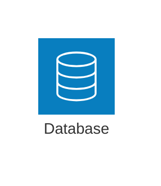
```mermaid
architecture-beta
service db(database)[Database]
```

**Output:**

### ServiceWithDifferentIcons

**Input:**
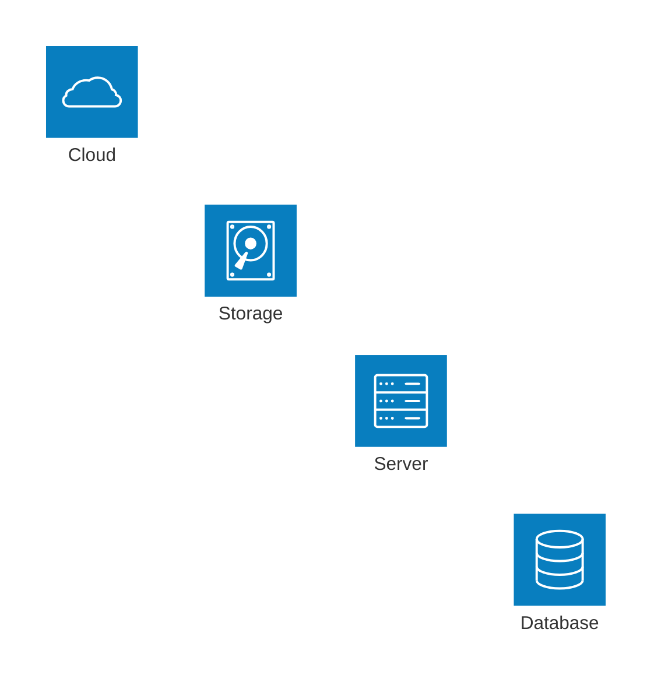
```mermaid
architecture-beta
service db(database)[Database]
service srv(server)[Server]
service disk1(disk)[Storage]
service cloud1(cloud)[Cloud]
```

**Output:**

### ServiceWithGroup

**Input:**
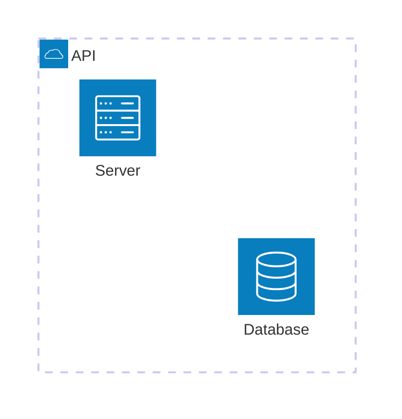
```mermaid
architecture-beta
group api(cloud)[API]
service db(database)[Database] in api
service server(server)[Server] in api
```

**Output:**

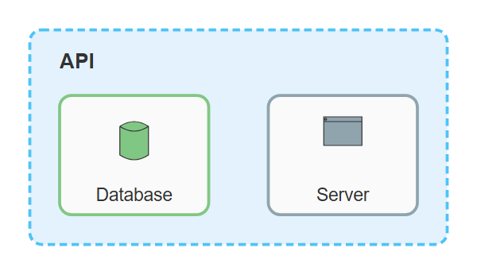

### ServicesWithEdge

**Input:**
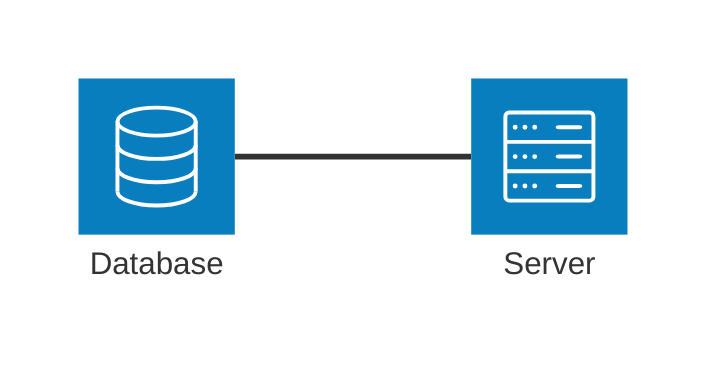
```mermaid
architecture-beta
service db(database)[Database]
service server(server)[Server]
db:R -- L:server
```

**Output:**

### Complex

**Input:**
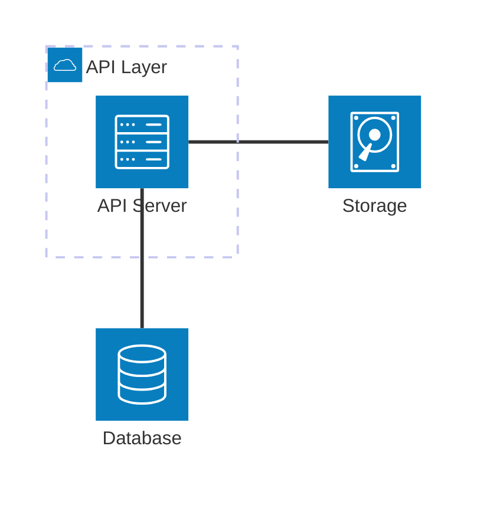
```mermaid
architecture-beta
group api(cloud)[API Layer]
service server(server)[API Server] in api
service db(database)[Database]
service disk1(disk)[Storage]
server:B -- T:db
server:R -- L:disk1
```

**Output:**

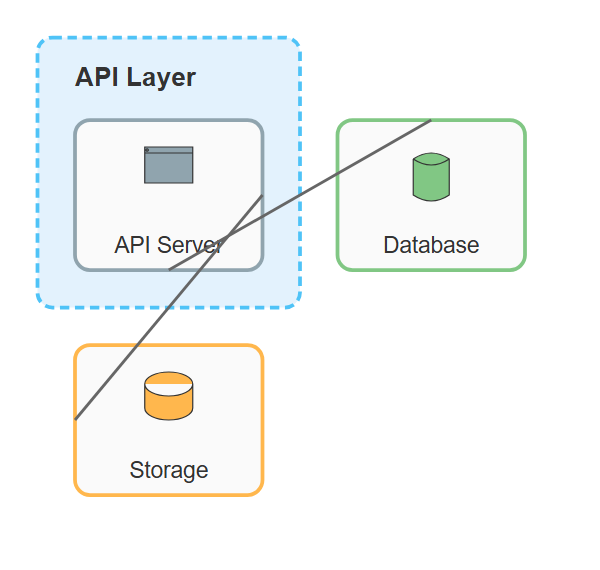

### EdgeWithArrows

**Input:**

```mermaid
architecture-beta
service client(internet)[Client]
service server(server)[Server]
service db(database)[Database]
<client:R -- L>:server
server:B -- T>:db
```

## Block

### Simple

**Input:**
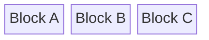
```mermaid
block-beta
    columns 3
    a["Block A"] b["Block B"] c["Block C"]
```

**Output:**

### Span

**Input:**
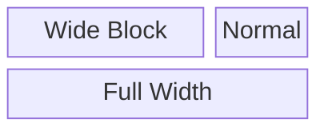
```mermaid
block-beta
    columns 3
    a["Wide Block"]:2 b["Normal"]
    c["Full Width"]:3
```

**Output:**

### DifferentShapes

**Input:**
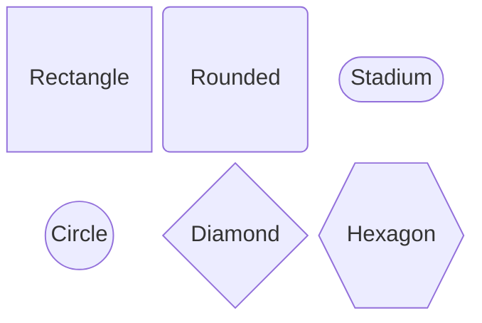
```mermaid
block-beta
    columns 3
    a["Rectangle"] b("Rounded") c(["Stadium"])
    d(("Circle")) e{"Diamond"} f{{"Hexagon"}}
```

**Output:**

### Column

**Input:**
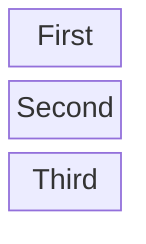
```mermaid
block-beta
    columns 1
    a["First"]
    b["Second"]
    c["Third"]
```

**Output:**

### ManyColumns

**Input:**
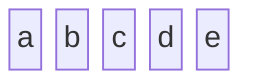
```mermaid
block-beta
    columns 5
    a b c d e
```

**Output:**

### MixedLayout

**Input:**
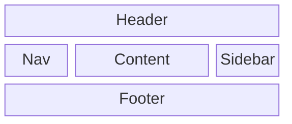
```mermaid
block-beta
    columns 4
    header["Header"]:4
    nav["Nav"] content["Content"]:2 side["Sidebar"]
    footer["Footer"]:4
```

**Output:**

## C4

### Simple

**Input:**
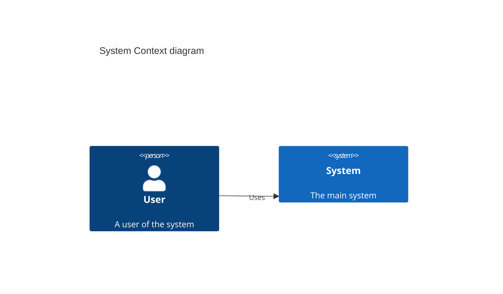
```mermaid
C4Context
    title System Context diagram
    Person(user, "User", "A user of the system")
    System(system, "System", "The main system")
    Rel(user, system, "Uses")
```

**Output:**

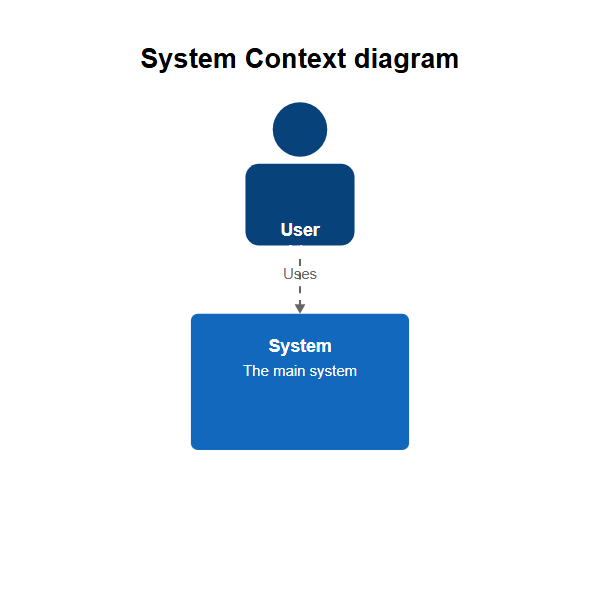

### External

**Input:**
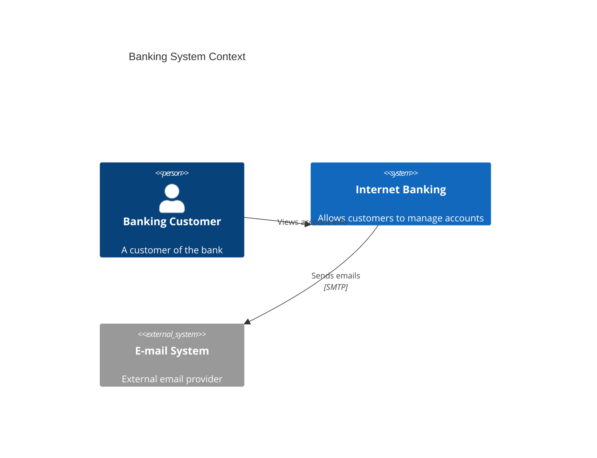
```mermaid
C4Context
    title Banking System Context
    Person(customer, "Banking Customer", "A customer of the bank")
    System(banking, "Internet Banking", "Allows customers to manage accounts")
    System_Ext(email, "E-mail System", "External email provider")
    Rel(customer, banking, "Views account info")
    Rel(banking, email, "Sends emails", "SMTP")
```

**Output:**

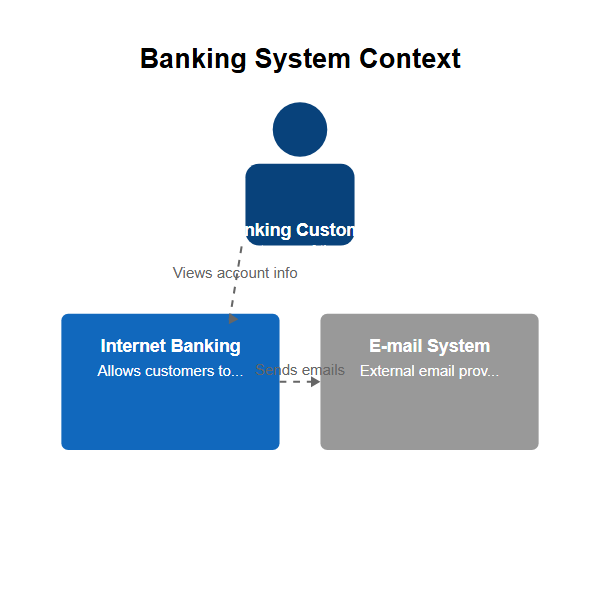

### Container

**Input:**
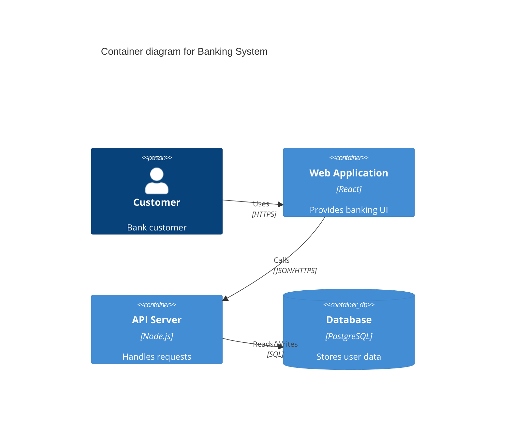
```mermaid
C4Container
    title Container diagram for Banking System
    Person(customer, "Customer", "Bank customer")
    Container(web, "Web Application", "React", "Provides banking UI")
    Container(api, "API Server", "Node.js", "Handles requests")
    ContainerDb(db, "Database", "PostgreSQL", "Stores user data")
    Rel(customer, web, "Uses", "HTTPS")
    Rel(web, api, "Calls", "JSON/HTTPS")
    Rel(api, db, "Reads/Writes", "SQL")
```

**Output:**

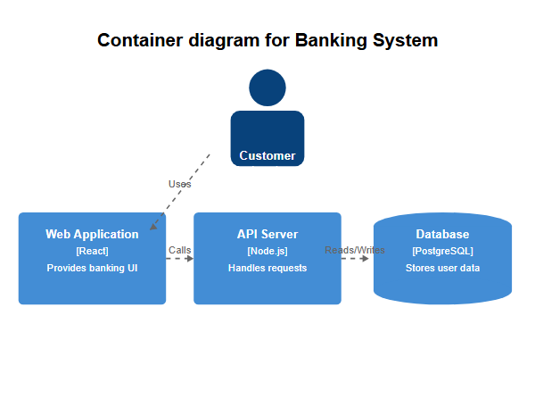

### Component

**Input:**
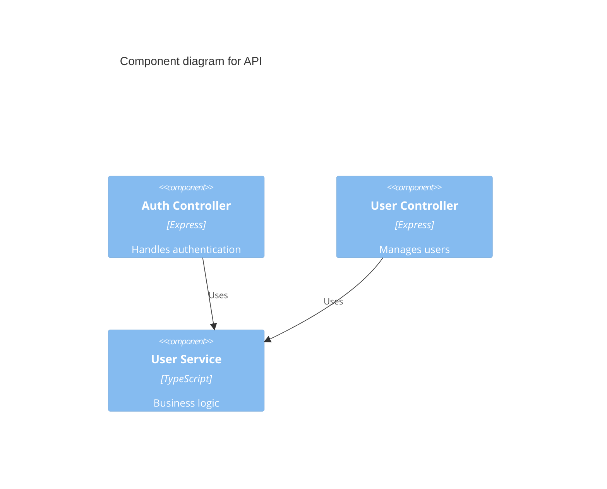
```mermaid
C4Component
    title Component diagram for API
    Component(auth, "Auth Controller", "Express", "Handles authentication")
    Component(user, "User Controller", "Express", "Manages users")
    Component(service, "User Service", "TypeScript", "Business logic")
    Rel(auth, service, "Uses")
    Rel(user, service, "Uses")
```

**Output:**

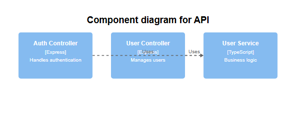

### MixedElements

**Input:**
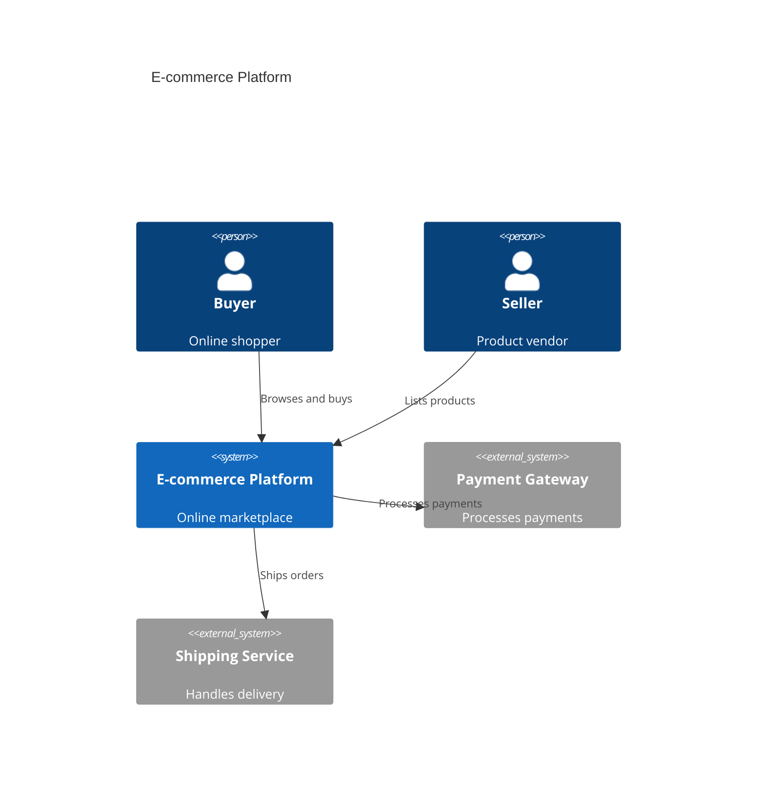
```mermaid
C4Context
    title E-commerce Platform
    Person(buyer, "Buyer", "Online shopper")
    Person(seller, "Seller", "Product vendor")
    System(platform, "E-commerce Platform", "Online marketplace")
    System_Ext(payment, "Payment Gateway", "Processes payments")
    System_Ext(shipping, "Shipping Service", "Handles delivery")
    Rel(buyer, platform, "Browses and buys")
    Rel(seller, platform, "Lists products")
    Rel(platform, payment, "Processes payments")
    Rel(platform, shipping, "Ships orders")
```

**Output:**

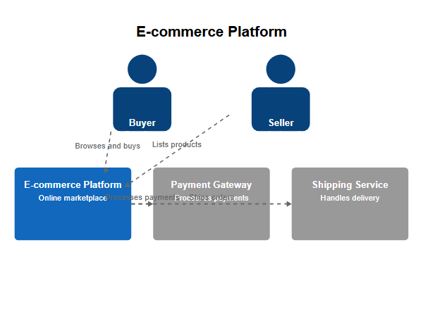

### NoRelationships

**Input:**
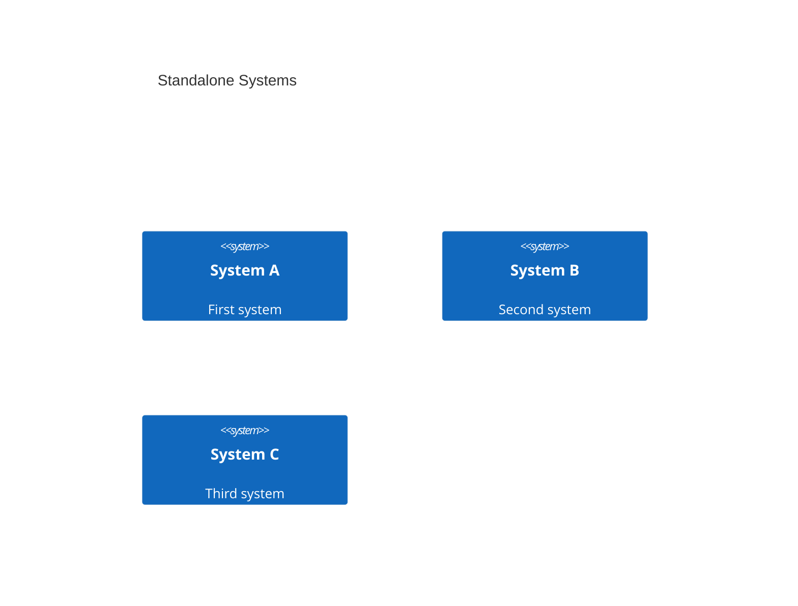
```mermaid
C4Context
    title Standalone Systems
    System(a, "System A", "First system")
    System(b, "System B", "Second system")
    System(c, "System C", "Third system")
```

**Output:**

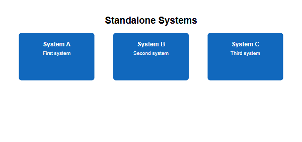

### Complex

**Input:**
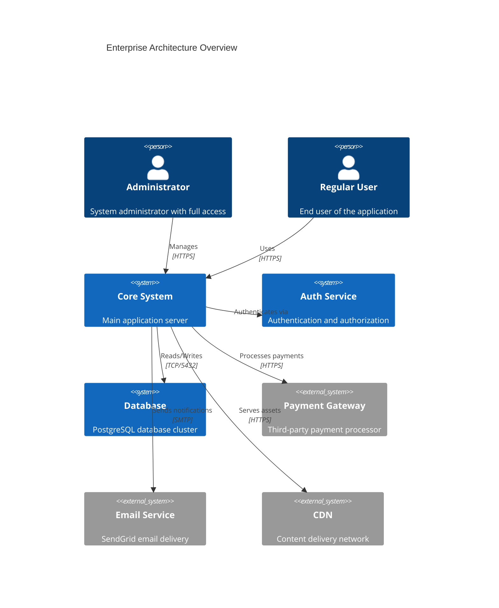
```mermaid
C4Context
    title Enterprise Architecture Overview

    Person(admin, "Administrator", "System administrator with full access")
    Person(user, "Regular User", "End user of the application")

    System(core, "Core System", "Main application server")
    System(auth, "Auth Service", "Authentication and authorization")
    System(db, "Database", "PostgreSQL database cluster")

    System_Ext(payment, "Payment Gateway", "Third-party payment processor")
    System_Ext(email, "Email Service", "SendGrid email delivery")
    System_Ext(cdn, "CDN", "Content delivery network")

    Rel(admin, core, "Manages", "HTTPS")
    Rel(user, core, "Uses", "HTTPS")
    Rel(core, auth, "Authenticates via")
    Rel(core, db, "Reads/Writes", "TCP/5432")
    Rel(core, payment, "Processes payments", "HTTPS")
    Rel(core, email, "Sends notifications", "SMTP")
    Rel(core, cdn, "Serves assets", "HTTPS")
```

**Output:**

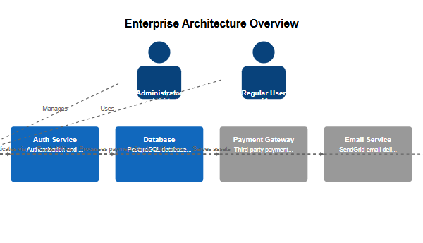

## Class

### Simple

**Input:**
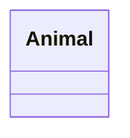
```mermaid
classDiagram
    class Animal
```

**Output:**

### Members

**Input:**
```mermaid
classDiagram
    class Animal {
        +String name
        +int age
    }
```

**Output:**

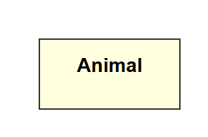

### Methods

**Input:**
```mermaid
classDiagram
    class Animal {
        +makeSound()
        +move() : void
    }
```

**Output:**

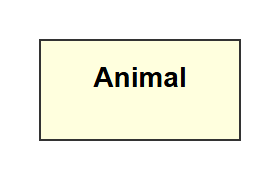

### MembersAndMethods

**Input:**
```mermaid
classDiagram
    class Animal {
        +String name
        +int age
        +makeSound() : void
        +move(int distance) : void
    }
```

**Output:**

### Inheritance

**Input:**
```mermaid
classDiagram
    Animal <|-- Dog
    Animal <|-- Cat
```

**Output:**

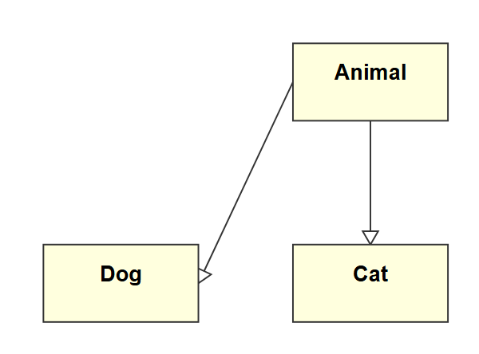

### Composition

**Input:**
```mermaid
classDiagram
    Car *-- Engine
    Car *-- Wheel
```

**Output:**

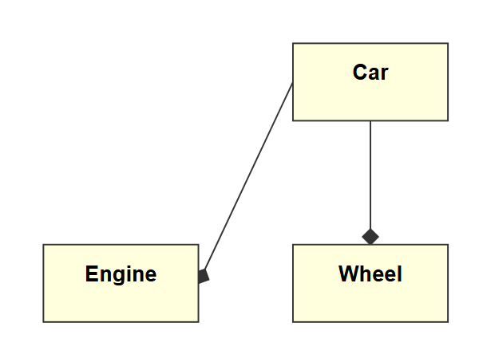

### Aggregation

**Input:**
```mermaid
classDiagram
    Library o-- Book
```

**Output:**

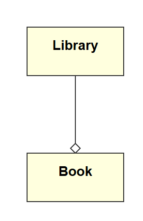

### Association

**Input:**
```mermaid
classDiagram
    Student --> Course : enrolls
```

**Output:**

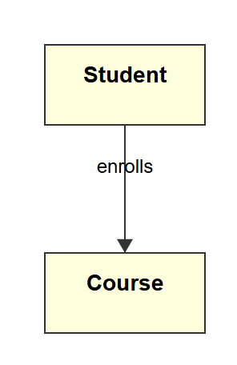

### InterfaceAnnotation

**Input:**
```mermaid
classDiagram
    class IFlyable {
        <<interface>>
        +fly() : void
    }
```

**Output:**

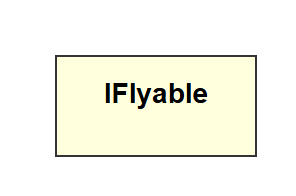

### Complex

**Input:**
```mermaid
classDiagram
class IRepository~T~ {
    <<interface>>
    +get(id: int) T
    +save(entity: T) void
    +delete(id: int) void
}

class AbstractEntity {
    <<abstract>>
    #int id
    #DateTime createdAt
    #DateTime updatedAt
    +getId() int
}

class UserService {
    <<service>>
    -IUserRepository repository
    -ILogger logger
    +createUser(name: String) User
    +findUser(id: int) User
    +deleteUser(id: int) void
}

class Status {
    <<enumeration>>
    ACTIVE
    INACTIVE
    PENDING
    DELETED
}

class User {
    +String name
    +String email
    -String passwordHash
    ~Status status
    +validate()$ bool
    +hashPassword(password: String)$ String
}

class Address {
    +String street
    +String city
    +String zipCode
}

class Order {
    +int orderId
    +List~Item~ items
    +calculateTotal() Decimal
}

class Item {
    +String name
    +Decimal price
    +int quantity
}

IRepository~T~ <|.. UserRepository : implements
AbstractEntity <|-- User : extends
UserService ..> IRepository~T~ : uses
User "1" --> "1..*" Address : has
User "1" o-- "*" Order : places
Order "1" *-- "1..*" Item : contains
```

**Output:**

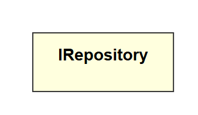

## EntityRelationship

### Simple

**Input:**
```mermaid
erDiagram
    CUSTOMER ||--o{ ORDER : places
```

**Output:**

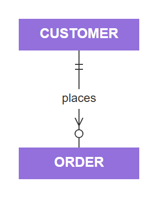

### MultipleRelationships

**Input:**
```mermaid
erDiagram
    CUSTOMER ||--o{ ORDER : places
    ORDER ||--|{ LINE-ITEM : contains
    PRODUCT ||--o{ LINE-ITEM : includes
```

**Output:**

### Attributes

**Input:**
```mermaid
erDiagram
    CUSTOMER {
        string name
        string email
        int age
    }
```

**Output:**

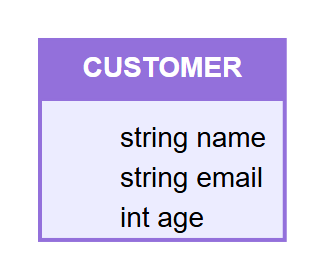

### KeyTypes

**Input:**
```mermaid
erDiagram
    CUSTOMER {
        int id PK
        string name
        string email UK
    }
```

**Output:**

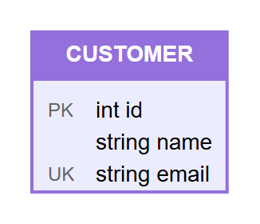

### Comments

**Input:**
```mermaid
erDiagram
    CUSTOMER {
        int id PK "Primary key"
        string name "Customer name"
    }
```

**Output:**

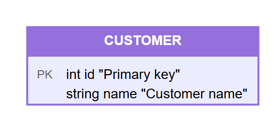

### OneToOne

**Input:**
```mermaid
erDiagram
    PERSON ||--|| PASSPORT : has
```

**Output:**

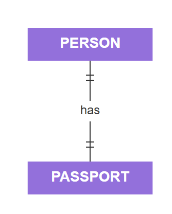

### ZeroOrOne

**Input:**
```mermaid
erDiagram
    EMPLOYEE |o--o| PARKING-SPACE : uses
```

**Output:**

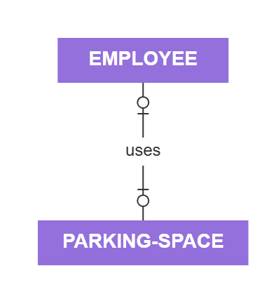

### NonIdentifying

**Input:**
```mermaid
erDiagram
    CUSTOMER ||..o{ ORDER : places
```

**Output:**

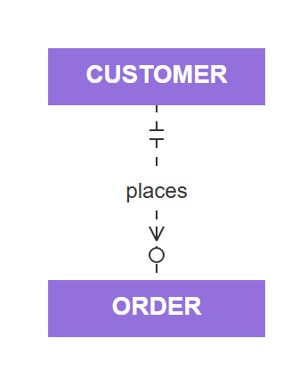

### Compelx

**Input:**
```mermaid
erDiagram
CUSTOMER {
    int customer_id PK "Primary key"
    string first_name "Customer first name"
    string last_name "Customer last name"
    string email UK "Unique email address"
    date date_of_birth
    string phone
    boolean is_active
}

ADDRESS {
    int address_id PK
    int customer_id FK
    string street
    string city
    string state
    string postal_code
    string country
    string address_type "billing or shipping"
}

ORDER {
    int order_id PK
    int customer_id FK
    int shipping_address_id FK
    int billing_address_id FK
    datetime order_date
    datetime shipped_date
    string status
    decimal total_amount
}

ORDER_ITEM {
    int item_id PK
    int order_id FK
    int product_id FK
    int quantity
    decimal unit_price
    decimal discount
}

PRODUCT {
    int product_id PK
    int category_id FK
    string name
    string description
    decimal price
    int stock_quantity
    string sku UK
}

CATEGORY {
    int category_id PK
    int parent_id FK "Self-referencing"
    string name
    string description
}

CUSTOMER ||--o{ ORDER : places
CUSTOMER ||--o{ ADDRESS : has
ORDER ||--|{ ORDER_ITEM : contains
ORDER }o--|| ADDRESS : "ships to"
ORDER }o--|| ADDRESS : "bills to"
PRODUCT ||--o{ ORDER_ITEM : "included in"
CATEGORY ||--o{ PRODUCT : categorizes
CATEGORY |o--o| CATEGORY : "parent of"
```

**Output:**

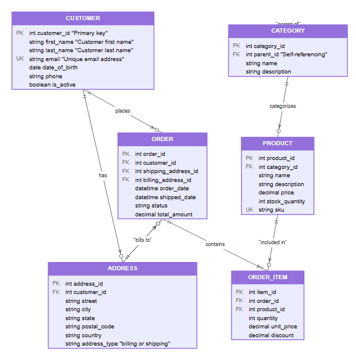

## Flowchart

### Simple

**Input:**
```mermaid
flowchart LR
    A[Start] --> B[Process] --> C[End]
```

**Output:**

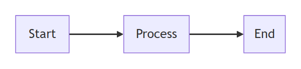

### Complex

**Input:**
```mermaid
flowchart TD
    A[Christmas] -->|Get money| B(Go shopping)
    B --> C{Let me think}
    C -->|One| D[Laptop]
    C -->|Two| E[iPhone]
    C -->|Three| F[fa:fa-car Car]
```

**Output:**

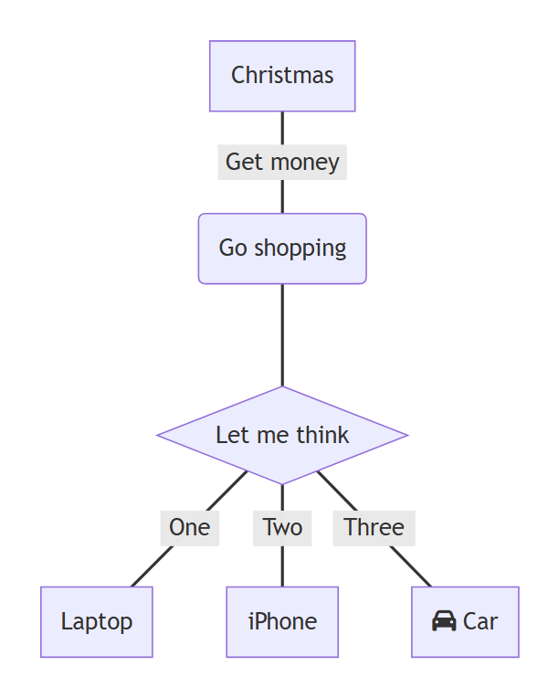

### Shapes

**Input:**
```mermaid
flowchart TD
    A[Rectangle]
    B(Rounded)
    C{Diamond}
    D((Circle))
```

**Output:**

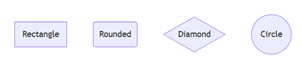

### EdgeLabels

**Input:**
```mermaid
flowchart LR
    A --> |Yes| B
    A --> |No| C
```

**Output:**

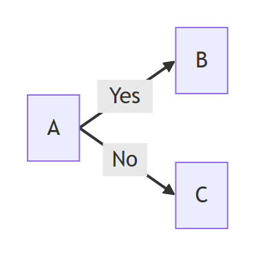

### GraphKeyword

**Input:**
```mermaid
graph TD
    A --> B --> C
```

**Output:**

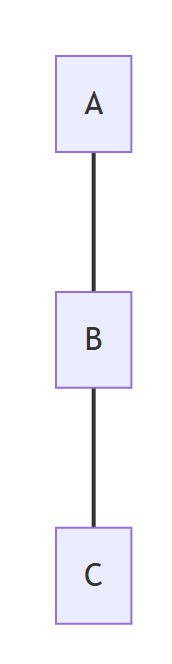

## Gantt

### Simple

**Input:**
```mermaid
gantt
    title Simple Gantt
    Task A :a1, 2024-01-01, 30d
    Task B :b1, 2024-01-15, 20d
```

**Output:**

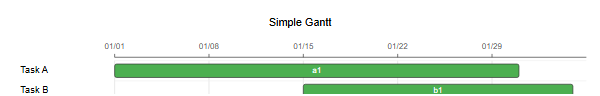

### TaskWithDependency

**Input:**
```mermaid
gantt
    title Dependent Tasks
    Task A :a1, 2024-01-01, 10d
    Task B :b1, after a1, 15d
```

**Output:**

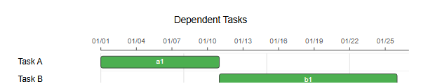

### Sections

**Input:**
```mermaid
gantt
    title Project Timeline
    section Planning
        Research :a1, 2024-01-01, 7d
        Design :a2, after a1, 14d
    section Development
        Coding :b1, after a2, 30d
        Testing :b2, after b1, 14d
```

**Output:**

### Statuses

**Input:**
```mermaid
gantt
    title Task Statuses
    Done Task :done, d1, 2024-01-01, 10d
    Active Task :active, a1, 2024-01-11, 10d
    Normal Task :n1, 2024-01-21, 10d
```

**Output:**

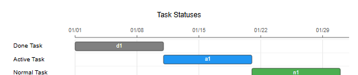

### Critical

**Input:**
```mermaid
gantt
    title Critical Path
    Normal :n1, 2024-01-01, 10d
    Critical :crit, c1, 2024-01-11, 10d
    Also Critical :crit, c2, after c1, 10d
```

**Output:**

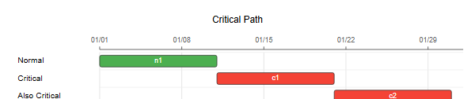

### Milestones

**Input:**
```mermaid
gantt
    title With Milestones
    Development :d1, 2024-01-01, 30d
    Release :milestone, m1, 2024-01-31, 0d
```

**Output:**

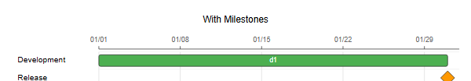

### Complex

**Input:**
```mermaid
gantt
    title Complete Project
    dateFormat YYYY-MM-DD
    section Phase 1
        Planning :done, p1, 2024-01-01, 7d
        Design :done, p2, after p1, 14d
    section Phase 2
        Development :active, d1, after p2, 30d
        Code Review :crit, d2, after d1, 7d
    section Phase 3
        Testing :t1, after d2, 14d
        Deployment :t2, after t1, 3d
        Go Live :milestone, m1, after t2, 0d
```

**Output:**

### WeeklyDuration

**Input:**
```mermaid
gantt
    title Weekly Tasks
    Week Task :w1, 2024-01-01, 2w
    Day Task :d1, after w1, 5d
```

**Output:**

## GitGraph

### Simple

**Input:**
```mermaid
gitGraph
    commit
    commit
    commit
```

**Output:**

### Id

**Input:**
```mermaid
gitGraph
    commit id: "alpha"
    commit id: "beta"
    commit id: "gamma"
```

**Output:**

### Tag

**Input:**
```mermaid
gitGraph
    commit
    commit tag: "v1.0.0"
    commit
```

**Output:**

### Message

**Input:**
```mermaid
gitGraph
    commit id: "init" msg: "Initial commit"
    commit id: "feat" msg: "Add feature"
```

**Output:**

### Types

**Input:**
```mermaid
gitGraph
    commit type: NORMAL
    commit type: REVERSE
    commit type: HIGHLIGHT
```

**Output:**

### BranchAndCheckout

**Input:**
```mermaid
gitGraph
    commit
    branch develop
    commit
    checkout main
    commit
```

**Output:**

### MultipleBranches

**Input:**
```mermaid
gitGraph
    commit
    branch develop
    commit
    branch feature
    commit
    checkout develop
    commit
    checkout main
    commit
```

**Output:**

### MergeBranch

**Input:**
```mermaid
gitGraph
    commit
    branch develop
    commit
    commit
    checkout main
    merge develop
    commit
```

**Output:**

### MergeWithTag

**Input:**
```mermaid
gitGraph
    commit
    branch develop
    commit
    checkout main
    merge develop tag: "v2.0.0"
```

**Output:**

### CherryPick

**Input:**
```mermaid
gitGraph
    commit id: "one"
    branch develop
    commit id: "two"
    checkout main
    cherry-pick id: "two"
```

**Output:**

### Complex

**Input:**
```mermaid
gitGraph
    commit id: "init" tag: "v1.0"
    branch develop
    commit id: "dev1"
    commit id: "dev2"
    branch feature
    commit id: "feat1"
    checkout develop
    merge feature
    checkout main
    merge develop tag: "v2.0"
    commit id: "hotfix" type: HIGHLIGHT
```

**Output:**

## Kanban

### Simple

**Input:**
```mermaid
kanban
todo[Todo]
    task1[First Task]
    task2[Second Task]
done[Done]
    task3[Completed Task]
```

**Output:**

### ThreeColumns

**Input:**
```mermaid
kanban
todo[To Do]
    t1[Research]
    t2[Design]
wip[In Progress]
    t3[Development]
done[Done]
    t4[Testing]
    t5[Review]
```

**Output:**

### EmptyColumns

**Input:**
```mermaid
kanban
backlog[Backlog]
todo[To Do]
done[Done]
    t1[Task 1]
```

**Output:**

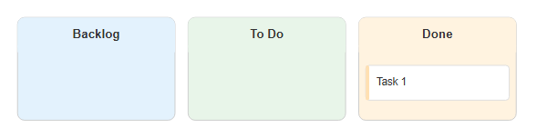

### ManyTasks

**Input:**
```mermaid
kanban
col1[Sprint Backlog]
    t1[User Story 1]
    t2[User Story 2]
    t3[User Story 3]
    t4[User Story 4]
    t5[User Story 5]
col2[In Progress]
    t6[Feature A]
    t7[Feature B]
col3[Review]
    t8[Bug Fix 1]
col4[Done]
    t9[Setup]
    t10[Configuration]
```

**Output:**

### SingleColumn

**Input:**
```mermaid
kanban
tasks[All Tasks]
    t1[Task One]
    t2[Task Two]
    t3[Task Three]
```

**Output:**

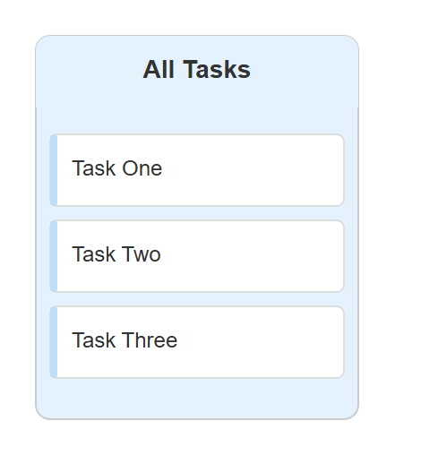

## Mindmap

### Simple

**Input:**
```mermaid
mindmap
  Root
    Branch A
    Branch B
    Branch C
```

**Output:**

### Nested

**Input:**
```mermaid
mindmap
  Root
    Branch 1
      Sub 1.1
      Sub 1.2
    Branch 2
      Sub 2.1
```

**Output:**

### CircleShape

**Input:**
```mermaid
mindmap
  ((Central))
    Child 1
    Child 2
```

**Output:**

### SquareShape

**Input:**
```mermaid
mindmap
  [Square Root]
    [Square Child]
    Normal Child
```

**Output:**

### RoundedShape

**Input:**
```mermaid
mindmap
  (Rounded Root)
    (Rounded Child)
    Normal Child
```

**Output:**

### HexagonShape

**Input:**
```mermaid
mindmap
  {{Hexagon}}
    Child A
    Child B
```

**Output:**

### MixedShapes

**Input:**
```mermaid
mindmap
  ((Center))
    [Square]
      Normal
    (Rounded)
      {{Hex}}
```

**Output:**

### DeepHierarchy

**Input:**
```mermaid
mindmap
  Root
    Level 1
      Level 2
        Level 3
          Level 4
            Level 5
```

**Output:**

### WideTree

**Input:**
```mermaid
mindmap
  Center
    A
    B
    C
    D
    E
    F
```

**Output:**

### Complex

**Input:**
```mermaid
mindmap
  ((Project))
    [Planning]
      Requirements
      Design
    [Development]
      Frontend
      Backend
      Database
    [Testing]
      Unit Tests
      Integration
    [Deployment]
      Staging
      Production
```

**Output:**

## Packet

### Simple

**Input:**
```mermaid
packet-beta
0-15: "Source Port"
16-31: "Destination Port"
```

**Output:**

### TCPHeader

**Input:**
```mermaid
packet-beta
0-15: "Source Port"
16-31: "Destination Port"
32-63: "Sequence Number"
64-95: "Acknowledgment Number"
96-99: "Data Offset"
100-102: "Reserved"
103-103: "NS"
104-104: "CWR"
105-105: "ECE"
106-106: "URG"
107-107: "ACK"
108-108: "PSH"
109-109: "RST"
110-110: "SYN"
111-111: "FIN"
112-127: "Window Size"
```

**Output:**

### IPv4Header

**Input:**
```mermaid
packet-beta
0-3: "Version"
4-7: "IHL"
8-13: "DSCP"
14-15: "ECN"
16-31: "Total Length"
32-47: "Identification"
48-50: "Flags"
51-63: "Fragment Offset"
64-71: "TTL"
72-79: "Protocol"
80-95: "Header Checksum"
96-127: "Source IP Address"
128-159: "Destination IP Address"
```

**Output:**

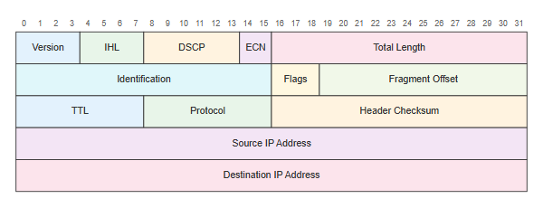

### SingleRow

**Input:**
```mermaid
packet-beta
0-7: "Byte 1"
8-15: "Byte 2"
16-23: "Byte 3"
24-31: "Byte 4"
```

**Output:**

### Fields

**Input:**
```mermaid
packet-beta
0-31: "First Word"
32-63: "Second Word"
64-95: "Third Word"
```

**Output:**

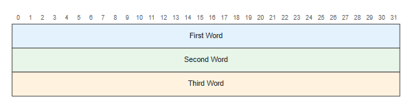

## Pie

### Simple

**Input:**
```mermaid
pie
    "Dogs" : 40
    "Cats" : 30
    "Birds" : 20
    "Fish" : 10
```

**Output:**

### Title

**Input:**
```mermaid
pie
    title Pet Distribution
    "Dogs" : 40
    "Cats" : 30
    "Birds" : 30
```

**Output:**

### ShowData

**Input:**
```mermaid
pie showData
    "Revenue" : 65
    "Costs" : 35
```

**Output:**

## Quadrant

### Simple

**Input:**
```mermaid
quadrantChart
    title Campaign Analysis
    x-axis Low Reach --> High Reach
    y-axis Low Engagement --> High Engagement
    Campaign A: [0.3, 0.6]
    Campaign B: [0.7, 0.8]
```

**Output:**

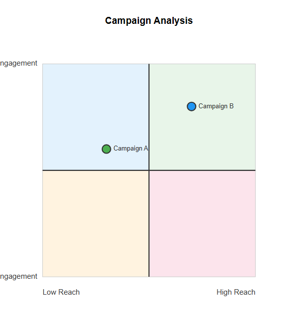

### Labels

**Input:**
```mermaid
quadrantChart
    title Priority Matrix
    x-axis Low Urgency --> High Urgency
    y-axis Low Impact --> High Impact
    quadrant-1 Do First
    quadrant-2 Schedule
    quadrant-3 Delegate
    quadrant-4 Eliminate
    Task A: [0.8, 0.9]
    Task B: [0.2, 0.8]
    Task C: [0.2, 0.2]
    Task D: [0.9, 0.3]
```

**Output:**

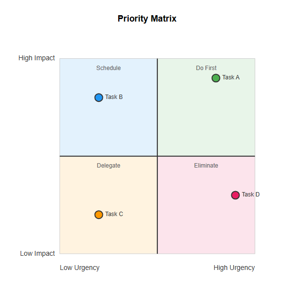

### ManyPoints

**Input:**
```mermaid
quadrantChart
    title Product Portfolio
    x-axis Low Growth --> High Growth
    y-axis Low Share --> High Share
    Product A: [0.1, 0.9]
    Product B: [0.9, 0.9]
    Product C: [0.1, 0.1]
    Product D: [0.9, 0.1]
    Product E: [0.5, 0.5]
    Product F: [0.3, 0.7]
```

**Output:**

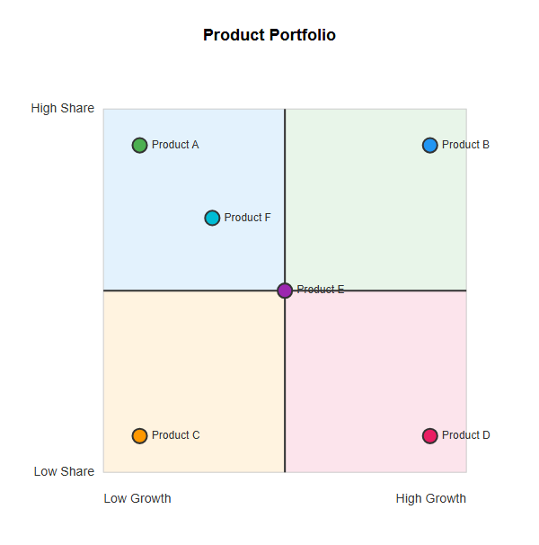

### TitleOnly

**Input:**
```mermaid
quadrantChart
    title Skills Assessment
    x-axis Beginner --> Expert
    y-axis Low Priority --> High Priority
    Python: [0.8, 0.9]
    JavaScript: [0.7, 0.7]
    Rust: [0.3, 0.5]
```

**Output:**

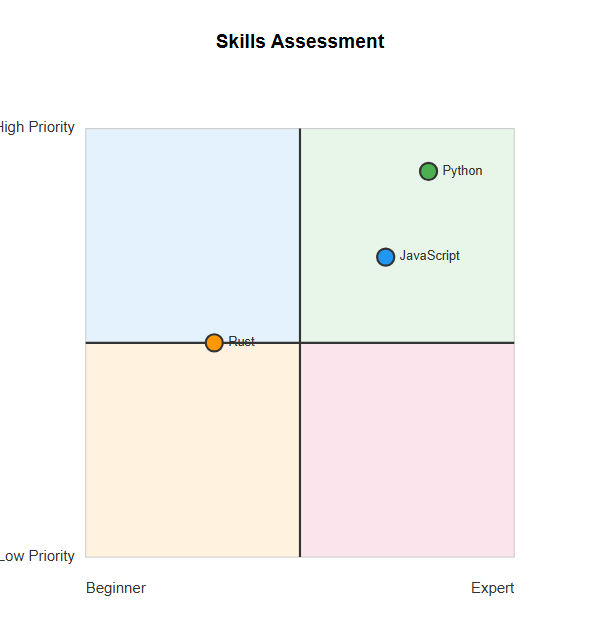

### EdgePositions

**Input:**
```mermaid
quadrantChart
    title Edge Cases
    x-axis Left --> Right
    y-axis Bottom --> Top
    Top Right: [1.0, 1.0]
    Top Left: [0.0, 1.0]
    Bottom Left: [0.0, 0.0]
    Bottom Right: [1.0, 0.0]
    Center: [0.5, 0.5]
```

## Radar

### Simple

**Input:**
```mermaid
radar-beta
axis A, B, C, D, E
curve data1["Series1"]{20, 40, 60, 80, 50}
```

**Output:**

### Title

**Input:**
```mermaid
radar-beta
title Performance Metrics
axis Speed, Quality, Cost, Time, Scope
curve a["Project A"]{80, 60, 40, 70, 90}
```

**Output:**

### MultipleCurves

**Input:**
```mermaid
radar-beta
title Comparison
axis Strength, Speed, Agility, Stamina, Intelligence
curve hero["Hero"]{90, 70, 85, 60, 75}
curve villain["Villain"]{75, 80, 65, 85, 90}
```

**Output:**

### ThreeCurves

**Input:**
```mermaid
radar-beta
title Language Skills
axis English, French, German, Spanish
curve a["User1"]{80, 30, 40, 50}
curve b["User2"]{50, 80, 30, 40}
curve c["User3"]{60, 60, 80, 70}
```

**Output:**

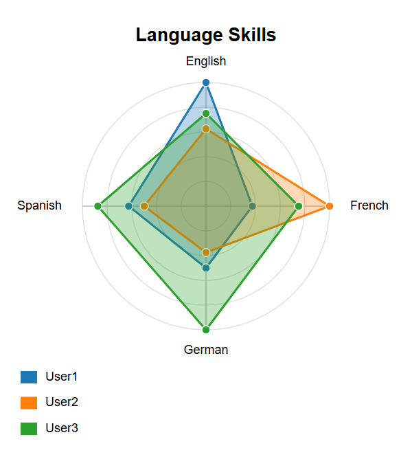

### Triangle

**Input:**
```mermaid
radar-beta
axis A, B, C
curve data["Values"]{100, 80, 60}
```

**Output:**

### Hexagon

**Input:**
```mermaid
radar-beta
title Six Dimensions
axis Dim1, Dim2, Dim3, Dim4, Dim5, Dim6
curve data["Metrics"]{50, 80, 60, 90, 40, 70}
```

**Output:**

## Requirement

### Simple

**Input:**
```mermaid
requirementDiagram

requirement test_req {
    id: 1
    text: The system shall do something
    risk: high
    verifymethod: test
}
```

**Output:**

### Functional

**Input:**
```mermaid
requirementDiagram

functionalRequirement login_req {
    id: REQ-001
    text: User must be able to log in
    risk: medium
    verifymethod: demonstration
}
```

### Element

**Input:**
```mermaid
requirementDiagram

requirement test_req {
    id: 1
    text: System requirement
    risk: low
}

element test_entity {
    type: simulation
}

test_entity - satisfies -> test_req
```

**Output:**

### Multiple

**Input:**
```mermaid
requirementDiagram

requirement req1 {
    id: REQ-001
    text: First requirement
    risk: low
}

requirement req2 {
    id: REQ-002
    text: Second requirement
    risk: medium
}

performanceRequirement perf1 {
    id: PERF-001
    text: Performance must be good
    risk: high
}
```

### Complex

**Input:**
```mermaid
requirementDiagram

requirement user_auth {
    id: REQ-001
    text: Users must authenticate
    risk: high
    verifymethod: test
}

functionalRequirement login_page {
    id: REQ-002
    text: System provides login page
    risk: medium
}

element web_app {
    type: application
    docref: /docs/webapp
}

element login_module {
    type: module
}

web_app - contains -> login_module
login_module - satisfies -> login_page
login_page - derives -> user_auth
```

### AllTypes

**Input:**
```mermaid
requirementDiagram

requirement req1 {
    id: 1
    text: Main requirement
}

requirement req2 {
    id: 2
    text: Derived requirement
}

element elem1 {
    type: component
}

req2 - derives -> req1
elem1 - satisfies -> req1
elem1 - verifies -> req2
```

**Output:**

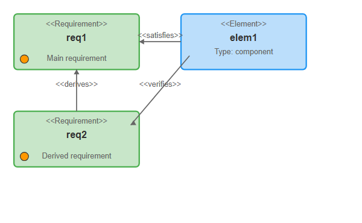

## Sankey

### Simple

**Input:**
```mermaid
sankey-beta
A,B,10
A,C,20
```

**Output:**

### ThreeColumns

**Input:**
```mermaid
sankey-beta
Source,Middle,30
Middle,Target,30
```

**Output:**

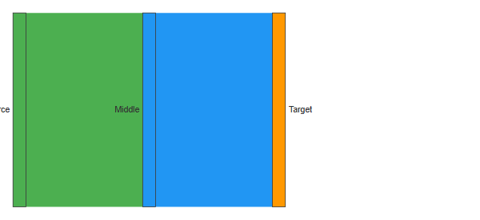

### EnergyFlow

**Input:**
```mermaid
sankey-beta
Coal,Electricity,100
Gas,Electricity,50
Nuclear,Electricity,30
Electricity,Industry,80
Electricity,Residential,60
Electricity,Commercial,40
```

**Output:**

### BudgetFlow

**Input:**
```mermaid
sankey-beta
Salary,Savings,1000
Salary,Expenses,3000
Expenses,Housing,1500
Expenses,Food,800
Expenses,Transport,400
Expenses,Other,300
```

**Output:**

### MultipleSourcesAndTargets

**Input:**
```mermaid
sankey-beta
A,X,10
A,Y,15
B,X,20
B,Y,25
B,Z,5
```

**Output:**

### SingleLink

**Input:**
```mermaid
sankey-beta
Input,Output,100
```

**Output:**

## Sequence

### Simple

**Input:**
```mermaid
sequenceDiagram
    Alice->>Bob: Hello Bob
    Bob-->>Alice: Hi Alice
```

**Output:**

### Participants

**Input:**
```mermaid
sequenceDiagram
    participant A as Alice
    participant B as Bob
    A->>B: Hello
    B->>A: Hi
```

**Output:**

### Actors

**Input:**
```mermaid
sequenceDiagram
    actor User
    participant Server
    User->>Server: Request
    Server-->>User: Response
```

**Output:**

### Activation

**Input:**
```mermaid
sequenceDiagram
    Alice->>+Bob: Hello
    Bob-->>-Alice: Hi
```

**Output:**

### Notes

**Input:**
```mermaid
sequenceDiagram
    Alice->>Bob: Hello
    Note right of Bob: Bob thinks
    Bob-->>Alice: Hi
    Note over Alice,Bob: Conversation
```

**Output:**

### AutoNumber

**Input:**
```mermaid
sequenceDiagram
    autonumber
    Alice->>Bob: Hello
    Bob->>Alice: Hi
    Alice->>Bob: How are you?
```

**Output:**

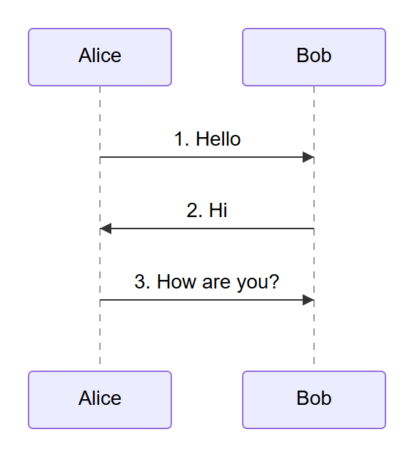

### DifferentArrows

**Input:**
```mermaid
sequenceDiagram
    A->>B: Solid arrow
    A-->>B: Dotted arrow
    A->B: Solid open
    A-->B: Dotted open
    A-xB: Solid cross
    A--xB: Dotted cross
```

**Output:**

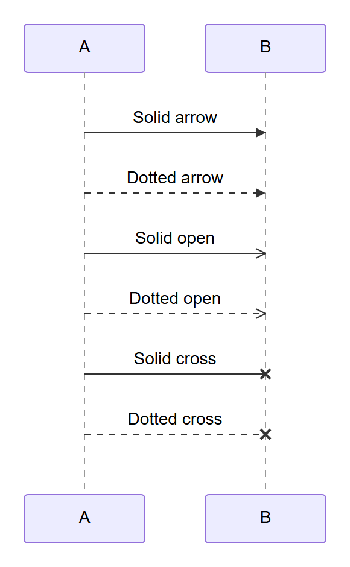

### Title

**Input:**
```mermaid
sequenceDiagram
    title Authentication Flow
    Client->>Server: Login request
    Server-->>Client: Token
```

**Output:**

### Complex

**Input:**
```mermaid
sequenceDiagram
    title Complete Authentication Flow
    autonumber

    actor User
    participant Client as Web Client
    participant Auth as Auth Service
    participant DB as Database
    participant Email as Email Service

    User->>+Client: Enter credentials
    Client->>+Auth: POST /login
    Auth->>+DB: Query user
    DB-->>-Auth: User data
    Note right of Auth: Validate credentials
    Auth->>Auth: Generate JWT
    Note right of Auth: Token expires in 24h
    Auth-->>-Client: 200 OK + Token
    Client->>+Email: Send welcome email
    Email-->>-Client: Email sent
    Client-->>-User: Show dashboard
    Note over User,DB: Session established
```

**Output:**

## State

### Simple

**Input:**
```mermaid
stateDiagram-v2
    [*] --> Still
    Still --> [*]
```

**Output:**

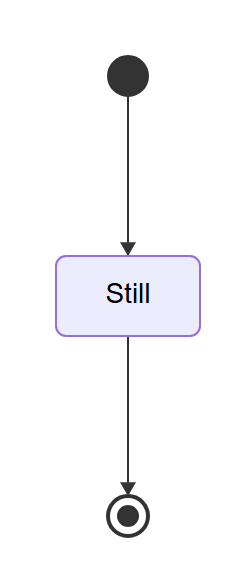

### MultipleStates

**Input:**
```mermaid
stateDiagram-v2
    [*] --> Still
    Still --> Moving
    Moving --> Still
    Moving --> Crash
    Crash --> [*]
```

**Output:**

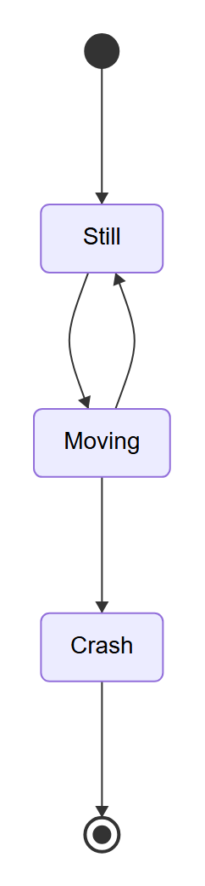

### TransitionLabels

**Input:**
```mermaid
stateDiagram-v2
    [*] --> Active
    Active --> Inactive : timeout
    Inactive --> Active : reset
    Active --> [*] : shutdown
```

**Output:**

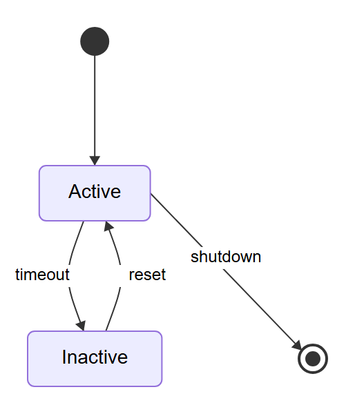

### Description

**Input:**
```mermaid
stateDiagram-v2
    state "This is a state description" as s1
    [*] --> s1
    s1 --> [*]
```

**Output:**

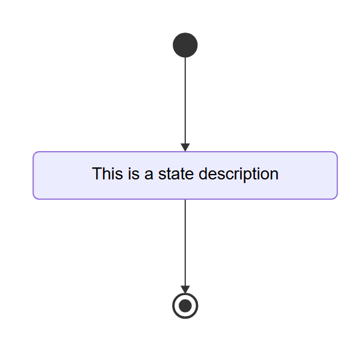

### ForkJoinState

**Input:**
```mermaid
stateDiagram-v2
    state fork_state <<fork>>
    [*] --> fork_state
    fork_state --> State2
    fork_state --> State3
```

**Output:**

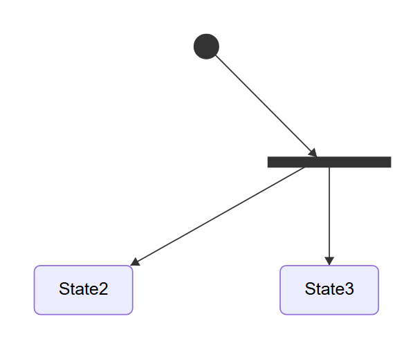

### ChoiceState

**Input:**
```mermaid
stateDiagram-v2
    state choice_state <<choice>>
    [*] --> IsPositive
    IsPositive --> choice_state
    choice_state --> Positive : if n > 0
    choice_state --> Negative : if n < 0
```

**Output:**

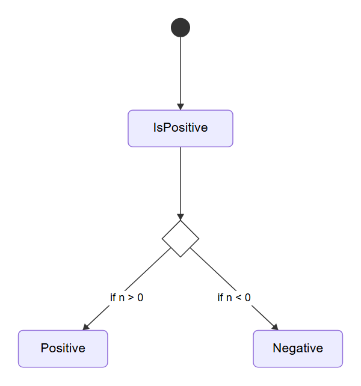

### StateWithNote

**Input:**
```mermaid
stateDiagram-v2
    [*] --> Active
    Active --> [*]
    note right of Active : Important note
```

**Output:**

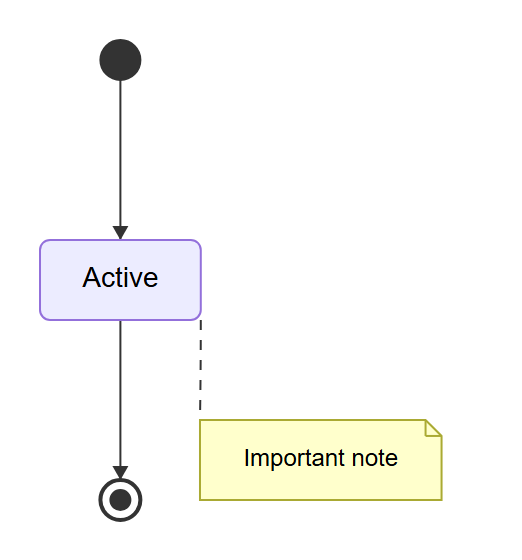

### StateDiagramV1

**Input:**
```mermaid
stateDiagram
    [*] --> Still
    Still --> [*]
```

**Output:**

### Complex

**Input:**
```mermaid
stateDiagram-v2
    [*] --> Idle

    state "Processing State" as Processing
    state fork_state <<fork>>
    state join_state <<join>>
    state choice_state <<choice>>

    Idle --> Processing : start
    Processing --> fork_state
    fork_state --> TaskA
    fork_state --> TaskB
    TaskA --> join_state
    TaskB --> join_state
    join_state --> choice_state
    choice_state --> Success : if valid
    choice_state --> Error : if invalid
    Success --> Idle : reset
    Error --> Idle : retry
    Success --> [*] : complete

    note right of Processing : This is a processing note
    note left of Error : Error handling
```

**Output:**

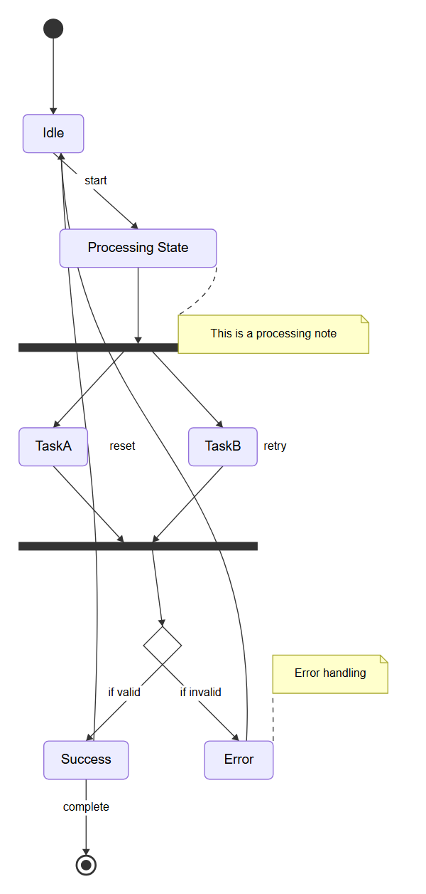

## Timeline

### Simple

**Input:**
```mermaid
timeline
    2020 : Event One
    2021 : Event Two
    2022 : Event Three
```

**Output:**

### Title

**Input:**
```mermaid
timeline
    title History of Computing
    1940 : First Computer
    1970 : Personal Computers
    2000 : Internet Era
```

**Output:**

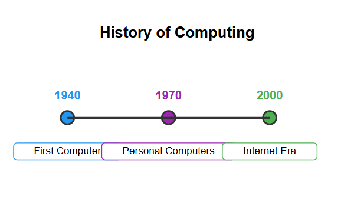

### MultipleEventsPerPeriod

**Input:**
```mermaid
timeline
    2004 : Facebook
         : Gmail
    2005 : YouTube
    2006 : Twitter
         : Spotify
```

**Output:**

### Sections

**Input:**
```mermaid
timeline
    title Technology Timeline
    section Early Era
        1990 : World Wide Web
        1995 : Windows 95
    section Modern Era
        2007 : iPhone
        2010 : iPad
```

**Output:**

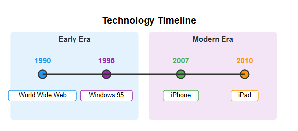

### TextPeriods

**Input:**
```mermaid
timeline
    title Project Phases
    Planning : Define scope
    Design : Create mockups
    Development : Build features
    Testing : Quality assurance
```

**Output:**

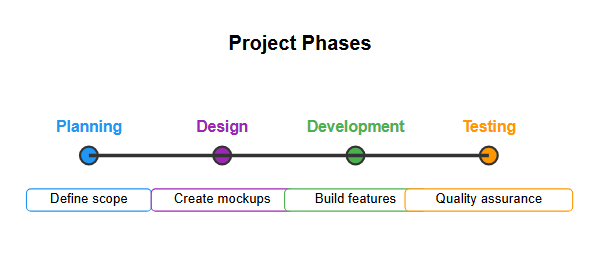

### MultipleSections

**Input:**
```mermaid
timeline
    section Ancient History
        3000 BC : Writing invented
        500 BC : Democracy
    section Medieval
        500 AD : Dark Ages
        1400 : Renaissance
    section Modern
        1800 : Industrial Revolution
        2000 : Digital Age
```

**Output:**

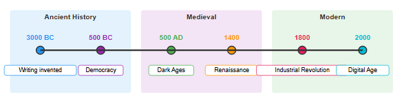

### Complex

**Input:**
```mermaid
timeline
    title Social Media Evolution
    section Web 1.0
        1997 : Six Degrees
        1999 : LiveJournal
    section Web 2.0
        2003 : MySpace
             : LinkedIn
        2004 : Facebook
        2005 : YouTube
        2006 : Twitter
    section Mobile Era
        2010 : Instagram
        2011 : Snapchat
        2016 : TikTok
```

**Output:**

## Treemap

### Simple

**Input:**
```mermaid
treemap-beta
"Section A"
    "Item 1": 30
    "Item 2": 20
"Section B"
    "Item 3": 50
```

**Output:**

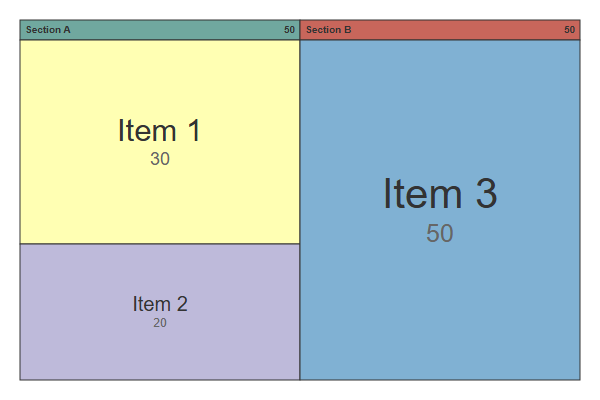

### SingleLevel

**Input:**
```mermaid
treemap-beta
"Alpha": 40
"Beta": 30
"Gamma": 20
"Delta": 10
```

**Output:**

### NestedSections

**Input:**
```mermaid
treemap-beta
"Root"
    "Branch 1"
        "Leaf 1.1": 15
        "Leaf 1.2": 25
    "Branch 2"
        "Leaf 2.1": 30
        "Leaf 2.2": 10
        "Leaf 2.3": 20
```

**Output:**

### MixedHierarchy

**Input:**
```mermaid
treemap-beta
"Products": 100
"Services"
    "Consulting": 50
    "Support": 30
"Other": 20
```

**Output:**

### LargeValues

**Input:**
```mermaid
treemap-beta
"Category A"
    "Sub A1": 1000
    "Sub A2": 500
"Category B"
    "Sub B1": 750
    "Sub B2": 250
```

**Output:**

### Complex

**Input:**
```mermaid
treemap-beta
"Group 1"
    "A": 10
    "B": 15
    "C": 20
"Group 2"
    "D": 25
    "E": 30
"Group 3"
    "F": 12
    "G": 18
    "H": 22
    "I": 8
```

**Output:**

## UserJourney

### Simple

**Input:**
```mermaid
journey
    title My Working Day
    section Morning
        Make coffee: 5: Me
        Check emails: 3: Me
```

**Output:**

### MultipleSections

**Input:**
```mermaid
journey
    title Customer Journey
    section Discovery
        Visit website: 4: Customer
        Browse products: 3: Customer
    section Purchase
        Add to cart: 4: Customer
        Checkout: 2: Customer
    section Delivery
        Track order: 5: Customer
        Receive package: 5: Customer
```

**Output:**

### MultipleActors

**Input:**
```mermaid
journey
    title Team Collaboration
    section Planning
        Define requirements: 4: PM, Dev
        Create design: 3: Designer, PM
    section Development
        Write code: 4: Dev
        Code review: 3: Dev, Lead
    section Testing
        Test features: 4: QA, Dev
        Fix bugs: 2: Dev
```

**Output:**

### AllScores

**Input:**
```mermaid
journey
    title Score Examples
    section Experience
        Terrible: 1: User
        Bad: 2: User
        Okay: 3: User
        Good: 4: User
        Great: 5: User
```

**Output:**

### WithoutTitle

**Input:**
```mermaid
journey
    section Tasks
        First task: 4: Alice
        Second task: 5: Bob
```

**Output:**

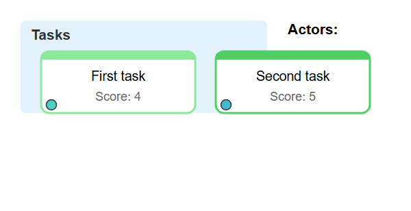

### ManyActors

**Input:**
```mermaid
journey
    title Big Team Project
    section Kickoff
        Initial meeting: 4: PM, Dev, QA, Designer, Lead, Stakeholder
    section Execution
        Development: 3: Dev, Lead
        Testing: 4: QA
```

**Output:**

### Complex

**Input:**
```mermaid
journey
    title Complete E-commerce Experience
    
    section Discovery
        Search for product: 4: Customer
        Browse categories: 3: Customer
        Read reviews: 5: Customer
        Compare prices: 4: Customer
    
    section Shopping
        Add to wishlist: 5: Customer
        Add to cart: 4: Customer
        Apply coupon: 2: Customer, Support
        Update quantity: 3: Customer
    
    section Checkout
        Enter shipping: 3: Customer
        Select payment: 4: Customer
        Confirm order: 5: Customer
        Receive confirmation: 5: Customer, System
    
    section Fulfillment
        Order processing: 4: Warehouse, System
        Package shipping: 4: Warehouse, Courier
        Track delivery: 5: Customer, Courier
        Receive package: 5: Customer, Courier
    
    section Post-Purchase
        Leave review: 4: Customer
        Contact support: 2: Customer, Support
        Request return: 1: Customer, Support
        Receive refund: 3: Customer, Finance
```

**Output:**

## XYChart

### Simple

**Input:**
```mermaid
xychart-beta
    title "Monthly Sales"
    x-axis [Jan, Feb, Mar, Apr, May]
    y-axis "Revenue" 0 --> 100
    bar [50, 60, 75, 80, 90]
```

**Output:**

### BarAndLine

**Input:**
```mermaid
xychart-beta
    title "Sales vs Target"
    x-axis [Q1, Q2, Q3, Q4]
    y-axis "Amount" 0 --> 200
    bar [120, 150, 180, 160]
    line [100, 140, 170, 190]
```

**Output:**

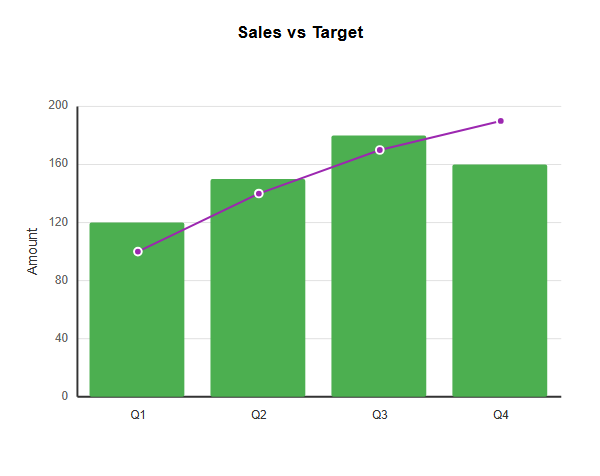

### MultipleBarSeries

**Input:**
```mermaid
xychart-beta
    title "Product Comparison"
    x-axis [2020, 2021, 2022, 2023]
    y-axis "Units" 0 --> 500
    bar [100, 150, 200, 250]
    bar [80, 120, 180, 220]
```

**Output:**

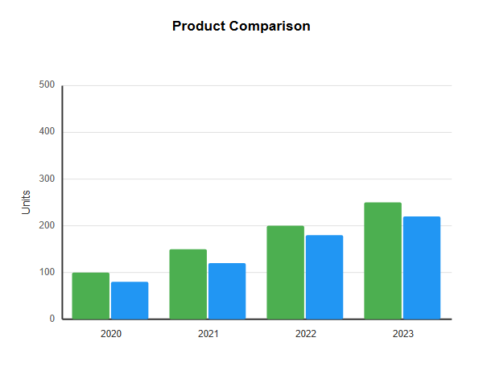

### WithoutTitle

**Input:**
```mermaid
xychart-beta
    x-axis [A, B, C, D]
    bar [10, 20, 30, 40]
```

**Output:**

### QuotedCategories

**Input:**
```mermaid
xychart-beta
    title "Regional Sales"
    x-axis ["North America", "Europe", "Asia Pacific"]
    y-axis "Revenue (M$)" 0 --> 100
    bar [85, 72, 90]
```

**Output:**

### Complex

**Input:**
```mermaid
xychart-beta
    title "Annual Data"
    x-axis [Jan, Feb, Mar, Apr, May, Jun, Jul, Aug, Sep, Oct, Nov, Dec]
    y-axis "Value" 0 --> 100
    bar [45, 52, 61, 58, 72, 85, 91, 88, 76, 65, 55, 48]
    line [40, 48, 58, 55, 70, 82, 88, 85, 73, 62, 52, 45]
```

**Output:**

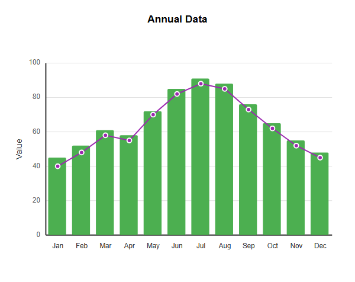

