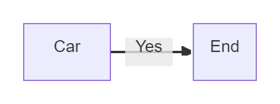
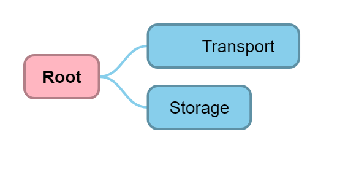
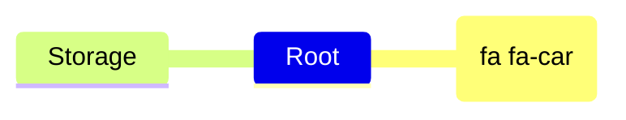

# AllowHtmlElements

## Flowchart

**Input:**
```
flowchart LR
    A[fa:fa-car Car] -->|Yes| B[End]
```
**Rendered by Naiad:**

<p align="center">
  
</p>

**Rendered by Mermaid:**


[Open in Mermaid Live](https://mermaid.live/edit#base64:eyJjb2RlIjoiZmxvd2NoYXJ0IExSXG4gICAgQVtmYTpmYS1jYXIgQ2FyXSAtLVx1MDAzRXxZZXN8IEJbRW5kXSIsIm1lcm1haWQiOnsidGhlbWUiOiJkZWZhdWx0In19)

## Mindmap

**Input:**
```
mindmap
  Root
    Transport ::icon(fa fa-car)
    Storage
```
**Rendered by Naiad:**

<p align="center">
  
</p>

**Rendered by Mermaid:**


[Open in Mermaid Live](https://mermaid.live/edit#base64:eyJjb2RlIjoibWluZG1hcFxuICBSb290XG4gICAgVHJhbnNwb3J0IDo6aWNvbihmYSBmYS1jYXIpXG4gICAgU3RvcmFnZSIsIm1lcm1haWQiOnsidGhlbWUiOiJkZWZhdWx0In19)

