# Flowchart

## Simple

**Input:**
```
flowchart LR
    A[Start] --> B[Process] --> C[End]
```
**Rendered by Naiad:**

<p align="center">
  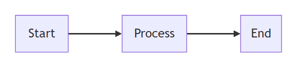
</p>

**Rendered by Mermaid:**
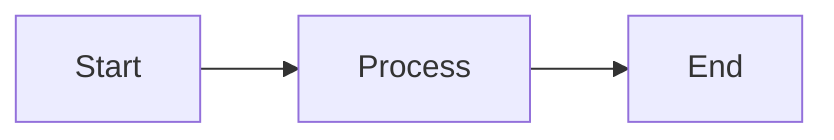

[Open in Mermaid Live](https://mermaid.live/edit#base64:eyJjb2RlIjoiZmxvd2NoYXJ0IExSXG4gICAgQVtTdGFydF0gLS1cdTAwM0UgQltQcm9jZXNzXSAtLVx1MDAzRSBDW0VuZF0iLCJtZXJtYWlkIjp7InRoZW1lIjoiZGVmYXVsdCJ9fQ==)

## Complex

**Input:**
```
flowchart TD
    A[Christmas] -->|Get money| B(Go shopping)
    B --> C{Let me think}
    C -->|One| D[Laptop]
    C -->|Two| E[iPhone]
    C -->|Three| F[fa:fa-car Car]
```
**Rendered by Naiad:**

<p align="center">
  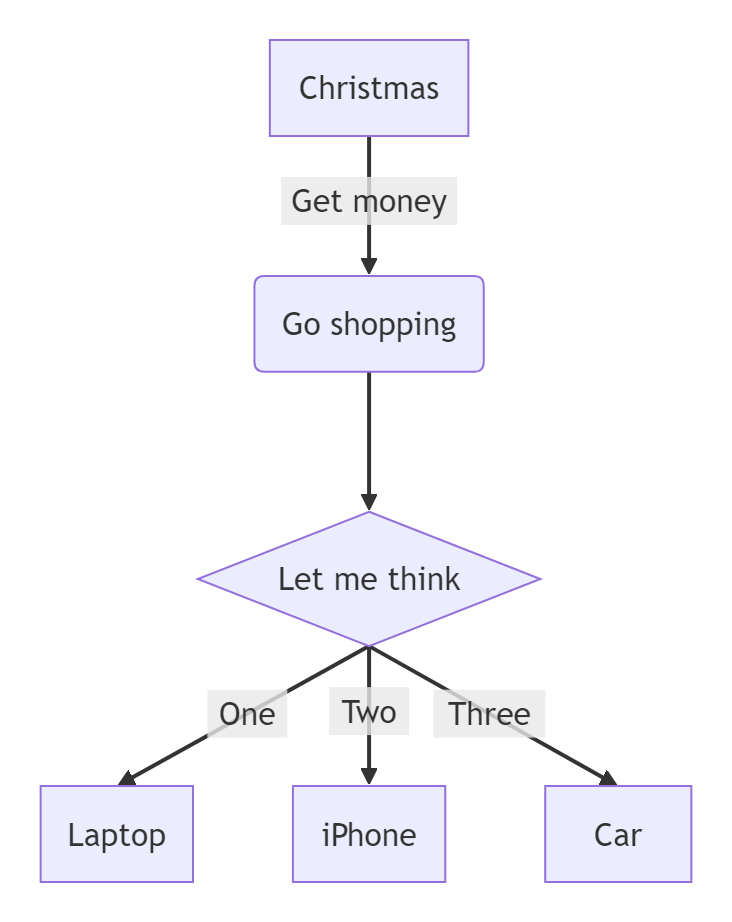
</p>

**Rendered by Mermaid:**
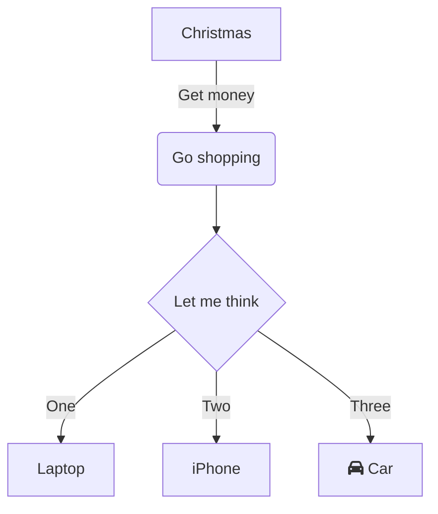

[Open in Mermaid Live](https://mermaid.live/edit#base64:eyJjb2RlIjoiZmxvd2NoYXJ0IFREXG4gICAgQVtDaHJpc3RtYXNdIC0tXHUwMDNFfEdldCBtb25leXwgQihHbyBzaG9wcGluZylcbiAgICBCIC0tXHUwMDNFIEN7TGV0IG1lIHRoaW5rfVxuICAgIEMgLS1cdTAwM0V8T25lfCBEW0xhcHRvcF1cbiAgICBDIC0tXHUwMDNFfFR3b3wgRVtpUGhvbmVdXG4gICAgQyAtLVx1MDAzRXxUaHJlZXwgRltmYTpmYS1jYXIgQ2FyXSIsIm1lcm1haWQiOnsidGhlbWUiOiJkZWZhdWx0In19)

## IconPackIcon

**Input:**
```
flowchart LR
    A[sample:box Storage] --> B[sample:ring Cache]
```
**Rendered by Naiad:**

<p align="center">
  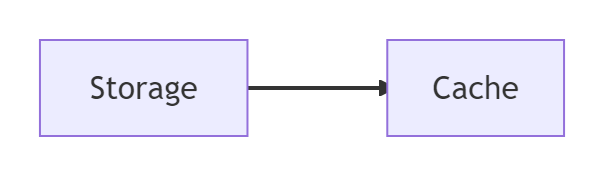
</p>

**Rendered by Mermaid:**
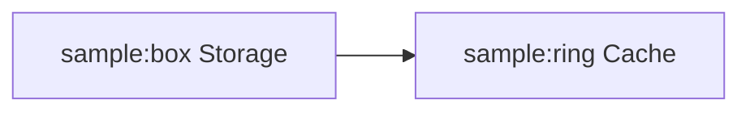

[Open in Mermaid Live](https://mermaid.live/edit#base64:eyJjb2RlIjoiZmxvd2NoYXJ0IExSXG4gICAgQVtzYW1wbGU6Ym94IFN0b3JhZ2VdIC0tXHUwMDNFIEJbc2FtcGxlOnJpbmcgQ2FjaGVdIiwibWVybWFpZCI6eyJ0aGVtZSI6ImRlZmF1bHQifX0=)

## Shapes

**Input:**
```
flowchart TD
    A[Rectangle]
    B(Rounded)
    C{Diamond}
    D((Circle))
```
**Rendered by Naiad:**

<p align="center">
  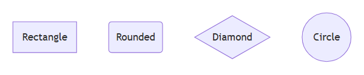
</p>

**Rendered by Mermaid:**
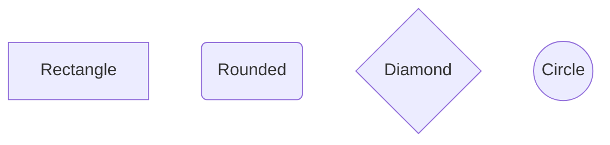

[Open in Mermaid Live](https://mermaid.live/edit#base64:eyJjb2RlIjoiZmxvd2NoYXJ0IFREXG4gICAgQVtSZWN0YW5nbGVdXG4gICAgQihSb3VuZGVkKVxuICAgIEN7RGlhbW9uZH1cbiAgICBEKChDaXJjbGUpKSIsIm1lcm1haWQiOnsidGhlbWUiOiJkZWZhdWx0In19)

## EdgeLabels

**Input:**
```
flowchart LR
    A --> |Yes| B
    A --> |No| C
```
**Rendered by Naiad:**

<p align="center">
  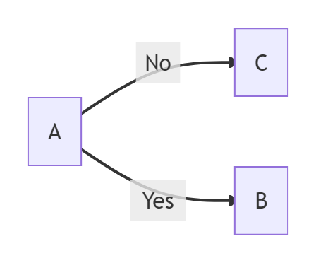
</p>

**Rendered by Mermaid:**
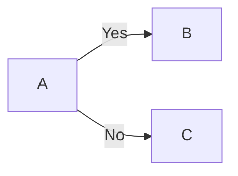

[Open in Mermaid Live](https://mermaid.live/edit#base64:eyJjb2RlIjoiZmxvd2NoYXJ0IExSXG4gICAgQSAtLVx1MDAzRSB8WWVzfCBCXG4gICAgQSAtLVx1MDAzRSB8Tm98IEMiLCJtZXJtYWlkIjp7InRoZW1lIjoiZGVmYXVsdCJ9fQ==)

## GraphKeyword

**Input:**
```
graph TD
    A --> B --> C
```
**Rendered by Naiad:**

<p align="center">
  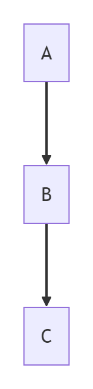
</p>

**Rendered by Mermaid:**
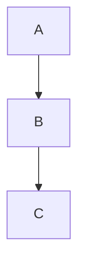

[Open in Mermaid Live](https://mermaid.live/edit#base64:eyJjb2RlIjoiZ3JhcGggVERcbiAgICBBIC0tXHUwMDNFIEIgLS1cdTAwM0UgQyIsIm1lcm1haWQiOnsidGhlbWUiOiJkZWZhdWx0In19)

## Subgraphs

**Input:**
```
flowchart TB
    Start[Start] --> A

    subgraph frontend [Frontend]
        A[Web UI] --> B[Mobile UI]
    end

    subgraph backend [Backend]
        C[API] --> D[(Database)]
    end

    A --> C
    B --> C
```
**Rendered by Naiad:**

<p align="center">
  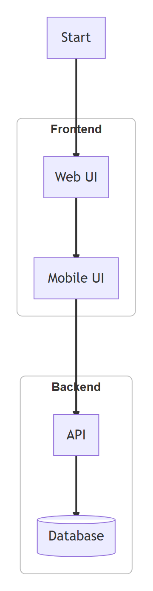
</p>

**Rendered by Mermaid:**
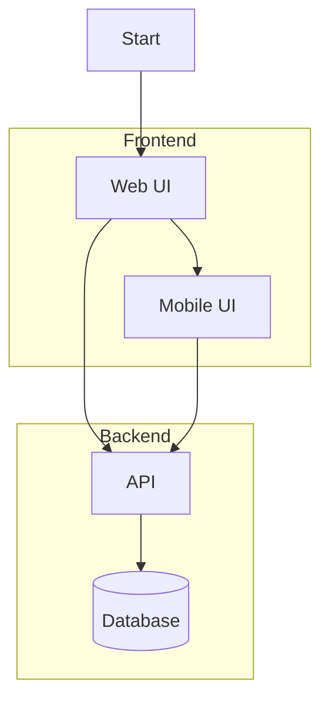

[Open in Mermaid Live](https://mermaid.live/edit#base64:eyJjb2RlIjoiZmxvd2NoYXJ0IFRCXG4gICAgU3RhcnRbU3RhcnRdIC0tXHUwMDNFIEFcblxuICAgIHN1YmdyYXBoIGZyb250ZW5kIFtGcm9udGVuZF1cbiAgICAgICAgQVtXZWIgVUldIC0tXHUwMDNFIEJbTW9iaWxlIFVJXVxuICAgIGVuZFxuXG4gICAgc3ViZ3JhcGggYmFja2VuZCBbQmFja2VuZF1cbiAgICAgICAgQ1tBUEldIC0tXHUwMDNFIERbKERhdGFiYXNlKV1cbiAgICBlbmRcblxuICAgIEEgLS1cdTAwM0UgQ1xuICAgIEIgLS1cdTAwM0UgQyIsIm1lcm1haWQiOnsidGhlbWUiOiJkZWZhdWx0In19)

## NestedSubgraphs

**Input:**
```
flowchart TB
    User[User] --> A

    subgraph system [Banking System]
        subgraph api [API Application]
            A[Controller] --> B[Service]
        end
        B --> C[(Database)]
    end
```
**Rendered by Naiad:**

<p align="center">
  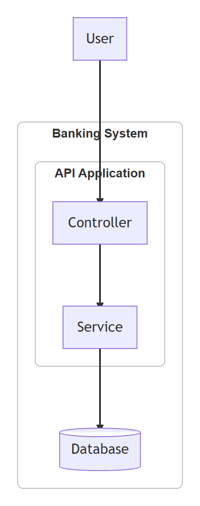
</p>

**Rendered by Mermaid:**
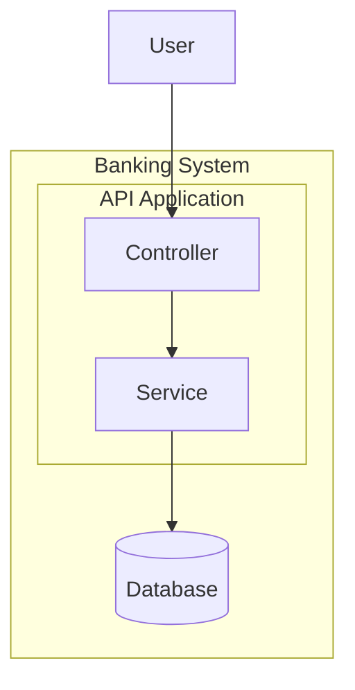

[Open in Mermaid Live](https://mermaid.live/edit#base64:eyJjb2RlIjoiZmxvd2NoYXJ0IFRCXG4gICAgVXNlcltVc2VyXSAtLVx1MDAzRSBBXG5cbiAgICBzdWJncmFwaCBzeXN0ZW0gW0JhbmtpbmcgU3lzdGVtXVxuICAgICAgICBzdWJncmFwaCBhcGkgW0FQSSBBcHBsaWNhdGlvbl1cbiAgICAgICAgICAgIEFbQ29udHJvbGxlcl0gLS1cdTAwM0UgQltTZXJ2aWNlXVxuICAgICAgICBlbmRcbiAgICAgICAgQiAtLVx1MDAzRSBDWyhEYXRhYmFzZSldXG4gICAgZW5kIiwibWVybWFpZCI6eyJ0aGVtZSI6ImRlZmF1bHQifX0=)

