# Flowchart

## Simple

**Input:**
```
flowchart LR
    A[Start] --> B[Process] --> C[End]
```
**Rendered by Naiad:**

<p align="center">
  
</p>

**Rendered by Mermaid:**
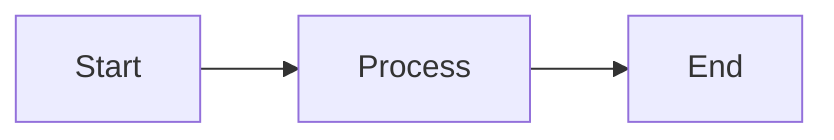

[Open in Mermaid Live](https://mermaid.live/edit#base64:eyJjb2RlIjoiZmxvd2NoYXJ0IExSXG4gICAgQVtTdGFydF0gLS1cdTAwM0UgQltQcm9jZXNzXSAtLVx1MDAzRSBDW0VuZF0iLCJtZXJtYWlkIjp7InRoZW1lIjoiZGVmYXVsdCJ9fQ==)

## Complex

**Input:**
```
flowchart TD
    A[Christmas] -->|Get money| B(Go shopping)
    B --> C{Let me think}
    C -->|One| D[Laptop]
    C -->|Two| E[iPhone]
    C -->|Three| F[fa:fa-car Car]
```
**Rendered by Naiad:**

<p align="center">
  
</p>

**Rendered by Mermaid:**
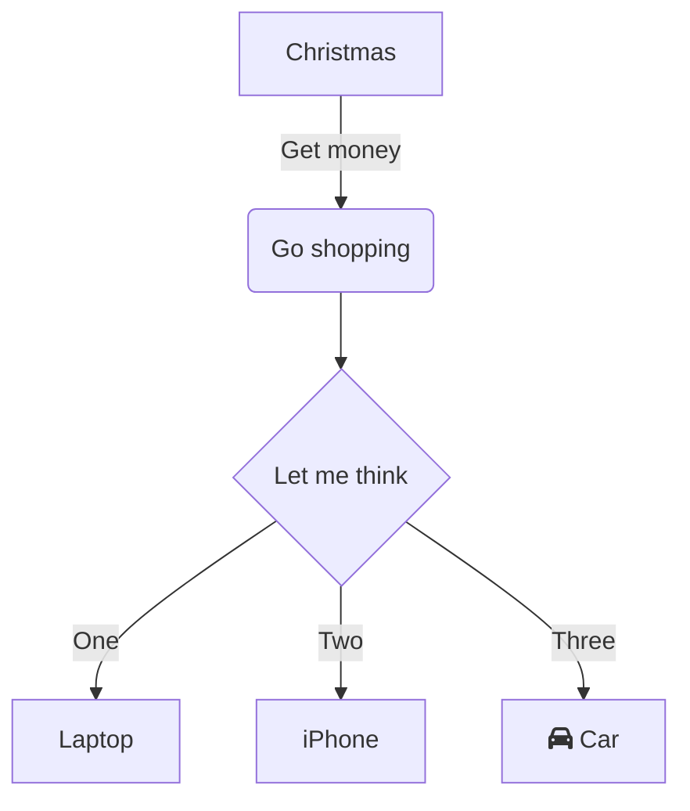

[Open in Mermaid Live](https://mermaid.live/edit#base64:eyJjb2RlIjoiZmxvd2NoYXJ0IFREXG4gICAgQVtDaHJpc3RtYXNdIC0tXHUwMDNFfEdldCBtb25leXwgQihHbyBzaG9wcGluZylcbiAgICBCIC0tXHUwMDNFIEN7TGV0IG1lIHRoaW5rfVxuICAgIEMgLS1cdTAwM0V8T25lfCBEW0xhcHRvcF1cbiAgICBDIC0tXHUwMDNFfFR3b3wgRVtpUGhvbmVdXG4gICAgQyAtLVx1MDAzRXxUaHJlZXwgRltmYTpmYS1jYXIgQ2FyXSIsIm1lcm1haWQiOnsidGhlbWUiOiJkZWZhdWx0In19)

## ComplexPipeline

**Input:**
```
flowchart TD
    U([Client application]) --> REQ>HTTP request]
    REQ --> CDN{{Edge / CDN}}
    CDN -->|hit| CRES([Cached edge response])
    CDN -->|miss| GW{{API Gateway}}

    subgraph gateway [Gateway and Security]
        GW --> RL{Rate limit OK?}
        RL -->|no| E429[[429 Too Many Requests]]
        RL -->|yes| AUTH{Token valid?}
        AUTH -->|expired| REF(Refresh token)
        REF --> AUTH
        AUTH -->|no| E401[[401 Unauthorized]]
        AUTH -->|yes| RBAC{Scope allowed?}
        RBAC -->|no| E403[[403 Forbidden]]
        RBAC -->|yes| ROUTE[Route to service]
    end

    subgraph app [Application Services]
        ROUTE --> VAL{Payload valid?}
        VAL -->|no| E422[[422 Unprocessable]]
        VAL -->|yes| CHK{Cache hit?}
        CHK -->|yes| SHAPE(Shape response)
        CHK -->|no| ORCH[[Request orchestrator]]

        subgraph resil [Resilience layer]
            ORCH --> SVCA(Catalog)
            ORCH --> SVCB(Pricing)
            ORCH --> SVCC(Inventory)
            SVCA --> CB{Circuit closed?}
            SVCB --> CB
            SVCC --> CB
            CB -->|open| FALL(Stale or fallback)
            CB -->|closed| AGG[Aggregate]
            FALL --> AGG
        end

        AGG --> SHAPE
    end

    subgraph data [Data and Cache]
        SVCA <--> PG[(Postgres)]
        SVCC <--> PG
        SVCB <--> RD[(Redis)]
        CHK -.->|lookup| RD
        SHAPE -.->|write-through| RD
        ORCH --> WQ{Mutation?}
        WQ -->|yes| TX[Begin transaction]
        TX --> PG
        TX --> OBX[(Transactional outbox)]
        WQ -->|no| AGG
    end

    subgraph bg [Background Processing]
        OBX -.-> MB{{Message broker}}
        MB --> WK[[Worker pool]]
        WK --> JOB{Job result?}
        JOB -->|retryable| RT{Under retry limit?}
        RT -->|yes| BO(Exponential backoff)
        BO --> WK
        RT -->|no| DLQ[(Dead-letter queue)]
        JOB -->|fatal| DLQ
        JOB -->|success| NOTE(Dispatch notifications)
    end

    SHAPE --> R200([200 OK])
    R200 --> END(((Request complete)))
    CRES --> END
    NOTE --> END

    subgraph obs [Observability]
        LOG[(Logs)]
        MET[(Metrics)]
        TRC[(Traces)]
    end

    GW -.->|span| TRC
    ORCH -.->|timing| MET
    WK -.->|structured| LOG
    E401 -.->|audit| LOG
    E429 -.->|audit| LOG
    DLQ -.->|alert| MET

    classDef error fill:#fee2e2,stroke:#dc2626,color:#991b1b;
    classDef service fill:#dcfce7,stroke:#16a34a,color:#14532d;
    classDef store fill:#dbeafe,stroke:#2563eb,color:#1e3a8a;
    classDef terminal fill:#ede9fe,stroke:#7c3aed,color:#4c1d95;
    class E429,E401,E403,E422,DLQ error;
    class SVCA,SVCB,SVCC,FALL service;
    class PG,RD,OBX,LOG,MET,TRC store;
    class CRES,R200,END terminal;
```
**Rendered by Naiad:**

<p align="center">
  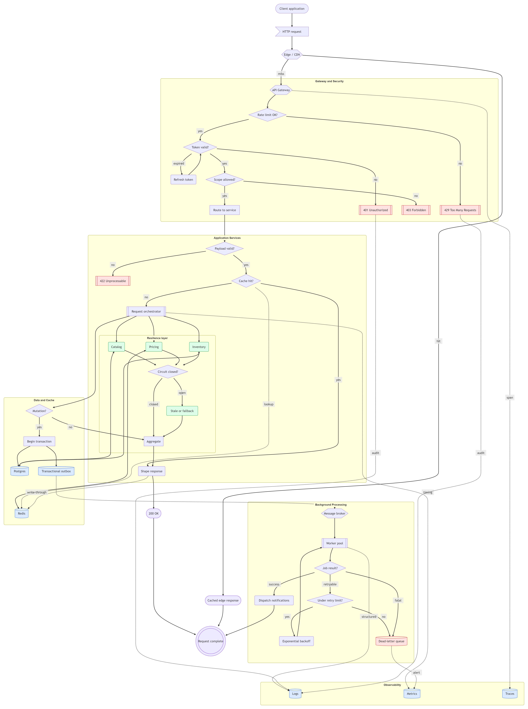
</p>

**Rendered by Mermaid:**
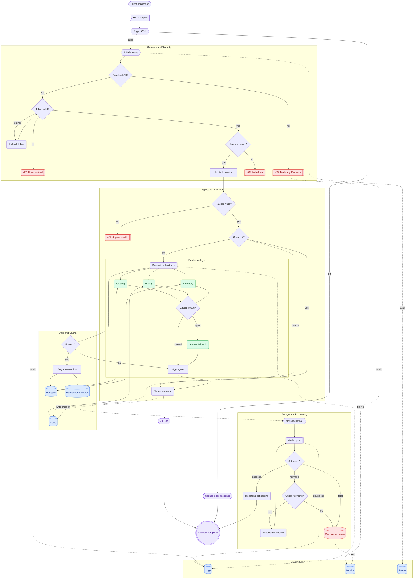

[Open in Mermaid Live](https://mermaid.live/edit#base64:eyJjb2RlIjoiZmxvd2NoYXJ0IFREXG4gICAgVShbQ2xpZW50IGFwcGxpY2F0aW9uXSkgLS1cdTAwM0UgUkVRXHUwMDNFSFRUUCByZXF1ZXN0XVxuICAgIFJFUSAtLVx1MDAzRSBDRE57e0VkZ2UgLyBDRE59fVxuICAgIENETiAtLVx1MDAzRXxoaXR8IENSRVMoW0NhY2hlZCBlZGdlIHJlc3BvbnNlXSlcbiAgICBDRE4gLS1cdTAwM0V8bWlzc3wgR1d7e0FQSSBHYXRld2F5fX1cblxuICAgIHN1YmdyYXBoIGdhdGV3YXkgW0dhdGV3YXkgYW5kIFNlY3VyaXR5XVxuICAgICAgICBHVyAtLVx1MDAzRSBSTHtSYXRlIGxpbWl0IE9LP31cbiAgICAgICAgUkwgLS1cdTAwM0V8bm98IEU0MjlbWzQyOSBUb28gTWFueSBSZXF1ZXN0c11dXG4gICAgICAgIFJMIC0tXHUwMDNFfHllc3wgQVVUSHtUb2tlbiB2YWxpZD99XG4gICAgICAgIEFVVEggLS1cdTAwM0V8ZXhwaXJlZHwgUkVGKFJlZnJlc2ggdG9rZW4pXG4gICAgICAgIFJFRiAtLVx1MDAzRSBBVVRIXG4gICAgICAgIEFVVEggLS1cdTAwM0V8bm98IEU0MDFbWzQwMSBVbmF1dGhvcml6ZWRdXVxuICAgICAgICBBVVRIIC0tXHUwMDNFfHllc3wgUkJBQ3tTY29wZSBhbGxvd2VkP31cbiAgICAgICAgUkJBQyAtLVx1MDAzRXxub3wgRTQwM1tbNDAzIEZvcmJpZGRlbl1dXG4gICAgICAgIFJCQUMgLS1cdTAwM0V8eWVzfCBST1VURVtSb3V0ZSB0byBzZXJ2aWNlXVxuICAgIGVuZFxuXG4gICAgc3ViZ3JhcGggYXBwIFtBcHBsaWNhdGlvbiBTZXJ2aWNlc11cbiAgICAgICAgUk9VVEUgLS1cdTAwM0UgVkFMe1BheWxvYWQgdmFsaWQ/fVxuICAgICAgICBWQUwgLS1cdTAwM0V8bm98IEU0MjJbWzQyMiBVbnByb2Nlc3NhYmxlXV1cbiAgICAgICAgVkFMIC0tXHUwMDNFfHllc3wgQ0hLe0NhY2hlIGhpdD99XG4gICAgICAgIENISyAtLVx1MDAzRXx5ZXN8IFNIQVBFKFNoYXBlIHJlc3BvbnNlKVxuICAgICAgICBDSEsgLS1cdTAwM0V8bm98IE9SQ0hbW1JlcXVlc3Qgb3JjaGVzdHJhdG9yXV1cblxuICAgICAgICBzdWJncmFwaCByZXNpbCBbUmVzaWxpZW5jZSBsYXllcl1cbiAgICAgICAgICAgIE9SQ0ggLS1cdTAwM0UgU1ZDQShDYXRhbG9nKVxuICAgICAgICAgICAgT1JDSCAtLVx1MDAzRSBTVkNCKFByaWNpbmcpXG4gICAgICAgICAgICBPUkNIIC0tXHUwMDNFIFNWQ0MoSW52ZW50b3J5KVxuICAgICAgICAgICAgU1ZDQSAtLVx1MDAzRSBDQntDaXJjdWl0IGNsb3NlZD99XG4gICAgICAgICAgICBTVkNCIC0tXHUwMDNFIENCXG4gICAgICAgICAgICBTVkNDIC0tXHUwMDNFIENCXG4gICAgICAgICAgICBDQiAtLVx1MDAzRXxvcGVufCBGQUxMKFN0YWxlIG9yIGZhbGxiYWNrKVxuICAgICAgICAgICAgQ0IgLS1cdTAwM0V8Y2xvc2VkfCBBR0dbQWdncmVnYXRlXVxuICAgICAgICAgICAgRkFMTCAtLVx1MDAzRSBBR0dcbiAgICAgICAgZW5kXG5cbiAgICAgICAgQUdHIC0tXHUwMDNFIFNIQVBFXG4gICAgZW5kXG5cbiAgICBzdWJncmFwaCBkYXRhIFtEYXRhIGFuZCBDYWNoZV1cbiAgICAgICAgU1ZDQSBcdTAwM0MtLVx1MDAzRSBQR1soUG9zdGdyZXMpXVxuICAgICAgICBTVkNDIFx1MDAzQy0tXHUwMDNFIFBHXG4gICAgICAgIFNWQ0IgXHUwMDNDLS1cdTAwM0UgUkRbKFJlZGlzKV1cbiAgICAgICAgQ0hLIC0uLVx1MDAzRXxsb29rdXB8IFJEXG4gICAgICAgIFNIQVBFIC0uLVx1MDAzRXx3cml0ZS10aHJvdWdofCBSRFxuICAgICAgICBPUkNIIC0tXHUwMDNFIFdRe011dGF0aW9uP31cbiAgICAgICAgV1EgLS1cdTAwM0V8eWVzfCBUWFtCZWdpbiB0cmFuc2FjdGlvbl1cbiAgICAgICAgVFggLS1cdTAwM0UgUEdcbiAgICAgICAgVFggLS1cdTAwM0UgT0JYWyhUcmFuc2FjdGlvbmFsIG91dGJveCldXG4gICAgICAgIFdRIC0tXHUwMDNFfG5vfCBBR0dcbiAgICBlbmRcblxuICAgIHN1YmdyYXBoIGJnIFtCYWNrZ3JvdW5kIFByb2Nlc3NpbmddXG4gICAgICAgIE9CWCAtLi1cdTAwM0UgTUJ7e01lc3NhZ2UgYnJva2VyfX1cbiAgICAgICAgTUIgLS1cdTAwM0UgV0tbW1dvcmtlciBwb29sXV1cbiAgICAgICAgV0sgLS1cdTAwM0UgSk9Ce0pvYiByZXN1bHQ/fVxuICAgICAgICBKT0IgLS1cdTAwM0V8cmV0cnlhYmxlfCBSVHtVbmRlciByZXRyeSBsaW1pdD99XG4gICAgICAgIFJUIC0tXHUwMDNFfHllc3wgQk8oRXhwb25lbnRpYWwgYmFja29mZilcbiAgICAgICAgQk8gLS1cdTAwM0UgV0tcbiAgICAgICAgUlQgLS1cdTAwM0V8bm98IERMUVsoRGVhZC1sZXR0ZXIgcXVldWUpXVxuICAgICAgICBKT0IgLS1cdTAwM0V8ZmF0YWx8IERMUVxuICAgICAgICBKT0IgLS1cdTAwM0V8c3VjY2Vzc3wgTk9URShEaXNwYXRjaCBub3RpZmljYXRpb25zKVxuICAgIGVuZFxuXG4gICAgU0hBUEUgLS1cdTAwM0UgUjIwMChbMjAwIE9LXSlcbiAgICBSMjAwIC0tXHUwMDNFIEVORCgoKFJlcXVlc3QgY29tcGxldGUpKSlcbiAgICBDUkVTIC0tXHUwMDNFIEVORFxuICAgIE5PVEUgLS1cdTAwM0UgRU5EXG5cbiAgICBzdWJncmFwaCBvYnMgW09ic2VydmFiaWxpdHldXG4gICAgICAgIExPR1soTG9ncyldXG4gICAgICAgIE1FVFsoTWV0cmljcyldXG4gICAgICAgIFRSQ1soVHJhY2VzKV1cbiAgICBlbmRcblxuICAgIEdXIC0uLVx1MDAzRXxzcGFufCBUUkNcbiAgICBPUkNIIC0uLVx1MDAzRXx0aW1pbmd8IE1FVFxuICAgIFdLIC0uLVx1MDAzRXxzdHJ1Y3R1cmVkfCBMT0dcbiAgICBFNDAxIC0uLVx1MDAzRXxhdWRpdHwgTE9HXG4gICAgRTQyOSAtLi1cdTAwM0V8YXVkaXR8IExPR1xuICAgIERMUSAtLi1cdTAwM0V8YWxlcnR8IE1FVFxuXG4gICAgY2xhc3NEZWYgZXJyb3IgZmlsbDojZmVlMmUyLHN0cm9rZTojZGMyNjI2LGNvbG9yOiM5OTFiMWI7XG4gICAgY2xhc3NEZWYgc2VydmljZSBmaWxsOiNkY2ZjZTcsc3Ryb2tlOiMxNmEzNGEsY29sb3I6IzE0NTMyZDtcbiAgICBjbGFzc0RlZiBzdG9yZSBmaWxsOiNkYmVhZmUsc3Ryb2tlOiMyNTYzZWIsY29sb3I6IzFlM2E4YTtcbiAgICBjbGFzc0RlZiB0ZXJtaW5hbCBmaWxsOiNlZGU5ZmUsc3Ryb2tlOiM3YzNhZWQsY29sb3I6IzRjMWQ5NTtcbiAgICBjbGFzcyBFNDI5LEU0MDEsRTQwMyxFNDIyLERMUSBlcnJvcjtcbiAgICBjbGFzcyBTVkNBLFNWQ0IsU1ZDQyxGQUxMIHNlcnZpY2U7XG4gICAgY2xhc3MgUEcsUkQsT0JYLExPRyxNRVQsVFJDIHN0b3JlO1xuICAgIGNsYXNzIENSRVMsUjIwMCxFTkQgdGVybWluYWw7IiwibWVybWFpZCI6eyJ0aGVtZSI6ImRlZmF1bHQifX0=)

## FullFeaturedSyntax

**Input:**
```
flowchart TD
    A([Request]):::entry -- submit --> B{Authenticated?}
    B -- no --> C[[401 Unauthorized]]:::error
    B -- yes --> D[/Validate payload/]
    D == process ==> E(Handler)
    E -. lookup .-> F[(Cache)]

    subgraph worker [Async Worker]
        direction LR
        E --> G{Retry?}
        G -- yes --> E
        G -- no --> H(((Complete)))
    end

    classDef entry fill:#dbeafe,stroke:#2563eb,stroke-width:2px;
    classDef error fill:#fee2e2,stroke:#dc2626,stroke-width:2px;
    class B,G decision;
    linkStyle default stroke:#94a3b8,stroke-width:1.5px;
```
**Rendered by Naiad:**

<p align="center">
  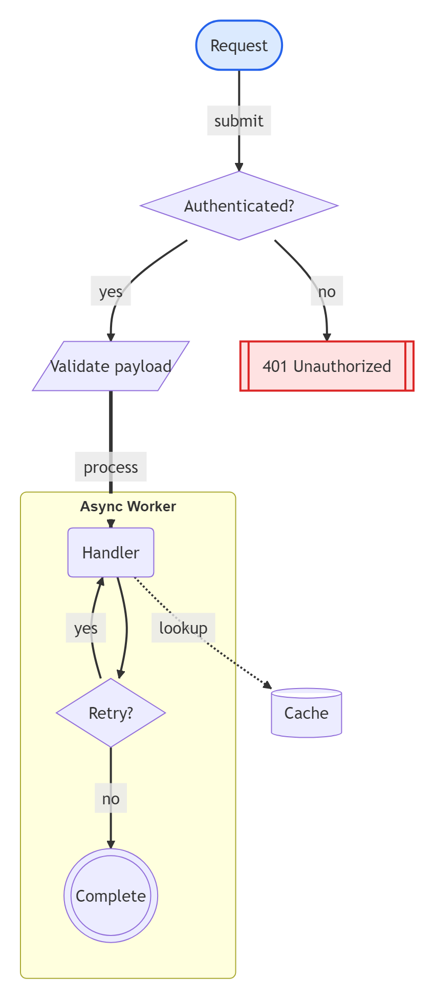
</p>

**Rendered by Mermaid:**
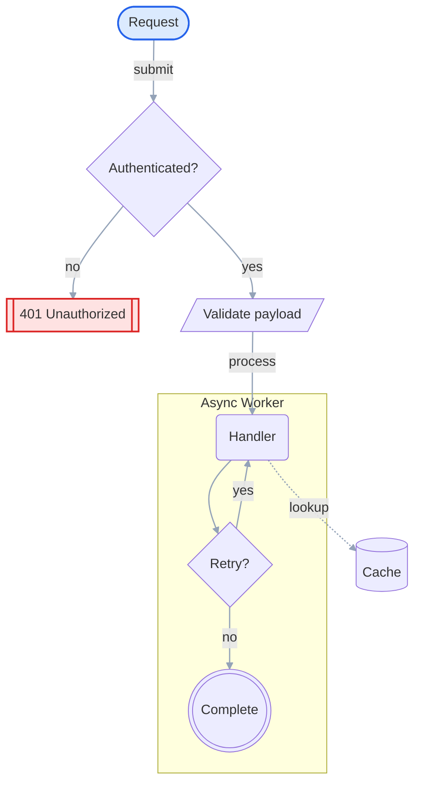

[Open in Mermaid Live](https://mermaid.live/edit#base64:eyJjb2RlIjoiZmxvd2NoYXJ0IFREXG4gICAgQShbUmVxdWVzdF0pOjo6ZW50cnkgLS0gc3VibWl0IC0tXHUwMDNFIEJ7QXV0aGVudGljYXRlZD99XG4gICAgQiAtLSBubyAtLVx1MDAzRSBDW1s0MDEgVW5hdXRob3JpemVkXV06OjplcnJvclxuICAgIEIgLS0geWVzIC0tXHUwMDNFIERbL1ZhbGlkYXRlIHBheWxvYWQvXVxuICAgIEQgPT0gcHJvY2VzcyA9PVx1MDAzRSBFKEhhbmRsZXIpXG4gICAgRSAtLiBsb29rdXAgLi1cdTAwM0UgRlsoQ2FjaGUpXVxuXG4gICAgc3ViZ3JhcGggd29ya2VyIFtBc3luYyBXb3JrZXJdXG4gICAgICAgIGRpcmVjdGlvbiBMUlxuICAgICAgICBFIC0tXHUwMDNFIEd7UmV0cnk/fVxuICAgICAgICBHIC0tIHllcyAtLVx1MDAzRSBFXG4gICAgICAgIEcgLS0gbm8gLS1cdTAwM0UgSCgoKENvbXBsZXRlKSkpXG4gICAgZW5kXG5cbiAgICBjbGFzc0RlZiBlbnRyeSBmaWxsOiNkYmVhZmUsc3Ryb2tlOiMyNTYzZWIsc3Ryb2tlLXdpZHRoOjJweDtcbiAgICBjbGFzc0RlZiBlcnJvciBmaWxsOiNmZWUyZTIsc3Ryb2tlOiNkYzI2MjYsc3Ryb2tlLXdpZHRoOjJweDtcbiAgICBjbGFzcyBCLEcgZGVjaXNpb247XG4gICAgbGlua1N0eWxlIGRlZmF1bHQgc3Ryb2tlOiM5NGEzYjgsc3Ryb2tlLXdpZHRoOjEuNXB4OyIsIm1lcm1haWQiOnsidGhlbWUiOiJkZWZhdWx0In19)

## IconPackIcon

**Input:**
```
flowchart LR
    A[sample:box Storage] --> B[sample:ring Cache]
```
**Rendered by Naiad:**

<p align="center">
  
</p>

**Rendered by Mermaid:**
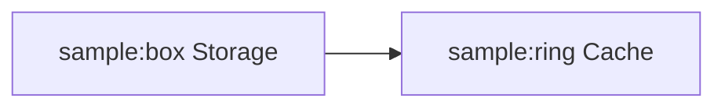

[Open in Mermaid Live](https://mermaid.live/edit#base64:eyJjb2RlIjoiZmxvd2NoYXJ0IExSXG4gICAgQVtzYW1wbGU6Ym94IFN0b3JhZ2VdIC0tXHUwMDNFIEJbc2FtcGxlOnJpbmcgQ2FjaGVdIiwibWVybWFpZCI6eyJ0aGVtZSI6ImRlZmF1bHQifX0=)

## Shapes

**Input:**
```
flowchart TD
    A[Rectangle]
    B(Rounded)
    C{Diamond}
    D((Circle))
```
**Rendered by Naiad:**

<p align="center">
  
</p>

**Rendered by Mermaid:**
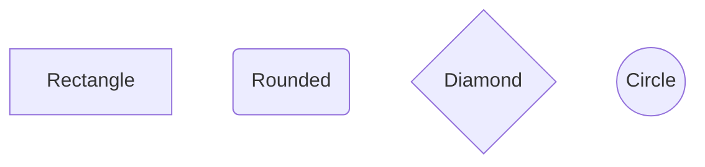

[Open in Mermaid Live](https://mermaid.live/edit#base64:eyJjb2RlIjoiZmxvd2NoYXJ0IFREXG4gICAgQVtSZWN0YW5nbGVdXG4gICAgQihSb3VuZGVkKVxuICAgIEN7RGlhbW9uZH1cbiAgICBEKChDaXJjbGUpKSIsIm1lcm1haWQiOnsidGhlbWUiOiJkZWZhdWx0In19)

## EdgeLabels

**Input:**
```
flowchart LR
    A --> |Yes| B
    A --> |No| C
```
**Rendered by Naiad:**

<p align="center">
  
</p>

**Rendered by Mermaid:**
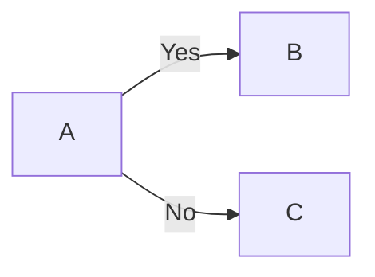

[Open in Mermaid Live](https://mermaid.live/edit#base64:eyJjb2RlIjoiZmxvd2NoYXJ0IExSXG4gICAgQSAtLVx1MDAzRSB8WWVzfCBCXG4gICAgQSAtLVx1MDAzRSB8Tm98IEMiLCJtZXJtYWlkIjp7InRoZW1lIjoiZGVmYXVsdCJ9fQ==)

## GraphKeyword

**Input:**
```
graph TD
    A --> B --> C
```
**Rendered by Naiad:**

<p align="center">
  
</p>

**Rendered by Mermaid:**
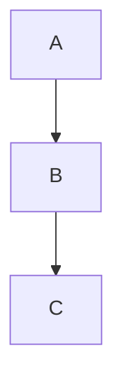

[Open in Mermaid Live](https://mermaid.live/edit#base64:eyJjb2RlIjoiZ3JhcGggVERcbiAgICBBIC0tXHUwMDNFIEIgLS1cdTAwM0UgQyIsIm1lcm1haWQiOnsidGhlbWUiOiJkZWZhdWx0In19)

## Subgraphs

**Input:**
```
flowchart TB
    Start[Start] --> A

    subgraph frontend [Frontend]
        A[Web UI] --> B[Mobile UI]
    end

    subgraph backend [Backend]
        C[API] --> D[(Database)]
    end

    A --> C
    B --> C
```
**Rendered by Naiad:**

<p align="center">
  
</p>

**Rendered by Mermaid:**
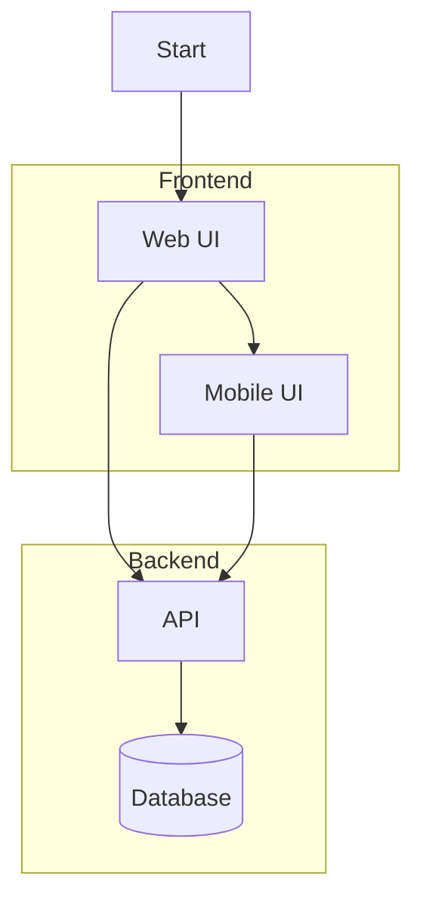

[Open in Mermaid Live](https://mermaid.live/edit#base64:eyJjb2RlIjoiZmxvd2NoYXJ0IFRCXG4gICAgU3RhcnRbU3RhcnRdIC0tXHUwMDNFIEFcblxuICAgIHN1YmdyYXBoIGZyb250ZW5kIFtGcm9udGVuZF1cbiAgICAgICAgQVtXZWIgVUldIC0tXHUwMDNFIEJbTW9iaWxlIFVJXVxuICAgIGVuZFxuXG4gICAgc3ViZ3JhcGggYmFja2VuZCBbQmFja2VuZF1cbiAgICAgICAgQ1tBUEldIC0tXHUwMDNFIERbKERhdGFiYXNlKV1cbiAgICBlbmRcblxuICAgIEEgLS1cdTAwM0UgQ1xuICAgIEIgLS1cdTAwM0UgQyIsIm1lcm1haWQiOnsidGhlbWUiOiJkZWZhdWx0In19)

## NestedSubgraphs

**Input:**
```
flowchart TB
    User[User] --> A

    subgraph system [Banking System]
        subgraph api [API Application]
            A[Controller] --> B[Service]
        end
        B --> C[(Database)]
    end
```
**Rendered by Naiad:**

<p align="center">
  
</p>

**Rendered by Mermaid:**
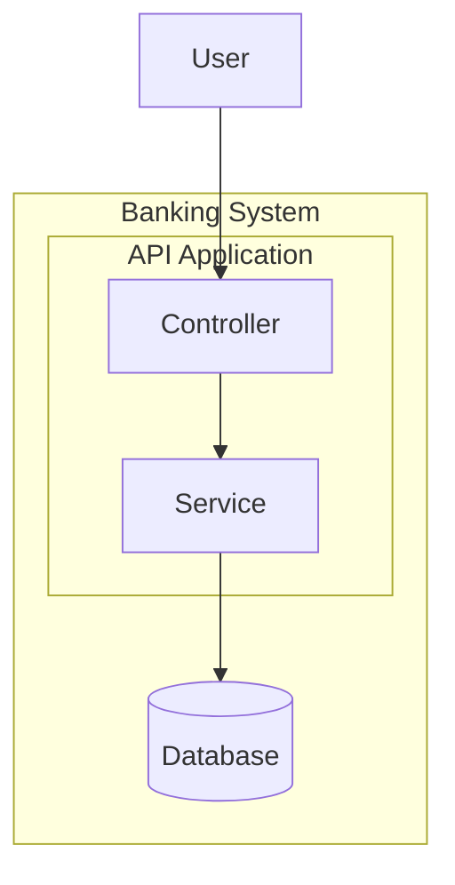

[Open in Mermaid Live](https://mermaid.live/edit#base64:eyJjb2RlIjoiZmxvd2NoYXJ0IFRCXG4gICAgVXNlcltVc2VyXSAtLVx1MDAzRSBBXG5cbiAgICBzdWJncmFwaCBzeXN0ZW0gW0JhbmtpbmcgU3lzdGVtXVxuICAgICAgICBzdWJncmFwaCBhcGkgW0FQSSBBcHBsaWNhdGlvbl1cbiAgICAgICAgICAgIEFbQ29udHJvbGxlcl0gLS1cdTAwM0UgQltTZXJ2aWNlXVxuICAgICAgICBlbmRcbiAgICAgICAgQiAtLVx1MDAzRSBDWyhEYXRhYmFzZSldXG4gICAgZW5kIiwibWVybWFpZCI6eyJ0aGVtZSI6ImRlZmF1bHQifX0=)

