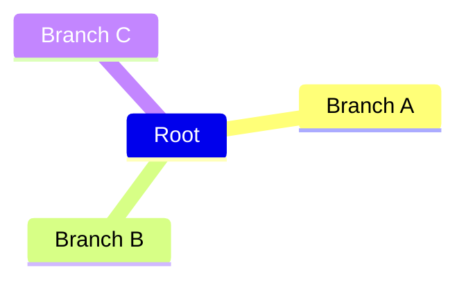
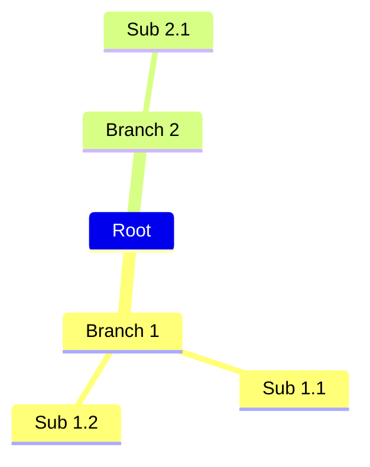
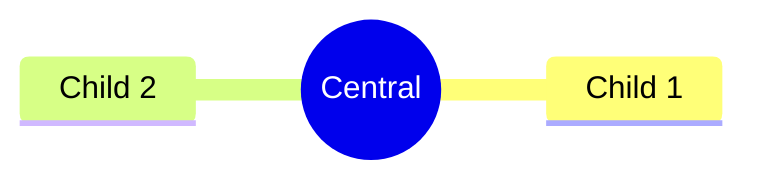
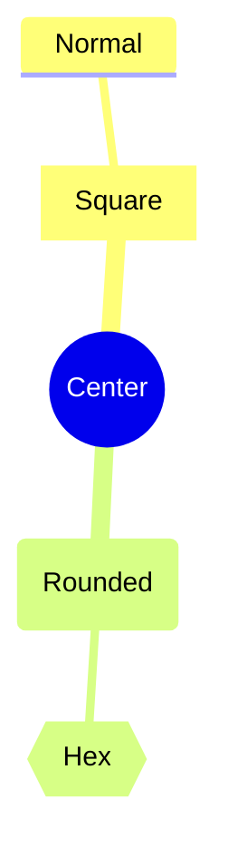
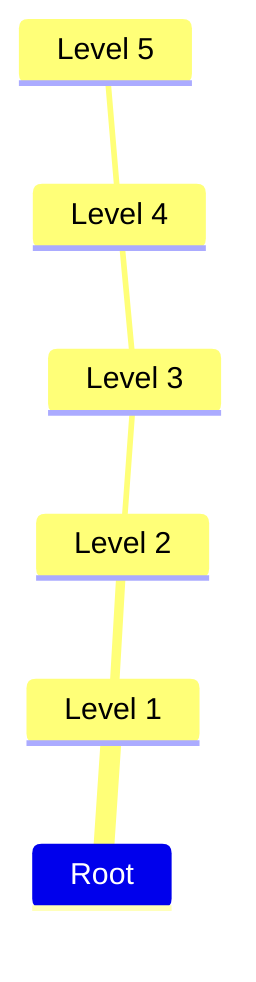
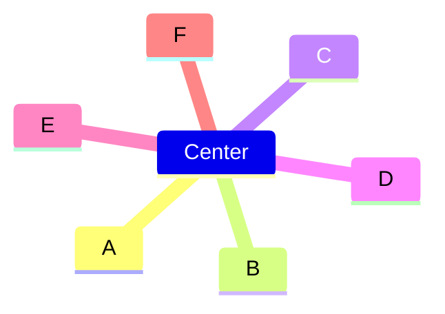
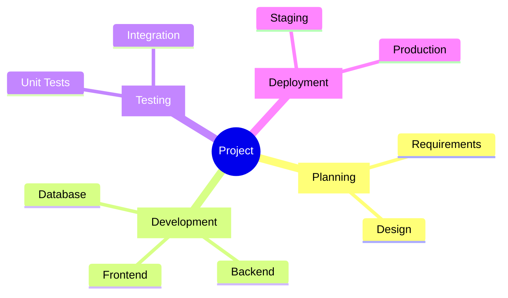

# Mindmap

## Simple

**Input:**
```
mindmap
  Root
    Branch A
    Branch B
    Branch C
```


[Open in Mermaid Live](https://mermaid.live/edit#base64:eyJjb2RlIjoibWluZG1hcFxuICBSb290XG4gICAgQnJhbmNoIEFcbiAgICBCcmFuY2ggQlxuICAgIEJyYW5jaCBDIiwibWVybWFpZCI6eyJ0aGVtZSI6ImRlZmF1bHQifX0=)

**Output:**


## Nested

**Input:**
```
mindmap
  Root
    Branch 1
      Sub 1.1
      Sub 1.2
    Branch 2
      Sub 2.1
```


[Open in Mermaid Live](https://mermaid.live/edit#base64:eyJjb2RlIjoibWluZG1hcFxuICBSb290XG4gICAgQnJhbmNoIDFcbiAgICAgIFN1YiAxLjFcbiAgICAgIFN1YiAxLjJcbiAgICBCcmFuY2ggMlxuICAgICAgU3ViIDIuMSIsIm1lcm1haWQiOnsidGhlbWUiOiJkZWZhdWx0In19)

**Output:**


## CircleShape

**Input:**
```
mindmap
  ((Central))
    Child 1
    Child 2
```


[Open in Mermaid Live](https://mermaid.live/edit#base64:eyJjb2RlIjoibWluZG1hcFxuICAoKENlbnRyYWwpKVxuICAgIENoaWxkIDFcbiAgICBDaGlsZCAyIiwibWVybWFpZCI6eyJ0aGVtZSI6ImRlZmF1bHQifX0=)

**Output:**


## SquareShape

**Input:**
```
mindmap
  [Square Root]
    [Square Child]
    Normal Child
```


[Open in Mermaid Live](https://mermaid.live/edit#base64:eyJjb2RlIjoibWluZG1hcFxuICBbU3F1YXJlIFJvb3RdXG4gICAgW1NxdWFyZSBDaGlsZF1cbiAgICBOb3JtYWwgQ2hpbGQiLCJtZXJtYWlkIjp7InRoZW1lIjoiZGVmYXVsdCJ9fQ==)

**Output:**


## RoundedShape

**Input:**
```
mindmap
  (Rounded Root)
    (Rounded Child)
    Normal Child
```


[Open in Mermaid Live](https://mermaid.live/edit#base64:eyJjb2RlIjoibWluZG1hcFxuICAoUm91bmRlZCBSb290KVxuICAgIChSb3VuZGVkIENoaWxkKVxuICAgIE5vcm1hbCBDaGlsZCIsIm1lcm1haWQiOnsidGhlbWUiOiJkZWZhdWx0In19)

**Output:**


## HexagonShape

**Input:**
```
mindmap
  {{Hexagon}}
    Child A
    Child B
```


[Open in Mermaid Live](https://mermaid.live/edit#base64:eyJjb2RlIjoibWluZG1hcFxuICB7e0hleGFnb259fVxuICAgIENoaWxkIEFcbiAgICBDaGlsZCBCIiwibWVybWFpZCI6eyJ0aGVtZSI6ImRlZmF1bHQifX0=)

**Output:**


## MixedShapes

**Input:**
```
mindmap
  ((Center))
    [Square]
      Normal
    (Rounded)
      {{Hex}}
```


[Open in Mermaid Live](https://mermaid.live/edit#base64:eyJjb2RlIjoibWluZG1hcFxuICAoKENlbnRlcikpXG4gICAgW1NxdWFyZV1cbiAgICAgIE5vcm1hbFxuICAgIChSb3VuZGVkKVxuICAgICAge3tIZXh9fSIsIm1lcm1haWQiOnsidGhlbWUiOiJkZWZhdWx0In19)

**Output:**


## DeepHierarchy

**Input:**
```
mindmap
  Root
    Level 1
      Level 2
        Level 3
          Level 4
            Level 5
```


[Open in Mermaid Live](https://mermaid.live/edit#base64:eyJjb2RlIjoibWluZG1hcFxuICBSb290XG4gICAgTGV2ZWwgMVxuICAgICAgTGV2ZWwgMlxuICAgICAgICBMZXZlbCAzXG4gICAgICAgICAgTGV2ZWwgNFxuICAgICAgICAgICAgTGV2ZWwgNSIsIm1lcm1haWQiOnsidGhlbWUiOiJkZWZhdWx0In19)

**Output:**


## WideTree

**Input:**
```
mindmap
  Center
    A
    B
    C
    D
    E
    F
```


[Open in Mermaid Live](https://mermaid.live/edit#base64:eyJjb2RlIjoibWluZG1hcFxuICBDZW50ZXJcbiAgICBBXG4gICAgQlxuICAgIENcbiAgICBEXG4gICAgRVxuICAgIEYiLCJtZXJtYWlkIjp7InRoZW1lIjoiZGVmYXVsdCJ9fQ==)

**Output:**


## Complex

**Input:**
```
mindmap
  ((Project))
    [Planning]
      Requirements
      Design
    [Development]
      Frontend
      Backend
      Database
    [Testing]
      Unit Tests
      Integration
    [Deployment]
      Staging
      Production
```


[Open in Mermaid Live](https://mermaid.live/edit#base64:eyJjb2RlIjoibWluZG1hcFxuICAoKFByb2plY3QpKVxuICAgIFtQbGFubmluZ11cbiAgICAgIFJlcXVpcmVtZW50c1xuICAgICAgRGVzaWduXG4gICAgW0RldmVsb3BtZW50XVxuICAgICAgRnJvbnRlbmRcbiAgICAgIEJhY2tlbmRcbiAgICAgIERhdGFiYXNlXG4gICAgW1Rlc3RpbmddXG4gICAgICBVbml0IFRlc3RzXG4gICAgICBJbnRlZ3JhdGlvblxuICAgIFtEZXBsb3ltZW50XVxuICAgICAgU3RhZ2luZ1xuICAgICAgUHJvZHVjdGlvbiIsIm1lcm1haWQiOnsidGhlbWUiOiJkZWZhdWx0In19)

**Output:**


