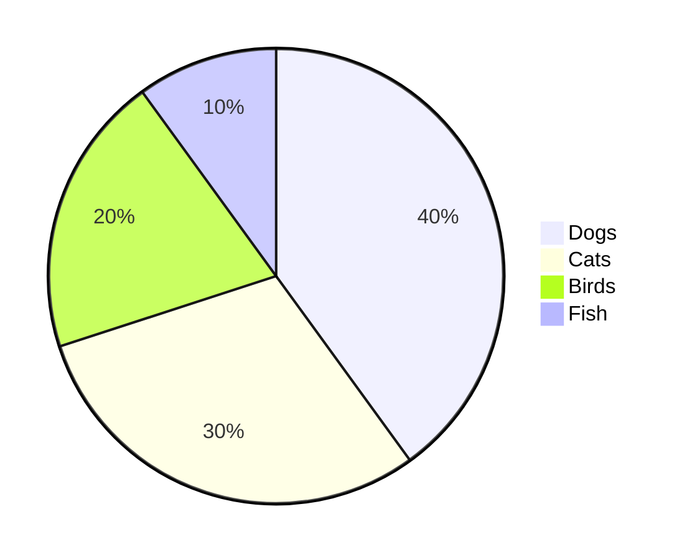
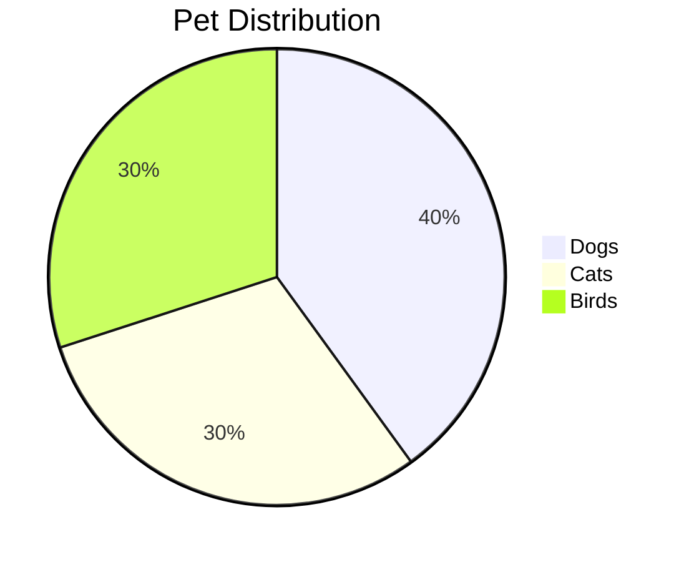
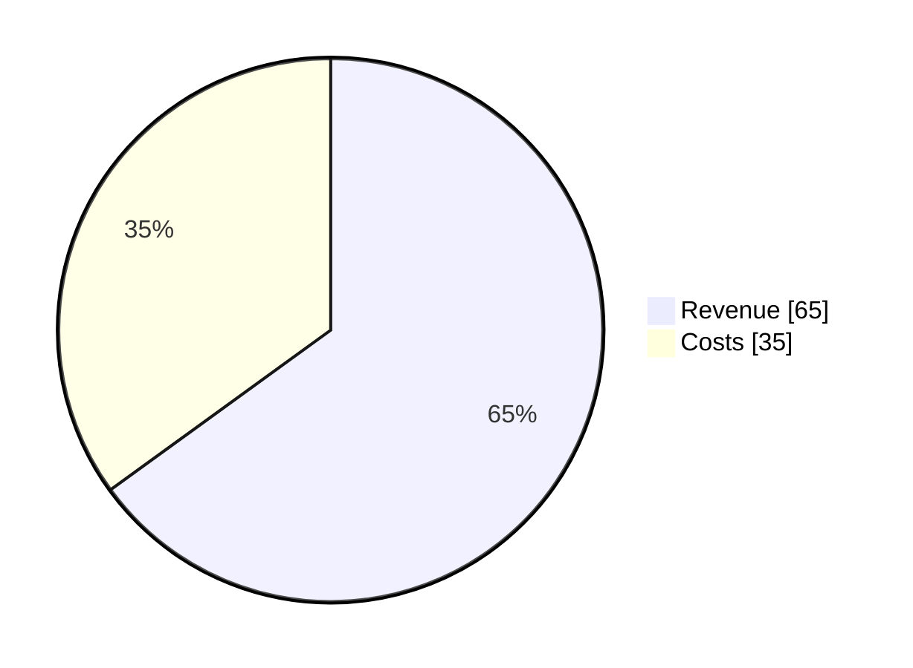

# Pie

## Simple

**Input:**
```
pie
    "Dogs" : 40
    "Cats" : 30
    "Birds" : 20
    "Fish" : 10
```


[Open in Mermaid Live](https://mermaid.live/edit#base64:eyJjb2RlIjoicGllXG4gICAgXHUwMDIyRG9nc1x1MDAyMiA6IDQwXG4gICAgXHUwMDIyQ2F0c1x1MDAyMiA6IDMwXG4gICAgXHUwMDIyQmlyZHNcdTAwMjIgOiAyMFxuICAgIFx1MDAyMkZpc2hcdTAwMjIgOiAxMCIsIm1lcm1haWQiOnsidGhlbWUiOiJkZWZhdWx0In19)

**Output:**


## Title

**Input:**
```
pie
    title Pet Distribution
    "Dogs" : 40
    "Cats" : 30
    "Birds" : 30
```


[Open in Mermaid Live](https://mermaid.live/edit#base64:eyJjb2RlIjoicGllXG4gICAgdGl0bGUgUGV0IERpc3RyaWJ1dGlvblxuICAgIFx1MDAyMkRvZ3NcdTAwMjIgOiA0MFxuICAgIFx1MDAyMkNhdHNcdTAwMjIgOiAzMFxuICAgIFx1MDAyMkJpcmRzXHUwMDIyIDogMzAiLCJtZXJtYWlkIjp7InRoZW1lIjoiZGVmYXVsdCJ9fQ==)

**Output:**


## ShowData

**Input:**
```
pie showData
    "Revenue" : 65
    "Costs" : 35
```


[Open in Mermaid Live](https://mermaid.live/edit#base64:eyJjb2RlIjoicGllIHNob3dEYXRhXG4gICAgXHUwMDIyUmV2ZW51ZVx1MDAyMiA6IDY1XG4gICAgXHUwMDIyQ29zdHNcdTAwMjIgOiAzNSIsIm1lcm1haWQiOnsidGhlbWUiOiJkZWZhdWx0In19)

**Output:**


